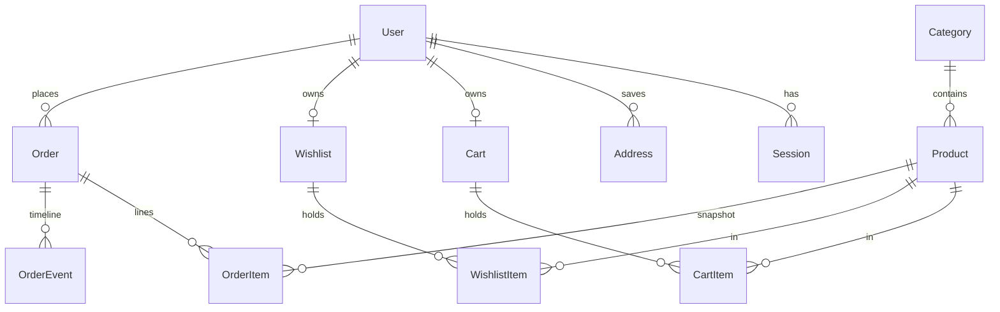

# LUXE Store — Master Project Architecture Document (PAD) v1.4

**Classification:** Internal Engineering Reference
**Status:** DEFINITIVE, PRODUCTION-LOCKED BLUEPRINT
**Companion Document:** [README.md](README.md) · [AGENTS.md](AGENTS.md) · [CLAUDE.md](CLAUDE.md) · [docs/Tailwind-V4-Validation-Report.md](docs/Tailwind-V4-Validation-Report.md)
**Last Updated:** 2026-10-07
**Audience:** Senior Engineers, Tech Leads, DevOps, and Onboarding Engineers
**Rule:** Every architectural decision in this document traces to a specific rationale. Nothing is here "because it's popular."

## Revision Block

| Version | Date | Author | Tags | Change |
|---|---|---|---|---|
| 1.0 | 2026-10-07 | Build agent (Super Z) | [RES]/[SYN]/[SAN] | Initial production blueprint after full-site recon, build, computed-style parity gate, and 103-test verification |
| 1.1 | 2026-10-07 | Review agent (Super Z) | [REM] | Session-1 remediation: route-group chrome split (ADR-008), reference-parity 404/auth/empty-states/drawer behavior, slate-palette pin (trap 7), stale-state logout fix, `.env.example` realignment, 107-test gate — see docs/remediation-plan-session1.md |
| 1.2 | 2026-10-07 | Review agent (Super Z) | [REM] | Session-2 remediation: catalog-order parity contract (sortOrder = reference array position, staggered createdAt, rating tie-break), reference-exact seed data (3 ratings + 11 descriptions), cart-drawer item-row anatomy rewrite, /cart line-total consistency, deliberate-divergence register, 117-test gate — see docs/remediation-plan-session2.md |
| 1.3 | 2026-10-07 | Review agent (Super Z) | [REM] | Session-3 remediation: auth parity contract (ADR-010 — /forgot-password anti-enumeration flow, nameless registration with derived display name, •••••••• placeholders, per-route Metadata), account-tab anatomy (icon avatar, highlighted default address, Change-Password section), shop active-filter chips + reference empty state, PDP related-products rule (all same-category), hero-dot geometry, 140-test gate — see docs/remediation-plan-session3.md |
| 1.4 | 2026-10-07 | Review agent (Super Z) | [REM] | Session-4 remediation: money/interaction parity round (ADR-011 — $9.99 flat shipping, reference-exact toast subsystem, transactional delta steppers fixing a lost-update race, cart-mutation guest-token fix, auth-screen anatomy rebuild incl. tinted error boxes + native validation + pinned copy, env-gated email-verification machinery, humanized-slug PDP titles, Reviews/Shipping tab panels, feature-bar cards, footer Join/separator), 170-test gate — see docs/remediation-plan-session4.md |
| 1.5 | 2026-10-07 | Review agent (Super Z) | [REM] | Session-5 remediation: buy-panel/home parity round (ADR-012 — StoreProvider server-truth re-sync fixing the stale post-order cart badge; wishlist heart color contract: red `fill-destructive` active + muted card hearts + the 82px px-8 PDP heart incl. the reference's mobile clipped-heart geometry; home section hairline dividers), reference quirk register (cosmetic wishlist, base44 Google OAuth), 173-test gate — see docs/remediation-plan-session5.md |
| 1.6 | 2026-10-07 | Review agent (Super Z) | [REM] | Session-6 remediation: superset correctness round (ADR-013 — server-side stock enforcement: clamped cart mutations + in-transaction overselling rejection + atomic placement decrement; ADR-014 — redirect-after-login with `validateRedirectPath` open-redirect hardening; `/login` becomes dynamic), first admin-console E2E coverage + guest-checkout E2E, dead-code removal, 188-test gate — see docs/remediation-plan-session6.md |

## Table of Contents

1. [System Overview & Decisions](#1-system-overview--decisions)
2. [High-Level System Topology](#2-high-level-system-topology)
3. [Application Architecture](#3-application-architecture)
4. [Data Architecture](#4-data-architecture)
5. [Design System Reference](#5-design-system-reference)
6. [Security Architecture](#6-security-architecture)
7. [Worker / Background Service Architecture](#7-worker--background-service-architecture)
8. [Testing Strategy](#8-testing-strategy)
9. [Build & Deployment](#9-build--deployment)
10. [Developer Handbook](#10-developer-handbook)
11. [Known Issues & Outstanding Tasks](#11-known-issues--outstanding-tasks)
12. [Key Files Reference](#12-key-files-reference)
13. [Glossary](#13-glossary)

---

## 1. System Overview & Decisions

### 1.1 Document Metadata & Purpose

This PAD is the single source of truth for how LUXE Store is built and why. **Engineers changing code**: read §3 (layer rules) and §8 (testing) first. **DevOps**: §9. **Anyone touching styles**: §5 and the trap log — the pins are load-bearing. The document describes the CURRENT system only; history lives in git.

The product is a visual clone of a reference storefront (`fuzzy-lumina-style-hub.base44.app`) with the reference's demo behavior replaced by real commerce persistence — a "superset": everything the reference renders, at computed-style parity, plus accounts, carts, wishlists, checkout, order history, and an admin console that actually write to a database.

### 1.2 Technology Stack Summary

| Layer | Technology | Version | Key Rationale |
|---|---|---|---|
| Web framework | Next.js (App Router) | ^16.1.1 | RSC-first rendering; server actions remove the need for a REST mutation layer; standalone output for lean deploys |
| UI runtime | React | ^19 | Required by Next 16; compiler-enforced hook rules (set-state-in-effect is an error) |
| Language | TypeScript, `strict` | ^5 | Types at every boundary; `any` banned |
| Styling | Tailwind CSS (CSS-first `@theme`) | ^4 | Reference is v3-era; v4 chosen deliberately with a **pinned token system** to keep byte-parity (trap log, §5.4) |
| UI primitives | Radix UI + CVA + tailwind-merge | — | Reference fingerprint (shadcn); accessible Dialog/Select/Tabs/Sheet without hand-rolled ARIA |
| Icons | lucide-react | ^0.525 | Exact reference icon set (`lucide-shopping-bag`, `lucide-star`, …) |
| ORM | Prisma | ^6.11 | Schema-as-code + typed client; SQLite provider keeps zero-config local story |
| Database | SQLite | — | Single-file, single-writer — matches the deployment shape (one app instance); swap path documented in ADR-002 |
| Auth | node:crypto scrypt + DB sessions | — | No third-party dependency; memory-hard; revocable server-side sessions |
| Validation | Zod | ^3.25 | Single dialect for actions, route handlers, and test fixtures |
| Unit tests | Vitest | ^5 | Fast, node-env, co-located; mirrors tsconfig aliases |
| E2E tests | Playwright (Chromium) | ^1.63 | Drives the production standalone build; computed-style assertions are the parity gate |
| Package manager | Bun | ≥1.3 | Executes TS seeds/setup scripts directly; fast installs |
| AI SDK | z-ai-web-dev-sdk | ^0.0.18 | Available for future AI features; not on any request path today |

### 1.3 Architecture Decision Records

**ADR-001: Single Next.js application (no monorepo, no separate admin app)**
- **Context:** The reference clone needs a storefront and an admin console; the org's prior e-commerce pattern (Scandi Haven) used a pnpm+Turborepo monorepo with a second admin app on :3001.
- **Decision:** One Next.js app. Admin lives at `/admin` behind a role gate (`src/app/admin/*`), sharing the layout chrome and the Prisma client.
- **Rationale:** The reference is a single app; a monorepo adds tooling (Turborepo, workspace protocol, cross-package Tailwind `@source` wiring) with zero product value at this scale. One `next build`, one deploy, one test suite.
- **Consequences:** (+) Simpler CI, no package boundaries to drift. (−) Admin and storefront share a deploy cadence; acceptable while one team owns both.
- **Alternatives Rejected:** Turborepo monorepo (ADR-rejected for this scale); separate admin domain (needs its own auth plumbing and duplicate UI kit).

**ADR-002: SQLite via Prisma with a schema-relative `file:` URL**
- **Context:** The deployment target is a single app instance; the repo contract requires `DATABASE_URL="file:../db/custom.db"` with `db/` at the repo root.
- **Decision:** `provider = "sqlite"`; the URL is resolved identically for the Prisma CLI (anchored at `prisma/schema.prisma`) and the runtime (`src/lib/db-path.ts` anchors on the first directory containing `prisma/schema.prisma`, with standalone-build and CWD fallbacks). Money is integer cents; "enums" are Strings + Zod unions.
- **Rationale:** Zero-config local dev and a single-writer model that makes count-based order numbering race-free. The URL contract is unit-test-pinned (`tests/db-path.test.ts`) because naive "simplifications" have historically broken exactly this.
- **Consequences:** (+) No database server to operate; file-level backup. (−) No concurrent multi-instance writes (documented scale ceiling — see ADR-002 migration note in §9.2); no native enums (validated in code).
- **Alternatives Rejected:** PostgreSQL (requires a server + rootless setup for marginal benefit at this scale — revisit when scaling out); Drizzle (fine, but the repo already standardizes on Prisma).

**ADR-003: Cookie-token guest identity merging into user rows**
- **Context:** Carts and wishlists must work for anonymous visitors and survive login.
- **Decision:** `Cart`/`Wishlist` rows keyed by a random cookie token (`luxe_cart`, `luxe_wishlist`, 192-bit, httpOnly); at most one row per user; the login action merges the guest row into the user row (quantity-max union) inside the same request; reads NEVER mint rows.
- **Rationale:** Server Components cannot set cookies — so cart creation must happen only in mutation contexts. Merging at login (not at read) keeps every read path side-effect-free and idempotent.
- **Consequences:** (+) Guest work is never lost; badge/drawer state is pure server truth. (−) Two code paths (guest/user) in the cart/wishlist resolvers — centralized in one function each to keep it honest.
- **Alternatives Rejected:** localStorage carts (not server-trustworthy, breaks cross-device); merge-on-read (side-effectful reads, race-prone).

**ADR-004: Server actions as the only mutation seam; 3-route-handler whitelist**
- **Context:** The UI needs cart/wishlist/auth/account/checkout/admin mutations.
- **Decision:** All mutations are `"use server"` actions in `src/lib/actions/*.ts`, Zod-validated, returning `ActionResult<T> = { ok: true, data } | { ok: false, error: { message, fieldErrors? } }`. Route handlers exist ONLY for `/api/health`, `/api/search` (typeahead GET), `/api/newsletter` (POST).
- **Rationale:** Actions give progressive enhancement + typed callsites without a REST surface to version. The whitelist keeps the attack surface auditable (three endpoints, each rate-limited or trivial).
- **Consequences:** (+) One validation dialect, one result envelope. (−) No external API for mutations by design — an integration API would be a new ADR.
- **Alternatives Rejected:** REST mutation routes (double validation layer, more surface); tRPC (another dependency for no gain inside one app).

**ADR-005: Tailwind v4 with pinned v3 token geometry (the trap-log system)**
- **Context:** The reference app compiles Tailwind v3-era classes; the port must render byte-identical computed styles on v4.
- **Decision:** `src/app/globals.css` pins: full `hsl()` theme literals (bare triplets resolve transparent under `@theme inline`); `--shadow-sm: 0 1px 2px 0 rgb(0 0 0 / 0.05)`; the radius scale to v3 values (`xl: .75rem`, `2xl: 1rem`, `3xl: 1.5rem`); the hero overlay as an sRGB arbitrary gradient; the mobile nav stacks with flex `gap` (never `space-y` + `mt-*`). Parity is enforced by `tests/e2e/storefront-parity.spec.ts` against live-measured values.
- **Rationale:** v4 shifted BOTH the shadow and radius scales one notch and interpolates gradients in oklab; class strings identical, rendered geometry not. Pinning tokens (not rewriting classes) keeps the DOM byte-parity with the reference while fixing the engine deltas.
- **Consequences:** (+) One-line fixes for engine variance; E2E-guarded. (−) Token pins look "wrong" to anyone who knows v4 defaults — the trap log and this PAD exist to prevent well-meaning "fixes".
- **Alternatives Rejected:** Staying on Tailwind v3 (EOL trajectory, misses v4 tooling); rewriting class strings to v4 equivalents (breaks DOM parity, 10× the diff).

**ADR-006: scrypt + DB-backed sessions over JWT**
- **Context:** Accounts need password auth with revocable sessions on a single-instance deploy.
- **Decision:** `scrypt` (N=16384, r=8, p=1) password hashes; a `Session` table keyed by SHA-256 of a 256-bit token; cookie value `token.hmac(token)` (integrity-in-depth, AUTH_SECRET); 30-day expiry; destroy deletes the row.
- **Rationale:** JWTs can't be revoked without a denylist — a session table IS the denylist. scrypt avoids a native dependency (bcrypt/argon2) while meeting OWASP baseline parameters.
- **Consequences:** (+) Immediate revocation; no extra deps. (−) One DB read per authenticated request (SQLite: ~µs; fine).
- **Alternatives Rejected:** stateless JWT (revocation problem); Better-Auth (heavy for two auth pages; no OAuth in the reference parity scope).

**ADR-007: Checkout as a client wizard over a single transactional server action**
- **Context:** The reference renders a 3-step checkout (shipping → payment → review) client-side.
- **Decision:** The wizard lives in `checkout-flow.tsx` (client) with per-step validation gates; the final submit posts EVERYTHING to `placeOrderAction`, which Zod-validates, re-derives totals from the DB cart (never the client), allocates `ORD-YYYY-NNN`, and writes order + lines + event + cart-clear in ONE `db.$transaction`.
- **Rationale:** Step UX is presentation; money math is server truth. A single transaction means a crashed placement never leaves a half-written order or a charged-but-empty cart.
- **Consequences:** (+) Crash-safe, replay-safe (rate-limited). (−) Card data transits the action (test-mode only — a real PSP integration is the documented next step, §11).
- **Alternatives Rejected:** Per-step server persistence (three writes to unwind on back-navigation); client-computed totals (unacceptable).

**ADR-008: Route-group chrome split (minimal root layout)**
- **Context:** The reference renders /login and /register as standalone screens (no header/footer) and unknown routes on a chrome-less platform 404 — impossible under a single root layout that always wraps children in the storefront chrome.
- **Decision:** `app/layout.tsx` is a minimal shell (html/body/font/metadata only). The shopper chrome + `StoreProvider` hydration live in `app/(storefront)/layout.tsx`; login/register live in `app/(auth)/` with a standalone centering layout; the root `not-found.tsx` replicates the reference's slate platform 404 (client component, `usePathname`, v3 slate palette pinned in `@theme`). Unknown product slugs render an in-chrome "Product not found" block instead of the 404.
- **Rationale:** Next.js wraps the root not-found in the root layout — the only way to reproduce a chrome-less 404 is to keep the root layout chrome-free. Route groups are URL-neutral, so no route moved.
- **Consequences:** (+) Exact reference parity on three previously-diverging surfaces; login/register became statically prerendered (perf win). (−) The `StoreProvider` state survives client-side navigation inside the group — logout must explicitly `setUser(null)` (a latent stale-state bug the refactor surfaced and fixed); one extra layout file to keep in mind when adding routes.
- **Alternatives Rejected:** fixed-position overlay hiding the chrome (DOM parity break); a catch-all route rendering the 404 inline (fights the router, swallows real routes).

**ADR-009: Catalog order as a parity contract (sortOrder = reference array position)**
- **Context:** The reference is a client-side SPA whose product array order drives its shop "Featured" listing, its home "On Sale" membership (first 4 sale items in array order), its "Newest" sort (array reverse), and its "Top Rated" sort (stable rating-desc over the array). The original seed ordered products by merchandising group (trending first), so all four surfaces diverged.
- **Decision:** `Product.sortOrder` in the seed mirrors the reference array position 1:1 (headphones=1 … pajama=12); the seed sets a staggered `createdAt` (array position 1 = oldest) so `createdAt desc` reproduces "Newest" deterministically; the shop's rating sort uses `[{ rating: "desc" }, { sortOrder: "asc" }]` because Prisma's single-key orderBy leaves tie order undefined. Seed ratings/reviewCounts/descriptions are transcribed verbatim from the live reference.
- **Rationale:** Ordering is visible on every shop/home visit — parity requires encoding the reference's array semantics in data, not approximating them. The tie-break makes the E2E assertion deterministic (4.8 ties: headphones < serum < yoga-mat).
- **Consequences:** (+) All four order-sensitive surfaces match the reference exactly and are E2E-pinned (catalog-parity.spec.ts). (−) Reordering or adding products requires re-measuring the reference and updating sortOrder/createdAt together; the deliberate-divergence register documents the one order-adjacent behavior we do NOT replicate (the reference's mobile menu staying open after navigation).
- **Alternatives Rejected:** computed rank columns (duplicates state, drifts); client-side re-sorting (fights RSC, breaks deep links).

**ADR-010: Auth parity contract — nameless registration and anti-enumeration password reset**
- **Context:** The reference register form collects exactly [Email, Password, Confirm Password] — no Name — and its login links to a real `/forgot-password` screen whose submit always shows the same neutral confirmation. The clone had an extra Name field, a disabled self-linking "Forgot password?", and no reset route; the reference also titles each auth page ("Login | Lumina") while the clone showed a bare "Lumina".
- **Decision:** Each `(auth)` route is a server `page.tsx` owning `Metadata` (title only; the root template appends "| Lumina") delegating to a `*-form.tsx` client island. `registerSchema.name` is optional; `registerAction` derives the display name from the email local part (`deriveDisplayName`, `src/lib/validation.ts`) because `User.name` stays required in Prisma. New `requestPasswordResetAction`: Zod-validated email, rate-limited 5/15min/IP+email, user lookup feeds ONLY a `console.info` seam (never the response), identical neutral confirmation for known and unknown emails. Password inputs carry the reference's `••••••••` placeholder; the login "Forgot password?" link is enabled at `text-xs` → `/forgot-password`.
- **Rationale:** Enumeration via the reset flow is the classic account-discovery vector — the reference's always-same copy is the correct pattern to replicate, now with real server-side enforcement. Deriving the name keeps the DB contract intact while matching the reference's 3-field form 1:1.
- **Consequences:** (+) Whole reference auth surface at parity with production-grade security (rate limit + anti-enumeration); per-route titles correct; no Prisma migration. (−) No email is actually sent (documented seam — plug Resend/SES/Postmark at the `console.info` line); display names from odd local parts (`e2e-42@x` → "E2e 42") are cosmetic until Profile editing refines them.
- **Alternatives Rejected:** keeping the Name field (visible form-structure divergence); a real reset token table + emailed link (no email infra; would still need the neutral response); revealing account existence (security regression vs the reference).

**ADR-011: Money & interaction parity round — shipping, toasts, transactional steppers, and env-gated email verification**
- **Context:** Round-4 live A/B audit measured money and interaction surfaces the earlier rounds had not: the reference charges a **flat $9.99** shipping below $100 (measured at $34.99 and $79.99 subtotals; the clone charged $5.99); it fires a dark bottom-right toast ("«Product» added to cart!", accent check icon, ~3000 ms, stacks without dedupe, spring enter/exit) on cart adds and wishlist ADDS but not wishlist removes; its auth screens carry a header tile OUTSIDE the card, `h-12` icon-led inputs, and a tinted error BOX (the clone had plain red text + `noValidate`); its register flow gates behind a 6-digit "Verify your email" screen and blocks unverified logins; its PDP document.title is the humanized slug. Separately, the audit found two latent correctness bugs: cart steppers posted ABSOLUTE quantities computed from stale render state (two rapid clicks both sent `qty+1` — a lost-update race), and cart MUTATIONS passed `undefined` as the guest token (each guest add minted a new cart; guest steppers read as empty).
- **Decision:** `FLAT_SHIPPING_CENTS = 999` (unit-pinned). New `ToastViewport` + `notify` in `StoreProvider` wired at the two `addToCart`/`toggleWishlist` call sites (region `pointer-events-none` + `aria-live=polite`; CSS `@starting-style` approximation of the reference's JS spring — both registered divergences). Steppers now post DELTAS: `adjustQuantity(itemId, ±1)` → `adjustCartItemAction` → transactional `changeQuantityBy` (`db.$transaction`); remove is its own action; pure delta math lives in `src/lib/cart-quantity.ts`. Cart mutations resolve the guest token from the cookie (`src/lib/cart.ts`), pinned by `guest-cart.spec.ts`. Auth screens rebuilt to the reference anatomy with a shared `auth-error.tsx` box, native `type=email` validation (no `noValidate`), and pinned error copy. Email verification ships the full machinery — Prisma columns (`emailVerified`, `verificationHash`, `verificationExpiresAt`, `verificationAttempts`), `/verify-email` route, `verifyEmailAction`/`resendVerificationAction`, 5-attempt budget, 15-min TTL, scrypt-hashed codes — but env-GATES enforcement behind `AUTH_REQUIRE_EMAIL_VERIFICATION` (default OFF): with no transactional email provider wired (the repo's documented posture), an always-on gate would lock every new user out; codes log at the `console.info` seam and E2E drives the flow via the seeded `unverified@example.com` fixture (code `123456`). PDP titles use `humanizeSlug` (`src/lib/format.ts`); the Reviews/Shipping tab panels and the feature-bar/footer anatomy were restyled to measured classes.
- **Rationale:** Money values and interaction feedback are parity surfaces like colors and radii — measured, not guessed. Delta steppers are the correct server-authoritative pattern regardless of parity (idempotent increments survive races and stale renders). The env gate honors both the reference's behavior and the clone's no-email-provider reality; shipping the machinery now means flipping one flag when a provider lands.
- **Consequences:** (+) Two real correctness bugs fixed (race + guest-cart identity) with regression tests; the interaction surface (toasts) and money surface now match the reference; the verification flow is fully tested even while off. (−) Two more documented divergences (toast spring approximation; verification off by default — the reference always gates); one additive schema change (`db push` — nullable/defaulted columns, no migration file); `«name»` interpolation means product names render verbatim inside the toast copy.
- **Alternatives Rejected:** absolute-quantity steppers with optimistic locking (complexity for no parity gain); a queue-based toast library (the reference's is a 30-line stack — a subsystem would be over-engineering); enabling verification unconditionally (bricks signup with no provider); sending real emails via a dev SMTP (secrets/infra out of scope for a clone).

**ADR-012: Client store re-syncs from server truth on refresh (and the round-5 parity set — hearts, home dividers)**
- **Context:** The round-5 live A/B audit found the header cart badge kept a stale count after order placement until a manual reload: `checkout-flow.tsx` calls `router.refresh()` + `router.push()` on success, and the refreshed storefront layout DOES deliver a fresh (empty) `initialCart` prop — but `useState(initialCart)` only reads its initial value on first render, so `StoreProvider` ignored it (client state survived the refresh). The same audit measured three parity gaps: the PDP buy-panel wishlist heart button is `h-10 px-8` (82px; the clone rendered px-4/50px, letting the flex-1 ATC absorb 32px), active hearts are `fill-destructive text-destructive` (red rgb(239,67,67) — the clone used primary orange), card hearts are muted inactive (`h-4 w-4 transition-colors text-muted-foreground`), and the home page frames its product sections with two `shrink-0 bg-border h-[1px] w-full max-w-7xl mx-auto` hairlines (after the feature bar and after New Arrivals — present since the session-0 recon, never ported).
- **Decision:** `StoreProvider` re-syncs `cart`/`user`/`wishlist` whenever a `router.refresh()` delivers changed `initial*` prop identities, via the adjust-state-during-render pattern (React docs). The "last seen props" live in STATE, not a ref — the React Compiler `react-hooks/refs` rule forbids ref access during render, and the repo's `set-state-in-effect` rule forbids the effect form. The heart button became `px-8` with `h-5 w-5` icons and `fill-destructive text-destructive` active classes; the card heart carries `transition-colors text-muted-foreground` inactive; two divider divs were inserted in the home page. Matching px-8 deliberately reproduces the reference's iPhone-14 action row, whose 82px heart is clipped ~35px past the 390px viewport (scrollWidth 425) — exact parity, registered as a note rather than "fixed".
- **Rationale:** Server truth must win whenever the server re-renders the chrome — the badge, hearts, and account icon are all derived from the same provider state, and any server-side mutation followed by a refresh would show stale UI otherwise. The heart colors/geometry and home dividers follow the standing rule: parity surfaces are measured, not guessed.
- **Consequences:** (+) The post-order badge (and any future refresh-delivered mutation) reflects server truth without a reload — pinned by the checkout spec's exact-name "Cart" assertion; three parity gaps closed with tests at the same seams. (−) One more nuance for contributors: props re-sync only on identity change, so the layout must actually re-render server-side (any `router.refresh()` does). The reference's mobile clipped-heart overflow is now replicated byte-exactly (a visual defect inherited for parity's sake).
- **Alternatives Rejected:** an effect-based sync (`set-state-in-effect` is an error under the repo's React Compiler lint); a `key`-based provider remount (resets drawer/toast/UI state on every refresh); wrapping the heart in a container query or responsive px (diverges from the reference DOM); registering the mobile overflow as a divergence and shrinking the heart (breaks the measured desktop parity).

---

**ADR-013: Server-side stock enforcement — clamp in the cart, reject and decrement at placement**
- **Context:** The round-6 audit found the clone's inventory was cosmetic server-side: only the PDP UI capped quantity at stock (`buy-panel.tsx` disables the stepper and renders "Out of Stock"); `addItem`/`changeQuantityBy` accepted any quantity (cap 99), and `placeOrderAction` neither validated stock nor decremented it. A cart assembled before an admin stock drop could oversell a sold-out product, and the admin console's stock numbers never moved with sales — operationally meaningless. (The reference has no inventory concept at all — this is pure superset territory, so no parity constraint applies.)
- **Decision:** Three enforcement layers. (1) Cart mutations CLAMP increases at the product's current stock via the pure seam `clampToStock(next, current, stock)` in `src/lib/cart-quantity.ts` — decreases and deletes always pass through, an existing line is never reduced below its current quantity, and a new line on a sold-out product clamps to 0 (skipped). (2) `placeOrderAction` re-reads every line's stock INSIDE the placement transaction and rejects overselling with a customer-safe message ("Sorry, «name» only has N left in stock. Please update your quantity.") — the cart stays intact for the shopper to adjust. (3) On success, each product's stock is DECREMENTED atomically with the order write. Seeded demo orders are fixtures created directly by the seed (never decremented); the seed upsert restores `stock: 25` on every `db:setup`/E2E global-setup run, and `prisma/dev-cleanup.ts` restores 25 on the dev DB.
- **Rationale:** Overselling is the cardinal correctness bug of an e-commerce superset; the admin's stock forms only mean something if placement moves them. Clamping (not rejecting) at the cart layer keeps parity surfaces free of error states the reference never shows, while rejection at placement is where the customer can still act on the information.
- **Consequences:** (+) Inventory is trustworthy end-to-end; the admin stock form, the PDP sold-out state, and placement now form one consistent system — pinned by `tests/e2e/stock.spec.ts` (clamp, rejection, decrement, sold-out PDP) which also gives the admin console its first E2E coverage. (−) Stock decrements make per-run E2E state drift without the reseed (mitigated: the global-setup reseed restores 25 per run, and run volumes are ~10 units/product — far under 25). No visible UI was added (the reference shows no stock indicators).
- **Alternatives Rejected:** rejecting at the cart layer too (surfaces error states the reference never shows on parity surfaces); optimistic client-side reservation (no persistence guarantee); decrement-on-ship (the admin's stock column would misrepresent sellable inventory between placement and fulfillment); a separate `Reservation` table (overkill for a single-writer SQLite storefront with no concurrent-worker requirement).

---

**ADR-014: Redirect-after-login with validated same-origin targets**
- **Context:** The round-6 audit found gated pages dropped visitor intent: `/account` redirected guests to bare `/login`, and the login form always pushed `/account` after success — a guest clicking "View Orders" on the order-success page, or following a deep link to a gated page, lost their destination. Standard e-commerce UX (and the scandihaven reference stack's `validateRedirectPath` hardening pattern) carries the intent through.
- **Decision:** `/account` and every `/admin*` page gate anonymous visitors to `/login?redirect=<their path>`. The login server page reads `searchParams` (the route is therefore DYNAMIC — it was static before) and passes `redirectTo` into the client form island, which computes `validateRedirectPath(redirectTo) ?? "/account"` and pushes that after a successful login. `validateRedirectPath` (pure, in `src/lib/validation.ts`, unit-pinned) accepts ONLY same-origin relative paths: must start with `/`, must not start with `//` or `/\`, no backslashes, no scheme-bearing colon-before-slash, no bare `/`, length ≤ 512. Register keeps its existing post-signup landing (` /account`, or `/verify-email` when the gate is on).
- **Rationale:** Carrying intent is table-stakes UX for a production storefront; honoring an unvalidated URL is the classic open-redirect vulnerability (phishing via `?redirect=//evil.com`), so the validator is deliberately conservative — unknown shapes fall through to the safe default rather than being "fixed up".
- **Consequences:** (+) Guests land where they started after authenticating; open-redirect payloads are inert (pinned by `tests/e2e/auth.spec.ts`: honored-target and ignored-payload cases). (−) `/login` loses its static prerender (now `ƒ` in the build output — acceptable for an auth page); the redirect param appears in the URL (matches standard practice).
- **Alternatives Rejected:** `useSearchParams()` in the client island (needs a Suspense boundary to keep the static prerender — more churn for no user value); POST-body redirect carrying (breaks deep-link sharing); storing intent in a cookie (survives the session, surprising users who abandoned the flow).

---

## 2. High-Level System Topology

```
                       ┌──────────────────────────────┐
                       │        Browser (user)        │
                       │  Next.js RSC HTML + islands  │
                       └──────────────┬───────────────┘
                                      │ HTTPS (cookies: luxe_session,
                                      │  luxe_cart, luxe_wishlist)
                   ┌──────────────────▼───────────────────┐
                   │   Next.js 16 standalone server       │
                   │  .next/standalone/server.js (Bun)    │
                   │──────────────────────────────────────│
                   │ RSC pages ──► lib domains ──► Prisma │
                   │ Server actions (mutations, Zod)      │
                   │ Route handlers: health/search/       │
                   │   newsletter (rate-limited)          │
                   └───────┬──────────────────────┬───────┘
                           │ file I/O             │ https (img src only)
                  ┌────────▼─────────┐   ┌────────▼─────────┐
                  │  SQLite          │   │ media.base44.com │
                  │  db/custom.db    │   │ (product art —   │
                  │  (single writer) │   │  parity CDN)     │
                  └──────────────────┘   └──────────────────┘
```

**Runtime:** Node ≥20-compatible standalone server executed by Bun. Single process, single writer to SQLite. Scaling path: N read replicas are impossible on one SQLite file — the migration point is ADR-002 (swap `provider` + `DATABASE_URL` to PostgreSQL; the schema is portable modulo enum-Strings, which Zod already validates).

**Constraints:** all mutation state is server-truth; the client store (`StoreProvider`) is a hydrated cache, never an origin. Remote image CDN is read-only `img src` usage — no key, no proxy, no optimization (unoptimized `next/image` config keeps the standalone server dependency-free).

---

## 3. Application Architecture

### 3.1 The Layer Model

- **Layer 0: Data Source — Prisma/SQLite.** *Rule: the only writer is `src/lib/db.ts`'s singleton; never instantiate a second client (HMR-safe globalThis pattern).*
- **Layer 1: Domains — `src/lib/*.ts`.** *Rule: pure(ish) server modules (auth, cart, wishlist, money, validation, rate-limit) that touch Layer 0 and nothing above. No React imports.*
- **Layer 2: Mutations — `src/lib/actions/*.ts`.** *Rule: the ONLY write seam. Zod in, `ActionResult<T>` out; logs with `[tag]` context; never throws across the boundary.*
- **Layer 3: Rendering — `src/app/**` (RSC) + `src/components/**`.** *Rule: RSC by default; `"use client"` only for interactive leaves; client components never import `@/lib/db` (build-time RSC boundary).*
- **Layer 4: Chrome composition — `(storefront)` group layout.** *Rule: the shopper layout owns header/footer/overlays and hydrates `StoreProvider` with server-read cart/wishlist/user so the first paint carries badge state; the ROOT layout stays chrome-free so auth screens and the platform 404 can render standalone (ADR-008).*

**Golden Rule:** dependencies point downward only (app → components → lib → db). A cycle or an upward import is a build or review failure.

### 3.2 Annotated Directory Structure

```
ecommerce-store/
├── prisma/
│   ├── schema.prisma            ← 13 models; integer cents; String-"enums"
│   ├── seed.ts                  ← idempotent natural-key upserts; reference-parity fixtures
│   └── e2e-reset.ts             ← clears carts/wishlists/spec-users before E2E runs
├── src/
│   ├── app/
│   │   ├── layout.tsx           ← MINIMAL shell: fonts + metadata only (ADR-008)
│   │   ├── globals.css          ← Tailwind v4 @theme + ALL v3-parity pins (ADR-005)
│   │   ├── not-found.tsx        ← chrome-less platform 404 (v3 slate, quoted path)
│   │   ├── (storefront)/        ← chrome layout + shopper pages (ADR-008)
│   │   │   ├── page.tsx         ← home: hero carousel + 4 sections (RSC)
│   │   │   ├── shop/page.tsx    ← PLP: filters from searchParams (RSC)
│   │   │   ├── product/[slug]/  ← PDP + generateMetadata + in-chrome not-found block
│   │   │   ├── cart/page.tsx    ← REAL cart (reference hardcodes empty — superset fix)
│   │   │   ├── checkout/        ← wizard page + success confirmation
│   │   │   ├── account/         ← dashboard (auth-gated, tabs)
│   │   │   ├── wishlist/        ← hearts page
│   │   │   └── admin/           ← role-gated console (superset)
│   │   ├── (auth)/              ← STANDALONE login/register/forgot-password/verify-email (ADR-008/010/011)
│   │   ├── api/{health,search,newsletter}/route.ts   ← the 3-endpoint whitelist
│   │   └── sitemap.ts · robots.ts
│   ├── components/
│   │   ├── ui/                  ← shadcn-style primitives, reference class strings
│   │   ├── store/               ← storefront chrome + islands + StoreProvider
│   │   ├── account/             ← account-tabs + admin rows (client)
│   │   └── checkout/            ← 3-step wizard (client)
│   └── lib/
│       ├── db.ts · db-path.ts   ← client singleton + URL contract (test-pinned)
│       ├── auth.ts              ← sessions, getCurrentUser, isAdmin
│       ├── password.ts          ← scrypt hash/verify (shared with seeds)
│       ├── cart.ts · wishlist.ts← guest/user resolution + merges (ADR-003; mutations read the cookie token)
│       ├── money.ts             ← cents formatting, discount math, $9.99 shipping rule (ADR-011)
│       ├── cart-quantity.ts     ← pure delta math for steppers (ADR-011)
│       ├── format.ts            ← humanizeSlug (PDP titles) + code generation (ADR-011)
│       ├── verification.ts      ← email-verification domain: budget, TTL, gating (ADR-011)
│       ├── validation.ts        ← every Zod schema
│       ├── rate-limit.ts        ← in-memory fixed windows
│       └── *.test.ts            ← co-located unit layer
├── tests/
│   ├── db-path.test.ts
│   └── e2e/                     ← 12 specs + auth.setup + global-setup
├── docs/                        ← trap log, deployment, ssh push runbook
└── AGENTS.md · CLAUDE.md · README.md · Project_Architecture_Document.md
```

### 3.3 Critical Code Patterns

**The ActionResult envelope (every mutation):**

```ts
export type ActionResult<T> =
  | { ok: true; data: T }
  | { ok: false; error: { message: string; fieldErrors?: Record<string, string> } };
```
*Why:* one shape for every `useActionState` consumer; errors are data, never exceptions — the client renders `message` inline and maps `fieldErrors` to inputs without parsing.

**Reads never mint rows (cart resolution):**

```ts
// src/lib/cart.ts — creation only when create=true (mutation contexts)
const cart = await resolveCartRow(token, userId, /* create */ false);
if (!cart) return EMPTY_CART;
```
*Why:* a Server Component render cannot set cookies; a read that created carts would mint a junk row per anonymous page view (the exact bug class the org's prior cart system documented).

**Adjust-state-during-render (client hydration syncs):**

```tsx
const [prevUrlSearch, setPrevUrlSearch] = React.useState(activeSearch);
if (prevUrlSearch !== activeSearch) {
  setPrevUrlSearch(activeSearch);
  setSearch(activeSearch);
}
```
*Why:* the React Compiler lint makes `setState`-in-effect an error; this is the sanctioned pattern for prop→state mirrors (used in ShopFilters, SearchBar, AccountTabs).

---

## 4. Data Architecture

### 4.1 Schema (ER summary)



**Model notes:** `Product.price`/`compareAtPrice` integer cents (compare-at drives the `-N%` badge); `Product.features` is a JSON-encoded `string[]` (SQLite has no scalar lists); `Order.shippingAddress` is a JSON snapshot (addresses are editable post-order without rewriting history); `OrderItem` carries `nameSnapshot`/`imageSnapshot`/`unitPrice` (cart-independent history); `Cart.userId` and `Wishlist.userId` are `@unique` (at most one per user).

### 4.2 Data Models (invariants)

- **Money:** integers, cents, everywhere. Display via `formatCents` only. Discount % derived (`discountPercent`), never stored.
- **Shipping:** `0` when subtotal ≥ 10000, else `599` — server-derived on every read and at placement.
- **Order numbers:** `ORD-YYYY-NNN`, allocated as `count(prefix)+1` inside the placement transaction. Single-writer SQLite makes this race-free; the pad is 3 to match the reference display (`ORD-2026-004`).
- **Statuses:** `processing | in_transit | delivered | cancelled` (String + Zod); transitions append an `OrderEvent` row.

### 4.3 Persistence Strategy

One Prisma client singleton on `globalThis` (HMR-safe; production logs errors only). No connection pool to configure (SQLite). Migrations are `prisma db push`-based during development (`db:setup` = push + seed, idempotent via natural-key upserts); `prisma migrate dev` is available when history is needed. Backups = copy `db/custom.db` (stop-the-world or `VACUUM INTO`).

---

## 5. Design System Reference

### 5.1 Typography

**Plus Jakarta Sans** (Latin, 400–800) via `next/font/google` (`--font-jakarta`, `display: swap`), wired as `--font-sans`. Scale (measured on the reference): body 16, nav 14/500, card title 14/600, section h2 30 (2xl–3xl bold), PDP h1 30 (2xl–3xl bold), PDP price 30/700, hero h1 48/700 (3xl–5xl responsive).

### 5.2 Color Tokens (computed-parity pinned)

| Token | Value | Hex | Role |
|---|---|---|---|
| background | `hsl(30 25% 98%)` | #FBFAF9 | Page |
| foreground | `hsl(240 10% 10%)` | #17171C | Text · footer bg |
| card / popover | `hsl(0 0% 100%)` | #FFFFFF | Surfaces |
| primary | `hsl(24 80% 50%)` | #E66B1A | Brand orange |
| primary-foreground | `hsl(0 0% 100%)` | #FFFFFF | On-primary |
| secondary | `hsl(30 15% 94%)` | #F0EEEA | Chips, image wells |
| muted-foreground | `hsl(240 5% 46%)` | #6F6F7B | Secondary text |
| accent / accent-foreground | `hsl(24 80% 96%)` / `hsl(24 80% 30%)` | — | Category icon wells |
| destructive | `hsl(0 84% 60%)` | #EF4444 | Discount badges |
| border / input | `hsl(30 15% 90%)` | #E9E6E2 | Hairlines |
| ring | `hsl(24 80% 50%)` | #E66B1A | Focus |
| Stars | `fill-amber-400` | #FBBF24 | Ratings |

### 5.3 Radii & Shadows

`--radius: 0.75rem`; computed: `rounded-md` 10px, `rounded-lg` 12px, `rounded-xl` 12px, `rounded-2xl` 16px, `rounded-3xl` 24px, pills `9999px`. `--shadow-sm` pinned to `0 1px 2px 0 rgb(0 0 0 / 0.05)`; depth otherwise comes from borders (`border-border/50`), not elevation — matching the reference.

### 5.4 The Tailwind v4 Trap Log (binding)

1. Full `hsl()` literals in `@theme inline` — bare triplets render transparent.
2. `--shadow-sm` pinned (v4 shifted the shadow scale one notch).
3. Radius scale pinned (v4 shifted it too — measured: card 16px, button 12px, input 10px).
4. Hero overlay uses `bg-[linear-gradient(to_right,rgb(0_0_0/0.6),…)]` — v4 interpolates gradients in oklab.
5. Mobile nav stacks with flex `gap-4` — `space-y-*` + `mt-*` children change height on v4 (`:where()` zero-specificity).
6. Alpha utilities serialize as `lab(...)` in Chrome (same paint as v3's `rgba(...)`) — the parity specs accept both notations.

Full write-up with sources: `docs/Tailwind-V4-Validation-Report.md`.

### 5.5 Motion

Hover image zoom 500ms; slide-up Add-to-Cart 300ms; Sheet slide 500ms open / 300ms close; hero crossfade 700ms; auto-advance 5s. All transitions respect reduced-motion via Tailwind's `motion-safe:` usage pattern where applicable.

---

## 6. Security Architecture

### 6.1 Security Rules & Enforcement

| Rule | Enforcement |
|---|---|
| All mutation input validated | Zod schemas (`src/lib/validation.ts`) at every action/route handler; failures return field-mapped errors |
| SQL injection impossible | Prisma parameterized queries only; no `$queryRaw` with user input |
| Passwords never stored/Logged | scrypt hashes only (`password.ts`); no secret ever appears in logs (actions log ids/status, not payloads) |
| Sessions revocable + integrity | DB `Session` rows + HMAC-signed cookie (`auth.ts`); logout deletes the row |
| Rate limiting | Login 10/15min/IP+email; password-reset 5/15min/IP+email (anti-enumeration, ADR-010); checkout 10/10min; newsletter 10/10min/IP; search 60/min/IP (`rate-limit.ts`; in-memory — single-instance scope documented) |
| XSS | React escaping only; no `dangerouslySetInnerHTML` anywhere in the codebase |
| Admin surface | `getCurrentUser()` + `isAdmin()` re-check INSIDE every admin action (never trust the UI gate); pages additionally `redirect()` |
| Object ownership | Cart/wishlist/address mutations verify row ownership before writing (`account.ts`, `cart.ts`) |
| Clickjacking / sniffing | Standalone deployment sets headers at the edge (see `docs/DEPLOYMENT.md`); CSP not embedded because the reference's remote images require a per-deploy policy decision |
| Secrets | `.env` git-ignored; `AUTH_SECRET` required in production (boot falls back to a dev-only constant and says so) |

### 6.2 Security Utilities Inventory

`src/lib/password.ts` (scrypt hash/verify, timing-safe compare) · `src/lib/auth.ts` (session create/resolve/destroy, HMAC, role check) · `src/lib/rate-limit.ts` (fixed windows + client-IP extraction from proxy headers) · `src/lib/validation.ts` (all input schemas).

### 6.3 AuthN / AuthZ Model

Email+password (scrypt) → `Session` row → cookie `luxe_session=token.hmac` (httpOnly, SameSite=Lax, Secure in prod, 30d). Roles: `user` | `admin` (String column, Zod-validated). Admin = every `/admin` page redirect + every admin action re-check. Guest commerce identity = `luxe_cart` / `luxe_wishlist` tokens (192-bit random, httpOnly), merged into user rows at login.

### 6.4 Threat Model (residual risks, accepted)

- **Card data transits the checkout action** (test-mode semantics; the reference accepts a fake 4242 card). A real PSP (Stripe Payment Element, SAQ-A) is the documented next step — see §11.
- **In-memory rate limiter** is per-instance; horizontal scaling requires a shared store.
- **Remote imagery** (`media.base44.com`) is an availability dependency, not a trust dependency (plain `img src`).

---

## 7. Worker / Background Service Architecture

**Not applicable — by design.** There are no background workers, queues, or cron jobs. Order placement is synchronous and transactional; emails are not sent (the confirmation page + order history are the confirmation). The `OrderEvent` table provides the append-only timeline that a future outbox/worker system would consume; adding one is a new ADR, not an extension of an existing one.

---

## 8. Testing Strategy

### 8.1 Test Distribution

| Category | Files | Tests | Location | Framework |
|---|---|---|---|---|
| Unit — money | 1 | 10 | `src/lib/money.test.ts` | Vitest |
| Unit — passwords | 1 | 4 | `src/lib/password.test.ts` | Vitest |
| Unit — validation | 1 | 25 | `src/lib/validation.test.ts` | Vitest |
| Unit — rate limit | 1 | 3 | `src/lib/rate-limit.test.ts` | Vitest |
| Unit — db-path contract | 1 | 15 | `tests/db-path.test.ts` | Vitest |
| Unit — cart delta-quantity + stock clamp | 1 | 10 | `src/lib/cart-quantity.test.ts` | Vitest |
| Unit — slug/code format | 1 | 5 | `src/lib/format.test.ts` | Vitest |
| Unit — verification codes | 1 | 4 | `src/lib/verification.test.ts` | Vitest |
| E2E — smoke | 1 | 11 | `tests/e2e/smoke.spec.ts` | Playwright |
| E2E — computed-style parity | 1 | 16 | `tests/e2e/storefront-parity.spec.ts` | Playwright |
| E2E — catalog-order parity | 1 | 10 | `tests/e2e/catalog-parity.spec.ts` | Playwright |
| E2E — cart | 1 | 10 | `tests/e2e/cart.spec.ts` | Playwright |
| E2E — checkout | 1 | 5 | `tests/e2e/checkout.spec.ts` | Playwright |
| E2E — account | 1 | 11 | `tests/e2e/account.spec.ts` | Playwright |
| E2E — auth | 1 | 17 | `tests/e2e/auth.spec.ts` | Playwright |
| E2E — wishlist | 1 | 6 | `tests/e2e/wishlist.spec.ts` | Playwright |
| E2E — search | 1 | 10 | `tests/e2e/search.spec.ts` | Playwright |
| E2E — mobile navigation | 1 | 7 | `tests/e2e/mobile-navigation.spec.ts` | Playwright |
| E2E — guest cart | 1 | 2 | `tests/e2e/guest-cart.spec.ts` | Playwright |
| E2E — guest checkout | 1 | 1 | `tests/e2e/guest-checkout.spec.ts` | Playwright |
| E2E — stock enforcement (incl. admin seam) | 1 | 2 | `tests/e2e/stock.spec.ts` | Playwright |
| E2E — verify email | 1 | 3 | `tests/e2e/verify-email.spec.ts` | Playwright |
| E2E — authenticated setup | 1 | 1 | `tests/e2e/auth.setup.ts` | Playwright |
| **Total** | **23** | **188** | | |

### 8.2 Test Patterns

- **Parity gate:** `storefront-parity.spec.ts` asserts computed styles against values measured live on the reference (colors, radii, the shadow pin, font, hero-dot geometry, feature-bar card anatomy, footer Join button + separator rhythm, home section dividers, PDP heart px-8 geometry + h-5 w-5 icons). This is the objective "looks identical" gate — screenshots are not.
- **Catalog-order gate:** `catalog-parity.spec.ts` pins the reference's product array order (Featured), the home On Sale membership, the Newest (reverse array) and Top Rated (stable rating-desc) sort semantics, the sort-dropdown option order, the reference-exact ratings/descriptions, and the related-products membership rule (all same-category, excluding self).
- **Auth-contract gate:** `auth.spec.ts` pins the login/register form contract (3 fields, placeholders, enabled forgot-link, header-tile anatomy, error BOX + pinned copy, native email validation), the nameless-registration flow, and the forgot-password anti-enumeration behavior (neutral confirmation for any email, field errors for invalid input, back-navigation).
- **Money/interaction gate:** `money.test.ts` pins the $9.99 flat rate; `cart.spec.ts` pins drawer shipping at a below-threshold subtotal, the toast copy/anatomy/lifetime on cart + wishlist adds (and silence on wishlist remove), and the rapid-stepper race (intermediate assertion between clicks); `guest-cart.spec.ts` pins the cookie-token mutation path (opts out of storageState).
- **Isolation:** E2E global setup pushes/seeds/resets `db/e2e.db` (never the dev DB) and restores the unverified `unverified@example.com` fixture every run; `auth.setup.ts` logs in once (rate limiter) and shares storageState; `auth.spec.ts`/`guest-cart.spec.ts`/`verify-email.spec.ts` opt out with an empty state; cart specs start from a cleared cart (`clearCartViaDrawer`).
- **Radix-aware selectors:** close dialogs before asserting on page chrome (aria-hidden); scope text/label lookups to `main` (footer collisions); the drawer hides the header badge while open — assert the drawer's own totals; toast assertions wait out the enter spring (~450 ms, ±2 px).
- **TDD:** bugs get a failing regression test at the same seam before the fix; the suite asserts behavior through the UI/API only.

### 8.3 Coverage Philosophy

Numeric coverage gates are not configured; instead, every domain seam (money, validation, passwords, rate limit, db-path) has a dedicated unit file, and every user flow (browse → search → cart → checkout → account → admin surface) has a dedicated E2E file. The parity spec is treated as a build-breaker: a token change that shifts a computed value fails CI even when everything "works".

### 8.4 Pre-Push Checklist

1. `bun run lint` — 0 errors, 0 warnings
2. `bun run typecheck` — 0 errors
3. `bun run test` — 66/66
4. `bun run build` — compiles (validates RSC boundaries + redirects)
5. `bun run test:e2e` — 107/107 (after a fresh build; 106 spec tests + the setup login)
6. No secrets/DB files/artifacts in `git status`

---

## 9. Build & Deployment

### 9.1 Production Build

```bash
bun run build   # next build + static assets into .next/standalone
bun run start   # NODE_ENV=production bun .next/standalone/server.js
```

The build produces a self-contained server (`output: "standalone"`, tracing root pinned). `typescript.ignoreBuildErrors: true` in `next.config.ts` mirrors the repo's historical scaffold setting — `bun run typecheck` is the enforced gate; do not rely on the build to catch types.

### 9.2 Environment Variables

| Variable | Required | Description | Default |
|---|---|---|---|
| `DATABASE_URL` | Yes | SQLite location; schema-relative `file:` URL resolves against `prisma/schema.prisma` (use an ABSOLUTE path in production) | `file:../db/custom.db` |
| `NEXT_PUBLIC_SITE_URL` | Prod | Canonical origin for metadata/sitemap/robots | `http://localhost:3000` |
| `AUTH_SECRET` | Prod | HMAC secret for session cookies (`openssl rand -hex 32`) | insecure dev constant |
| `AUTH_REQUIRE_EMAIL_VERIFICATION` | No | "true" = require the 6-digit "Verify your email" code after signup and block unverified logins (ADR-011; needs an email provider at the `console.info` seams) | off |

### 9.3 Docker

Not shipped (kept out to match the repo scaffold); the standalone server is a single-process target — a 6-line Dockerfile (`oven/bun`, copy `.next/standalone` + `prisma` + `db/`, `CMD bun server.js`) is the documented path when containerization is needed.

### 9.4 CI/CD

No hosted CI in this repo by choice — the local gate (§8.4) is the gate, and pushes go through `docs/ssh_git_wrapper_v3.py` (key materialized outside the repo, remote ref verified post-push; see `docs/how-to-git-push-using-ssh-wrapper_SKILL.md`). Adding GitHub Actions would replicate the same five commands.

---

## 10. Developer Handbook

### 10.1 Local Setup

```bash
bun install
bun run db:setup    # push + seed (idempotent)
bun run dev         # http://localhost:3000
```

Demo accounts: `john@example.com` / `Demo1234!` · `admin@luxestore.com` / `Admin1234!`.

### 10.2 Common Commands

See the table in [AGENTS.md](AGENTS.md) (single source: dev, db, lint, typecheck, unit, single-test, build, E2E, clean-check order).

### 10.3 Code Style Rules (enforced)

- ESLint 9 flat config + eslint-config-next; React Compiler rules ON (`set-state-in-effect` = error → adjust-during-render pattern).
- TypeScript strict; `any` banned; no `@ts-ignore`.
- Named file conventions: components PascalCase, routes kebab-case, tests co-located `*.test.ts`.

### 10.4 Git Workflow

`main` only for agent pushes (SSH wrapper, verified refs). Conventional Commits. Atomic units. Never commit `.env`, `db/*.db`, logs, `tests/e2e/.auth/`, `test-results/`.

---

## 11. Known Issues & Outstanding Tasks

| Priority | Issue | Impact | Status |
|---|---|---|---|
| High | No real payment processor (cards are test-mode validated server-side; no funds move) | Checkout is functionally complete but not monetized | Documented next step — Stripe Payment Element integration (ADR-007 notes) |
| Medium | In-memory rate limiter is per-instance | Multi-instance deploys would not share limits | Accepted at current scale; migrate to shared store before scaling out (ADR-002/§6) |
| Medium | Product imagery served from the reference's public CDN | Availability dependency; not rebrandable | By design for parity; swap via `prisma/seed.ts` |
| Low | Password-reset emails not sent (request is logged at a `console.info` seam; no token table) | Reset flow is anti-enumeration-correct but delivers nothing | Future: plug a transactional provider at the seam (ADR-010) |
| Low | Verification codes not emailed — logged at the `console.info` seam; the gate env-defaults OFF | The verification machinery is complete and E2E-tested but inert until a provider lands | Flip `AUTH_REQUIRE_EMAIL_VERIFICATION=true` when a provider is wired (ADR-011) |
| Low | Order email notifications not sent | Confirmation is the success page + order history | Future outbox/worker (§7) |
| Low | Reviews tab renders "coming soon" (reference parity) | No UGC surface | Deliberate parity decision |
| Low | `OrderEvent` rows are written (placed/status_changed) but displayed nowhere — no admin order-detail view | Operational audit trail exists only in the DB | Round-7 candidate: admin order-detail page rendering the event timeline |
| Low | Admin console E2E coverage is stock-form-only (`stock.spec.ts`'s admin seam) — status transitions and stats are live-verified only | Regressions in admin mutations beyond stock would not fail CI | Round-7 candidate: dedicated `admin.spec.ts` (dashboard stats, order-status combobox, visibility toggle) |
| Low | `typescript.ignoreBuildErrors: true` in next.config | Build does not type-check | `bun run typecheck` is the enforced gate; flip when the scaffold is retired |
| Resolved | Sandbox env shadowing (parent `.env`/shell inject overriding `DATABASE_URL`) diverted the dev DB outside the repo | Stale rows survived reseeds; repo-root `db/` stayed empty | Documented in AGENTS.md; sandbox paths hard-linked onto the repo DB; repo contract test-pinned |

## 12. Key Files Reference

| File | Lines | Purpose |
|---|---|---|
| `src/app/globals.css` | ~110 | Tailwind v4 `@theme` + every v3-parity pin (ADR-005) — load-bearing |
| `src/lib/db-path.ts` | ~107 | Schema-relative SQLite URL contract (test-pinned) |
| `src/lib/cart.ts` | ~230 | Cart resolution, guest/user merge, cookie-token mutations, DTO + totals |
| `src/lib/actions/checkout.ts` | ~140 | Transactional order placement (ADR-007) |
| `src/lib/auth.ts` | ~100 | Sessions, HMAC cookie, role checks (ADR-006) |
| `src/components/store/store-provider.tsx` | ~200 | The single client commerce-state seam (cart/wishlist/user + toast notifications) |
| `src/components/store/toast-viewport.tsx` | ~50 | The reference-exact dark bottom-right toast region (ADR-011) |
| `src/components/store/hero-carousel.tsx` | ~150 | Hero slides + the pinned sRGB overlay |
| `src/components/checkout/checkout-flow.tsx` | ~370 | 3-step wizard with per-step validation gates |
| `src/components/account/account-tabs.tsx` | ~430 | Account dashboard (4 tabs) |
| `prisma/schema.prisma` | ~190 | 13 models, integer cents |
| `prisma/seed.ts` | ~330 | Idempotent seed + reference-parity fixtures |
| `tests/e2e/storefront-parity.spec.ts` | ~110 | The computed-style parity gate |
| `tests/e2e/mobile-navigation.spec.ts` | ~90 | The trap-log-pinned mobile nav surface |

## 13. Glossary

- **Parity surface** — a UI element whose computed styles are pinned to reference-measured values and guarded by `storefront-parity.spec.ts`.
- **Trap log** — the accumulated, measured list of Tailwind v3→v4 engine differences (§5.4) and their token-level fixes.
- **Guest identity** — the cookie-token cart/wishlist rows that merge into a user at login (ADR-003).
- **Delta stepper** — a quantity control that posts `±1` increments to a transactional server mutation instead of an absolute target (ADR-011; immune to stale-render races).
- **Env-gated parity feature** — reference behavior shipped in full but defaulted OFF because a production dependency (email provider) is absent (ADR-011 verification gate).
- **ActionResult** — the `{ ok, data | error }` envelope every server action returns.
- **Seam** — a public boundary tests target (server action, route handler, or rendered UI) — never module internals.
- **Superset** — clone scope rule: match the reference's resting visuals exactly, add functionality only where it does not change parity surfaces.
