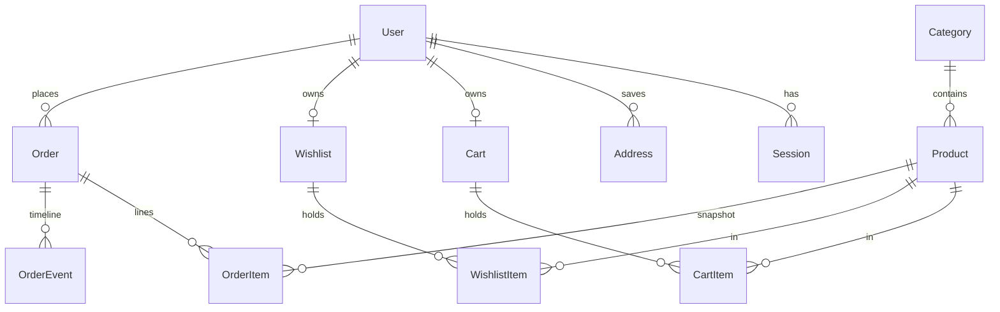

# LUXE Store — Master Project Architecture Document (PAD) v1.34

**Classification:** Internal Engineering Reference
**Status:** DEFINITIVE, PRODUCTION-LOCKED BLUEPRINT
**Companion Document:** [README.md](README.md) · [AGENTS.md](AGENTS.md) · [CLAUDE.md](CLAUDE.md) · [docs/Tailwind-V4-Validation-Report.md](docs/Tailwind-V4-Validation-Report.md)
**Last Updated:** 2026-10-10
**Audience:** Senior Engineers, Tech Leads, DevOps, and Onboarding Engineers
**Rule:** Every architectural decision in this document traces to a specific rationale. Nothing is here "because it's popular."

## Revision Block

| Version | Date | Author | Tags | Change |
|---|---|---|---|---|
| 1.0 | 2026-10-07 | Build agent (Super Z) | [RES]/[SYN]/[SAN] | Initial production blueprint after full-site recon, build, computed-style parity gate, and 103-test verification |
| 1.1 | 2026-10-07 | Review agent (Super Z) | [REM] | Session-1 remediation: route-group chrome split (ADR-008), reference-parity 404/auth/empty-states/drawer behavior, slate-palette pin (trap 7), stale-state logout fix, `.env.example` realignment, 107-test gate — see docs/remediation-plan-session1.md |
| 1.2 | 2026-10-07 | Review agent (Super Z) | [REM] | Session-2 remediation: catalog-order parity contract (sortOrder = reference array position, staggered createdAt, rating tie-break), reference-exact seed data (3 ratings + 11 descriptions), cart-drawer item-row anatomy rewrite, /cart line-total consistency, deliberate-divergence register, 117-test gate — see docs/remediation-plan-session2.md |
| 1.3 | 2026-10-07 | Review agent (Super Z) | [REM] | Session-3 remediation: auth parity contract (ADR-010 — /forgot-password anti-enumeration flow, nameless registration with derived display name, •••••••• placeholders, per-route Metadata), account-tab anatomy (icon avatar, highlighted default address, Change-Password section), shop active-filter chips + reference empty state, PDP related-products rule (all same-category), hero-dot geometry, 140-test gate — see docs/remediation-plan-session3.md |
| 1.4 | 2026-10-07 | Review agent (Super Z) | [REM] | Session-4 remediation: money/interaction parity round (ADR-011 — $9.99 flat shipping, reference-exact toast subsystem, transactional delta steppers fixing a lost-update race, cart-mutation guest-token fix, auth-screen anatomy rebuild incl. tinted error boxes + native validation + pinned copy, env-gated email-verification machinery, humanized-slug PDP titles, Reviews/Shipping tab panels, feature-bar cards, footer Join/separator), 170-test gate — see docs/remediation-plan-session4.md |
| 1.5 | 2026-10-07 | Review agent (Super Z) | [REM] | Session-5 remediation: buy-panel/home parity round (ADR-012 — StoreProvider server-truth re-sync fixing the stale post-order cart badge; wishlist heart color contract: red `fill-destructive` active + muted card hearts + the 82px px-8 PDP heart incl. the reference's mobile clipped-heart geometry; home section hairline dividers), reference quirk register (cosmetic wishlist, base44 Google OAuth), 173-test gate — see docs/remediation-plan-session5.md |
| 1.6 | 2026-10-07 | Review agent (Super Z) | [REM] | Session-6 remediation: superset correctness round (ADR-013 — server-side stock enforcement: clamped cart mutations + in-transaction overselling rejection + atomic placement decrement; ADR-014 — redirect-after-login with `validateRedirectPath` open-redirect hardening; `/login` becomes dynamic), first admin-console E2E coverage + guest-checkout E2E, dead-code removal, 188-test gate — see docs/remediation-plan-session6.md |
| 1.7 | 2026-10-08 | Review agent (Super Z) | [REM] | Session-7 remediation: operational-completeness round (ADR-015 — admin order-detail view rendering the OrderEvent timeline + dedicated admin E2E; fresh-clone build reproducibility — `public/` committed + hardened build script; per-page admin redirect targets fixing REDIRECT-2; unknown-slug PDP titles + CDN favicon parity; nested-`<main>` landmark fix; six unused dependencies pruned; e2e-reset run-to-run order isolation), 194-test gate — see docs/remediation-plan-session7.md |
| 1.8 | 2026-10-08 | Review agent (Super Z) | [REM] | Session-8 remediation: computed-geometry parity round (ADR-016 — Tailwind v4 trap 8: `space-y-*` margins are inert on inline `<label>` first children, fixed surgically with `mt-2` input wrappers; account tab/label/button geometry; the PDP's flat floor() star row + gap-2/mb-8 breadcrumb + reference feature glyphs; humanized-path unknown-route titles via the `[...notFound]` catch-all; lowercase typeahead categories), 210-test gate — see docs/remediation-plan-session8.md |
| 1.9 | 2026-10-08 | Review agent (Super Z) | [REM] | Session-9 remediation: mobile-geometry + social-metadata round (ADR-017 — the `pageMetadata()` OpenGraph/Twitter/PWA head layer incl. the PDP's React-19-hoisted card-less twitter shape + the Next metadata-engine constraints; trap 9: grid-item stretch breaks fit-content buttons on mobile while desktop coincides; the account Orders row anatomy port; the 150px sort trigger), first deep mobile sweep of the non-home surfaces + 9th mobile-nav verification, 224-test gate — see docs/remediation-plan-session9.md |
| 1.10 | 2026-10-08 | Review agent (Super Z) | [REM] | Session-10 remediation: interaction-engine parity round (ADR-018 — trap 10: a base `leading-*` beats responsive `text-*` line-heights on v4 (hero h1 45/60px vs the reference's 40/48px, identical class strings) pinned with `sm:leading-[2.5rem] lg:leading-none`; trap 11: v4.3 gates every hover-family variant behind `@media (hover: hover)` — restored v3 semantics with `@custom-variant hover (&:hover)`), first tablet-band sweep (639/640/768/1024) + focus-state audit + text-metric censuses + 10th mobile-nav verification, 226-test gate — see docs/remediation-plan-session10.md |
| 1.11 | 2026-10-08 | Review agent (Super Z) | [REM] | Session-11 remediation: typography + keyboard-a11y parity round (ADR-019 — trap 12: the shadcn v4 starter's body `antialiased` vs the reference's subpixel `auto`; trap 13: next/font's repackaged woff2 strips the `prep` hinting table — self-hosted the reference's EXACT Google-served file at public/fonts/ + a plain @font-face, pixel diffs 1-4.8% -> 0.23-0.60%; A11Y-FOCUS-1: hero inactive slides inert, tab order restored to the reference's CTA -> prev -> next -> dots), first media-preference sweep (reduced-motion/print/color-scheme) + a11y-semantics census + 11th mobile-nav verification, 229-test gate — see docs/remediation-plan-session11.md |
| 1.12 | 2026-10-08 | Review agent (Super Z) | [REM] | Session-12 remediation: axe-core differential a11y round (ADR-020 — A11Y-MAIN-1: four shopper pages shipped a nested `<main>` since session-1, exposed by the first automated axe differential after eleven computed-style rounds; A11Y-ARIA-1/2: aria-label on role-less divs — the toast viewport is now a nameless live region, the rating row role="img"; SEC-HEADERS-1: the reference's three security headers + X-Frame-Options via next.config headers()), 12th mobile-nav verification + first 200%-zoom reflow + console-error census, 233-test gate — see docs/remediation-plan-session12.md |
| 1.13 | 2026-10-08 | Review agent (Super Z) | [REM] | Session-13 remediation: Core Web Vitals differential round (first LCP/CLS/FCP quantification: clone LCP 252ms vs reference 1576ms on the IDENTICAL CDN hero element — the SSR superset; CLS 0.0213 = 0.0213 byte-identical layout stability) + keyboard focus-order walk + 8-route pixel drift re-check (all at baseline) — zero parity defects; ADR-021 (ADMIN-SEARCH-1: URL-deep-linkable admin order filters — status + number/email search + count line + empty state), 13th mobile-nav verification, 248-test gate — see docs/remediation-plan-session13.md |
| 1.14 | 2026-10-08 | Review agent (Super Z) | [REM] | Session-14 remediation: delivery-layer differential round (first network/transfer/caching quantification: font byte-identical 27,348B; route-split JS 177KB gzip vs the reference's 213KB single bundle; 1-year immutable asset caching vs 7-day; the encoding gap recorded as reverse-proxy territory) — zero parity defects; ADR-022 (SEC-CSP-1: nonce-based Content-Security-Policy via `src/proxy.ts` — the Next 16 proxy convention — with `strict-dynamic` scripts, per-request nonces, and the two static auth screens force-dynamic'd), 14th mobile-nav verification (byte-identical to the 13th across the CSP change), 250-test gate — see docs/remediation-plan-session14.md |
| 1.15 | 2026-10-08 | Review agent (Super Z) | [REM] | Session-15 remediation: full-route census round (first production-readiness sweep: all 22 manifest routes walked in a real browser — ZERO console errors/pageerrors; link-integrity crawl — 19/19 internal targets live; 8-route pixel drift re-check at baseline; axe differential re-measured at byte-identical counts 28/23/14/8/8/3) — zero parity defects; ADR-023 (A11Y-GATE-1: the self-hosted axe-core standing E2E gate — census exactly {color-contrast} + pinned counts, mutation-proven), 15th mobile-nav verification (byte-identical md5 to the 13th/14th), 256-test gate — see docs/remediation-plan-session15.md |
| 1.16 | 2026-10-08 | Review agent (Super Z) | [REM] | Session-16 remediation: the axe-gate-coverage round (FIRST mobile-viewport axe differential — the clone's mobile census is {color-contrast} with counts byte-identical to the desktop pins 28/23/14/8/8/3, the aria superset holds at mobile; FIRST admin-surface axe census — {color-contrast} only, 8/7/7/7, zero aria violations on any console surface; 16th mobile-nav verification byte-identical md5 to the 13th–15th; 8-route pixel drift + full-route census + typeahead/carousel watches all at baseline) — zero parity defects; ADR-024 (A11Y-GATE-2: the standing gate extended to BOTH viewports + the admin console — dual-mutation-proven, the mobile-only mutation invisible to the desktop gate by construction), 266-test gate — see docs/remediation-plan-session16.md |
| 1.17 | 2026-10-08 | Review agent (Super Z) | [REM] | Session-17 remediation: the CWV standing-gate round (FIRST multi-route Core Web Vitals differential — LCP/CLS/LCP-element on home/shop/PDP, both sites, authenticated: the clone paints 2–4.5× faster than the reference on the byte-identical LCP elements with CLS ≤ 0.0011 — the SSR performance superset; measured: the reference auth-gates every route for anonymous visitors; 17th mobile-nav verification byte-identical md5 to the 13th–16th; 8-route pixel drift + full-route census + typeahead/carousel watches all at baseline) — zero parity defects; ADR-025 (PERF-GATE-1: the standing CWV budget gate — LCP ≤ 2500ms + CLS ≤ 0.03 + LCP-element identity floors, E2E-condition-calibrated, dual-mutation-proven), 269-test gate — see docs/remediation-plan-session17.md |
| 1.18 | 2026-10-08 | Review agent (Super Z) | [REM] | Session-18 remediation: the mobile-CWV-gate round (FIRST MOBILE-VIEWPORT CWV differential — LCP/CLS/LCP-element on home/shop/PDP at iPhone 14, both sites, authenticated: the clone paints 3.2–4.4× faster than the reference on the byte-identical LCP elements with CLS ≤ 0.0016; 18th mobile-nav verification byte-identical md5 to the 13th–17th; 8-route pixel drift + full-route census + typeahead/carousel watches all at baseline) — zero parity defects; ADR-026 (PERF-GATE-2: the mobile CWV budget gate — the SAME pin families at iPhone 14 with mobile-scale identity floors, E2E-condition-calibrated at the 390×664 device viewport, triple-mutation-proven incl. the mobile-only structural-blindness proof), L28 (the unsized-media CLS class is CDN-timing-dependent), 272-test gate — see docs/remediation-plan-session18.md |
| 1.19 | 2026-10-09 | Review agent (Super Z) | [REM] | Session-19 remediation: the auth-screens-gate completion round (the FIRST auth-screens axe differential — register/forgot-password/verify-email on BOTH sites at BOTH viewports, anonymous: register + forgot-password censuses byte-identical ({color-contrast} × 2); verify-email measured against the reference's platform 404 — the clone's standalone route is a SUPERSET surface with the QUALITY pin (× 1); 19th mobile-nav verification byte-identical md5 to the 13th–18th; 8-route pixel drift + full-route census + typeahead/carousel watches all at baseline) — zero parity defects; ADR-027 (A11Y-GATE-3: the standing axe gate extended to the auth family's remaining screens — 3 screens × 2 viewports in anonymous contexts, dual-mutation-proven), L29 (axe's label rule accepts a non-empty placeholder as a last-resort name source — reference-parity placeholders mask label-association defects), 278-test gate; the v1.18 title-bump defect (header read v1.17) fixed — see docs/remediation-plan-session19.md |
| 1.20 | 2026-10-09 | Review agent (Super Z) | [REM] | Session-20 remediation: the SEO + auth-completion round (the FIRST SEO/sitemap differential — the user's standing round instruction — discovered the reference ships a REAL /reset-password route listed in its own sitemap while the clone 404s it (RESET-ROUTE-1, the auth family's missing member); the sitemap/robots layer had ZERO regression pins (SEO-GATE-1); no structured data on either site (JSON-LD-1); 20th mobile-nav verification byte-identical md5 to the 13th–19th; 8-route pixel drift + typeahead/carousel watches at baseline) — ONE parity defect fixed + two gate/superset gaps closed: the /reset-password route (both measured states, sha256-indexed single-use tokens, session invalidation) + the SEO standing gate (tests/e2e/seo.spec.ts — sitemap census 17 URLs + robots rules + JSON-LD nodes) + the structured-data layer (Organization/WebSite/Product); ADR-028; L30 (the drawer exit-animation remnant races unscoped strict-mode locators — post-navigation role assertions scope to the region) + L31 (high-entropy tokens are sha256-indexed — scrypt's random salt can never serve as a lookup key); the cart-spec Checkout assertion refined to the main region; the smoke nonce test skips CSP-exempt data blocks; 296-test gate — see docs/remediation-plan-session20.md |
| 1.21 | 2026-10-09 | Review agent (Super Z) | [REM] | Session-21 remediation: the INP standing-gate round (the FIRST INP differential — a scripted 5-interaction protocol on both sites at both viewports: ZERO parity defects, the clone's server-action mutations paint as fast as the reference's client-state mutations, 16-48ms everywhere; 21st mobile-nav verification byte-identical md5 to the 13th-20th; 8-route pixel drift + typeahead/carousel watches + full-route console census all at baseline) — zero parity defects, so the round's deliverable is PERF-GATE-3: the standing INP interaction gate (10 tests = 5 surfaces × 2 viewports in GUEST contexts, trusted-click event-timing collection, INP ≤ 200ms budgets, dual-mutation-proven); ADR-029; L32 (synthetic evaluate-clicks generate zero interaction entries) + L33 (the event observer's default durationThreshold hides fast interactions); 306-test gate — see docs/remediation-plan-session21.md |
| 1.22 | 2026-10-09 | Review agent (Super Z) | [REM] | Session-22 remediation: the professional Stripe payment round (the user's explicit round mandate — PAY-STRIPE-1, ADR-030): the full production machinery env-gated OFF by default (the reference-parity mock wizard stays the resting checkout — pixel-sweep + E2E-pinned): a themed Payment Element island (SAQ-A — card data never touches the app), server-minted PaymentIntents with deterministic idempotency keys and server-cart amounts, verify-then-place with `Order.stripePaymentIntentId` UNIQUE anchoring placement idempotency, the signature-verified dedup-first webhook backstop, and the env-gated CSP additions; 22nd mobile-nav verification byte-identical md5 (ten consecutive rounds); 8-route pixel drift + typeahead/carousel watches + console census + SEO layer all at baseline; L34 (the @stripe/stripe-js DEFAULT entry eagerly fetches js.stripe.com at module scope — /pure is the lazy form; the detection discipline: attach the request listener BEFORE the island chunk loads); 41 unit + 5 E2E new tests (352 total, three mutations proven); 352-test gate — see docs/remediation-plan-session22.md |
| 1.23 | 2026-10-09 | Review agent (Super Z) | [REM] | Session-23 remediation: the Stripe webhook H4d-hardening round (PAY-STRIPE-2, ADR-031 — the round-23 audit of the session-22 Stripe machinery against the reference skill's lesson log found the H4d/L9 defect class live: the webhook's StripeEvent dedup row committed BEFORE the placement tx and every failure answered 200, so a TRANSIENT failure permanently orphaned a captured payment — Stripe's retry short-circuited on the pre-committed dedup row). Fixes: the dedup row now commits INSIDE the placement transaction (a transient failure rolls it back + answers 500 → Stripe retries → the retry re-places — the recovery the backstop exists for); the honest failure policy (deterministic outcomes — amount mismatch, stock-short — keep the record + 200 + refund trail); the classifyWebhookPlacementError/isIntentAnchorP2002 seams (P2002-target-aware); the webhook's order-number generation moved inside the tx; the island's mint-error "Try again" affordance; and the NEW integration layer (tests/stripe-webhook.integration.test.ts — the REAL route handler driven with REAL HMAC-signed events against a scratch db/webhook-test.db; 11 tests incl. the H4d recovery proof with Proxy-wrapped real-tx fault injection; triple-mutation-proven); 23rd mobile-nav verification byte-identical md5 (eleven consecutive rounds); 8-route pixel drift + typeahead/carousel watches + console census + SEO layer all at baseline; L35 (the idempotency row commits WITH the side effects — a pre-committed dedup row swallows the retry the recovery needs); +22 tests (374 total); 374-test gate — see docs/remediation-plan-session23.md |
| 1.24 | 2026-10-09 | Review agent (Super Z) | [REM] | Session-24 remediation: the admin payment-ops surface round (PAY-OPS-1, ADR-032 — the session-44 suggested-next-steps payment-ops candidate, the only Stripe-family item actionable without credentials): the StripeEvent log's read surface at /admin/payments with honest per-event outcome resolution (deep-linked placed orders, the refund-needed family per ADR-031, failed/ignored), URL-deep-linkable family + intent/id filters, the demo-mode/configured status line, the Stripe-paid ORD-2026-003 + canonical three-event fixtures (seed + e2e-reset isolation contract), the dashboard Payments entry point; 19 seam + 6 E2E + 1 a11y-gate new tests (400 total); the heading-order console-family observation documented; 24th mobile-nav verification byte-identical md5 (twelve consecutive rounds); 8-route pixel drift + typeahead/carousel watches + console census (incl. payments ×3) + SEO layer all at baseline — see docs/remediation-plan-session24.md |
| 1.25 | 2026-10-09 | Review agent (Super Z) | [REM] | Session-25 remediation: the payment-ops observability + console a11y round (PAY-OPS-2, ADR-033 + A11Y-HEADING-1 — both session-46/47 documented round-25 candidates): (a) the refund-needed OUTCOME promoted to a first-class filter family (`?family=refund-needed` — succeeded events with NO linked order, the operator's most actionable signal; the pure seam gains the placed-intent set as its second parameter; family+q keeps the type+notIn group intact inside the AND element); (b) the event AMOUNT persisted + rendered (`StripeEvent.amount Int?` — the webhook persists `data.object.amount` at both write sites; the rows render the magnitude beside the outcome via formatCents); (c) the charge-event intent honesty (`stripeEventIntentId` = `payment_intent ?? object.id` — charge-family deliveries record the REAL intent id; the surface's q-search stays truthful); (d) the console LIST pages' heading-order family observation RESOLVED (sr-only h2s on orders/products/payments; the best-practice census on the console pinned EXACTLY EMPTY; the storefront keeps the reference's own shape — parity); a FOURTH canonical fixture (`evt_demo_fixture_n` — succeeded, NO order, amount 14900: the refund-needed family's seeded instance); the payments a11y pin recalibrated 8 → 9 (the fourth fixture's destructive line, node-enumerated — the same app-wide class); +12 Vitest + 4 E2E (416 total); triple-mutation-proven; 25th mobile-nav verification byte-identical md5 (thirteen consecutive rounds); 8-route pixel drift + typeahead/carousel watches + console census (incl. payments ×4) + SEO layer all at baseline — see docs/remediation-plan-session25.md |
| 1.26 | 2026-10-09 | Review agent (Super Z) | [REM] | Session-26 remediation: the reference-drift remediation + payments date-range round (HERO-DRIFT-1 + HEADER-DRIFT-1 + PAY-OPS-3, ADR-034 — the drift family discovered by the round's own audit): the reference site SILENTLY changed its slide-3 hero image (54a27de93… → 19ea6418a…, now its headphones product image) and re-pointed all three hero CTAs to plain /shop (the session-1 category deep-links were the old truth) — the 13-round pixel-sweep band held throughout because NO gate pinned slide media or CTA hrefs (computed-style pins are content-agnostic; the manual sweep read home 62.07% out-of-band and the diff-band localization + live A/B measurement isolated the three changes); the header icon cluster tightened to gap-1 (156px — the justify-between nav row lands 6px right of the clone's old gap-2 layout at 1024) and the mobile row re-structured to THREE direct children (menu / bare logo / cluster — the clone's (menu+logo) gap-4 wrapper sat the logo 23px left on every mobile page). Fixes: the slide-3 image + all CTAs plain /shop (page.tsx), the unwrapped mobile row + gap-1 cluster (header.tsx), and the standing CONTENT pins that close the coverage gap (the hero-content test: 3 img srcs by hash tail + 3 CTA hrefs; the header-geometry tests: column-gap 4px + cluster 156 at 1024, the three-child distribution at 390); post-fix the sweep reads home 0% (6 px). The PAY-OPS-3 superset item: the payments date-range filter (?from=/to= strict YYYY-MM-DD at UTC day boundaries — shape regex + Date round-trip, bad bounds fall through, from>to drops the pair; the composable-AND where refactor; two URL-controlled date inputs pushing merged params in canonical order); +10 Vitest + 7 E2E (433 total); triple-mutation-proven (the image revert, the gap revert, the clause drop); the mobile-nav token parity re-verified post-header-unwrap; watches + census clean — see docs/remediation-plan-session26.md |
| 1.27 | 2026-10-09 | Review agent (Super Z) | [REM] | Session-27 remediation: the console trifecta completion + docs alignment round (ADMIN-PRODUCTS-1, ADR-035 + DOCS-ALIGN-1): /admin/products — the last of the three console LIST surfaces still rendering a bare list — takes the URL-deep-linkable treatment the orders (session-13) and payments (sessions 24–26) surfaces already carry: ?q= (name OR slug contains), ?category= (validated against the DB-fetched slug set the page passes the pure seam as input — the placedIntentIds precedent, a future category validates the day it is seeded), ?visibility= (active/hidden — the eye-toggle seam's list-level answer, "which products did I hide?"); bad deep-links fall through to the unfiltered list, never an error (the family contract); the composable-AND where (the category element is Prisma's relation filter); the canonical param order (category, q, visibility); the filtered-of-total count line; the guided empty state. The round's audit verified NO new reference drift (the sweep all-8-in-band pre-change, the session-26 content pins holding against the live reference; the 27th mobile-nav token-exact verification). DOCS-ALIGN-1: the stale reference-table counts corrected (CLAUDE.md Build Commands 198/217 → 226/230; README 13→15 models + 25→27 verifications; PAD Key Files 13→15 models + the header version). +18 Vitest + 5 E2E (456 total); triple-mutation-proven; watches + census (incl. the products-filter variants) clean — see docs/remediation-plan-session27.md |
| 1.28 | 2026-10-09 | Review agent (Super Z) | [REM] | Session-28 remediation: the dashboard refund-needed alert round (DASH-ALERT-1, ADR-036 + SWEEP-DIAG-1/L37): the console's entry point now surfaces the payments surface's most actionable signal — a succeeded payment with no placed order is money the store captured and must refund — as an alert row between the stat grid and Recent Orders (the count composes with the SAME seam the payments family filter uses: buildAdminPaymentWhere family=refund-needed + the placed-intent set — a divergent count between the dashboard stat and the payments list is structurally impossible; the pure refundNeededAlert(count) presentation contract: {visible:false} at 0 — the honest calm state, only the unit layer can pin it, the e2e fixture set always counts 1 — singular/plural labels, the family deep-link href; the icon-only destructive accent keeps the admin a11y census pin at 8 — destructive TEXT measures ~3.9:1 and would grow the pinned count; the "Review payments" deep-link lands the family filter). The round's audit ALSO produced the SWEEP-DIAG-1 process finding: the first battery's home reading 59.95% out-of-band was a TRANSIENT cold-boot paint/phase artifact (4 independent re-measurements all 0.00%; active slide + h1 styles + CTAs + shop inventories identical) — the sweep now records the hero phase at capture time (the active slide's hash tail + paint state on BOTH sides — L37: a NOT-PAINTED flag or differing tail beside an out-of-band number = artifact, re-measure; identical painted phases + persistent diff = drift, run the playbook). +4 Vitest + 1 E2E (461 total); triple-mutation-proven (the visibility gate inversion, the pluralization drop, the empty placed-intent set); the a11y dashboard pin unchanged; the 28th mobile-nav token-exact verification; watches + census clean — see docs/remediation-plan-session28.md |
| 1.29 | 2026-10-10 | Review agent (Super Z) | [REM] | Session-29 remediation: the order-detail payment-event trail round (REFUND-TRAIL-1, ADR-037 + the L38 battery-login robustness fix): the order side of the payments deep link — a Stripe-paid order's detail (/admin/orders/[id]) renders the StripeEvent rows for its intent (the capture + any dashboard refunds) as a "Payment events" card between Items and the Timeline, composed through ONE bounded query on the exact linkage the payments outcome resolver uses (paymentIntentId = the order's stripePaymentIntentId) + the pure orderPaymentTrail/paymentEventLabel seams in src/lib/admin-payments.ts (the module boundary follows the data — the session-28 dashboard precedent; the operator vocabulary: succeeded → "Payment captured", charge.refunded → "Refunded", payment_failed → "Payment failed", unknown types pass through raw; the calm state {visible:false} on an empty set — a non-Stripe order renders NO card, which is also what keeps the a11y order-detail census pin at 7); contrast-safe by construction (foreground + muted only). The round's audit ALSO produced L38: the reference's login redirect chain became SLOW (login → login ×N → / takes >2.5s) — the battery's login helpers read the pre-redirect pathname and captured every authed route logged-OUT (40–66% false out-of-band); every reference login helper now waits for the URL to LEAVE /login (waitForURL) before reading state. +5 Vitest + 1 E2E (467 total); triple-mutation-proven (the label mapping drop, the visible-gate inversion, the page's wrong-column query); the a11y order-detail pin unchanged; the 29th mobile-nav token-exact verification; watches + census clean — see docs/remediation-plan-session29.md |
| 1.30 | 2026-10-10 | Review agent (Super Z) | [REM] | Session-30 remediation: the deterministic-failure reason trail round (REASON-TRAIL-1, ADR-038 — the session-58 suggested-next-steps' only non-credential-gated candidate: "persist the deterministic-failure reasons so the refund-needed family is self-explanatory"): StripeEvent.failureReason String? — the webhook's four permanent-classification write sites (metadata-unusable / cart-unavailable / amount-mismatch / stock-short) persist the canonical code through recordEvent(evt, reason); the vocabulary is exported as STRIPE_FAILURE_REASON from src/lib/stripe-payment.ts (the single source the write + read sides share); the read side is the pure paymentFailureReasonView seam in src/lib/admin-payments.ts (null → {visible:false} the honest calm state — pre-session-30 rows + every non-failure recording; the canonical codes → operator copy; unknown codes pass through raw); the payments page composes BOTH gates (the refund-needed outcome AND the view's visible) so a placed row can structurally never render a reason, in the row's own muted pair (the a11y payments census pin stays 9 — zero new color pairs); NEVER a derivation input (the refund-needed family still derives from DB state; the reason is enrichment). The seeded evt_demo_fixture_n carries amount-mismatch (the coherent story for a $149.00 succeeded intent with no order), restored idempotently by seed + e2e-reset. +6 unit + 1 integration + 1 E2E (475 total); triple-mutation-proven (M1 the label mapping drop → 4 unit failures; M2 the visible-gate inversion → 1 unit failure; M3 the webhook write-site drop → 1 integration failure); the a11y payments pin unchanged at 9; the 30th mobile-nav token-exact verification; watches + census clean — see docs/remediation-plan-session30.md |
| 1.31 | 2026-10-10 | Review agent (Super Z) | [REM] | Session-31 remediation: the guest order confirmation token round (GUEST-TOKEN-1, ADR-039 + CHECKOUT-SEO-1 + CHECKOUT-AC-1 — the audit-derived candidate: no Stripe test-mode keys or email credentials provided, so the round targeted the checkout-experience gaps surfaced by the Scandi Haven patterns review): /checkout/success's details gate widened from `!order.userId` (a live-verified enumeration exploit — ANY visitor could read ANY guest order's email/items/total by walking the sequential ORD-YYYY-NNN space) to owner-or-token — the placement action signs the order number (HMAC-SHA256, AUTH_SECRET-keyed, domain-separated `order-view:` prefix, 22-char base64url, constant-time verify, no expiry by design) and returns {orderNumber, viewToken} at BOTH success sites (the happy path AND the P2002 already-placed branch); the wizard redirects with `&t=`; anonymous enumerators AND signed-in non-owners get the generic block (src/lib/order-view-token.ts — the pure seam, 8 unit pins). + the checkout family noindex (pageMetadata's noindex option on /checkout + /checkout/success — belt-and-suspenders with the robots.txt disallow) and the shipping step's WCAG 1.3.5 autoComplete tokens (given-name/family-name/email/street-address/address-level2/address-level1/postal-code). +8 unit + 3 E2E (486 total); triple-mutation-proven (M1 the gate revert → the enumeration E2E fails; M2 the domain-prefix drop → the domain-separation unit contract fails; M3 the noindex spread removal → the seo E2E fails); the 31st mobile-nav token-exact verification; sweep at baseline; watches + census clean — see docs/remediation-plan-session31.md |
| 1.32 | 2026-10-10 | Review agent (Super Z) | [REM] | Session-32 remediation: the refund action seam round (REFUND-ACTION-1, ADR-040 — the audit-derived candidate from session-61's list; the guest-order merge-back was DEFERRED on the email-verification PII analysis and the rate-limiter store re-deferred as the PAD's open Medium): the payments family's first ACTION + the missing order-state reflection. (a) refundOrderAction (src/lib/actions/admin.ts) — admin-gated, guarded by the SHARED refundEligibility seam (src/lib/admin-payments.ts: intent + paymentStatus "paid"; the render gate and the action guard compose one function — the DASH-ALERT-1 rule), calling stripe.refunds.create with the intent-scoped idempotency key refund:<intentId> (stripeRefundIdempotencyKey — one full refund per intent, replay-safe); demo mode refuses with the honest operator copy. (b) The webhook's charge.refunded branch (the SINGLE WRITER of refund state on the order): the eventId fast-path dedup, then for a linked paid order the dedup row + paymentStatus "refunded" (full refunds — Stripe's `refunded` boolean) + a first-class payment_refunded OrderEvent commit in ONE transaction (H4d/L9 applied to the reflection — a standalone-committed row before a failed reflection would orphan the delivery); partial refunds write the timeline note only (the chargeRefundedReflection pure seam, src/lib/stripe-payment.ts — the write-side derivation family's home); no linked order / non-paid orders record standalone (today's behavior). (c) The order detail: the two-step inline confirm refund control (the GitHub destructive pattern, icon-only destructive accent — src/components/account/refund-order-button.tsx), the "Refunded (Stripe)" muted Charge branch, the "Payment refunded" timeline mapping (RotateCcw); the a11y order-detail census pin stays 7 by construction. +15 unit + 4 integration + 2 E2E (507 total); triple-mutation-proven (M1 the eligibility inversion → 3 unit failures; M2 the full-refund state write dropped → 2 integration + 2 unit failures; M3 the demo-refusal branch removed → the E2E refusal copy fails); the 32nd mobile-nav token-exact verification; sweep at baseline; watches + census clean; the live probe (a signed charge.refunded against the scratch-DB server) reflected end-to-end — see docs/remediation-plan-session32.md |
| 1.33 | 2026-10-10 | Review agent (Super Z) | [REM] | Session-33 remediation: the customer-side money-state mirror round (CUSTOMER-MONEY-1, ADR-041 — the audit-derived candidate from session-63's list; the payments-surface Stripe-dashboard deep-link DEFERRED on the configured-mode gate, the rate-limiter store re-deferred): the payments family built every OPERATOR surface for the refund state; the CUSTOMER half never shipped. (a) The pure seam module src/lib/order-money-state.ts (Prisma-free; formatCents via the pure-to-pure import): orderRefundLineView(paymentStatus, totalCents) — the account order-history row's line, visible ONLY on paymentStatus "refunded" → the muted "Refunded · $X returned" under the date (a full refund — partials keep "paid", so the state implies the amount); history NEVER shows a paid line (the DASH-ALERT-1 alert-fatigue lesson) and non-refunded rows keep the reference's exact anatomy ({visible:false} = no DOM delta). OrderRow carries paymentStatus (the page's query already fetched the full row). (b) confirmationMoneyLineView(paymentStatus) — the checkout confirmation's line: the paid wording byte-exact from session-22, the refunded state carrying the customer-safe copy ("Payment refunded — the amount has been returned to your original payment method." — the R10-2 rule); the confirmation-sent line's mb rhythm keys off the line's visibility. (c) The E2E fixture ORD-2026-004: john's fourth order — 1× Ceramic Planter Set $79.99 (matching evt_demo_fixture_r's amount exactly), status cancelled (the refundEligibility design's own example in its post-refund resting state), paymentStatus "refunded" + intent pi_demo_fixture_005 linking the EXISTING evt_demo_fixture_r (its "no linked order" orphan story graduated to the linked shape; the payments surface's row/count pins unchanged — charge.refunded stays "Ignored", the four-event set intact), placedAt 18 minutes before the refund event's receivedAt, and a payment_refunded OrderEvent (the reflection's note format); restored idempotently by the seed's paid-columns update pattern + the e2e-reset/dev-cleanup guards (004 joins CANONICAL_ORDERS). The admin orders count line moved to "4 orders" (the delivered/in_transit filter pins unchanged — 004 is cancelled). +9 unit + 2 E2E (518 total); triple-mutation-proven (M1 the paid calm case dropped → 2 unit + the E2E account test fails; M2 the refunded copy broken → the unit text contract fails; M3 the calm-state gate broken in the consumer → the E2E paid-row pin fails); the 33rd mobile-nav token-exact verification; sweep at baseline; watches + census clean; VLM 5/5 — see docs/remediation-plan-session33.md |
| 1.34 | 2026-10-10 | Review agent (Super Z) | [REM] | Session-34 remediation: the customer order-detail read surface round (CUSTOMER-ORDER-DETAIL-1, ADR-042 — the audit-derived candidate from session-65's list; the payments-surface Stripe-dashboard deep-link re-deferred on the configured-mode gate, the rate-limiter store re-deferred): the customer's per-order view was a one-line history row + the ephemeral token-gated confirmation — no persistent detail, no affordance, while the operator console held the full read surface since ADR-015. (a) The route /account/orders/[id] — the DATABASE id (the admin-detail convention), owner-gated the GUEST-TOKEN-1 way (anonymous → the REDIRECT-1 exact path; a signed-in non-owner, an unknown id, and a guest order ALL render the same generic in-chrome "Order not found" block — existence is never confirmed to a non-owner); noindex (the CHECKOUT-SEO-1 belt-and-suspenders). (b) The read surface — the customer-safe subset of the operator detail in the account family's design language: the header (the back link, the number h1, the STATUS pill, the total), the Payment card (method + `···· last4`, the placed date, the money state via confirmationMoneyLineView — the per-order read vocabulary), the Shipping Address card (the parsed JSON snapshot), the Items card (the snapshot rows + the totals block); NO OrderEvent timeline (operator attribution — R10-2). (c) The seam extraction src/lib/order-status.ts (STATUS_STYLES/STATUS_LABELS/formatOrderDate) — a "use client" module's plain-object exports are client references, not importable from server components; the pure seam lets the tabs and the server page share one source (the module boundary follows the data). (d) The affordance — the history rows' order numbers are Links (the admin-console precedent): the <p> keeps font-semibold and the anchor inherits color/decoration via the Tailwind v4 preflight, so the resting visual is byte-identical (the zero-visual-delta superset pattern; registered in the divergence log). +7 unit + 6 E2E (531 total); triple-mutation-proven (M1 the ownership gate inverted → 4 E2E failures; M2 the seam's delivered variant weakened → the unit pin AND the session-9 anatomy E2E fail — the seam feeds the history pills; M3 the consumer's drifted money copy → the exact-text pin); the 34th mobile-nav token-exact verification; sweep at baseline (account 0% — the Link is visually inert); watches + census clean (the new route added to the census walk); VLM 5/5 — see docs/remediation-plan-session34.md |

## Table of Contents

1. [System Overview & Decisions](#1-system-overview--decisions)
2. [High-Level System Topology](#2-high-level-system-topology)
3. [Application Architecture](#3-application-architecture)
4. [Data Architecture](#4-data-architecture)
5. [Design System Reference](#5-design-system-reference)
6. [Security Architecture](#6-security-architecture)
7. [Worker / Background Service Architecture](#7-worker--background-service-architecture)
8. [Testing Strategy](#8-testing-strategy)
9. [Build & Deployment](#9-build--deployment)
10. [Developer Handbook](#10-developer-handbook)
11. [Known Issues & Outstanding Tasks](#11-known-issues--outstanding-tasks)
12. [Key Files Reference](#12-key-files-reference)
13. [Glossary](#13-glossary)

---

## 1. System Overview & Decisions

### 1.1 Document Metadata & Purpose

This PAD is the single source of truth for how LUXE Store is built and why. **Engineers changing code**: read §3 (layer rules) and §8 (testing) first. **DevOps**: §9. **Anyone touching styles**: §5 and the trap log — the pins are load-bearing. The document describes the CURRENT system only; history lives in git.

The product is a visual clone of a reference storefront (`fuzzy-lumina-style-hub.base44.app`) with the reference's demo behavior replaced by real commerce persistence — a "superset": everything the reference renders, at computed-style parity, plus accounts, carts, wishlists, checkout, order history, and an admin console that actually write to a database.

### 1.2 Technology Stack Summary

| Layer | Technology | Version | Key Rationale |
|---|---|---|---|
| Web framework | Next.js (App Router) | ^16.1.1 | RSC-first rendering; server actions remove the need for a REST mutation layer; standalone output for lean deploys |
| UI runtime | React | ^19 | Required by Next 16; compiler-enforced hook rules (set-state-in-effect is an error) |
| Language | TypeScript, `strict` | ^5 | Types at every boundary; `any` banned |
| Styling | Tailwind CSS (CSS-first `@theme`) | ^4 | Reference is v3-era; v4 chosen deliberately with a **pinned token system** to keep byte-parity (trap log, §5.4) |
| UI primitives | Radix UI + CVA + tailwind-merge | — | Reference fingerprint (shadcn); accessible Dialog/Select/Tabs/Sheet without hand-rolled ARIA |
| Icons | lucide-react | ^0.525 | Exact reference icon set (`lucide-shopping-bag`, `lucide-star`, …) |
| ORM | Prisma | ^6.11 | Schema-as-code + typed client; SQLite provider keeps zero-config local story |
| Database | SQLite | — | Single-file, single-writer — matches the deployment shape (one app instance); swap path documented in ADR-002 |
| Auth | node:crypto scrypt + DB sessions | — | No third-party dependency; memory-hard; revocable server-side sessions |
| Validation | Zod | ^3.25 | Single dialect for actions, route handlers, and test fixtures |
| Unit tests | Vitest | ^5 | Fast, node-env, co-located; mirrors tsconfig aliases |
| E2E tests | Playwright (Chromium) | ^1.63 | Drives the production standalone build; computed-style assertions are the parity gate |
| Package manager | Bun | ≥1.3 | Executes TS seeds/setup scripts directly; fast installs |
| AI SDK | z-ai-web-dev-sdk | ^0.0.18 | Available for future AI features; not on any request path today |

### 1.3 Architecture Decision Records

**ADR-001: Single Next.js application (no monorepo, no separate admin app)**
- **Context:** The reference clone needs a storefront and an admin console; the org's prior e-commerce pattern (Scandi Haven) used a pnpm+Turborepo monorepo with a second admin app on :3001.
- **Decision:** One Next.js app. Admin lives at `/admin` behind a role gate (`src/app/admin/*`), sharing the layout chrome and the Prisma client.
- **Rationale:** The reference is a single app; a monorepo adds tooling (Turborepo, workspace protocol, cross-package Tailwind `@source` wiring) with zero product value at this scale. One `next build`, one deploy, one test suite.
- **Consequences:** (+) Simpler CI, no package boundaries to drift. (−) Admin and storefront share a deploy cadence; acceptable while one team owns both.
- **Alternatives Rejected:** Turborepo monorepo (ADR-rejected for this scale); separate admin domain (needs its own auth plumbing and duplicate UI kit).

**ADR-002: SQLite via Prisma with a schema-relative `file:` URL**
- **Context:** The deployment target is a single app instance; the repo contract requires `DATABASE_URL="file:../db/custom.db"` with `db/` at the repo root.
- **Decision:** `provider = "sqlite"`; the URL is resolved identically for the Prisma CLI (anchored at `prisma/schema.prisma`) and the runtime (`src/lib/db-path.ts` anchors on the first directory containing `prisma/schema.prisma`, with standalone-build and CWD fallbacks). Money is integer cents; "enums" are Strings + Zod unions.
- **Rationale:** Zero-config local dev and a single-writer model that makes count-based order numbering race-free. The URL contract is unit-test-pinned (`tests/db-path.test.ts`) because naive "simplifications" have historically broken exactly this.
- **Consequences:** (+) No database server to operate; file-level backup. (−) No concurrent multi-instance writes (documented scale ceiling — see ADR-002 migration note in §9.2); no native enums (validated in code).
- **Alternatives Rejected:** PostgreSQL (requires a server + rootless setup for marginal benefit at this scale — revisit when scaling out); Drizzle (fine, but the repo already standardizes on Prisma).

**ADR-003: Cookie-token guest identity merging into user rows**
- **Context:** Carts and wishlists must work for anonymous visitors and survive login.
- **Decision:** `Cart`/`Wishlist` rows keyed by a random cookie token (`luxe_cart`, `luxe_wishlist`, 192-bit, httpOnly); at most one row per user; the login action merges the guest row into the user row (quantity-max union) inside the same request; reads NEVER mint rows.
- **Rationale:** Server Components cannot set cookies — so cart creation must happen only in mutation contexts. Merging at login (not at read) keeps every read path side-effect-free and idempotent.
- **Consequences:** (+) Guest work is never lost; badge/drawer state is pure server truth. (−) Two code paths (guest/user) in the cart/wishlist resolvers — centralized in one function each to keep it honest.
- **Alternatives Rejected:** localStorage carts (not server-trustworthy, breaks cross-device); merge-on-read (side-effectful reads, race-prone).

**ADR-004: Server actions as the only mutation seam; 3-route-handler whitelist**
- **Context:** The UI needs cart/wishlist/auth/account/checkout/admin mutations.
- **Decision:** All mutations are `"use server"` actions in `src/lib/actions/*.ts`, Zod-validated, returning `ActionResult<T> = { ok: true, data } | { ok: false, error: { message, fieldErrors? } }`. Route handlers exist ONLY for `/api/health`, `/api/search` (typeahead GET), `/api/newsletter` (POST).
- **Rationale:** Actions give progressive enhancement + typed callsites without a REST surface to version. The whitelist keeps the attack surface auditable (three endpoints, each rate-limited or trivial).
- **Consequences:** (+) One validation dialect, one result envelope. (−) No external API for mutations by design — an integration API would be a new ADR.
- **Alternatives Rejected:** REST mutation routes (double validation layer, more surface); tRPC (another dependency for no gain inside one app).

**ADR-005: Tailwind v4 with pinned v3 token geometry (the trap-log system)**
- **Context:** The reference app compiles Tailwind v3-era classes; the port must render byte-identical computed styles on v4.
- **Decision:** `src/app/globals.css` pins: full `hsl()` theme literals (bare triplets resolve transparent under `@theme inline`); `--shadow-sm: 0 1px 2px 0 rgb(0 0 0 / 0.05)`; the radius scale to v3 values (`xl: .75rem`, `2xl: 1rem`, `3xl: 1.5rem`); the hero overlay as an sRGB arbitrary gradient; the mobile nav stacks with flex `gap` (never `space-y` + `mt-*`). Parity is enforced by `tests/e2e/storefront-parity.spec.ts` against live-measured values.
- **Rationale:** v4 shifted BOTH the shadow and radius scales one notch and interpolates gradients in oklab; class strings identical, rendered geometry not. Pinning tokens (not rewriting classes) keeps the DOM byte-parity with the reference while fixing the engine deltas.
- **Consequences:** (+) One-line fixes for engine variance; E2E-guarded. (−) Token pins look "wrong" to anyone who knows v4 defaults — the trap log and this PAD exist to prevent well-meaning "fixes".
- **Alternatives Rejected:** Staying on Tailwind v3 (EOL trajectory, misses v4 tooling); rewriting class strings to v4 equivalents (breaks DOM parity, 10× the diff).

**ADR-006: scrypt + DB-backed sessions over JWT**
- **Context:** Accounts need password auth with revocable sessions on a single-instance deploy.
- **Decision:** `scrypt` (N=16384, r=8, p=1) password hashes; a `Session` table keyed by SHA-256 of a 256-bit token; cookie value `token.hmac(token)` (integrity-in-depth, AUTH_SECRET); 30-day expiry; destroy deletes the row.
- **Rationale:** JWTs can't be revoked without a denylist — a session table IS the denylist. scrypt avoids a native dependency (bcrypt/argon2) while meeting OWASP baseline parameters.
- **Consequences:** (+) Immediate revocation; no extra deps. (−) One DB read per authenticated request (SQLite: ~µs; fine).
- **Alternatives Rejected:** stateless JWT (revocation problem); Better-Auth (heavy for two auth pages; no OAuth in the reference parity scope).

**ADR-007: Checkout as a client wizard over a single transactional server action**
- **Context:** The reference renders a 3-step checkout (shipping → payment → review) client-side.
- **Decision:** The wizard lives in `checkout-flow.tsx` (client) with per-step validation gates; the final submit posts EVERYTHING to `placeOrderAction`, which Zod-validates, re-derives totals from the DB cart (never the client), allocates `ORD-YYYY-NNN`, and writes order + lines + event + cart-clear in ONE `db.$transaction`.
- **Rationale:** Step UX is presentation; money math is server truth. A single transaction means a crashed placement never leaves a half-written order or a charged-but-empty cart.
- **Consequences:** (+) Crash-safe, replay-safe (rate-limited). (−) Card data transits the action (test-mode only — a real PSP integration is the documented next step, §11).
- **Alternatives Rejected:** Per-step server persistence (three writes to unwind on back-navigation); client-computed totals (unacceptable).

**ADR-008: Route-group chrome split (minimal root layout)**
- **Context:** The reference renders /login and /register as standalone screens (no header/footer) and unknown routes on a chrome-less platform 404 — impossible under a single root layout that always wraps children in the storefront chrome.
- **Decision:** `app/layout.tsx` is a minimal shell (html/body/font/metadata only). The shopper chrome + `StoreProvider` hydration live in `app/(storefront)/layout.tsx`; login/register live in `app/(auth)/` with a standalone centering layout; the root `not-found.tsx` replicates the reference's slate platform 404 (client component, `usePathname`, v3 slate palette pinned in `@theme`). Unknown product slugs render an in-chrome "Product not found" block instead of the 404.
- **Rationale:** Next.js wraps the root not-found in the root layout — the only way to reproduce a chrome-less 404 is to keep the root layout chrome-free. Route groups are URL-neutral, so no route moved.
- **Consequences:** (+) Exact reference parity on three previously-diverging surfaces; login/register became statically prerendered (perf win). (−) The `StoreProvider` state survives client-side navigation inside the group — logout must explicitly `setUser(null)` (a latent stale-state bug the refactor surfaced and fixed); one extra layout file to keep in mind when adding routes.
- **Alternatives Rejected:** fixed-position overlay hiding the chrome (DOM parity break); a catch-all route rendering the 404 inline (fights the router, swallows real routes).

**ADR-009: Catalog order as a parity contract (sortOrder = reference array position)**
- **Context:** The reference is a client-side SPA whose product array order drives its shop "Featured" listing, its home "On Sale" membership (first 4 sale items in array order), its "Newest" sort (array reverse), and its "Top Rated" sort (stable rating-desc over the array). The original seed ordered products by merchandising group (trending first), so all four surfaces diverged.
- **Decision:** `Product.sortOrder` in the seed mirrors the reference array position 1:1 (headphones=1 … pajama=12); the seed sets a staggered `createdAt` (array position 1 = oldest) so `createdAt desc` reproduces "Newest" deterministically; the shop's rating sort uses `[{ rating: "desc" }, { sortOrder: "asc" }]` because Prisma's single-key orderBy leaves tie order undefined. Seed ratings/reviewCounts/descriptions are transcribed verbatim from the live reference.
- **Rationale:** Ordering is visible on every shop/home visit — parity requires encoding the reference's array semantics in data, not approximating them. The tie-break makes the E2E assertion deterministic (4.8 ties: headphones < serum < yoga-mat).
- **Consequences:** (+) All four order-sensitive surfaces match the reference exactly and are E2E-pinned (catalog-parity.spec.ts). (−) Reordering or adding products requires re-measuring the reference and updating sortOrder/createdAt together; the deliberate-divergence register documents the one order-adjacent behavior we do NOT replicate (the reference's mobile menu staying open after navigation).
- **Alternatives Rejected:** computed rank columns (duplicates state, drifts); client-side re-sorting (fights RSC, breaks deep links).

**ADR-010: Auth parity contract — nameless registration and anti-enumeration password reset**
- **Context:** The reference register form collects exactly [Email, Password, Confirm Password] — no Name — and its login links to a real `/forgot-password` screen whose submit always shows the same neutral confirmation. The clone had an extra Name field, a disabled self-linking "Forgot password?", and no reset route; the reference also titles each auth page ("Login | Lumina") while the clone showed a bare "Lumina".
- **Decision:** Each `(auth)` route is a server `page.tsx` owning `Metadata` (title only; the root template appends "| Lumina") delegating to a `*-form.tsx` client island. `registerSchema.name` is optional; `registerAction` derives the display name from the email local part (`deriveDisplayName`, `src/lib/validation.ts`) because `User.name` stays required in Prisma. New `requestPasswordResetAction`: Zod-validated email, rate-limited 5/15min/IP+email, user lookup feeds ONLY a `console.info` seam (never the response), identical neutral confirmation for known and unknown emails. Password inputs carry the reference's `••••••••` placeholder; the login "Forgot password?" link is enabled at `text-xs` → `/forgot-password`.
- **Rationale:** Enumeration via the reset flow is the classic account-discovery vector — the reference's always-same copy is the correct pattern to replicate, now with real server-side enforcement. Deriving the name keeps the DB contract intact while matching the reference's 3-field form 1:1.
- **Consequences:** (+) Whole reference auth surface at parity with production-grade security (rate limit + anti-enumeration); per-route titles correct; no Prisma migration. (−) No email is actually sent (documented seam — plug Resend/SES/Postmark at the `console.info` line); display names from odd local parts (`e2e-42@x` → "E2e 42") are cosmetic until Profile editing refines them.
- **Alternatives Rejected:** keeping the Name field (visible form-structure divergence); a real reset token table + emailed link (no email infra; would still need the neutral response); revealing account existence (security regression vs the reference).

**ADR-011: Money & interaction parity round — shipping, toasts, transactional steppers, and env-gated email verification**
- **Context:** Round-4 live A/B audit measured money and interaction surfaces the earlier rounds had not: the reference charges a **flat $9.99** shipping below $100 (measured at $34.99 and $79.99 subtotals; the clone charged $5.99); it fires a dark bottom-right toast ("«Product» added to cart!", accent check icon, ~3000 ms, stacks without dedupe, spring enter/exit) on cart adds and wishlist ADDS but not wishlist removes; its auth screens carry a header tile OUTSIDE the card, `h-12` icon-led inputs, and a tinted error BOX (the clone had plain red text + `noValidate`); its register flow gates behind a 6-digit "Verify your email" screen and blocks unverified logins; its PDP document.title is the humanized slug. Separately, the audit found two latent correctness bugs: cart steppers posted ABSOLUTE quantities computed from stale render state (two rapid clicks both sent `qty+1` — a lost-update race), and cart MUTATIONS passed `undefined` as the guest token (each guest add minted a new cart; guest steppers read as empty).
- **Decision:** `FLAT_SHIPPING_CENTS = 999` (unit-pinned). New `ToastViewport` + `notify` in `StoreProvider` wired at the two `addToCart`/`toggleWishlist` call sites (region `pointer-events-none` + `aria-live=polite`; CSS `@starting-style` approximation of the reference's JS spring — both registered divergences). Steppers now post DELTAS: `adjustQuantity(itemId, ±1)` → `adjustCartItemAction` → transactional `changeQuantityBy` (`db.$transaction`); remove is its own action; pure delta math lives in `src/lib/cart-quantity.ts`. Cart mutations resolve the guest token from the cookie (`src/lib/cart.ts`), pinned by `guest-cart.spec.ts`. Auth screens rebuilt to the reference anatomy with a shared `auth-error.tsx` box, native `type=email` validation (no `noValidate`), and pinned error copy. Email verification ships the full machinery — Prisma columns (`emailVerified`, `verificationHash`, `verificationExpiresAt`, `verificationAttempts`), `/verify-email` route, `verifyEmailAction`/`resendVerificationAction`, 5-attempt budget, 15-min TTL, scrypt-hashed codes — but env-GATES enforcement behind `AUTH_REQUIRE_EMAIL_VERIFICATION` (default OFF): with no transactional email provider wired (the repo's documented posture), an always-on gate would lock every new user out; codes log at the `console.info` seam and E2E drives the flow via the seeded `unverified@example.com` fixture (code `123456`). PDP titles use `humanizeSlug` (`src/lib/format.ts`); the Reviews/Shipping tab panels and the feature-bar/footer anatomy were restyled to measured classes.
- **Rationale:** Money values and interaction feedback are parity surfaces like colors and radii — measured, not guessed. Delta steppers are the correct server-authoritative pattern regardless of parity (idempotent increments survive races and stale renders). The env gate honors both the reference's behavior and the clone's no-email-provider reality; shipping the machinery now means flipping one flag when a provider lands.
- **Consequences:** (+) Two real correctness bugs fixed (race + guest-cart identity) with regression tests; the interaction surface (toasts) and money surface now match the reference; the verification flow is fully tested even while off. (−) Two more documented divergences (toast spring approximation; verification off by default — the reference always gates); one additive schema change (`db push` — nullable/defaulted columns, no migration file); `«name»` interpolation means product names render verbatim inside the toast copy.
- **Alternatives Rejected:** absolute-quantity steppers with optimistic locking (complexity for no parity gain); a queue-based toast library (the reference's is a 30-line stack — a subsystem would be over-engineering); enabling verification unconditionally (bricks signup with no provider); sending real emails via a dev SMTP (secrets/infra out of scope for a clone).

**ADR-012: Client store re-syncs from server truth on refresh (and the round-5 parity set — hearts, home dividers)**
- **Context:** The round-5 live A/B audit found the header cart badge kept a stale count after order placement until a manual reload: `checkout-flow.tsx` calls `router.refresh()` + `router.push()` on success, and the refreshed storefront layout DOES deliver a fresh (empty) `initialCart` prop — but `useState(initialCart)` only reads its initial value on first render, so `StoreProvider` ignored it (client state survived the refresh). The same audit measured three parity gaps: the PDP buy-panel wishlist heart button is `h-10 px-8` (82px; the clone rendered px-4/50px, letting the flex-1 ATC absorb 32px), active hearts are `fill-destructive text-destructive` (red rgb(239,67,67) — the clone used primary orange), card hearts are muted inactive (`h-4 w-4 transition-colors text-muted-foreground`), and the home page frames its product sections with two `shrink-0 bg-border h-[1px] w-full max-w-7xl mx-auto` hairlines (after the feature bar and after New Arrivals — present since the session-0 recon, never ported).
- **Decision:** `StoreProvider` re-syncs `cart`/`user`/`wishlist` whenever a `router.refresh()` delivers changed `initial*` prop identities, via the adjust-state-during-render pattern (React docs). The "last seen props" live in STATE, not a ref — the React Compiler `react-hooks/refs` rule forbids ref access during render, and the repo's `set-state-in-effect` rule forbids the effect form. The heart button became `px-8` with `h-5 w-5` icons and `fill-destructive text-destructive` active classes; the card heart carries `transition-colors text-muted-foreground` inactive; two divider divs were inserted in the home page. Matching px-8 deliberately reproduces the reference's iPhone-14 action row, whose 82px heart is clipped ~35px past the 390px viewport (scrollWidth 425) — exact parity, registered as a note rather than "fixed".
- **Rationale:** Server truth must win whenever the server re-renders the chrome — the badge, hearts, and account icon are all derived from the same provider state, and any server-side mutation followed by a refresh would show stale UI otherwise. The heart colors/geometry and home dividers follow the standing rule: parity surfaces are measured, not guessed.
- **Consequences:** (+) The post-order badge (and any future refresh-delivered mutation) reflects server truth without a reload — pinned by the checkout spec's exact-name "Cart" assertion; three parity gaps closed with tests at the same seams. (−) One more nuance for contributors: props re-sync only on identity change, so the layout must actually re-render server-side (any `router.refresh()` does). The reference's mobile clipped-heart overflow is now replicated byte-exactly (a visual defect inherited for parity's sake).
- **Alternatives Rejected:** an effect-based sync (`set-state-in-effect` is an error under the repo's React Compiler lint); a `key`-based provider remount (resets drawer/toast/UI state on every refresh); wrapping the heart in a container query or responsive px (diverges from the reference DOM); registering the mobile overflow as a divergence and shrinking the heart (breaks the measured desktop parity).

---

**ADR-013: Server-side stock enforcement — clamp in the cart, reject and decrement at placement**
- **Context:** The round-6 audit found the clone's inventory was cosmetic server-side: only the PDP UI capped quantity at stock (`buy-panel.tsx` disables the stepper and renders "Out of Stock"); `addItem`/`changeQuantityBy` accepted any quantity (cap 99), and `placeOrderAction` neither validated stock nor decremented it. A cart assembled before an admin stock drop could oversell a sold-out product, and the admin console's stock numbers never moved with sales — operationally meaningless. (The reference has no inventory concept at all — this is pure superset territory, so no parity constraint applies.)
- **Decision:** Three enforcement layers. (1) Cart mutations CLAMP increases at the product's current stock via the pure seam `clampToStock(next, current, stock)` in `src/lib/cart-quantity.ts` — decreases and deletes always pass through, an existing line is never reduced below its current quantity, and a new line on a sold-out product clamps to 0 (skipped). (2) `placeOrderAction` re-reads every line's stock INSIDE the placement transaction and rejects overselling with a customer-safe message ("Sorry, «name» only has N left in stock. Please update your quantity.") — the cart stays intact for the shopper to adjust. (3) On success, each product's stock is DECREMENTED atomically with the order write. Seeded demo orders are fixtures created directly by the seed (never decremented); the seed upsert restores `stock: 25` on every `db:setup`/E2E global-setup run, and `prisma/dev-cleanup.ts` restores 25 on the dev DB.
- **Rationale:** Overselling is the cardinal correctness bug of an e-commerce superset; the admin's stock forms only mean something if placement moves them. Clamping (not rejecting) at the cart layer keeps parity surfaces free of error states the reference never shows, while rejection at placement is where the customer can still act on the information.
- **Consequences:** (+) Inventory is trustworthy end-to-end; the admin stock form, the PDP sold-out state, and placement now form one consistent system — pinned by `tests/e2e/stock.spec.ts` (clamp, rejection, decrement, sold-out PDP) which also gives the admin console its first E2E coverage. (−) Stock decrements make per-run E2E state drift without the reseed (mitigated: the global-setup reseed restores 25 per run, and run volumes are ~10 units/product — far under 25). No visible UI was added (the reference shows no stock indicators).
- **Alternatives Rejected:** rejecting at the cart layer too (surfaces error states the reference never shows on parity surfaces); optimistic client-side reservation (no persistence guarantee); decrement-on-ship (the admin's stock column would misrepresent sellable inventory between placement and fulfillment); a separate `Reservation` table (overkill for a single-writer SQLite storefront with no concurrent-worker requirement).

---

**ADR-014: Redirect-after-login with validated same-origin targets**
- **Context:** The round-6 audit found gated pages dropped visitor intent: `/account` redirected guests to bare `/login`, and the login form always pushed `/account` after success — a guest clicking "View Orders" on the order-success page, or following a deep link to a gated page, lost their destination. Standard e-commerce UX (and the scandihaven reference stack's `validateRedirectPath` hardening pattern) carries the intent through.
- **Decision:** `/account` and every `/admin*` page gate anonymous visitors to `/login?redirect=<their path>`. The login server page reads `searchParams` (the route is therefore DYNAMIC — it was static before) and passes `redirectTo` into the client form island, which computes `validateRedirectPath(redirectTo) ?? "/account"` and pushes that after a successful login. `validateRedirectPath` (pure, in `src/lib/validation.ts`, unit-pinned) accepts ONLY same-origin relative paths: must start with `/`, must not start with `//` or `/\`, no backslashes, no scheme-bearing colon-before-slash, no bare `/`, length ≤ 512. Register keeps its existing post-signup landing (` /account`, or `/verify-email` when the gate is on).
- **Rationale:** Carrying intent is table-stakes UX for a production storefront; honoring an unvalidated URL is the classic open-redirect vulnerability (phishing via `?redirect=//evil.com`), so the validator is deliberately conservative — unknown shapes fall through to the safe default rather than being "fixed up".
- **Consequences:** (+) Guests land where they started after authenticating; open-redirect payloads are inert (pinned by `tests/e2e/auth.spec.ts`: honored-target and ignored-payload cases). (−) `/login` loses its static prerender (now `ƒ` in the build output — acceptable for an auth page); the redirect param appears in the URL (matches standard practice).
- **Alternatives Rejected:** `useSearchParams()` in the client island (needs a Suspense boundary to keep the static prerender — more churn for no user value); POST-body redirect carrying (breaks deep-link sharing); storing intent in a cookie (survives the session, surprising users who abandoned the flow).

---

**ADR-015: The admin order-detail view — surfacing the OrderEvent audit trail (and the round-7 operational set)**
- **Context:** The round-7 audit (fresh-clone start) found the repo's own verification gate unrunnable from a bare clone (`public/` was never committed — `bun run build` exits 1 at the standalone copy step), the session-6 redirect wiring hardcoding `/login?redirect=/admin` on the admin SUB-pages (guests on `/admin/orders` lost their exact destination — the ADR-014 spec said "every `/admin*` page gates with its own path"), the `OrderEvent` rows written by `placeOrderAction`/`updateOrderStatusAction` rendered on no surface (PAD §11 round-7 candidate), admin E2E coverage limited to the stock-form seam, and two small parity gaps measured live (unknown-slug PDP `document.title` — the reference humanizes whatever slug is in the URL; no favicon — the reference injects a CDN-logo `<link rel=icon>` while the clone 404s `/favicon.ico`).
- **Decision:** (1) New read-only server page `/admin/orders/[id]` (admin-gated; anonymous → `/login?redirect=` with the FULL dynamic path) rendering the customer block (email, placed date, payment method + card last4), the parsed JSON shipping-address snapshot, the OrderItem snapshots, and the chronological OrderEvent timeline; order numbers deep-link to it from the admin orders list and the dashboard's Recent Orders; unknown ids render an in-admin not-found block. Status mutations stay on the list row's Select — one mutation seam, no duplication. (2) `adminLogin` promoted to `helpers.ts`; new `tests/e2e/admin.spec.ts` (one shared admin login; guest gating, dashboard stats, order-detail content, combobox status transitions landing in the timeline with restore, visibility toggle enforced on /shop). (3) `prisma/e2e-reset.ts` now deletes non-canonical orders and demo-order `status_changed` events every run — spec-placed orders otherwise accumulate across runs (the e2e DB file persists), pushing demo fixtures out of the dashboard's take:5 list and piling duplicate timeline events; `prisma/dev-cleanup.ts` mirrors this for the dev DB. (4) Build reproducibility: `public/.gitkeep` committed + `mkdir -p public` in the build script (verified: `rm -rf public && bun run build` exits 0). (5) Parity closes: PDP `generateMetadata` humanizes EVERY slug (the in-chrome not-found block is unchanged); `metadata.icons` in the root layout points at the reference's CDN logo (the established remote-CDN pixel-parity pattern — no binary shipped). (6) Hygiene: admin pages wrap in `<div className="flex-1">` (the storefront layout already owns the single `<main>` — a nested pair is invalid HTML and broke strict-mode locators); six zero-import dependencies removed (`z-ai-web-dev-sdk`, `zustand`, `@radix-ui/react-toast`, `@radix-ui/react-alert-dialog`, `@radix-ui/react-popover`, `tailwindcss-animate`).
- **Rationale:** An audit trail that exists only in the DB is operational theater — the admin who changes a status needs to see the history on a surface, and the round-6 stock work made the console's numbers meaningful, so the console's coverage had to catch up. A gate that fails on a fresh clone defeats the repo's own documented workflow (clone → install → `db:setup` → build → test). The redirect and title fixes follow the standing rule: parity surfaces are measured, not guessed — and both were measured live this round.
- **Consequences:** (+) The admin console is now a complete operational surface (stats → list → detail → timeline) with E2E at every seam; fresh clones build green; E2E runs are deterministic run-over-run (proven: 118/118 twice consecutively); the browser tab carries the Lumina icon. (−) One more dynamic admin route (22 total); the e2e-reset's canonical-order list must be maintained if the seed's demo-order set ever changes (same contract as dev-cleanup's `CANONICAL_ORDERS`); `/favicon.ico` deliberately stays 404 (the reference's is a platform 302 — the `<link rel=icon>` is what browsers honor).
- **Alternatives Rejected:** a timeline section on the orders LIST page (crowds the row card; the detail page has room for items + address too); a separate mutation seam on the detail page (duplicates the list row's Select for zero user value); shipping a favicon binary (breaks the remote-CDN parity pattern; the repo owns no icon asset); guarding the build's `cp` with `|| true` (masks real copy failures — `mkdir -p` is deterministic).

**ADR-016: Computed-geometry parity — the v4 `space-y` inline trap and the form-field measuring round**
- **Context:** The round-8 live A/B audit (paired agent-browser sessions + 15-route pixel diffs) surfaced a NEW Tailwind v4 engine trap the release notes don't call out: v4 emits `:where(.space-y-N > :not(:last-child)) { margin-block-end }` — the margin lands on the NON-LAST child and is INERT when that child is inline (a bare shadcn `<label>`), while v3 emitted `margin-top` on FOLLOWING block siblings (always effective). The auth forms (login 1 field, register 3, forgot-password 1) had silently lost 8px per field — register's card measured 490px vs the reference's 514px. The same engine rule wore two more faces: the account Tabs (`space-y-6` + TabsContent `mt-2` stack to 32px vs v3's collapsed 24px — v3's higher-specificity selector REPLACED the panel's own margin instead of stacking) and the account Save button (inside a `gap-4` grid, an extra `mt-4` doubled the reference's 16px to 32px). Independent findings in the same sweep: the PDP star row used a track+overlay structure with `gap-0.5` and round-up semantics (the reference renders a flat 5-glyph `gap-1` row with floor() — 4 amber + 1 gray for 4.8, no half-stars); the PDP breadcrumb used `gap-1.5 mb-6 flex-wrap` (reference: `gap-2 mb-8` — the 8px mb delta cascaded the ENTIRE PDP); feature bar + PDP feature row shipped `shield-check`/`refresh-cw` (reference glyphs: `shield`/`rotate-ccw`); unknown routes titled "Lumina" (the reference's SPA titles from the LAST letter-bearing path segment, humanized — decoded across 12 live probes); typeahead suggestion categories rendered capitalized (reference: lowercase).
- **Decision:** (1) Surgical `mt-2` on the five auth input-wrapper `div.relative`s — keeping `space-y-2` on the wrappers (DOM parity) while restoring the v3 computed geometry (input wrapper `margin-top: 8px`, 11px visual label gap). A global CSS override of `space-y-*` semantics was evaluated and REJECTED: replicating v3 exactly requires layer/specificity engineering whose blast radius includes the `flex flex-col space-y-2` SheetHeader (flex items don't collapse margins — a naive override doubles that gap) and any `mb-*`-carrying non-last child (trap-5 territory). (2) The account Tabs root drops `space-y-6` — its TabsContent base `mt-6` alone supplies the reference's 24px gap (the PDP tabs already work this way); the profile form converts to the in-repo inline-label pattern (plain `Label` + `Input mt-1.5`, matching the reference's measured 18px line box + 6px input margin); the Save button drops `mt-4` (grid gap-4 supplies the 16px). (3) `star-rating.tsx` rewritten to the flat floor() form (its only callsite is the PDP — cards use the pinned single-star+number form). (4) Breadcrumb → `gap-2 mb-8`, `flex-wrap` dropped. (5) Lucide swaps: `ShieldCheck→Shield`, `RefreshCw→RotateCcw` in `category-card.tsx` + the PDP feature row. (6) New root catch-all `src/app/[...notFound]/page.tsx` + shared `Platform404` component + `notFoundPageTitle()` in `src/lib/format.ts` (the decoded title rule; `humanizeSlug` extended to `[-_]` splitting — measured live: `/FOO_BAR` titles "FOO BAR | Lumina"); no-letter paths render `title: { absolute: "Lumina" }` to bypass the template. (7) Typeahead categories lowercase. Every fix is E2E/unit-pinned at the same seam.
- **Rationale:** Form-field geometry is a parity surface like any other — the reference is the ground truth and it was MEASURED (label rects, computed margins, card heights, on both sites). The trap log exists precisely so engine variance gets a name, a mechanism, and a fix pattern; trap 8 had gone undetected because nothing pinned field-level spacing (the E2E suite pinned anatomy, not gaps). The surgical fix follows Appendix-B rule 9 (no speculative scaffolding): five one-line `mt-2` additions with zero blast radius beat a global override with three known edge cases.
- **Consequences:** (+) Auth/account/PDP surfaces sit at computed parity (pixel diffs: register 2.89%→0.17%, PDP 8.71%→0.48%, account 31.7%→0.23% after also fixing the button spacing); unknown routes now title themselves like the reference's SPA; the trap log documents the mechanism for future surfaces; 210-test gate (82 unit + 128 E2E, run twice consecutively). (−) The auth wrappers' class strings now carry `mt-2` the reference's DOM doesn't (computed parity chosen over class-string parity — invisible, and the reference's own `mt-2` on its TabsContent is dead code overridden by its space-y rule); the account Tabs root no longer carries `space-y-6` (same trade); trap 8 means reviewers must eyeball any NEW `space-y-*` wrapper whose first child is inline.
- **Alternatives Rejected:** global `@utility`/CSS override of `space-y-*` (blast radius: flex SheetHeader double-gaps, avatar `mb-6` zeroing, margin-collapse asymmetries — all documented in the remediation plan); block-ifying the labels (`mb-2 block` — changes the 18px inline line box to 14px, drifting the label height itself); catch-all via `notFound()` (Next's boundary carries no path context — the title rule needs the segments).

**ADR-017: The social/PWA metadata layer, the mobile grid-stretch trap, and the Orders row anatomy (round 9)**
- **Context:** The round-9 audit ran the FIRST deep mobile sweep of the non-home surfaces (mobile button geometry on every interactive page) plus a per-route head-metadata diff — two surfaces no prior round had measured. Four findings: (1) **ACCOUNT-BTN-W-1** — the profile Save button, integrated INTO the fields grid by session-8 with `sm:col-span-2 sm:w-fit`, rendered full-width (308px) on iPhone 14 vs the reference's 127px fit-content; DESKTOP computed values coincided (both 127px, 16px gap), which is exactly why the desktop-only session-8 audit passed it — grid items stretch by default and `sm:w-fit` only engages at ≥640px. (2) **METADATA-OG-1** — the reference renders a complete OpenGraph/Twitter/PWA head set on EVERY route (decoded live across 10 probes: og:title = document title; og:description = "«Page» on Lumina. " + SITE_DESC on static pages, plain SITE_DESC on home/PDP/unknown; og:image = the site LOGO site-wide — even the PDP; og:url canonical with the QUERY preserved; twitter:title/description/image mirroring og; twitter:card + twitter:url on every route EXCEPT the PDP, which renders NEITHER; PWA `mobile-web-app-capable` + `apple-mobile-web-app-*` metas) while the clone rendered none of it (a partial PDP set that drifted on all four axes). (3) **ACCOUNT-ORDER-ROW-1** — the Orders tab rows used a bordered/hover card with emerald/amber chips and 12px gaps vs the reference's tinted border-less `bg-secondary/30` row with button-class pill badges (`bg-primary` delivered / `bg-secondary` in-transit) and 16px gaps, stacking on mobile. (4) **SORT-W-1** — the shop sort trigger `w-[170px]` vs the reference's `w-[150px]` (the single drift in a global arbitrary-width sweep).
- **Decision:** (1) The profile form restructures to the reference's ACTUAL anatomy — a fields grid (`grid grid-cols-1 sm:grid-cols-2 gap-4`) with the Save button OUTSIDE it as a flow child carrying `mt-4` (fit-content on every viewport, 16px below the grid on every viewport); trap 9 enters the log: audit mobile viewports separately, desktop computed parity does not transitively prove mobile parity. (2) New `src/lib/metadata.ts` — `SITE_DESCRIPTION`, `OG_IMAGE_URL` (the reference's CDN logo at the 1200×630 fill), and a `pageMetadata({ title, path, plain?, bare?, siteUrl? })` builder applied to home (bare "Lumina", plain description), shop (via `generateMetadata` reading `searchParams` so og:url preserves the query), cart, wishlist, account, checkout, checkout/success, login, register, forgot-password, verify-email, the PDP (plain description, humanized-slug og:title, logo image), and the `[...notFound]` catch-all; root layout gains SITE_DESCRIPTION + `appleWebApp` PWA metas. Three Next-engine constraints drove the shape: the twitter resolver force-defaults `twitter:card` whenever the typed twitter field carries images (every non-PDP route wants exactly that — `card` is deliberately omitted); `appleWebApp.capable` auto-emits `mobile-web-app-capable` (never hand-emit a duplicate via `other`); the PDP's card-less shape (twitter title/description/image WITHOUT card or url) is inexpressible through the Metadata API — the PDP page body carries React-19-hoisted `<meta name="twitter:…">` elements (plain meta tags in the RSC tree hoist into `<head>`, and only that route needs the exception). `twitter:url` rides in `other` everywhere (no typed key exists). (3) The Orders rows port the reference anatomy verbatim with `STATUS_STYLES` remapped to the two measured variants (unmeasured statuses default secondary — reasoned, documented). (4) The sort trigger drops to `w-[150px]`.
- **Rationale:** Both surfaces were measured, not guessed: the head layer was decoded from 10 live route probes (including query preservation and the PDP's card-less exception), and every geometry value came from paired iPhone-14 measurements. The engine constraints were verified against Next's own resolver source and confirmed empirically (duplicate `mobile-web-app-capable`, derived duplicate twitter sets) before settling on the `other`-key + React-hoisting split — the shipped head on home/shop/404/PDP renders byte-equivalent to the reference's. The reference's site-wide LOGO og:image (even on the PDP) was measured and reproduced rather than "improved" with per-product images — parity over cleverness.
- **Consequences:** (+) Every route now carries the reference's full social/PWA head set (link previews, SEO, PWA installability metadata); the mobile account surface sits at pixel parity (m-account 2.87%→0.65%); the Orders tab matches the reference's visual language; 224-test gate (88 unit + 136 E2E, two consecutive full runs) with a new unit module pinning the builder rules and a new E2E mobile describe + head-metadata assert set; `NEXT_PUBLIC_SITE_URL` was already in `.env.example` (no new env surface). (−) The PDP carries four hoisted `<meta>` elements outside its Metadata object (one documented exception — the Metadata API cannot express the shape); two `STATUS_STYLES` variants are reasoned rather than measured (only Delivered/In-Transit exist on the reference account); admin pages deliberately keep title-only metadata (superset surface, no reference target).
- **Alternatives Rejected:** emitting twitter via `other` on EVERY route (loses the typed-field resolver behavior non-PDP routes WANT — card auto-default); per-product og:image on the PDP (the reference measurably uses the logo site-wide); keeping session-8's in-grid button and adding `w-fit` without the `sm:` prefix (a one-off patch that diverges from the reference's DOM anatomy — the restructure reproduces the actual structure and keeps the 16px spacing invariant across viewports).

**ADR-018: The interaction-engine parity round — the hover media-gate and the line-height cascade (round 10)**
- **Context:** The round-10 audit targeted surfaces no prior round had measured: the TABLET viewport band (639/640/768/1024 — trap 9's lesson applied to the `sm:`/`md:`/`lg:` flip points), INTERACTION states (focus + hover), and a per-route text-metric census (fontSize/line-height digests). The structural sweeps came back clean — shop grid columns, profile grid, order rows, PDP layout, auth card, header behavior all identical across the band; the text digests matched on shop/PDP/account; focus-state machinery proved identical (same shadcn class strings, same 1px #e66b1a rings, same global outline-tint rule). Two engine-level findings remained: (1) **HERO-LH-1 (trap 10)** — the hero h1's class string is byte-identical on both sites (`…text-3xl sm:text-4xl lg:text-5xl… leading-tight`), yet the reference renders 40px/48px line-heights at ≥640/≥1024 while the clone renders 45/60px: v3 emits responsive variants in media layers AFTER base utilities, so `sm:text-4xl`/`lg:text-5xl` re-override `leading-tight` with their own line-heights; v4's sort order lets the base `leading-tight` (1.25) win at every width. Every hero slide's text block measured +12px (the 2-line Spring slide +24px: 268 vs 244px). (2) **HOVER-GATE-1 (trap 11)** — Tailwind 4.3 registers the default `hover` variant as `["&:hover", ["@media", "(hover: hover)", …]]` (verified in `dist/lib.mjs`): EVERY hover-family utility (plain `hover:*`, `group-hover:*`, breakpoint compounds) is emitted inside `@media (hover: hover)`. In a touch-emulated context (`matchMedia('(hover: hover)')` false), the v3-built reference still renders its hover effects (live-measured: nav link → foreground, card img scale(1.05), hovered title → primary) while the gated clone renders NONE of them — `:hover` matches, the rules stay inert. The gate is invisible to desktop-only audits because the media query matches whenever a real mouse is present — which is exactly how nine rounds of audits missed it.
- **Decision:** (1) `globals.css` adds `@custom-variant hover (&:hover);` — one line restoring v3 semantics for the entire hover family; the `group-hover` compound composes on top of the redefined variant, keeping v4's own selector shape (`&:is(:where(.group):hover *)`) while dropping the media wrapper. The emitted CSS was verified post-build: zero `@media (hover:hover)` blocks remain. (2) The hero h1 gains `sm:leading-[2.5rem] lg:leading-none` — the exact v3 companion values (40px = the 4xl line-height, 48px = the 5xl's 1) — with the base `leading-tight` untouched below 640 (both engines agree there: 37.5px).
- **Rationale:** Both fixes were chosen for minimal blast radius and maximal evidence. The hover override touches NO component file and changes no resting visual (hover states render only while an element is actually hovered — in MORE contexts than before, exactly matching the reference's v3 behavior, including synthesized-touch-hover on phones, which the reference also exhibits). The hero pins are two responsive utilities on ONE element (the codebase sweep found exactly one `leading-*` + responsive-`text-*` coexistence). Both were pinned from live A/B measurements, not guessed: the touch-context probes measured BOTH sites under identical conditions (the decisive `(hover: hover)` false state), and the line-height cascade was measured at three widths on both sites plus per-slide text-block census.
- **Consequences:** (+) Hover behavior now matches the reference on touch/hybrid devices AND desktop; the hero h1 sits at the reference's computed geometry (text blocks 196/196/244px matching 208→196 etc., home pixel diff 2.58%→0.30%); 226-test gate (88 unit + 138 E2E, two consecutive full runs) with two new E2E pins (the 37.5/40/48px cascade + the touch-context hover proof) — both CSS-level fixes, no unit seams; 10th mobile-nav verification byte-exact; tablet band verified at parity (structure + pixel diffs 0.27–0.40%). (−) The hover un-gate re-introduces v3's sticky-hover-on-tap behavior on touch devices (the reference has it too — parity, not a regression, but reviewers should know); the hero h1's class string now carries two utilities the reference's DOM doesn't (computed parity chosen over class parity, the trap-8 precedent); v4's `scale-*` sets the CSS `scale` property (not `transform`), so hover assertions must read `getComputedStyle(img).scale` — documented in AGENTS trap 11.
- **Alternatives Rejected:** keeping the v4 media gate (an a11y improvement in the abstract, but this repo's contract is the reference's v3 semantics — the same reasoning that pinned the shadow scale, radius scale, slate palette, and space-y behavior); overriding `group-hover` alone (plain `hover:*` utilities are gated through the same variant definition — a partial fix would leave the chrome's hover styles dead in touch contexts); a `@media (hover: hover) and (pointer: fine)` override (narrower than v3, still diverges on stylus/trackpad hybrids); pinning the hero line-heights via the theme's `--text-4xl--line-height` tokens (global blast radius — every `text-4xl` usage site would change, not just the hero h1).

**ADR-019: The typography + keyboard-a11y parity round — font smoothing, the exact font file, and inert hero slides (round 11)**
- **Context:** The round-11 audit targeted the never-measured media-preference surfaces (`prefers-reduced-motion`, `prefers-color-scheme`, print emulation), an a11y-semantics/keyboard differential, and a full pixel-diff drift re-check. The media sweeps came back clean (both sites animate under reduce — the clone's CSS toast transitions and the reference's framer-motion JS springs both ignore the preference; both ignore dark-mode; print surfaces differ only by the documented alpha-notation trap 6). Three findings remained: (1) **FONT-SMOOTH-1 (trap 12)** — the clone's body computed `-webkit-font-smoothing: antialiased` (the shadcn v4 starter default, present since the first port) while the reference computes `auto` (subpixel LCD AA); invisible to content censuses, computed-font censuses, AND headless pixel diffs (headless Chromium cannot do subpixel AA — it only manifests in real browsers). (2) **FONT-FILE-1 (trap 13)** — the elevated text-band pixel diffs (1–4.8% on every route at the pixelmatch-0.1 threshold) survived the smoothing fix, forcing a font-file investigation: the reference serves Google's `plusjakartasans/v12` variable woff2 (27,348 B, captured live); fontTools comparison proved hmtx advances, glyf outlines, GPOS/GSUB/GDEF/gvar/HVAR/MVAR all byte-identical to the clone's next/font copy — except the clone's copy has NO `prep` table (the TrueType hinting pre-program — next/font's subsetting strips it) and a recalculated checksum. Canvas metrics: 1009px (ref) vs 1013px (clone) for the same calibration string; the VLM described "a halo around the letters" on every text element of the diff overlay. (3) **A11Y-FOCUS-1** — the clone's all-slides-in-DOM carousel keeps the inactive slides' CTA links in the TAB ORDER (`aria-hidden` does not remove descendants from tab focus): Tab from the active CTA landed on the invisible "Explore"/"Browse" anchors; the reference's DOM-swap structure has exactly one CTA at a time.
- **Decision:** (1) Remove `antialiased` from the body `@apply` and the layout body className. (2) Self-host the reference's EXACT woff2 (`public/fonts/plus-jakarta-sans.woff2`, md5-verified) with a plain `@font-face { font-family: "Plus Jakarta Sans"; font-style: normal; font-weight: 200 800; font-display: swap; src: url("/fonts/plus-jakarta-sans.woff2") format("woff2"); }`; set `--font-sans: "Plus Jakarta Sans", sans-serif` (the reference's exact computed stack); delete the next/font import, the `jakarta` const and the `${jakarta.variable}` interpolation from the root layout. (3) Add `inert={i !== index}` alongside `aria-hidden={i !== index}` on BOTH the media-slide and text-block divs of the hero carousel.
- **Rationale:** Typography parity is FILE parity — the only way to guarantee identical rasterization is to serve the identical bytes (advance widths are byte-identical, so no reflow is possible; the swap is layout-neutral by construction). The inert fix restores the reference's effective tab order without touching the resting visual or the crossfade; React 19 renders `inert` natively as a boolean attribute, and the auto-advance edge case (a slide going inert while focused) blurs to body — the same observable as the reference's DOM removal. All three fixes were chosen for zero computed-visual drift on parity surfaces.
- **Consequences:** (+) Pixel diffs collapsed to the session-10 baseline (home 0.31 / shop 0.34 / PDP 0.60 / account 0.31 / cart 0.31 / login 0.23%, from 1.62–4.81%); the computed body font stack is now the reference's exact string (the next/font "Fallback" companion face is gone); the hero tab order is the reference's (CTA → prev → next → dots — pinned E2E); 229-test gate (88 unit + 141 E2E, two consecutive full runs) with three new E2E pins; 11th mobile-nav verification byte-exact; media-preference + a11y-semantics sweeps documented. (−) The font file is a committed binary (27 KB) that must be re-captured if the reference ever changes its served font (documented as a standing drift-watch item); keyboard users lose the (broken) ability to tab to invisible slides; the `antialiased` removal makes text strokes darker in real browsers — matching the reference, but reviewers comparing old clone screenshots will see the change.
- **Alternatives Rejected:** keeping next/font and pinning its output (the repackaged file is not the reference's file — rasterization provably differs); downloading the font at build time from Google Fonts (same pipeline risk — Google serves different masters over time; the reference's file is the ground truth, and a build-time fetch re-introduces non-determinism); declaring the diff sub-visual and shipping (the repo's contract is measured parity, and the halo was measurable at the standard pixelmatch threshold); `tabIndex={-1}` on the inactive CTAs alone (narrower than inert — future focusable elements inside inactive slides would regress; inert covers the whole subtree).

**ADR-020: The axe-core differential a11y round — single landmarks, valid ARIA, and security headers (round 12)**
- **Context:** The round-12 audit ran the first automated axe-core differential (4.10.2, same version injected on both sites, six routes), a WCAG 1.4.4 200%-zoom reflow probe, a console-error census over 12 routes, a security-header census, and the standing pixel-diff re-check. Two audit-methodology findings shaped the results: (1) the reference gates its product sections behind framer-motion `whileInView` wrappers (`opacity: 0; transform: translateY(20px)` inline until scrolled) — axe skips invisible text, so the reference's initial scans under-report contrast violations until the page is incrementally scrolled (after which home reported 28 contrast nodes — exactly the clone's 28; the white-on-orange badges are a SHARED design-system trait, byte-identical computed styles, dismissed as parity, not fixed); (2) an audit artifact — running `bunx next build` (raw Next) instead of the repo wrapper regenerates `.next/standalone` WITHOUT the static chunks, killing hydration with `Unexpected token '<'` pageerrors (recorded in AGENTS.md testing quirks). The real findings: (1) **A11Y-MAIN-1** — four shopper pages (`/account`, `/checkout` ×2 code paths, `/checkout/success`, `/wishlist` ×2 code paths) shipped a nested `<main className="flex-1">` INSIDE the storefront layout's `<main>` since session-1; the session-7 fix covered only the admin pages; axe flagged `landmark-main-is-top-level` + `landmark-no-duplicate-main` + `landmark-unique` (the reference renders exactly one main per route — live-counted); the defect was invisible to eleven rounds of computed-style audits because Playwright `locator("main")` chains dedupe shared descendants. (2) **A11Y-ARIA-1/2** — `aria-label` on role-less divs is prohibited by ARIA 1.2+ (axe `aria-prohibited-attr`): the toast viewport carried `aria-label="Notifications"` (flagged on every storefront route) and the PDP star-rating row carried `aria-label="Rated X out of 5"` (the reference's rating row and toast container are both completely unlabeled). (3) **SEC-HEADERS-1** — the clone shipped zero security headers; the reference's platform ships `referrer-policy: strict-origin-when-cross-origin`, `strict-transport-security: max-age=31536000`, `x-content-type-options: nosniff` (live-measured).
- **Decision:** (1) Replace the inner `<main className="flex-1">` with `<div className="flex-1">` at all six code sites — the session-7 admin pattern. (2) Drop `aria-label` from the toast viewport (keep `aria-live="polite"` — a live region announces its content, not its name; a nameless live region is fully valid); add `role="img"` to the star-rating row (the canonical WCAG pattern for a decorative glyph row — `role="img"` allows naming, so the aria superset survives). (3) Ship the four security headers via `next.config.ts` `headers()`: the reference's three + `X-Frame-Options: DENY` (superset clickjacking hardening).
- **Rationale:** All four fixes are attribute/tag/response-level changes with zero computed-visual effect — the inner `flex-1` is layout-inert (the parent main is not a flex container), `role`/label changes touch no style, and headers are transport-level. The reference's single-main structure is the parity target; the nameless live region stays closer to the reference's bare container than a `role="region"` landmark would (and avoids a11y-tree noise); `role="img"` was chosen over dropping the rating label because it preserves the clone's documented aria superset while making the label VALID. HSTS is safe unconditionally: RFC 6797 §7.2 requires UAs to ignore it over non-secure transports (localhost included).
- **Consequences:** (+) The clone's axe profile now contains ONLY the shared parity violations (color-contrast + heading-order, both byte-identical to the reference's post-scroll scans) — zero clone-only violations across six routes, while the reference still carries 19–20 `button-name`, 2 `link-name`, 4 `label`, and 1 `landmark-unique` violations the clone never has; 233-test gate (88 unit + 145 E2E, two consecutive full runs) with four new pins; live re-verification 18/18; pixel re-diffs unchanged (0.28–0.72% — visual no-op confirmed); 12th mobile-nav verification byte-exact; 200% reflow parity; zero console errors across 12 routes. (−) The HSTS max-age matches the reference's single-year policy (not the 2-year preload recommendation — deliberately the reference's value); X-Frame-Options: DENY makes the app unembeddable in iframes (no embedding use-case exists); CSP and Permissions-Policy remain future work (a meaningful CSP needs nonce plumbing through Next's inline bootstrap).
- **Alternatives Rejected:** fixing the badge contrast (would break visual parity — the 3.23:1 white-on-orange rows are the reference's own design and byte-identical on both sites); `role="region"` + label on the toast viewport (adds a landmark the reference does not carry); dropping the rating row's label entirely (loses the aria superset — `role="img"` keeps it valid); per-route conditional headers (complexity for no benefit — the four values apply site-wide); a full CSP now (`script-src 'unsafe-inline'` would be theater; the nonce plumbing is the real fix and is deferred with documentation).

**ADR-021: URL-deep-linkable admin order filters — the console's fulfillment surface (round 13)**
- **Context:** The round-13 differential audit (13th mobile-nav verification, first Core Web Vitals differential — clone LCP 252ms vs reference 1576ms on the identical CDN hero element; CLS 0.0213 = 0.0213 byte-identical; keyboard focus-order walk; 8-route pixel drift re-check at the 0.27–0.63% baseline band; console census on the uncovered routes; typeahead + carousel drift watches) found ZERO parity defects and no reference drift. The round's finding was a functional-superset gap: the admin orders list (`/admin/orders`) rendered a flat `take: 100` list — an operator could not find an order by number or customer email (the two identifiers a customer relays), could not filter by fulfillment status (the exact four the status combobox writes), and the silent `take: 100` truncation read as "everything". The reference has no admin console at all (the whole surface is the documented superset), so extending it carries zero visual-parity risk.
- **Decision:** Ship `/admin/orders` with URL-deep-linkable filter state, mirroring the shop's own filter-bar conventions: `?status=` validated against the four canonical combobox statuses (invalid values fall through to the unfiltered list — never an error) and `?q=` matched with SQLite `contains` (ASCII-case-insensitive LIKE) against order number OR customer email. Three pieces: a pure seam (`src/lib/admin-orders.ts` — `parseAdminOrderFilters` + `buildAdminOrderWhere` + `ADMIN_ORDER_STATUS_OPTIONS`, 12 unit tests), a client island (`admin-order-filters.tsx` — search form + status Select + Clear, merged params via `router.push`, the adjust-during-render input sync from `ShopFilters`), and the page wiring (parallel `findMany` + `count`, a "N orders" / "100+ of N orders" count line that makes the take bound visible, and a "No orders match your filters" empty state with a Clear-all-filters way out).
- **Rationale:** The repo already solved this exact problem on the storefront — mirroring `ShopFilters`/`parseSearchParams` keeps the two filter surfaces internally consistent (one mental model, one URL shape convention). The seam gets the lib treatment (unit-pinned) because the admin surface is a superset with no reference-parity constraint holding the parser page-local. SQLite's ASCII-case-insensitive `contains` matches how an operator actually types an order number or email. The count line converts the silent `take: 100` truncation into visible state.
- **Consequences:** (+) The console's fulfillment workflow is operable at scale (find by number/email, filter by status, shareable/bookmarkable deep-links); 248-test gate (100 unit + 148 E2E, two consecutive full runs) with 15 new tests (12 unit + 3 E2E); live re-verification 11/11; zero parity-surface changes (pixel diffs untouched). (−) The `take: 100` bound remains (documented: server-side pagination deferred — the count line + filters make 100 rows tractable at demo scale; pagination adds UI surface with no demonstrated need); date-range and line-item search deliberately out of scope (the customer relays the order number, not the SKU).
- **Alternatives Rejected:** server-side pagination (no demonstrated need at scale + UI surface); full-text line-item search (wrong identifier granularity); a client-side filter over the full list (unbounded query — the count/where belongs server-side); table-style data grid (inconsistent with the console's existing card-row anatomy).

**ADR-022: Nonce-based Content-Security-Policy via the proxy pipeline — the last nominated security item (round 14)**
- **Context:** The round-14 differential audit (14th mobile-nav verification — byte-identical to the 13th across the change; first delivery-layer differential: request census, compressed transfer sizes, caching/encoding headers on both sites; 8-route pixel drift re-check at the 0.27–0.63% baseline; content + console + typeahead/carousel drift watches) found ZERO parity defects — the delivery layer measures as a functional superset (route-split JS 177KB gzip vs the reference's 213KB single bundle; 1-year immutable caching vs 7-day; byte-identical 27,348B font; the SSR document trade already quantified by round-13's CWV differential). The round's finding was the last nominated security gap, deferred twice since session-12's ADR-020: the clone shipped no CSP, so any injected inline script would execute unchallenged. The prior deferrals recorded the risk honestly: "a broken CSP nonce pipeline bricks hydration system-wide". The codebase's own posture — zero inline application styles, no `notFound()` calls, no third-party scripts, a self-hosted font, same-origin APIs, a single image CDN host — makes the directive set fully enumerable, and the 148-test E2E suite IS the hydration regression net that de-risks the plumbing.
- **Decision:** Ship a nonce-based CSP via `src/proxy.ts` (Next 16's renamed middleware convention — `middleware.ts` is deprecated; the same NextRequest/NextResponse/matcher API with the exported function named `proxy`). The proxy mints a per-request nonce (`crypto.randomUUID()` → base64), builds the CSP, and sets it on BOTH the request headers (Next's `getScriptNonceFromHeader` extracts the nonce and applies it to every bootstrap/flight `<script>` it renders) and the response (browser enforcement). Directives pinned to the measured footprint: `default-src 'self'`; `script-src 'self' 'nonce-…' 'strict-dynamic'`; `style-src 'self' 'unsafe-inline'` (framework insurance — the app ships zero inline styles); `img-src 'self' https://media.base44.com data:` (the sole art/favicon CDN); `font-src 'self'` (the self-hosted woff2, trap 13); `connect-src 'self'` (RSC fetches, server actions, `/api/*`); `frame-ancestors 'none'` (complements X-Frame-Options: DENY); `object-src 'none'`; `base-uri 'self'`; `form-action 'self'`. NO `upgrade-insecure-requests` (the app runs on plain-HTTP localhost in dev/E2E — the directive would rewrite same-origin subresources to https and break them; TLS termination is the documented reverse-proxy layer). Per-request nonces require per-request rendering: `/register` and `/forgot-password` gain `export const dynamic = "force-dynamic"` (they were the ONLY static HTML pages; `/_not-found` is unreachable — nothing calls `notFound()`; robots/sitemap are route handlers). The matcher excludes `/_next/static`, `/_next/image`, `/fonts`, `favicon.ico`, `robots.txt`, `sitemap.xml`.
- **Rationale:** The nonce mechanism was verified in the Next 16 source (`parse-request-headers.js` → `getScriptNonceFromHeader` → app-render nonce propagation) before implementation, then proven empirically: 16/16 home scripts and 14/14 register scripts carry the nonce; two requests never share a nonce; zero console CSP violations across a real-browser walk (home typeahead, register validation, PDP cart-add server action, /cart DB write). The full-gate discipline (two consecutive 150-test E2E runs) converts the "bricks hydration" fear into a loud, immediate failure mode — the register/login form-fill specs die on the first un-nonced script.
- **Consequences:** (+) Injected inline scripts are now blocked site-wide (`strict-dynamic` + nonce; host allowlists ignored in modern browsers); 250-test gate (100 unit + 150 E2E, two consecutive full runs) with 2 new smoke pins (directive census + nonce uniqueness + every-SSR-script-nonced on / and /register); live re-verification 14/14; pixel re-diffs unchanged (the 14th mobile-nav capture is BYTE-IDENTICAL to the 13th — md5-equal across the CSP change); the register/forgot-password pages now render per-request (dynamic) — an acceptable cost for trivial auth screens already served dynamically on the reference's own platform. (−) The proxy adds ~1ms to every document request (measured: negligible); brotli-vs-gzip encoding gap remains (reverse-proxy territory, documented); a hypothetical future third-party script (analytics, Stripe) will need explicit directive additions — the pinned footprint makes that a conscious decision, not an accident.
- **Alternatives Rejected:** a report-only CSP rollout phase (the 150-test gate + live verification provide the confidence report-only would, without shipping a policy that protects nothing); `'unsafe-inline'` script-src (security theater — the nonce pipeline is the real fix); hash-based CSP (per-build hash churn for zero benefit over nonces); shipping `middleware.ts` as-is (works today, but Next 16 deprecates the filename — the repo ships the current convention); local brotli in the app server (custom middleware territory, no parity surface at stake, documented for the reverse-proxy layer).

**ADR-023: The self-hosted axe-core standing E2E gate — the manual a11y differential becomes permanent (round 15)**
- **Context:** The round-15 audit (15th mobile-nav verification — byte-identical md5 to the 13th/14th; the first FULL-ROUTE production-readiness census: all 22 manifest routes walked — zero console errors, zero page errors, zero nav failures; link-integrity crawl: 19/19 unique internal targets live; 8-route pixel drift re-check at the 0.27–0.68% baseline; the session-12 axe differential re-measured with the same build both sides — the clone's profile is EXACTLY the shared-parity set, color-contrast counts byte-identical 28/23/14/8/8/3, while the reference additionally carries 4–20 button-name + 2 link-name + 4 label violations per route) found ZERO parity defects. The finding is the process gap session-12's own history exposes: the axe differential — the tool that caught the longest-lived defect in project history (four pages shipped a nested `<main>` for eleven computed-style rounds) — existed only as a manual audit; nothing prevented its return except a human re-running the injection.
- **Decision:** Pin the parity profile as a standing E2E gate: `tests/e2e/accessibility.spec.ts` runs on every `test:e2e`, injecting the SELF-HOSTED axe-core build (pinned `4.14.0` devDependency — the exact build the differential injected on both sites) via `page.addScriptTag` (DevTools-protocol injection, exempt from the page CSP — no CDN, no network dependency), after a scrolled-reveal pass (the session-12 whileInView trap: content at `opacity: 0` until scrolled is skipped by axe). Assertions per route (home/shop/PDP/cart/account authed; login anon via the opted-out describe): (a) the violation census is EXACTLY `{color-contrast}` — any other rule firing is a regression against the aria superset / the session-12 fixes; (b) the color-contrast node count equals the parity pin (28/23/14/8/8/3, calibrated under exact E2E conditions — Desktop Chrome 1280×720 on the e2e DB).
- **Rationale:** The gate's efficacy is MUTATION-PROVEN, not assumed: re-introducing the exact session-12 defect (an `aria-label` on the toast viewport's role-less div) makes the home assertion fail with `aria-prohibited-attr` in the census; reverting restores green. A gate that has never failed is unproven — this one has, deliberately, once. The TDD trail also encoded the contract deliberately: the RED step ran a zero-violation assertion that failed on the shared color-contrast trait (28 nodes on home) — documenting that the baseline profile is a PARITY contract (the reference carries the identical set), not an oversight, before the profile was pinned.
- **Consequences:** (+) The a11y profile is now regression-pinned like geometry, colors, catalog order, money, CSP, headers, and fonts — session-12's one-time audit is permanent; 256-test gate (100 unit + 156 E2E, two consecutive full runs) with 6 new a11y tests (none removed); the aria superset (zero unlabeled anything) is enforced, not just documented. (−) The pinned counts need re-measuring whenever the shared UI changes (a new badge style shifts color-contrast counts — the assertion message carries the census JSON to make the re-pin a one-glance operation); the counts are calibrated for Desktop Chrome at 1280×720 on the e2e DB — a future mobile-viewport or admin-surface extension needs its own calibration pass (recorded as future candidates).
- **Alternatives Rejected:** fixing the shared color-contrast violations (they are PARITY — the reference carries the identical set; "fixing" only the clone would break parity); an axe scan via CDN injection (a network dependency + CSP directive churn for zero benefit — the build is self-hosted); running axe inside the unit layer (axe needs a real DOM + the rendered route — that is the E2E layer's job); a separate optional npm script (a standing gate must run on EVERY `test:e2e` — optionality is how gates rot).

**ADR-024: The a11y gate extended to both viewports and the admin console (round 16)**
- **Context:** The round-16 audit (16th mobile-nav verification — byte-identical md5 to the 13th–15th; 8-route pixel drift re-check at the identical session-15 numbers; the full-route census re-run — 22/22 routes console-clean, 19/19 links live; typeahead + carousel watches at parity; the FIRST mobile-viewport axe differential — the clone's mobile census is {color-contrast} with counts byte-identical to the desktop pins on BOTH sites (28/23/14/8/8/3), the reference additionally carrying button-name/link-name/label at mobile; the FIRST admin-surface axe census — {color-contrast} only at 8/7/7/7, ZERO aria violations on any console surface) found zero parity defects. The finding is the coverage gap ADR-023's own "future candidates" note recorded: the standing gate pinned only 6 shopper routes at Desktop Chrome 1280×720. The structural problem: an element hidden at desktop (`lg:hidden`) is `display:none` at 1280×720 → axe SKIPS it → a mobile-only a11y defect passes the desktop gate forever — and the mobile viewport is the project's standing user priority (16 consecutive mobile-nav verifications). The admin console (the functional superset, 4 surfaces) had NO a11y guard at all.
- **Decision:** Extend `tests/e2e/accessibility.spec.ts` in place with two describes: (a) `a11y mobile gate` — `test.use` with `devices["iPhone 14"]` (its `defaultBrowserType` stripped — `test.use` rejects it inside a describe because it forces a new worker) riding the project's storageState (the demo user authed at 390px), reusing the SAME `PROFILE` pins (28/23/14/8/8/3 — the mobile census is byte-identical to the desktop's, live-measured both sites + E2E-calibrated; the identity IS the contract — a viewport divergence is flagged exactly like a drift at either viewport); (b) `a11y admin gate` — one `adminLogin(browser)` in `beforeAll` (the admin.spec pattern; 3 admin logins per run stays inside the 10/15min rate-limit bucket across two consecutive runs) asserting the QUALITY census {color-contrast} at the calibrated 8/7/7/7 on the four console surfaces, the order detail reached by clicking the `ORD-2026-001` link (the e2e.db cuid is not hardcodable across fresh clones).
- **Rationale:** The E2E-condition calibration discipline (session-15): pins come from E2E conditions, not the dev DB — `scripts/axe-calibrate-session16.mjs` measured the mobile 6 + admin 4 surfaces on the fresh-reset e2e DB at :3100 and returned byte-identical numbers to the live dev-DB measurement (the profile is DB-invariant and viewport-invariant on both sites). The gate's efficacy is DUAL-MUTATION-PROVEN, with the mutations engineered to prove the STRUCTURAL blindness claim, not just that the tests run: removing the mobile menu button's `aria-label` fails ONLY the 5 storefront mobile tests (the `lg:hidden` button is `display:none` at desktop — the desktop gate stays GREEN, which is precisely the class of defect the extension exists to catch); removing the eye buttons' `aria-labels` on the admin products rows fails the admin products test (`button-name(12)`). A methodological discovery recorded in AGENTS.md: a plain `div` with `aria-label` (no `aria-live`) does NOT trip axe's aria-prohibited-attr under the wcag2x tag set — the session-12 defect fired because the toast viewport carries `aria-live="polite"` (aria-label on a live region is prohibited); live-region or icon-only-button targets are the registered mutation surfaces.
- **Consequences:** (+) The standing a11y gate now covers both viewports of the shopper surfaces AND the admin console — 10 new tests (none removed), 266-test gate (100 unit + 166 E2E, two consecutive full runs); the 16th mobile-nav capture is byte-identical (md5) to the 13th–15th across the change (the extension is test-level, rendering-neutral — re-verified empirically by the pixel re-diff at the identical baseline numbers). (−) The admin pins are a QUALITY census with no reference counterpart — they pin the measured profile rather than a parity contract, so a deliberate admin-UI change needs a re-pin (the assertion message carries the census JSON); the mobile pins double the re-measurement surface whenever the shared UI changes.
- **Alternatives Rejected:** a separate mobile/admin spec file (the gate grows in place — one file, one contract, one place to look); fixing the reference's shared color-contrast trait (parity — unchanged from ADR-023); extending to the register/forgot-password/verify-email screens at mobile (the login anon pattern already covers the auth family's anatomy; the admin console is the higher-value unguarded surface); server-side pagination (no demonstrated need at 12 products / 3 demo orders).

**ADR-025: The standing Core Web Vitals budget gate — PERF-GATE-1 (round 17)**
- **Context:** Round-13 quantified the performance superset once (home only: clone LCP 252ms vs reference 1576ms on the byte-identical hero CDN image; CLS 0.0213 = 0.0213). Round-17 extended the differential to the three top-traffic routes, both sites, authenticated (the reference auth-gates every route for anonymous visitors — measured: anonymous contexts render the login screen client-side ON the requested URL, so round-13's hero-image LCP reproduces only under authentication): home 248ms vs 1008ms, shop 460ms vs 1132ms, pdp 252ms vs 968ms — the LCP elements byte-identical (the hero CDN asset, the 288×288 card image, the 584×584 product image), the clone's CLS ≤ 0.0011 everywhere. Zero parity defects — the SSR performance superset holds on every route. The finding is the coverage gap: the differential was a MANUAL audit no gate runs. The defect classes that ship silently: LCP-element regressions (a lazy/broken hero moves the LCP to text — invisible to settled-state computed-style specs and to the pixel sweep), CLS regressions (an unsized media container or a late-injected banner shifting layout after first paint), and paint-blocking regressions (bundle/CSS growth delaying first paint).
- **Decision:** Ship `tests/e2e/performance.spec.ts` — a NEW spec file (the a11y gate grows in place because it is one contract on one tool's output; the performance gate is a different contract family with its own mechanics, and the repo's spec-per-concern layout is the precedent). A `measure(page, path)` helper registers PerformanceObservers (LCP + CLS, `buffered: true`) via `page.addInitScript` — BEFORE first paint, with the element tag + geometry captured at ENTRY TIME (a DOM-swap carousel replaces elements) — then navigates (`networkidle`), awaits `document.fonts.ready`, settles briefly, and reads. Three pin families on home/shop/PDP: (a) LCP ≤ 2500ms; (b) CLS ≤ 0.03; (c) LCP-element identity THROUGH SCALE — the largest paint is an IMG at ≥ the calibrated floor (hero 400,000 / card 50,000 / product 200,000 px²). The pins are BUDGETS (a QUALITY gate — the reference's slower SPA numbers are not a parity target; same distinction as the admin axe census), calibrated under exact E2E conditions (the session-15/16 discipline: `scripts/cwv-calibrate-session17.mjs` on the :3100 standalone server against the fresh-reset e2e DB, demo-user session, two passes per route — LCP 168–396ms, CLS 0.0006–0.0011, e.size 576,576/82,944/317,112).
- **Rationale:** LCP budget headroom is 6–15× the calibrated values (absorbs CDN variance; catches paint-blocking regressions) — measured 592/892/616ms even on a cold suite run. CLS budget 0.03 = 27×+ headroom (round-13's long-window 0.0213 stays inside; the unsized-media and late-banner classes land at 0.1+). The identity floors encode the LCP-element contract through paint scale: a lazy or broken hero moves the largest paint to text (the H1 at 40,198 px²), which the floors exclude — a defect class the budget alone cannot see. Dual-mutation-proven: (1) a `hidden` hero img fails ONLY the home identity pin (`Expected: "IMG", Received: "H1"` at 392ms — the LCP budget stays GREEN, which is precisely the proof the identity pin exists); (2) a late-injected 160px banner (900ms post-hydration — the consent-bar/ads class) fails ONLY the home CLS pin at 0.104 with LCP + identity GREEN. A structural finding recorded en route (L27): the first CLS mutation attempt (unsized PDP image) did NOT bite at desktop — the PDP's 2-column grid makes the buy-panel column the taller one, so the image container's growth is absorbed with zero movement; the same defect at mobile (stacked layout) shifts the whole buy panel — the A11Y-GATE-2 structural-blindness story, now for CLS; the PDP `aspect-square` container is the registered mobile-CWV mutation target.
- **Consequences:** (+) The performance dimension is now regression-pinned — 3 new E2E tests (none removed), 269-test gate (100 unit + 169 E2E, two consecutive full runs); the gate is test-level, rendering-neutral (re-verified empirically: pixel re-diff at the identical baseline numbers; the 17th mobile-nav capture byte-identical md5 to the 13th–16th). (−) The budgets need a re-pin if the imagery strategy changes (e.g., owning the media instead of the CDN); LCP-value measurements carry CDN variance the budget absorbs but the calibration numbers do not (documented headroom); the desktop-only coverage records the mobile CWV extension as the nominated follow-up.
- **Alternatives Rejected:** pinning the reference's CWV numbers as parity (the reference is a live third-party SPA whose numbers move with their deploys — a quality budget is the stable contract); INP pins (needs a scripted interaction protocol; the load-time pair LCP+CLS is the deterministic subset); mobile-viewport CWV pins in the same round (needs its own calibration pass and mobile-sized identity floors — the ADR-024 precedent of one-extension-per-round); an email provider / Stripe (external credentials that don't exist for a self-hosted clone); the remaining auth screens' axe coverage (the login anon pattern covers the family's anatomy — a next-round candidate).

**ADR-026: The mobile-viewport CWV gate — PERF-GATE-2 (round 18)**
- **Context:** ADR-025 pinned the CWV budgets at desktop only and recorded the mobile extension as the nominated follow-up. Round-18's first MOBILE-VIEWPORT CWV differential (`scripts/cwv-diff-session18.mjs`, iPhone 14, authenticated both sites) measured the mobile superset: home 396ms vs 1260ms, shop 308ms vs 1368ms, pdp 312ms vs 984ms — 3.2–4.4× faster on the byte-identical LCP elements (the hero CDN asset at 358×332 vs 370×343, the 169×169 card, the 358×358 product image), CLS ≤ 0.0016 (the reference itself carries 0.0156 on mobile home). Zero parity defects. The coverage gap: the desktop gate is structurally blind to the mobile-only defect classes — the L27 structural finding (an unsized PDP container that the desktop 2-col grid absorbs at 0.0184, inside budget, shifts the mobile stacked-layout buy panel 358px at 0.37+), plus mobile-only imagery regressions (the mobile hero paints at ~1/4 of the desktop's scale — a mobile-only lazy/broken hero moves the 390px LCP to text while the desktop identity floor stays green).
- **Decision:** Extend `tests/e2e/performance.spec.ts` IN PLACE with a `CWV mobile gate` describe (the a11y-gate precedent: one contract family grows in place) — `test.use({...devices["iPhone 14"]})` with `defaultBrowserType` stripped (the A11Y-GATE-2 lesson), the project storageState applying (demo user authed at 390px), the SAME `measure()` helper and the SAME three pin families with MOBILE-scale identity floors: home IMG ≥ 79,000 / shop ≥ 19,000 / pdp ≥ 85,000 px² (calibrated at the EXACT device viewport — `devices["iPhone 14"]` is 390×664, NOT the 844 physical height: `50vh` resolves to 332px so the hero paints at 118,856 px²; e.size is CSS-pixel area — DPR 3 does not multiply it), LCP ≤ 2500ms, CLS ≤ 0.03 (the same QUALITY ceilings as the desktop gate — 7–19× and 19–100× headroom over the mobile calibration `scripts/cwv-calibrate-session18.mjs`: LCP 228–372/340–368/128–364ms, e.size 118,856/28,561/128,164, CLS 0.0003–0.0016).
- **Rationale:** The floors sit 3.3–4.5× above each route's next-largest mobile paint class (the H1s at 5,841–19,158 and the 169×169 cards at 28,561) and 1.5× below the measured hero/product paints — the identity contract discriminates by scale exactly as the desktop floors do, but at the mobile geometry. Triple-mutation-proven: (1) a mobile-only hero-img hide (CSS `@media ≤640px { display: none }` on the hero) fails ONLY the mobile identity pin (`Expected "IMG", Received "H1"` at 19,050 px²) while ALL FOUR desktop tests stay green — the ADR-024 structural-blindness proof transplanted to CWV; (2) the late-injected 160px banner (900ms post-hydration) fails the mobile CLS pin at 0.2088 — proportionally larger than the desktop's 0.1098 (the same banner is a bigger viewport fraction at 390×664); (3) the L27 PDP unsized-image mutation (`aspect-square` + `h-full` removed) fails the mobile CLS pin at 0.3776 while the desktop PDP stays green — the defect class caught exactly where it manifests. A measurement lesson recorded en route (L28): the unsized-media CLS class is CDN-timing-dependent — a warm CDN context (login-first flow) lets the image size before the first frame (zero shift entries, the defect invisible); a cold context (every Playwright per-test context is network-isolated) reliably produced the 0.30+ shift, sometimes pre-FCP (Chrome's raw layout-shift API reports pre-FCP entries — the raw-sum observer catches them; the official field CLS filters them) — mutation proofs for the CLS pin family therefore prefer the deterministic late-banner class, and the PDP container is the registered timing-conditional target.
- **Consequences:** (+) The CWV gate now spans both viewports like the a11y gate — mobile-only CLS/LCP/identity defects are regression-pinned; +3 E2E tests (none removed), 272-test gate (100 unit + 172 E2E, two consecutive full runs); the gate is test-level, rendering-neutral (pixel re-diff at the identical baseline numbers; the 18th mobile-nav capture byte-identical md5 to the 13th–17th — six consecutive rounds of rendering continuity). (−) The mobile floors need a re-pin with the desktop's if the imagery strategy changes; the L28 timing-dependence means a hand-warmed manual CLS measurement can silently read 0.0000 on a defective build (the E2E contexts are cold by construction — the gate is immune).
- **Alternatives Rejected:** a separate mobile perf spec file (the a11y-gate precedent — one contract family, one file); pinning the reference's mobile CWV numbers (a moving third-party target — the QUALITY budget is the stable contract); INP at mobile (needs a scripted interaction protocol); the remaining auth screens' axe coverage (the nominated next-round candidate); an email provider / Stripe (external credentials).

**ADR-027: The auth-screens axe gate — A11Y-GATE-3 (round 19)**
- **Context:** The standing axe gate (A11Y-GATE-1/2) pins login (desktop + mobile) plus home/shop/PDP/cart/account (desktop + mobile) plus the admin console — but register, forgot-password, and verify-email are NOT in the gate. The auth family shares ONE anatomy (the session-4 rebuild: header block outside the card, icon-led h-12 inputs with `<Label htmlFor>` associations, the line-and-label "or" divider, the tinted error box) and carries real labeled-control dependencies: register's three fields and forgot-password's email depend on the Label association; verify-email's 6-digit collector is a single `opacity-0` input whose ONLY name source is `aria-label="Verification code"` (the visual digit boxes are divs, not inputs). Round-19's first auth-screens axe differential (both sites, both viewports, anonymous — `scripts/axe-diff-session19.mjs`) measured register and forgot-password byte-identical censuses on both sites ({color-contrast} × 2) and revealed that the reference's `/verify-email` route renders its client-side platform 404 (the reference's verify screen is a state INSIDE its register flow, not a standalone route) — the clone's standalone screen (session-4, ADR-011) is a SUPERSET surface whose census is a QUALITY pin (× 1, the admin-gate precedent). Zero parity defects — the finding is the coverage gap: a defect introduced on the three unmeasured screens passes the standing gate forever (the A11Y-GATE-2 structural-blindness story, now for the auth family's routes).
- **Decision:** Extend `tests/e2e/accessibility.spec.ts` in place with an `a11y auth screens gate` describe — six tests = 3 screens × 2 viewports (desktop 1280×720 + iPhone 14, the device descriptor spread into each `browser.newContext`), each in an ANONYMOUS context (`storageState: { cookies: [], origins: [] } }` — the screens render standalone for anon visitors, the auth.spec/login-gate pattern; zero rate-limit impact). Pins: register {color-contrast} × 2 (PARITY), forgot-password × 2 (PARITY), verify-email × 1 (QUALITY — superset surface). The pins E2E-condition-calibrated (`scripts/axe-calibrate-session19.mjs`: byte-identical to the live differential — the screens are anonymous + DB-independent, the invariance itself confirmed).
- **Rationale:** The family-completion choice over the other round-19 candidates: the remaining candidates need external credentials (email provider for ADR-011 activation, Stripe for ADR-007) or a new measurement protocol (INP — the deterministic next CWV family). The auth-screens gate is the session-34-nominated completion with the login anon pattern already covering the family's anatomy. Dual-mutation-proven: (1) removing the verify-email collector's `aria-label` fails ONLY the verify-email tests with `label(1)` at both viewports (an input whose only name source is an aria-label has no mask); (2) the register label-association mutation fails ONLY the register tests — **after a live design revision (L29): the first attempt (removing only `<Label htmlFor="confirmPassword">`) did NOT bite because axe's `label` rule accepts the non-empty PLACEHOLDER as a last-resort name source** (the `any` check `non-empty-placeholder`), and the auth passwords carry the reference-parity `placeholder="••••••••"` which masks the defect; the revised mutation (htmlFor + placeholder removed) fails with `label(1)`. L29 registered: label-association mutations on placeholder-carrying inputs must also remove the placeholder — and, symmetrically, a real-world label-association regression on those inputs will NOT be axe-visible while the placeholder survives (the placeholder is the last line of name-defense, not a fix).
- **Consequences:** (+) The axe gate now covers the whole auth family — 6 new E2E tests (none removed), 278-test gate (100 unit + 178 E2E, two consecutive full runs); the gate is test-level, rendering-neutral (pixel re-diff at the identical baseline numbers; the 19th mobile-nav capture byte-identical md5 to the 13th–18th — seven consecutive rounds of rendering continuity). (−) The auth screens' color-contrast node counts (2/2/1) are the shared parity trait — "fixing" only the clone would break parity (the session-15 contract); the L29 masking means the gate cannot see a label-association regression on the placeholder-carrying password inputs (the visible Label association remains the primary contract; the placeholder is the documented fallback).
- **Alternatives Rejected:** pinning the reference's verify-email census as parity (the reference's route 404s client-side — its 404 page is not a parity target; the QUALITY pin is the honest contract); reducing the auth screens' color-contrast counts (the shared parity trait — both sites carry them); INP pins (needs a scripted interaction protocol); an email provider / Stripe (external credentials that don't exist for a self-hosted clone).

---

**ADR-028: The /reset-password parity route + the SEO standing gate + structured data (round 20)**
- **Context:** The round-20 SEO differential (the user's standing round instruction: "Check for Sitemap implementation and SEO optimization") measured the SEO layer on BOTH sites for the first time: the reference's platform sitemap lists 10 app routes incl. PRIVATE ones (`/account`, `/checkout`, `/cart`) at priority 0.8 with ZERO product URLs; the clone's curated sitemap (5 public routes + all 12 products with `lastModified`) and robots (4 private disallows) are the SEO superset — but NOTHING pinned them (a refactor could silently drop the product URLs or break the robots rules). The same sitemap listed `/reset-password` — a REAL reference route (measured: no-token → the "Invalid reset link" screen; any token → the "New password" form; a bogus token on submit → "Invalid or expired reset token"; mismatched passwords → "Passwords do not match" client-side FIRST; og:url preserves the token query) — while the clone's catch-all answered the platform 404: the auth family's missing member, a genuine parity defect. Neither site ships structured data (the SPA has none; the clone never added it) — for a production-ready SEO superset, Product schema on the PDP + Organization/WebSite on home are the standard members.
- **Decision:** Three deliverables, one audit surface. (1) RESET-ROUTE-1: the `/reset-password` route (both measured states, the family's anatomy) + the `PasswordResetToken` machinery — tokens indexed by SHA-256 (the Session-token pattern; **L31: scrypt's per-call random salt makes it unusable as a lookup key** — the live failure before the fix), 30-min TTL, single-use, one active token per user, the reset LINK logged at the `console.info` email seam (the ADR-010/011 posture), anti-enumeration response unchanged, EVERY session deleted on success (the standard security behavior; the reference's post-success state is unmeasurable — registered superset), redirect to `/login` (no auto-login). Pinned by auth.spec (4 tests: both states, the error copy, the full flow — new password works, old fails, sessions die) + the axe gate (2 states × 2 viewports, {color-contrast} × 1 — the reference's measured census). (2) SEO-GATE-1: `tests/e2e/seo.spec.ts` — 6 tests pinning the sitemap census (200 + application/xml; 17 URLs = 5 curated static with pinned priorities/changefreqs + 12 product URLs with lastmod; the fallback origin documented) + the robots rule block + the JSON-LD nodes. (3) JSON-LD-1: Organization + WebSite on home, Product (offers.price as DECIMAL USD = `price / 100`, priceCurrency, availability from live stock, aggregateRating when rating > 0) on the PDP; data blocks render OUTSIDE pinned child lists (fragment siblings — the home divider test counts exactly 8 wrapper children); the smoke nonce test skips non-executable script types (data blocks are CSP-exempt — script-src governs execution).
- **Rationale:** The honest fix chain: the parity defect FIRST (the route), the standing gates for the layers that had none (the SEO files), the superset member for the production-readiness goal (the structured data). The bisection of the one suite-level test failure (the cart mirror test) produced L30: the drawer's exit-animation remnant (~500ms portal content + a re-animation on the /cart hydration commit) races UNSCOPED strict-mode role locators — the drawer behavior is byte-identical to the baseline (animationend 137/487ms vs the baseline's 142/506ms) and the test's TIMING (the preceding specs) decides whether the race fires; the assertion is now scoped to the main region (the test's intent — the full-page cart's own Checkout link). Quad-mutation-proven: a dropped product URL, a dropped robots rule, a corrupted JSON-LD price, and the L29-aware label mutation each fail exactly their pin.
- **Consequences:** (+) The auth family is now five-for-five at parity or superset (login, register, forgot-password, verify-email, reset-password); the SEO layer is regression-pinned; the product URLs are rich-results-eligible. 296-test gate (104 unit + 192 E2E, two consecutive full runs); rendering-neutral (pixel sweep at the identical baseline numbers; the 20th mobile-nav capture byte-identical md5 to the 13th–19th — eight consecutive rounds of continuity). (−) The reset token's email delivery remains at the `console.info` seam (no provider — the documented posture; flip when one lands); the reset spec consumes its fixture token per run (e2e-reset restores it — the verify-email precedent); the cart-spec assertion needed the region scope (documented, not weakened — the drawer remnant is not the page's link).
- **Alternatives Rejected:** adding `/reset-password` to the sitemap (utility-page curation — forgot-password likewise absent; the reference's platform list-everything sitemap is the divergence, not the target); auto-login after reset (the reference's post-success state is unmeasurable; the standard is login-first); pinning the reference's sitemap as parity (its private-route listing is an SEO anti-pattern — the clone's curation is the registered superset); `@graph` JSON-LD nodes (one node per script is the standard shape and simpler to pin); rendering the JSON-LD inside the home wrapper div (breaks the pinned 8-child parity contract — the storefront-parity failure that drove the fragment-sibling placement).

**ADR-029: The INP (Interaction to Next Paint) standing interaction gate (round 21)**
- **Context:** The session-20 log nominated INP as "the deterministic next CWV family — needs a repeatably-driven interaction set like the cart stepper or the search typeahead." PERF-GATE-1/2 pin LCP/CLS/identity, but interaction latency has NO regression pin: a long synchronous task in an event handler, layout thrash in a mutation handler, or a blocking action dispatch that prevents React from painting the pending state all ship silently. The round-21 differential (scripts/inp-diff-session21.mjs — the FIRST INP measurement on either site) drove a scripted 5-interaction protocol (PDP add-to-cart · PDP wishlist heart · search typing · drawer stepper · carousel next) on BOTH sites at BOTH viewports, authenticated, and measured ZERO parity defects: every surface on both sites lands at 16–48ms, deep in Google's good band (≤200ms). The architecture-level finding: the clone's SERVER-ACTION mutations paint as fast as the reference's CLIENT-STATE mutations — React 19 transitions keep the main thread free through the action dispatch (the worst clone surface, the transactional stepper, matches the reference's client-side stepper at 48/48ms desktop).
- **Decision:** PERF-GATE-3: two new describes in `tests/e2e/performance.spec.ts` — 10 tests = 5 surfaces × 2 viewports (desktop 1280×720 + iPhone 14 390×664). The tests run in GUEST contexts (`storageState` opt-out — the zero-e2e.db-pollution design: the guest cart/wishlist live in the context's cookie token and die with the test; `wishlist.spec` sorts AFTER `performance.spec` alphabetically, so an authed protocol that toggles the PDP heart would break its count assertions; the guest UI paths are the identical interaction surfaces). The collector: `PerformanceObserver(type "event", buffered, durationThreshold: 0)` registered pre-load via `addInitScript` (L33: the default 16ms threshold hides fast interactions); entries grouped by `interactionId`; per-interaction duration = the MAX event duration (the web-vitals v4 approximation). The protocol uses TRUSTED Playwright clicks exclusively (L32: synthetic `evaluate(() => el.click())` generates ZERO interaction entries — interactionId attaches only to input-pipeline events) with universal structural locators (the reference's icon-only buttons are unlabeled — the a11y superset): `header button:has(svg.lucide-search)`, `:has(svg.lucide-shopping-bag)`, the PDP action row's LAST button (the heart), `[role="dialog"] div.gap-2 button:has(svg.lucide-plus)`, `button:has(svg.lucide-chevron-right)`. Budgets: INP ≤ 200ms per surface (the Google "good" line — the ADR-025 convention; calibrated 16–72ms under exact E2E conditions, 2.8–12.5x headroom). Dual-mutation-proven: a 400ms synchronous busy-wait in the stepper handler fails ONLY the drawer-stepper tests (432/416ms); the same in the carousel's next handler fails ONLY carousel-next (456/448ms) — everything else green both times (only SYNCHRONOUS main-thread work delays the next paint; an `await setTimeout` yields — the busy-wait is the minimal deterministic long-task reproduction).
- **Rationale:** INP is the last Core Web Vitals family member (Google's good line ≤200ms), and the clone's server-action architecture makes it the family with the most at stake: every cart/wishlist mutation is a roundtrip. The differential PROVED the React 19 transition design holds (16–48ms — the pending state paints without waiting for the response); the gate now pins that property permanently. The guest-context design solves the state-pollution problem the authed protocol would create (the cart/wishlist specs assert absolute counts against the e2e-reset canonical state). The trusted-click and threshold discoveries (L32/L33) are the methodology that makes any future event-timing work correct.
- **Consequences:** (+) The CWV standing-gate family is complete: LCP + CLS + LCP-element identity + INP, each at both viewports, each mutation-proven. 306-test gate (104 unit + 202 E2E, two consecutive full runs). (−) The INP budget is a QUALITY gate, not a parity pin (the reference's numbers are not the target — the same distinction as every CWV budget); the guest protocol does not exercise the AUTHED interaction paths (the paint paths are identical — the badge vs account-icon difference is in the header chrome, not the interaction surfaces); Playwright-harness overhead inflates the measured values ~15-30% vs raw playwright-core (56–72ms vs 16–56ms — absorbed by the budget headroom).
- **Alternatives Rejected:** an authed protocol with post-test cleanup (a failed test's cleanup never runs — pollution persists; the guest design has no failure-mode pollution); pinning the reference's INP numbers as parity (they are SPA-client values, not a target — the quality-gate distinction); a `web-vitals` library dependency (DEPS-1: zero-import pruning — the ~40-line observer replaces it); the `long-animation-frames`/`long-tasks` API instead of event timing (catches the same class but not the paint-delay attribution INP carries); measuring only at desktop (the A11Y-GATE-2 structural-blindness story — a touch-only interaction regression passes the desktop gate forever).

**ADR-030: Professional Stripe payment integration, env-gated OFF by default (round 22, PAY-STRIPE-1)**
- **Context:** The checkout's payment step was the last storefront seam still running the reference's DEMO behavior — card-number SHAPES validated server-side (any 13-19 digit string "pays"; the raw card digits transit the server — exactly what PCI SAQ-A forbids) and PayPal a dead toggle. The user's round mandate: "integrate Stripe payment professionally and with properly functioning to give customer a perfect checkout experience as how any high-end ecommerce store would implement … as part of the 'superset' functionality with harmonious visual integration." No Stripe keys exist in the sandbox — the professional answer is the repo's established env-gated pattern (AUTH_REQUIRE_EMAIL_VERIFICATION, session-4): ship the FULL machinery with the resting visual untouched; flipping env keys activates it in production. The reference skill (`skills/e-commerce-nextjs16-monorepo`) supplies the pattern: SAQ-A Payment Element, PaymentIntent idempotency keys, webhook_event-inside-dedup, R10-2 customer-safe copy, R10-7/L20 converted-cart/unique-anchor idempotency.
- **Decision:** (1) **Data layer** — `Order.stripePaymentIntentId String? @unique` (the placement idempotency anchor), `Order.paymentStatus String?` (null = demo, "paid" = captured, "failed" = recorded), the `StripeEvent` model (eventId UNIQUE — webhook dedup-first); additive/lossless push. (2) **Config seam** — `src/lib/stripe-config.ts`: ONE truth table shared server/client (the L16/R8-1 mirror; "set-me" placeholders are NOT configuration); `src/lib/stripe-payment.ts` holds the node-crypto seams (SERVER-ONLY — the client imports the config module). (3) **Intent mint** — `createPaymentIntentAction`: Zod-parses the shipping snapshot, re-derives the cart server-side, builds params via the pure seam (amount = cart.total, usd, automatic payment methods, metadata = cartId/userId/email/shipping-JSON), creates under the deterministic `sha256(cartId:total:shippingHash)` idempotency key. (4) **Placement** — `placeOrderAction` accepts the optional `stripePaymentIntentId` (Zod `^pi_` shape), RETRIEVES + verifies the intent OUTSIDE the SQLite tx (status/amount/currency — each failure customer-safe), places with the paid columns inside the same stock-checking transaction as the mock path; P2002 on the unique anchor maps to the already-placed order number (idempotent client retry). (5) **Webhook** — `/api/stripe/webhook`: raw-body `constructEvent` (300s tolerance) → 400 on bad signature (customer-safe copy) → StripeEvent dedup-first → succeeded: order-exists? no-op : place-from-intent-metadata (re-load cart by id, re-price, the SAME verification gate; refund-trail `console.error` + 200 on every unplaceable case — never a 5xx, Stripe would retry forever); failed: record + log. (6) **Client island** — `stripe-pay.tsx`: the one-page "Payment & Review" (Stripe's recommended embedded-checkout shape — the PaymentElement must stay mounted with the confirm button, so steps 2+3 collapse when Stripe is ON), themed via the `appearance` variables (the theme orange, the pinned v3 12px radius, Plus Jakarta Sans), confirm-then-place (`elements.submit()` → `confirmPayment({redirect: "if_required"})` → the confirmed intent id written into the hidden field → `requestSubmit()`), the amount-mismatch retry via adjust-state-during-render, and `/pure` loader (L34). (7) **CSP** — env-gated additions (js.stripe.com script+frame, hooks.stripe.com frame, api.stripe.com connect) — byte-identical to the session-14 pin when unconfigured. (8) **Surfaces** — the success page's paid-order line; the admin order detail's Charge row; PayPal stays the reference's demo option on both paths (a real provider is a separate integration, documented).
- **Rationale:** "Production-ready superset" means the checkout must be able to take REAL money without changing a single pinned pixel by default. The action-canonical placement (vs the skill's webhook-canonical Drizzle app) is deliberate: this repo's placement transaction is SQLite stock-checking + decrement, the E2E-testable path is the action, and the webhook covers the one failure the client path cannot (the browser dying between confirm and place — the orphaned payment). The one-page collapse solves the PaymentElement remount problem (Stripe's own guidance) while keeping the mock 3-step wizard byte-identical for the default. L34 (the eager default entry) was caught by the round's own live audit discipline — the request listener attached before the island chunk loads.
- **Consequences:** (+) The checkout is monetization-ready (set three env keys); every path is idempotent (intent-key reuse, the unique placement anchor, event dedup); SAQ-A scope (card data never transits the app); the unconfigured default is E2E-pinned (parity anchors, zero Stripe network, no operator vocabulary, the 400 webhook) + pixel-sweep-pinned. 352-test gate (145 unit + 207 E2E, two consecutive full runs; three mutations proven: the amount gate, the unique anchor, the sentinel mirror). (−) The configured path's UI flow is unit-tested but not E2E-drivable without real keys (the honest posture — same as the email-verification machinery; activating in production requires setting keys + a Stripe webhook endpoint); PayPal remains demo; the webhook placement's last4 is null (the webhook's PaymentIntent view carries no expanded card — the admin detail renders the existing "—" fallback).
- **Alternatives Rejected:** Stripe Checkout (hosted redirect — the visual guide is the reference's in-app wizard; Payment Element keeps checkout on-brand); webhook-canonical placement (the skill's shape — correct for Drizzle/pg_advisory_lock, but this repo's action path is the E2E-testable seam and the SQLite tx is stock-checked; the webhook is the backstop instead); mocking Stripe in E2E (a stubbed Payment Element cannot render the real iframe — false confidence); storing card data (PCI SAQ-D, disqualifying); eager `loadStripe` on the default entry (L34 — third-party traffic on every /checkout load, unconfigured or not).

**ADR-031: The webhook H4d hardening — the dedup row commits with the side effects; the honest 200/500 failure policy (round 23, PAY-STRIPE-2)**
- **Context:** The round-23 audit re-read the session-22 Stripe machinery against the reference skill's lesson log and found the H4d/L9 defect class live in the webhook: the `StripeEvent` dedup row committed BEFORE the placement transaction, and the catch answered 200 for EVERY failure. A transient failure (a tx error, a P2002 number race) therefore permanently orphaned a captured payment — the 200 stopped Stripe's retry, and even a manual re-delivery short-circuited on the pre-committed dedup row. The backstop existed precisely to recover these payments and could not. Additionally the webhook's order-number generation sat outside the tx (a concurrent-placement race the unique constraint catches as a generic failure), the action path's P2002 catch did not check the constraint TARGET (a number race masqueraded as the intent anchor), and a failed PaymentIntent mint left the island's "Preparing…" panel stuck with no affordance.
- **Decision:** (1) **The H4d/L9 rule** — for `payment_intent.succeeded`, the `StripeEvent` insert happens INSIDE the placement transaction (event row + number + stock re-check + order create + decrement + cart clear commit atomically); a fast pre-TX `findUnique` short-circuits the common post-commit retry. (2) **The honest failure policy** via the `classifyWebhookPlacementError` seam: duplicate (a P2002 on eventId/stripePaymentIntentId — a concurrent delivery or the client path won) → 200 with the winner's order number; permanent (`STOCK_SHORT:` marker — deterministic) → record standalone + 200 + the refund trail; transient (everything else, incl. a P2002 on `number`) → the tx already rolled back the row → 500 → Stripe retries (up to 3 days, exponential backoff) and the retry re-attempts the full placement. This refines ADR-030's blanket "never a 5xx" into the honest policy: a retry is worthless when the outcome is deterministic and priceless when it is not. (3) The webhook's `ORD-YYYY-NNN` generation moved INSIDE the tx (the action path's convention). (4) `placeOrderAction`'s P2002 catch now checks the target via `isIntentAnchorP2002` — the intent anchor resolves to the already-placed order; a number race falls to the honest retry copy (the retry resolves via the anchor). (5) The island's mint-error panel gained a "Try again" affordance (unconfigured resting visual untouched). (6) The NEW integration layer: `tests/stripe-webhook.integration.test.ts` drives the REAL route handler with REAL HMAC-signed events (t=…,v1=HMAC_SHA256 computed with node:crypto exactly as Stripe does; `constructEvent` is a local check) against a scratch `db/webhook-test.db` — 11 tests incl. the H4d recovery proof (a Proxy-wrapped REAL transaction whose `order.create` rejects once: the first POST answers 500 with the event row rolled back; the re-delivery places the order).
- **Rationale:** The reference skill documents this exact defect shape as a High finding (H4d: "a Stripe retry after a placement failure silently 200'd but never created the order — payment captured, order dropped") with the C8 rule: the idempotency row must commit in the same tx as the side effects. The failure-policy distinction (permanent vs transient) mirrors the skill's `resolvePlacementOutcome` seam — record-only outcomes for deterministic failures, rollback+retry for recoverable ones.
- **Consequences:** (+) A transient placement failure is now self-healing (Stripe's retry re-places); deterministic failures stay quiet (no retry storms — a retry could never succeed); the whole backstop path is integration-pinned without network or keys (the real handler + real signatures + a scratch DB — the repo's first integration layer, honest about what E2E cannot cover without credentials); triple-mutation-proven (the H4d revert fails exactly the rollback-semantics tests; the amount-gate skip fails exactly the mismatch test; the policy flatten fails the seam table + both H4d tests while stock-short stays green). 374-test gate (167 Vitest incl. 11 integration + 207 E2E, two consecutive full runs). (−) The 500 path depends on Stripe's retry schedule (bounded at ~3 days — an ops trail log accompanies every 500); the integration gate spawns a `prisma db push` in `beforeAll` (~1-3s — acceptable for a per-file worker); the island affordance is not E2E-pinnable without keys (the resting-visual pins carry the default contract).

**ADR-032: The admin payment-ops surface — the StripeEvent log's read surface with honest outcome resolution (round 24, PAY-OPS-1)**
- **Context:** Sessions 22/23 made the StripeEvent write path transactionally-correct, but the log had NO read surface anywhere: the refund-trail signals (amount mismatch, stock-short, unusable metadata, vanished cart — the deterministic "captured payment needs a human" family) existed only as console.error lines in server logs. An operator could not see which webhook events arrived, which resolved to placed orders, or which captured payments needed refunds — the classic payment-ops gap for a high-end store (every payment event observable, every orphaned payment actionable). The reference site has no such surface (its payments are mock), making this pure superset, admin-gated, zero parity risk.
- **Decision:** (1) `/admin/payments` — an admin-gated server page (guests → `/login?redirect=/admin/payments`, non-admins → `/`) rendering the StripeEvent log newest-first (`take: 100` + the visible count line), with URL-deep-linkable filters mirroring the orders surface (`?family=` validated against succeeded/failed/other — bad values fall through to the unfiltered list, never an error; `?q=` on paymentIntentId OR eventId `contains` — the two identifiers an operator relays from the Stripe dashboard). (2) The outcome derivation is a pure seam, `resolvePaymentEventOutcome` (`src/lib/admin-payments.ts`): a succeeded event + a linked order → the order number deep-linked to `/admin/orders/[id]`; succeeded with NO order → the destructive "No order — refund via Stripe dashboard" line (exactly the deterministic-failure family the webhook records + 200s per ADR-031); payment_failed → "Payment failed"; anything else → "Ignored" — resolved in ONE findMany over the page's intent ids (no N+1). (3) A one-line Stripe configuration status (resolveStripeConfig: "demo mode" vs "configured") renders as operator context — the R10-2 customer-copy rule applies to CUSTOMER surfaces; the console may name its own configuration. (4) Demo fixtures: `ORD-2026-003` becomes the Stripe-paid demo order (`pi_demo_fixture_003` + `paymentStatus: "paid"` — the order-detail Charge row's seeded instance) + the canonical three-event set (succeeded/payment_failed/charge.refunded), seeded idempotently and restored by `prisma/e2e-reset.ts` every run (the run-to-run isolation contract extends to the new table). (5) The dashboard's quick actions gained the Payments button. (6) 19 seam unit tests + 6 E2E tests + the a11y admin gate's payments test ({color-contrast} × 8, E2E-calibrated).
- **Rationale:** The write path's correctness guarantees are only as operationally useful as their observability; the ADR-031 failure policy deliberately routes deterministic failures into recorded rows + refund trails — the payments surface is where those rows become actionable. The outcome derivation stays PURE (structural input, no Prisma import) per the repo's seam convention, and the filter seam mirrors the proven ADMIN-SEARCH-1 shape so the two console list pages behave identically.
- **Consequences:** (+) Every webhook delivery observable, every orphaned payment actionable with a one-click order deep-link or the refund-needed line; the demo fixtures make the surface demonstrable in the unconfigured default (dev + E2E); mutation-proven (the outcome-resolution drop fails 3 tests; the family-validation drop fails the seam table; the admin-gate skip fails the role contract). 400-test gate (186 Vitest + 214 E2E, two consecutive full runs). (−) The outcome column is derived at read time (an event row's outcome can change if an order is later re-linked — acceptable: the page is an operational snapshot, not an audit ledger; the recorded event row itself never changes); the heading-order best-practice observation shared by ALL console list pages (the lone h1 → the footer's h3 columns, outside the gate's WCAG runOnly set) is documented rather than fixed — a family-wide round if ever taken.

---

**ADR-033: The payment-ops observability refinement — the refund-needed first-class family, the persisted amount, the honest intent column; and the console heading-order fix (round 25, PAY-OPS-2 + A11Y-HEADING-1)**

- **Context:** The session-24 payments surface made every event observable, but triage still required scanning: (a) the refund-needed OUTCOME — the operator's most actionable signal (the deterministic-failure family the webhook records + 200s per ADR-031) — was derivable per row yet NOT filterable; (b) the event rows carried no AMOUNT (the webhook's structural parse already extracts `data.object.amount`, but the row never persisted it — "how much needs refunding?" required opening the Stripe dashboard); (c) `recordEvent` wrote `paymentIntentId: object.id` for EVERY type — a `charge.refunded` delivery's object is a CHARGE, so the column (and the surface's q-search over it) silently recorded charge ids for the charge family; (d) the session-24 documented family observation (the lone h1 → the footer's h3 columns on the three console LIST pages, best-practice-tagged, outside the gate's WCAG runOnly set) remained unresolved.
- **Decision:** (1) **PAY-OPS-2a** — the refund-needed family joins the canonical set (succeeded/failed/refund-needed/other): `buildAdminPaymentWhere(filters, placedIntentIds = [])` gains the placed-intent set as a PURE second parameter (no Prisma import; the page fetches it in ONE bounded query — `order.findMany({ where: { stripePaymentIntentId: { not: null } } })` — when the family is active; the E2E deep-link test is the integration guard, the seam owns the shape contract: `{ type: "payment_intent.succeeded", OR: [{ paymentIntentId: { notIn: placed } }, { paymentIntentId: null }] }`; family+q keeps the type+notIn group intact inside one AND element). (2) **PAY-OPS-2b** — `StripeEvent.amount Int?` (integer minor units, nullable): the webhook persists `data.object.amount ?? null` at BOTH write sites (recordEvent + the in-tx insert); the payments rows render the magnitude beside the outcome via `formatCents`. (3) **PAY-OPS-2c** — the pure helper `stripeEventIntentId(object)` = `payment_intent ?? object.id` (the parse schema gains `payment_intent: string.optional()`): payment_intent.* events keep their own id; charge-family events record the REAL intent id; other shapes keep the object id. (4) **A11Y-HEADING-1** — sr-only h2s label the list regions on the three console LIST pages ("Orders list" / "Products list" / "Payment event list"); the a11y admin gate gains the best-practice-tag census test (`runAxeTags` parameterization; the standing WCAG gate + pins stay byte-identical) pinning the census EXACTLY EMPTY; the storefront pages keep the reference's own heading shape (parity). (5) The canonical fixture set grows to FOUR events: `evt_demo_fixture_n` (payment_intent.succeeded → `pi_demo_fixture_006`, NO linked order, amount 14900 — the refund-needed family's seeded instance) + amounts on the existing set (52497/8999/7999); the payments a11y pin recalibrated 8 → 9 (the fourth fixture's destructive line — node-enumerated, the same app-wide class).
- **Rationale:** The reference skill's `payment_orphan` outbox pattern and refund-permission model both assume the operator can answer "which captured payments need refunds, and for how much" — the filter + the magnitude are the triage primitives. The seam's second parameter keeps the where-builder PURE (unit-testable) while the page owns the fetch; the notIn approach is honest at this repo's SQLite scale (a large-order-volume store would move to a SQL anti-join — documented as the Alternatives-Rejected). The storefront heading shape is untouched: the reference's own a11y tree is the parity trait (its full-tag census shows the same observations), so the fix is deliberately console-only.
- **Consequences:** (+) The payments surface graduates from observable to triageable — one deep-link answers "what needs my money back today"; every event row answers "for how much"; the charge-family intent column is truthful (an operator pasting a pi_ id finds charge.refunded events). 416-test gate (198 Vitest + 218 E2E, two consecutive full runs on the final code); triple-mutation-proven (the placed-intent fetch drop → 2 E2E tests; the amount persistence drop → the integration test; the sr-only h2 drop → the best-practice census test). (−) `notIn` over the full placed-intent set grows with order volume (fine at the demo/SQLite scale; the SQL anti-join is the documented escape); the amount is per-type-semantics (captured for succeeded, attempted for payment_failed, refunded for charge.refunded) — an operational display convention, not an accounting ledger.

**ADR-034: The reference-drift remediation — the pinned hero content + header geometry contracts; and the payments date-range filter (round 26, HERO-DRIFT-1 + HEADER-DRIFT-1 + PAY-OPS-3)**

- **Context:** The round-26 audit's paired pixel sweep measured home at 62.07%/57.19% on two consecutive runs — far out of the documented 0.28–0.68% baseline band (the other 7 routes in-band). Diff-band localization isolated rows 53–67 (the header nav row) and 109–607 (the hero region); live A/B measurement on the authenticated reference found THREE reference-side changes no standing gate could see: (a) the reference regenerated its slide-3 hero image ("Home & Comfort" now serves `19ea6418a_generated_c69d9eaa.png`; the old `54a27de93…` is now the reference's headphones PRODUCT image — slides 1/2 unchanged); (b) all three hero CTA hrefs are plain `/shop` today (the clone pinned the session-1 `/shop?category=…` deep-links — a functional divergence on a parity surface); (c) the header icon cluster is `gap-1` (156px at desktop — the justify-between nav row lands at x=270 at 1024, 6px right of the clone's `gap-2` layout) and the mobile row carries THREE direct children (menu button / bare logo link / icon cluster) where the clone wrapped (menu+logo) in a `gap-4` group — the logo sat 23px left of the reference's on every mobile page. The systemic finding: NO E2E spec pinned hero slide images, CTA hrefs, or header row geometry — 13 rounds of pixel-sweep band held while the reference silently changed all three. Separately, the session-49 documented round-26 candidate: the payments surface offered family + intent/id filters but no TIME narrowing (an operator triaging refund-needed payments asks "which events arrived in THIS window?" — the `StripeEvent.receivedAt` column indexed by the list ordering and the four canonical fixtures' staggered dates 2026-02-20/21/22/23 make the filter demonstrable with the seeded set).
- **Decision:** (1) **HERO-DRIFT-1** — `HERO_SLIDES` re-pinned to the live reference truth: slide-3 image → `19ea6418a_generated_c69d9eaa.png`; all three CTA hrefs → plain `/shop` (the title/subtitle/promo/cta text re-measured live and unchanged; the mobile-nav drawer's category hrefs are a different surface, token-verified identical in the 26th A/B — untouched). (2) **HEADER-DRIFT-1** — the header row restructured to the reference's: the menu Button and the Logo are DIRECT children of the `flex items-center justify-between h-16` row (at desktop the menu is `display:none` — absent from flex layout, so [logo, nav, cluster] is unchanged), and the icon cluster is `gap-1` (4px). (3) **The content pins** (the coverage-gap fix) — the storefront-parity spec gains the hero-content test (3 img srcs pinned by hash tail + 3 CTA hrefs pinned to `/shop`, read via DOM traversal because the crossfade keeps inactive slides aria-hidden+inert) and the header-geometry tests (the cluster's computed column-gap 4px + width 156 + the nav x=270 at 1024×768; the three-child row distribution logo x=91 + cluster x=218 at 390×664 — the row located via the banner's LUXE logo link because the Main nav is display:none at mobile, invisible to role queries). (4) **PAY-OPS-3** — the payments date-range filter: `parseAdminPaymentFilters` gains `from`/`to` (strict `YYYY-MM-DD` — the shape regex + the Date round-trip; a bad bound falls through to undefined so bad deep-links render the unfiltered list, never an error; `from > to` drops the pair); `buildAdminPaymentWhere` composes ONE `receivedAt` clause (`gte` the UTC day boundary of `from`, `lt` the day AFTER `to` — exclusive, `to`'s whole day in range; either bound stands alone) via the composable-AND refactor (each active dimension — family / q / dates — contributes ONE AND element; one element renders bare, so every pre-session-26 single-filter shape is byte-identical under the refactor); the island gains two URL-controlled `<Input type="date">` bounds whose changes push MERGED params in the CANONICAL order (family, q, from, to — the island's props are the PRE-navigation state, so a Select change on a date-filtered URL would otherwise append family last: an unstable deep-link order).
- **Rationale:** The pixel sweep is the only standing instrument that sees CONTENT; the computed-style pins, the catalog-order pins, the money pins, the a11y censuses, and the CWV/INP budgets are all content-agnostic — precisely the seams where the reference drifted. Converting the sweep's manual catches into standing pins makes the NEXT silent drift a gate failure instead of a 13-round latent divergence. The date-range filter completes the payments surface's triage primitives (family + identifier + time window), mirroring the reference skill's operator-observability stance; the composable-AND refactor generalizes the session-25 nested-group pattern to N dimensions while preserving every documented single-filter shape byte-for-byte (the session-25 unit pins held unchanged — the regression proof of the refactor).
- **Consequences:** (+) The sweep reads home 0% (6 px) post-fix — all 8 routes at the baseline band; the hero/header/content contracts are standing gate failures on any future reference drift; the payments surface answers "which events arrived in THIS window" with a deep-linkable URL. 433-test gate (208 Vitest + 225 E2E, two consecutive full runs on the final code); triple-mutation-proven (M1: the slide-3 image reverted → the hero-content pin fails on the stale hash; M2: the cluster gap reverted to gap-2 → the geometry pin fails at column-gap 8px; M3: the receivedAt clause dropped → all four date-range E2E tests fail) — each reverted byte-exact against pre-mutation backups. (−) The content pins hard-pin the reference's CURRENT media hashes — the next legitimate reference regeneration is now a RED test that requires a deliberate re-measure round (the correct friction: a conscious parity decision, not a silent drift); the date inputs are native `<input type="date">` (the reference's own admin surface is unreachable to compare — base44-gated — so the island follows the repo's filter-bar conventions rather than a reference measurement).

**ADR-035: The console trifecta completion — the products list's URL-deep-linkable filters (round 27, ADMIN-PRODUCTS-1) + the docs-alignment corrections (DOCS-ALIGN-1)**

- **Context:** The round-27 audit verified the session-26 ship intact against the live reference (the pixel sweep all 8 routes in the 0.28–0.68% band — no new drift; the 27th mobile-nav token-exact verification; the watches + census clean), leaving the round's superset candidate to the audit's own finding: `/admin/products` — the third and last console LIST surface — still rendered a bare take-everything list while its two siblings carried the URL-deep-linkable treatment (orders since session-13's ADMIN-SEARCH-1; payments across sessions 24–26's PAY-OPS family). An operator managing the catalog could not answer "find the planter", "which products are in Electronics", or "which products did I hide?" — the last question standing out because the row's own eye toggle (the visibility seam, sessions 6/7) had no list-level answer for its own state. The audit also found stale counts in the operator-facing reference tables (CLAUDE.md's Build Commands 198/217 vs the real 208/225; README/PAD's "13 models" vs the schema's 15; README's "25 consecutive verifications" vs the 27th).
- **Decision:** (1) **ADMIN-PRODUCTS-1** — the pure seam `src/lib/admin-products.ts` (`parseAdminPaymentFilters`-style parse + `buildAdminProductWhere`, the composable-AND composition; the category slug set is PURE INPUT the page fetches from the DB — the same query feeds the island's Select options — so a future category validates the day it is seeded, the placedIntentIds precedent); the island `admin-product-filters.tsx` (the ADMIN-SEARCH-1 anatomy — search + category Select + visibility Select + Clear, canonical param order category/q/visibility); the page wiring (the filtered-of-total count line — the products list carries no take bound, so no "100+" form; the guided empty state); 18 seam unit tests + 5 E2E tests (search, category + the bad-value fall-through, visibility via the real eye seam with canonical-state restore, the combined shape, the empty state + Clear). (2) **DOCS-ALIGN-1** — the stale reference-table counts corrected (CLAUDE.md 198/217 → 226/230; README 13→15 models, 25→27 verifications, the 456-test row; PAD Key Files 13→15 models + the header version bumped to match the revision block).
- **Rationale:** The console's LIST surfaces are the admin superset's operator workflow — the three surfaces now share ONE filter grammar (deep-linkable URL state, validated params that fall through on bad values, an honest count line, a guided empty state), so the operator's mental model transfers across orders/payments/products unchanged. The category-validation-as-pure-input design keeps the seam catalog-agnostic (unit-testable with any slug set) while the DB remains the single source of canonical categories. The docs alignment closes the gap between what the reference tables claim and what the gate runs — the class of debt the standing instruction targets ("update the relevant documentation to ensure alignment with the remediated codebase").
- **Consequences:** (+) 456-test gate (226 Vitest + 230 E2E, two consecutive full runs on the final code); triple-mutation-proven (M1: the q OR reduced to name-only → 3 seam unit tests fail; M2: the category validation dropped → 2 seam unit tests fail; M3: the visibility clause dropped → the unit tests + the visibility E2E test fail — all 12 rows render); the a11y admin gate's products census pin UNCHANGED by the island ({color-contrast} × 7, re-run green — no recalibration needed); the census extended with the four products-filter variants (all clean). (−) The visibility filter's usefulness grows with hidden products — the seeded catalog ships all-active, so the E2E test creates its own hidden state through the real eye seam and restores it (the seed's upsert re-restores isActive: true every global-setup as the run-to-run backstop); the console trifecta is now feature-complete, so future console rounds move from pattern-completion to depth (e.g. Stripe-keyed live refund actions — still credential-gated).

---

**ADR-036: The dashboard refund-needed alert stat (round 28, DASH-ALERT-1) + the sweep's hero-phase self-diagnosis (SWEEP-DIAG-1, L37)**

- **Context:** The session-53 suggested-next-steps named the Stripe test-mode keys and the email provider (both credential-gated) plus "the dashboard could surface the refund-needed count as an alert stat (ONE bounded query at the entry point — the natural observability graduation)" — the round's actionable candidate. The payments surface's refund-needed family (sessions 25/26) is the operator's most actionable signal, but it lived ONLY behind `/admin/payments?family=refund-needed`: the dashboard (the console's entry point) rendered four KPI cards + Recent Orders with no trace of triage work existing. The round's audit ALSO produced a process finding: the first battery's pixel sweep measured home 59.95% OUT OF BAND — the round-26 drift playbook was invoked, but the investigation read NO drift (the active slide IDENTICAL on both sites, the h1 computed styles identical, the CTAs all /shop, the shop inventories identical; 4 independent re-measurements all 0.00%) — a transient cold-boot paint/phase artifact (fresh contexts + cold DNS/TLS to the remote hero CDN; `networkidle` guarantees network quiet, not paint completion).
- **Decision:** (1) **DASH-ALERT-1** — the dashboard runs TWO bounded queries (the placed-intent input set — orders holding a Stripe intent, select-only — + `db.stripeEvent.count`) and composes the count with **the SAME seam the payments family filter composes** (`buildAdminPaymentWhere({ family: "refund-needed" }, placedIntentIds)`): the dashboard stat and the payments list can never disagree (structurally impossible, not just untested). The pure `refundNeededAlert(count)` presentation contract (in `src/lib/admin-payments.ts`, 4 unit pins): `{ visible: false }` at 0 (the honest calm state — only the unit layer can pin it, the e2e fixture set deterministically counts 1 via `evt_demo_fixture_n`); the singular/plural labels; the href exactly the family Select's own value. The alert row renders between the stat grid and Recent Orders (an action item, not a KPI — it does not join the 4-card grid) with an ICON-ONLY destructive accent (`border-destructive/30` + the triangle chip — destructive TEXT measures ~3.9:1 on the card and would grow the admin a11y census's pinned count) + a "Review payments" outline Button deep-linking to the family filter; 1 E2E test (the alert renders with the seeded count + the deep-link lands the family's own row). (2) **SWEEP-DIAG-1** — the sweep script now records the hero phase at capture time on every home capture (BOTH sides: the active slide's src hash tail + the paint state `naturalWidth > 0`): a NOT-PAINTED flag or a differing tail beside an out-of-band number = artifact (re-measure before diagnosing); identical painted phases + a persistent diff = drift (run the full playbook). The drift signal is now self-diagnosing.
- **Rationale:** The observability graduation: a triage signal that only exists behind a filter the operator must already know about is a signal that does not exist at the moment of login. Reusing the payments seam (rather than a fresh count query) makes cross-surface disagreement impossible by construction — the alternative (a second, subtly different where) is exactly how dashboards and lists drift apart in production. The icon-only accent keeps the admin census pin at 8 (the a11y-gate recalibration is a documented last resort, and this design makes it unnecessary — the session-27 contingency precedent). The L37 instrumentation converts the sweep's biggest false-positive class into a self-diagnosing signal — the round-26 investigation cycle was correctly spent on real drift, but this round's identical-looking reading was an artifact; the phase record distinguishes them at a glance.
- **Consequences:** (+) 461-test gate (230 Vitest + 231 E2E, two consecutive full runs on the final code); triple-mutation-proven (M1: the visibility gate inverted → the calm-state unit contract fails; M2: the pluralization dropped → the singular-form unit contract fails; M3: the page passes an empty placed-intent set → the count reads 2 → the E2E integration guard fails — the page wiring's own efficacy proof); the a11y admin gate's dashboard census pin UNCHANGED at 8 (re-run green); the 28th mobile-nav token-exact verification; watches + census clean; the instrumented sweep ran clean on the final build (both sides painted, same slide, 0%). (−) The alert's "ONE bounded query" is in practice two (the count + its small input set — Prisma cannot express the anti-join without the set; the same shape the payments page runs for the family); the calm state (count 0) is unobservable in E2E by fixture design — the unit layer owns it.

---

**ADR-037: The order-detail payment-event trail (round 29, REFUND-TRAIL-1) + the battery login robustness fix (L38)**

- **Context:** The session-55 suggested-next-steps named the Stripe test-mode keys and the email provider (both credential-gated) plus "a natural depth candidate: order-detail refund-trail rendering (the deterministic-failure events already record the context)." The audit confirmed the gap: the payments surface (sessions 24–26) deep-links succeeded events to their order, and the dashboard (session 28) surfaces the refund-needed count — but the ORDER side of the link is a dead end. `/admin/orders/[id]` for a Stripe-paid order renders the Charge row ("Paid (Stripe)" + the plain-text intent id) and NOTHING else about the payment: the events that exist for that intent in the DB (`evt_demo_fixture_s` — captured $524.97 on Feb 20, 2026; in live operation any `charge.refunded` the dashboard operator triggers) render nowhere on the order surface. An operator auditing an order ("was this payment refunded? when was it captured?") must leave the order, open `/admin/payments`, and search the intent id by hand. The round's audit also produced L38: the reference's login redirect chain became slow (login → login ×N → / takes >2.5s) — the battery's login helpers read the pre-redirect pathname, and the first sweep run captured every authed route logged-OUT (40–66% false out-of-band; an unauthenticated diff masquerading as drift).
- **Decision:** (1) **REFUND-TRAIL-1** — the order-detail page runs ONE bounded query on the exact linkage the payments outcome resolver uses (`db.stripeEvent.findMany({ where: { paymentIntentId: order.stripePaymentIntentId } }, receivedAt asc)`; an order with no intent queries nothing) and composes the rows through the pure `orderPaymentTrail` + `paymentEventLabel` seams appended to `src/lib/admin-payments.ts` (the payments data family — the module boundary follows the data, the session-28 dashboard precedent). `paymentEventLabel` maps the canonical types to the operator vocabulary (succeeded → "Payment captured", `charge.refunded` → "Refunded", payment_failed → "Payment failed"; unknown types pass through RAW — the parse family's fall-through philosophy). `orderPaymentTrail` owns the presentation contract: an EMPTY set → `{ visible: false }` (the honest calm state — a non-Stripe order renders NO card; also what keeps the a11y order-detail census pin at 7, the census page being a non-Stripe order). The card renders between Items and the Timeline (the two chronological trails read together) with the console's card anatomy and the payments surface's row shape — foreground + muted text only, NO destructive accent (contrast-safe by construction). 5 unit pins + 1 E2E test (the seeded ORD-2026-003 ↔ `pi_demo_fixture_003` ↔ `evt_demo_fixture_s` $524.97 the deterministic target; the row-scoped locator because the order total renders the same "$524.97" string; the calm state asserted on ORD-2026-001). (2) **L38** — every battery script that logs into the reference (sweep, mobile-nav, watches) now waits for the URL to LEAVE `/login` (`page.waitForURL((u) => !u.pathname.startsWith("/login"), { timeout: 25000 })`) before the networkidle + settle reads, falling through to the caller's own path guard on timeout.
- **Rationale:** The deep link is a bidirectional contract — the payments surface answering "which order did this payment become?" without the order answering "which payment events did I absorb?" leaves the operator's audit trail half-built. Reusing the payments module (rather than a new order-side module) keeps the event vocabulary in ONE place: the family Select on the payments surface and the trail labels on the order detail derive from the same module's constants — the two surfaces cannot develop divergent vocabularies. The calm state mirrors DASH-ALERT-1's alert-fatigue rule (an order with no Stripe payment renders no empty placeholder card). The L38 fix follows L37's shape: a false-positive class in the drift signal instrumented away — an unauthenticated capture looks EXACTLY like catastrophic drift (40–66%), and the discriminating observable is the login helper's own landing pathname.
- **Consequences:** (+) 467-test gate (235 Vitest + 232 E2E, two consecutive full runs on the final code); triple-mutation-proven (M1: the label mapping dropped → 3 unit contracts fail; M2: the visible gate inverted → 3 unit contracts fail; M3: the page queries the wrong column → the E2E integration guard fails — the query linkage is what the unit layer cannot see); the a11y admin gate's order-detail census pin UNCHANGED at 7 (re-run green — the contrast-safe design + the non-Stripe census page make it double-safe); the 29th mobile-nav token-exact verification; watches + census clean. (−) The single-fixture trail renders one row (a multi-event trail — capture + refund — needs either live Stripe keys or an extended fixture set; the design renders the general case, the fixture demonstrates the minimal one); the label vocabulary covers three canonical types, everything else passes through raw by design (an operator sees the raw Stripe type name — honest, but not translated).

**ADR-038: The deterministic-failure reason trail — the webhook persists the WHY, the payments surface renders it (round 30, REASON-TRAIL-1)**

- **Context:** The session-58 suggested-next-steps named the Stripe test-mode keys (credential-gated) and "persist the deterministic-failure reasons so the refund-needed family is self-explanatory" — the only actionable candidate. The audit confirmed the gap: when the webhook's backstop placement fails DETERMINISTICALLY, the route records the StripeEvent row, answers 200 (a retry could never succeed — ADR-031), and writes the reason to **console.error only**. Four distinct write sites (metadata unusable / cart vanished / amount mismatch / stock-short) each log their trail — but the reason is NOT persisted. The read surfaces therefore render the refund-needed family's signal with no WHY: /admin/payments renders "No order — refund via Stripe dashboard" for every refund-needed row, and the dashboard alert counts them — an operator triaging must SSH into server logs to learn whether the payment mismatched the cart, hit a stock short, or carried unusable metadata. The amount column (session-25, PAY-OPS-2b) answered the operator's first question ("how much?"); the second ("why?") lived only in the log stream.
- **Decision:** (1) **Schema** — `StripeEvent.failureReason String?` (nullable canonical code; null = no reason known: pre-session-30 rows, the failed/ignored recordings, the client-path-precedence recording, and the SUCCESSFUL in-tx insert, which writes none by construction — a placed order has no placement failure). (2) **Write side** — the vocabulary exported as `STRIPE_FAILURE_REASON` from `src/lib/stripe-payment.ts` (metadata-unusable / cart-unavailable / amount-mismatch / stock-short — the single source the write and read sides share; no stringly-typed drift); `recordEvent(evt, failureReason?)` persists the code at the four permanent-classification sites. (3) **Read side** — the pure `paymentFailureReasonView(reason)` seam in `src/lib/admin-payments.ts`: null → `{ visible: false }` (the honest calm state — the refundNeededAlert precedent); the canonical codes → operator copy ("Reason: amount mismatch vs cart total" / "…insufficient stock at placement" / "…payment metadata unusable" / "…cart unavailable at placement"); an unknown code → the RAW passthrough (the parse family's fall-through philosophy). (4) **Page composition** — the payments row renders the reason line ONLY when BOTH gates pass (`outcome.kind === "refund-needed"` AND the view's `visible`), in the row's own muted pair (`text-xs text-muted-foreground` — the timestamp vocabulary; zero new color pairs, the a11y payments census pin stays 9). (5) **Fixtures** — the seeded `evt_demo_fixture_n` carries `failureReason: "amount-mismatch"` (the coherent story for a $149.00 succeeded intent with NO order — the webhook refused a payment that did not match the server-derived cart), restored idempotently by seed + e2e-reset.
- **Rationale:** The reason is ENRICHMENT, never derivation — the refund-needed family still derives from DB state (type + no linked order), so a null-reason refund-needed row (recorded before session-30 or by a path the webhook never classified) remains refund-needed, and the column can never mask a signal. Composing both gates on the page makes "a placed row renders no reason" structural rather than assumed. The enrichment graduation mirrors PAY-OPS-2b's amount column: the operator's triage surface gains the second observable the log stream already held. 6 unit contracts (the calm state, the four canonical labels, the raw passthrough) + 1 integration test (the REAL handler, HMAC-signed events, the scratch DB — all four write sites + the success-path null) + 1 E2E test (the reason line scoped to the fixture row + the calm state: exactly ONE reason line on the unfiltered list).
- **Consequences:** (+) 475-test gate (242 Vitest + 233 E2E, two consecutive full runs on the final code); triple-mutation-proven (M1: the label mapping dropped → 4 unit contracts fail; M2: the visible gate inverted → the calm-state unit contract fails; M3: the webhook's amount-mismatch write drops the reason → the integration contract fails — no rebuild needed, the integration test imports the route handler directly); the a11y admin gate's payments census pin UNCHANGED at 9 (re-run green — the muted pair is the row's own); the 30th mobile-nav token-exact verification; watches + census clean. (−) The label vocabulary covers four canonical codes, everything else passes through raw by design; the reason line renders only on the payments surface (the order-detail trail is for PLACED orders — failure reasons don't apply there); pre-session-30 rows in a live deployment carry null reasons (the calm state renders nothing — honest, not backfilled).

**ADR-039: The guest order confirmation token — sequential order numbers are not capability tokens (round 31, GUEST-TOKEN-1)**

- **Context:** The user's standing round instruction directed a Scandi Haven patterns review; no Stripe test-mode keys or email credentials were provided (the two credential-gated standing candidates), so the round targeted the checkout-experience gaps the review surfaced. The audit's primary finding: `/checkout/success` gated its detailed confirmation with `!order.userId || order.userId === user?.id` — the first disjunct is TRUE for every guest order, and order numbers are sequential and guessable by construction (`ORD-YYYY-NNN`, count-based, zero-padded). Verified as a LIVE exploit (`scripts/guest-order-enumeration-probe.mjs`): a fresh anonymous context visiting `/checkout/success?order=ORD-2026-004` (a guest order placed minutes earlier) rendered the victim's email, purchased item, and total — anyone on the internet could walk the number space and harvest guest PII. Worse, the leak extended to AUTHENTICATED non-owners: any signed-in user could read any guest order. High-end stores never do this (Shopify gates guest order status behind a per-order secret key in the URL).
- **Decision:** (1) **The pure seam** — `src/lib/order-view-token.ts`: `signOrderViewToken(orderNumber, secret?)` = HMAC-SHA256 over the domain-separated `order-view:<number>`, base64url, 22 chars (132 bits); `verifyOrderViewToken` compares constant-time with a length guard (timingSafeEqual throws on mismatched lengths). The optional `secret` parameter is the test seam (the rate-limit `now()` pattern); production resolution mirrors `src/lib/auth.ts` exactly (AUTH_SECRET + the documented dev-only fallback). Server-only (node:crypto). (2) **The action** — `placeOrderAction` returns `{ orderNumber, viewToken }` at BOTH success sites: the happy path AND the P2002 already-placed branch (a retried guest submit must still render its confirmation, not a false "lost" order — the token is minted for the EXISTING order's number). (3) **The redirect** — the wizard's single success effect appends `&t=<token>` (both the mock 3-step path and the Stripe island path redirect through it). (4) **The gate** — the success page renders details when `order.userId === user.id` (the signed-in owner — the authenticated E2E flow's URL is unchanged) OR the token verifies; everyone else — anonymous enumerators AND signed-in non-owners — gets the existing generic "Your order has been placed." block. (5) **No expiry by design** — the Shopify-key posture: the token gates exactly what the customer already saw; bookmarked confirmation links keep working. (6) **Companion fixes** — the checkout family carries `noindex` (the new `pageMetadata({ noindex: true })` option — belt-and-suspenders with the robots.txt disallow, which cannot prevent indexing of linked URLs), and the shipping step's seven inputs carry their WCAG 1.3.5 autoComplete tokens (the browser-autofill contract the card fields already had).
- **Rationale:** A sequential public id is an IDENTIFIER, not a CAPABILITY — any "view by public id" surface needs an ownership check or a per-row secret. The token reuses the existing AUTH_SECRET (no new env plumbing; a fresh key per deployment, never derivable from the number), the domain-separation prefix keeps it structurally distinct from session-cookie signatures, and the additive ActionResult shape means every pre-existing consumer (the E2E pins, the Stripe island's error rendering) stays green unchanged. The success page is a superset surface (the reference always renders its empty cart), so the gate change carries zero parity implications — verified by the post-change pixel sweep (all 8 routes at baseline).
- **Consequences:** (+) 486-test gate (250 Vitest + 236 E2E, two consecutive full runs on the final code); triple-mutation-proven (M1: the gate reverted to the leaky form → the enumeration E2E fails — the victim email reappears under the bare number; M2: the domain prefix dropped → the domain-separation unit contract fails; M3: the noindex spread removed → the seo E2E fails); the exploit re-probe on the remediated build shows the generic block (victim email/items/total absent, tokened URL still renders details); the 31st mobile-nav token-exact verification; sweep at baseline; watches + census clean. (−) The token is long-lived (no expiry — deliberate; a rotation would need a revocation column); webhook-placed orphan orders are viewable only via admin (the customer never saw a success URL in that path — unchanged behavior); the noindex meta rides pageMetadata (any future route wanting noindex opts in explicitly).

**ADR-040: The refund action seam — the webhook is the single writer of refund state (round 32, REFUND-ACTION-1)**

- **Context:** The payments family arc (ADR-030..038) built the webhook write path, the payments read surface, the filters, the dashboard alert, the order trail, and the failure reasons — but every refund instruction in the system said "refund via the Stripe dashboard" (four webhook ops-trail sites + the payments surface's destructive line): the action loop was open, and a dashboard-initiated refund was never reflected on the ORDER (the trail showed the StripeEvent row while paymentStatus stayed "paid" forever — the Customer card rendered the green "Paid (Stripe)" badge on fully refunded orders). Session-61's candidate list named the seam; the round's triage deferred the guest-order merge-back (the PII analysis: without email verification, any email-based order linkage extends the "first registrant owns the email" weakness to purchase history — the GUEST-TOKEN-1 lesson applied in reverse) and re-deferred the rate-limiter store migration (correct for single-instance SQLite).
- **Decision:** Two halves, one contract. (1) **The action** — `refundOrderAction`: admin-gated (defense in depth), eligibility-guarded by the SAME pure seam the order detail renders (`refundEligibility`: a Stripe intent + paymentStatus "paid"; fulfillment status orthogonal — a cancelled-but-paid order is exactly the refund case), then `stripe.refunds.create({ payment_intent }, { idempotencyKey: refund:<intentId> })` — one full refund per intent (a double-click, a retry, or a second operator replays the first refund's response). Demo mode refuses with the operator copy; the action NEVER writes refund state. (2) **The reflection** — the webhook's charge.refunded branch: the eventId fast-path dedup (the succeeded branch's shape), then for a linked paid order ONE transaction committing the dedup row + (full refunds, Stripe's `refunded` boolean) `paymentStatus: "refunded"` + a `payment_refunded` OrderEvent; partial refunds write the timeline note only; no linked order / non-paid orders record standalone. The `chargeRefundedReflection` seam lives in `stripe-payment.ts` (the webhook's write-side derivation family — verify/classify), `refundEligibility` in `admin-payments.ts` (the admin read family); the envelope schema gains `refunded`/`amount_refunded` (additive optional fields).
- **Rationale:** The single-writer rule (the webhook's delivery is the truth; no optimistic local truth in the action) keeps the order's money state convergent across BOTH refund paths (console-initiated and dashboard-initiated) with one writer and one dedup anchor — the H4d/L9 lesson applied to the reflection: the dedup row commits WITH the side effects (a standalone-committed row before a failed reflection would orphan the delivery — the retry would short-circuit on the row and the order would stay "paid" forever). The shared-seam eligibility (the DASH-ALERT-1 rule) makes the button/action disagreement structurally impossible. The UI follows the console's destructive-action vocabulary: the two-step inline confirm (no dialog dependency), the icon-only destructive accent (the ~3.9:1 census lesson), the muted "Refunded (Stripe)" terminal state.
- **Consequences:** (+) 507-test gate (269 Vitest + 238 E2E, two consecutive full runs on the final code); triple-mutation-proven (M1 the eligibility inversion → the unit contracts fail; M2 the full-refund state write dropped → the integration + unit reflection contracts fail; M3 the demo-refusal branch removed → the E2E refusal-copy test fails); the live probe (a signed charge.refunded against a scratch-DB production server) reflected the refund end-to-end (webhook 200 → paymentStatus refunded + the timeline event + the button unmounted); the 32nd mobile-nav token-exact verification; sweep at baseline; watches + census clean; the a11y order-detail census pin stays 7. (−) The SDK call itself is credential-gated untestable (the createPaymentIntentAction posture — code-reviewed, the pure parts pinned); refunds are full-only from the console (partial refunds arrive via the dashboard and reflect as timeline notes); a concurrent same-event double-delivery resolves via the P2002 classification (the loser answers 200 duplicate — the winner's reflection committed).

**ADR-041: The customer-side money-state mirror — the refund state rides the order surfaces the customer already reads (round 33, CUSTOMER-MONEY-1)**

- **Context:** The payments family arc (ADR-030..040) built every OPERATOR surface for the refund state — the payments log, the family filters, the dashboard alert, the order payment-events trail, the failure reasons, the refund ACTION, and the webhook's order-state reflection (the single writer of paymentStatus "refunded"). The audit's primary finding: the CUSTOMER side never shipped. `OrderRow` carried no `paymentStatus` — the account order-history tab (the customer's persistent order surface) rendered only the fulfillment status, so a fully refunded order was indistinguishable from a fulfilled-and-kept one; and the checkout confirmation's money line handled `paid` only — a refunded order revisiting its confirmation rendered nothing (the line was silent exactly when it mattered most). The information asymmetry was total: the operator's console saw the refund; the customer whose money was returned saw nothing, forever.
- **Decision:** One pure seam module, two consumer surfaces, one E2E fixture. (1) **The seam** — `src/lib/order-money-state.ts` (Prisma-free; `formatCents` from `./money` via the pure-to-pure import, the admin-payments precedent): `orderRefundLineView(paymentStatus, totalCents)` for the history row and `confirmationMoneyLineView(paymentStatus)` for the confirmation. (2) **The history row** — visible ONLY on `paymentStatus === "refunded"`: the muted `text-sm text-muted-foreground` line "Refunded · $X returned" under the date in the row's left block (the row's existing muted vocabulary); history NEVER shows a paid line (every order in history was paid — a permanent paid line is noise, the DASH-ALERT-1 alert-fatigue lesson) and non-refunded rows keep the reference's exact anatomy (`{visible:false}` renders no DOM delta — the resting-visual rule for superset features). `OrderRow` gains `paymentStatus: string | null` (the page's `include: { items: true }` findMany already fetched the full row — only the mapping changed). (3) **The confirmation** — the paid wording byte-exact from session-22 ("Payment received — charged by Stripe."), the refunded state carrying the customer-safe copy ("Payment refunded — the amount has been returned to your original payment method." — the R10-2 rule: no operator vocabulary); the confirmation-sent line's mb-1/mb-8 rhythm keys off the line's visibility (the session-22 structure generalized). (4) **The fixture** — `ORD-2026-004`: john's fourth order, 1× Ceramic Planter Set ($79.99 — matching evt_demo_fixture_r's refunded amount exactly), status `cancelled` (the refundEligibility design's own example in its post-refund resting state), `paymentStatus "refunded"` + intent `pi_demo_fixture_005` linking the EXISTING evt_demo_fixture_r (its "no linked order" orphan story graduated to the linked shape the reflection family produces; the payments surface's row is unaffected — charge.refunded stays "Ignored", the four-event set and every count pin unchanged), placedAt 18 minutes before the refund event's receivedAt (the same-day charge-then-refund story), and a `payment_refunded` OrderEvent (the chargeRefundedReflection note format) — giving the fixture's admin order-detail full coherence (the "Refunded (Stripe)" Charge row, the "Refunded" Payment events row, the "Payment refunded" Timeline entry, no refund button). Restored idempotently: the seed's paid-columns update pattern (the ORD-2026-003 precedent) + the e2e-reset/dev-cleanup guards (004 joins CANONICAL_ORDERS). The admin orders count line moved to "4 orders" (the delivered/in_transit filter pins unchanged — 004 is cancelled).
- **Rationale:** The mirror reuses the money state's single writer (the webhook's reflection) — no new write path, no new state, just the read side on the two surfaces the customer already reads. The calm-state discipline (DASH-ALERT-1's lesson) drives the visibility rule: only the EXCEPTIONAL money state earns pixels, so every non-refunded row and confirmation renders byte-identically to the pre-round DOM (verified by the post-change sweep: all 8 routes at baseline). The a11y census pins hold by construction: the history line lives on the orders tab (unmounted at census time — Radix inactive-content unmounting), and the admin rows' anatomy is contrast-safe on white cards (foreground/muted/secondary texts). The fixture's story is the reflection family's own post-state — the same shape the live probe produced in round 32, now deterministic.
- **Consequences:** (+) 518-test gate (278 Vitest + 240 E2E, two consecutive full runs on the final code); triple-mutation-proven (M1: the paid calm case dropped from orderRefundLineView → 2 unit failures + the E2E account test fails on the paid fixture's no-line pin; M2: the confirmation's refunded copy broken → the unit text contract fails, the E2E exact-text pin guards the same string; M3: the consumer's calm-state gate broken (any non-null payment renders a line) → the E2E paid-row pin fails); the 33rd mobile-nav token-exact verification; sweep at baseline; watches + census clean; VLM 5/5 (one description correction — the row-order phrasing, the round-32 lesson again: describe reality, not intention). (−) The history line's amount equals the order total by the full-refund implication (partials keep "paid" — their timeline note is admin-only today; a customer-facing partial-refund state would need a new column or the note surfaced on the success page); the fixture adds a 4th demo order (the count-line pins moved — documented, the honest-count contract); the payments-surface Stripe-dashboard deep-link remains deferred (the configured-mode gate — valuable when test-mode keys arrive).


**ADR-042: The customer order-detail read surface — every history row links to a persistent, owner-gated per-order view (round 34, CUSTOMER-ORDER-DETAIL-1)**

- **Context:** The customer's order-reading experience had two surfaces: the account history row (five fields — number, date · item count, the fulfillment pill, the total, and since ADR-041 the refunded money line) and the checkout confirmation (the token-gated single visit). The audit's primary finding: no persistent per-order view exists — after leaving the confirmation, a customer with a question ("what did I order? where is it shipping? how did I pay?") has no in-app answer, while the OPERATOR console has held the full `/admin/orders/[id]` read surface since ADR-015. The reference has no counterpart (its orders are hardcoded rows that link nowhere — verified across 34 live battery rounds), making this pure superset territory (the /verify-email and /admin/* family).
- **Decision:** One route, one seam extraction, one affordance. (1) **The route** — `/account/orders/[id]` (the DATABASE id, the admin-detail convention; never the public number): a server page in the (storefront) group, `dynamic = "force-dynamic"`, `pageMetadata({ title: "Order Details", path: "/account" })` + `robots: { index: false, follow: false }` (the CHECKOUT-SEO-1 belt-and-suspenders — the robots.txt /account disallow covers the family; a disallow cannot prevent indexing of linked URLs; a per-order canonical would leak the cuid into share previews). (2) **The gate** — the GUEST-TOKEN-1 discipline: anonymous → `/login?redirect=/account/orders/<id>` (the REDIRECT-1 exact-path pattern); a signed-in non-owner, an unknown id, and a guest order (userId null — its confirmation carries the HMAC view token, the bookmarked-confirmation contract) ALL render the same generic in-chrome "Order not found" block — existence is never confirmed to a non-owner, and the platform 404 stays reserved for unknown routes (the ADR-015 pattern). (3) **The read surface** — the customer-safe subset of the operator detail in the account family's design language: the header (the ghost "← Orders" back link, the number h1, the STATUS pill, the total), the Payment card (the method + card row `Card ···· 4242`, the placed date, and the money state through `confirmationMoneyLineView` — the per-order read vocabulary: the paid wording byte-exact from session-22, the refunded copy customer-safe, demo-path null → nothing (the calm state)), the Shipping Address card (the parsed JSON snapshot), and the Items card (the snapshot rows + the Subtotal/Shipping/Total block). NO OrderEvent timeline — the events carry operator attribution ("by admin" — the R10-2 customer-safe rule). (4) **The seam** — `src/lib/order-status.ts`: STATUS_STYLES/STATUS_LABELS (the session-9 reference-measured badge vocabulary) and formatOrderDate (the account family's short date) extracted from account-tabs.tsx, because a `"use client"` module's plain-object exports are CLIENT REFERENCES — not importable values from server components; the pure seam lets the client tabs and the server page share one source (the module boundary follows the data). formatOrderDate is E2E-pinned via both consumers and deliberately NOT unit-pinned to a calendar day (a fixed UTC instant renders different local days under different runner TZs — the worker TZ is not a contract). (5) **The affordance** — the history rows' order numbers are `<Link>`s (the admin-console precedent: "order numbers link to it"): the `<p>` KEEPS `font-semibold` (the pinned numberWeight: 600 assertion reads the p) and the anchor inherits color/decoration via the Tailwind v4 preflight (`a { color: inherit; text-decoration: inherit }`) — the resting visual is byte-identical, the zero-visual-delta superset pattern (the footer-deep-link precedent; registered in the divergence log).
- **Rationale:** The gate composes the established discipline rather than inventing one: the owner check is the confirmation's ownerView (GUEST-TOKEN-1), the redirect carries the exact path (REDIRECT-1/2), and the not-found block is the admin-detail's in-chrome pattern — a non-owner learns nothing, exactly as the enumeration probe proved for the confirmation. The read surface composes the existing seams (STATUS_STYLES for the pill, confirmationMoneyLineView for the money state, formatCents for every amount) — the page introduces no new vocabulary, which is what keeps the a11y census at {color-contrast} × 8 (a QUALITY pin on a superset surface, the admin-gate/verify-email precedent). The capture-time lesson (recorded in the round's scripts): a Link click immediately after the tab click races the Radix panel's React mount — the E2E's toBeVisible actionability wait absorbs it, but raw scripts must settle (or waitForURL) before reading the DOM (the hydration-race quirk, now in its third form).
- **Consequences:** (+) 531-test gate (285 Vitest + 246 E2E, two consecutive full runs on the final code); triple-mutation-proven (M1: the ownership gate inverted → 4 E2E failures — the owner locked out AND the non-owner leaked in; M2: the seam's delivered variant weakened → the unit pin AND the session-9 anatomy E2E fail — the seam feeds the history pills, proving the extraction single-sourced the vocabulary; M3: the consumer's drifted money copy → the exact-text pin); the 34th mobile-nav token-exact verification; sweep at baseline (account 0% — the Link is visually inert as designed); watches + census clean (the new route added to the census walk); VLM 5/5. (−) The customer timeline remains absent by design (operator attribution; a customer-safe timeline mapping is a future candidate if asked for); guest orders still have no persistent detail view (their token-gated confirmation is the contract — the merge-back stays deferred on the email-verification PII analysis, ADR-039/040's rationale).

---

## 2. High-Level System Topology

```
                       ┌──────────────────────────────┐
                       │        Browser (user)        │
                       │  Next.js RSC HTML + islands  │
                       └──────────────┬───────────────┘
                                      │ HTTPS (cookies: luxe_session,
                                      │  luxe_cart, luxe_wishlist)
                   ┌──────────────────▼───────────────────┐
                   │   Next.js 16 standalone server       │
                   │  .next/standalone/server.js (Bun)    │
                   │──────────────────────────────────────│
                   │ RSC pages ──► lib domains ──► Prisma │
                   │ Server actions (mutations, Zod)      │
                   │ Route handlers: health/search/       │
                   │   newsletter (rate-limited)          │
                   └───────┬──────────────────────┬───────┘
                           │ file I/O             │ https (img src only)
                  ┌────────▼─────────┐   ┌────────▼─────────┐
                  │  SQLite          │   │ media.base44.com │
                  │  db/custom.db    │   │ (product art —   │
                  │  (single writer) │   │  parity CDN)     │
                  └──────────────────┘   └──────────────────┘
```

**Runtime:** Node ≥20-compatible standalone server executed by Bun. Single process, single writer to SQLite. Scaling path: N read replicas are impossible on one SQLite file — the migration point is ADR-002 (swap `provider` + `DATABASE_URL` to PostgreSQL; the schema is portable modulo enum-Strings, which Zod already validates).

**Constraints:** all mutation state is server-truth; the client store (`StoreProvider`) is a hydrated cache, never an origin. Remote image CDN is read-only `img src` usage — no key, no proxy, no optimization (unoptimized `next/image` config keeps the standalone server dependency-free).

---

## 3. Application Architecture

### 3.1 The Layer Model

- **Layer 0: Data Source — Prisma/SQLite.** *Rule: the only writer is `src/lib/db.ts`'s singleton; never instantiate a second client (HMR-safe globalThis pattern).*
- **Layer 1: Domains — `src/lib/*.ts`.** *Rule: pure(ish) server modules (auth, cart, wishlist, money, validation, rate-limit) that touch Layer 0 and nothing above. No React imports.*
- **Layer 2: Mutations — `src/lib/actions/*.ts`.** *Rule: the ONLY write seam. Zod in, `ActionResult<T>` out; logs with `[tag]` context; never throws across the boundary.*
- **Layer 3: Rendering — `src/app/**` (RSC) + `src/components/**`.** *Rule: RSC by default; `"use client"` only for interactive leaves; client components never import `@/lib/db` (build-time RSC boundary).*
- **Layer 4: Chrome composition — `(storefront)` group layout.** *Rule: the shopper layout owns header/footer/overlays and hydrates `StoreProvider` with server-read cart/wishlist/user so the first paint carries badge state; the ROOT layout stays chrome-free so auth screens and the platform 404 can render standalone (ADR-008).*

**Golden Rule:** dependencies point downward only (app → components → lib → db). A cycle or an upward import is a build or review failure.

### 3.2 Annotated Directory Structure

```
ecommerce-store/
├── prisma/
│   ├── schema.prisma            ← 15 models; integer cents; String-"enums"
│   ├── seed.ts                  ← idempotent natural-key upserts; reference-parity fixtures
│   └── e2e-reset.ts             ← clears carts/wishlists/spec-users before E2E runs
├── src/
│   ├── app/
│   │   ├── layout.tsx           ← MINIMAL shell: fonts + metadata only (ADR-008)
│   │   ├── globals.css          ← Tailwind v4 @theme + ALL v3-parity pins (ADR-005)
│   │   ├── not-found.tsx        ← chrome-less platform 404 (v3 slate, quoted path)
│   │   ├── (storefront)/        ← chrome layout + shopper pages (ADR-008)
│   │   │   ├── page.tsx         ← home: hero carousel + 4 sections (RSC)
│   │   │   ├── shop/page.tsx    ← PLP: filters from searchParams (RSC)
│   │   │   ├── product/[slug]/  ← PDP + generateMetadata + in-chrome not-found block
│   │   │   ├── cart/page.tsx    ← REAL cart (reference hardcodes empty — superset fix)
│   │   │   ├── checkout/        ← wizard page + success confirmation
│   │   │   ├── account/         ← dashboard (auth-gated, tabs)
│   │   │   ├── wishlist/        ← hearts page
│   │   │   └── admin/           ← role-gated console: dashboard + orders + orders/[id] detail + products (superset)
│   │   ├── (auth)/              ← STANDALONE login/register/forgot-password/verify-email (ADR-008/010/011)
│   │   ├── api/{health,search,newsletter}/route.ts   ← the 3-endpoint whitelist
│   │   └── sitemap.ts · robots.ts
│   ├── components/
│   │   ├── ui/                  ← shadcn-style primitives, reference class strings
│   │   ├── store/               ← storefront chrome + islands + StoreProvider
│   │   ├── account/             ← account-tabs + admin rows (client)
│   │   └── checkout/            ← 3-step wizard (client)
│   └── lib/
│       ├── db.ts · db-path.ts   ← client singleton + URL contract (test-pinned)
│       ├── auth.ts              ← sessions, getCurrentUser, isAdmin
│       ├── password.ts          ← scrypt hash/verify (shared with seeds)
│       ├── cart.ts · wishlist.ts← guest/user resolution + merges (ADR-003; mutations read the cookie token)
│       ├── money.ts             ← cents formatting, discount math, $9.99 shipping rule (ADR-011)
│       ├── cart-quantity.ts     ← pure delta math for steppers (ADR-011)
│       ├── format.ts            ← humanizeSlug (PDP titles) + code generation (ADR-011)
│       ├── verification.ts      ← email-verification domain: budget, TTL, gating (ADR-011)
│       ├── validation.ts        ← every Zod schema
│       ├── rate-limit.ts        ← in-memory fixed windows
│       └── *.test.ts            ← co-located unit layer
├── tests/
│   ├── db-path.test.ts
│   └── e2e/                     ← 12 specs + auth.setup + global-setup
├── docs/                        ← trap log, deployment, ssh push runbook
└── AGENTS.md · CLAUDE.md · README.md · Project_Architecture_Document.md
```

### 3.3 Critical Code Patterns

**The ActionResult envelope (every mutation):**

```ts
export type ActionResult<T> =
  | { ok: true; data: T }
  | { ok: false; error: { message: string; fieldErrors?: Record<string, string> } };
```
*Why:* one shape for every `useActionState` consumer; errors are data, never exceptions — the client renders `message` inline and maps `fieldErrors` to inputs without parsing.

**Reads never mint rows (cart resolution):**

```ts
// src/lib/cart.ts — creation only when create=true (mutation contexts)
const cart = await resolveCartRow(token, userId, /* create */ false);
if (!cart) return EMPTY_CART;
```
*Why:* a Server Component render cannot set cookies; a read that created carts would mint a junk row per anonymous page view (the exact bug class the org's prior cart system documented).

**Adjust-state-during-render (client hydration syncs):**

```tsx
const [prevUrlSearch, setPrevUrlSearch] = React.useState(activeSearch);
if (prevUrlSearch !== activeSearch) {
  setPrevUrlSearch(activeSearch);
  setSearch(activeSearch);
}
```
*Why:* the React Compiler lint makes `setState`-in-effect an error; this is the sanctioned pattern for prop→state mirrors (used in ShopFilters, SearchBar, AccountTabs).

---

## 4. Data Architecture

### 4.1 Schema (ER summary)



**Model notes:** `Product.price`/`compareAtPrice` integer cents (compare-at drives the `-N%` badge); `Product.features` is a JSON-encoded `string[]` (SQLite has no scalar lists); `Order.shippingAddress` is a JSON snapshot (addresses are editable post-order without rewriting history); `OrderItem` carries `nameSnapshot`/`imageSnapshot`/`unitPrice` (cart-independent history); `Cart.userId` and `Wishlist.userId` are `@unique` (at most one per user).

### 4.2 Data Models (invariants)

- **Money:** integers, cents, everywhere. Display via `formatCents` only. Discount % derived (`discountPercent`), never stored.
- **Shipping:** `0` when subtotal ≥ 10000, else `999` ($9.99 flat — ADR-011; corrected from a stale `599`) — server-derived on every read and at placement.
- **Order numbers:** `ORD-YYYY-NNN`, allocated as `count(prefix)+1` inside the placement transaction. Single-writer SQLite makes this race-free; the pad is 3 to match the reference display (`ORD-2026-004`).
- **Statuses:** `processing | in_transit | delivered | cancelled` (String + Zod); transitions append an `OrderEvent` row.

### 4.3 Persistence Strategy

One Prisma client singleton on `globalThis` (HMR-safe; production logs errors only). No connection pool to configure (SQLite). Migrations are `prisma db push`-based during development (`db:setup` = push + seed, idempotent via natural-key upserts); `prisma migrate dev` is available when history is needed. Backups = copy `db/custom.db` (stop-the-world or `VACUUM INTO`).

---

## 5. Design System Reference

### 5.1 Typography

**Plus Jakarta Sans** (Latin, 200–800) — self-hosted as the reference's EXACT Google-served woff2 (`public/fonts/plus-jakarta-sans.woff2`, 27,348 B) with a plain `@font-face` (`font-display: swap`; corrected from the stale next/font description — ADR-019, trap 13: next/font's repackaging strips the `prep` hinting table), wired as `--font-sans`. Scale (measured on the reference): body 16, nav 14/500, card title 14/600, section h2 30 (2xl–3xl bold), PDP h1 30 (2xl–3xl bold), PDP price 30/700, hero h1 48/700 (3xl–5xl responsive).

### 5.2 Color Tokens (computed-parity pinned)

| Token | Value | Hex | Role |
|---|---|---|---|
| background | `hsl(30 25% 98%)` | #FBFAF9 | Page |
| foreground | `hsl(240 10% 10%)` | #17171C | Text · footer bg |
| card / popover | `hsl(0 0% 100%)` | #FFFFFF | Surfaces |
| primary | `hsl(24 80% 50%)` | #E66B1A | Brand orange |
| primary-foreground | `hsl(0 0% 100%)` | #FFFFFF | On-primary |
| secondary | `hsl(30 15% 94%)` | #F0EEEA | Chips, image wells |
| muted-foreground | `hsl(240 5% 46%)` | #6F6F7B | Secondary text |
| accent / accent-foreground | `hsl(24 80% 96%)` / `hsl(24 80% 30%)` | — | Category icon wells |
| destructive | `hsl(0 84% 60%)` | #EF4444 | Discount badges |
| border / input | `hsl(30 15% 90%)` | #E9E6E2 | Hairlines |
| ring | `hsl(24 80% 50%)` | #E66B1A | Focus |
| Stars | `fill-amber-400` | #FBBF24 | Ratings |

### 5.3 Radii & Shadows

`--radius: 0.75rem`; computed: `rounded-md` 10px, `rounded-lg` 12px, `rounded-xl` 12px, `rounded-2xl` 16px, `rounded-3xl` 24px, pills `9999px`. `--shadow-sm` pinned to `0 1px 2px 0 rgb(0 0 0 / 0.05)`; depth otherwise comes from borders (`border-border/50`), not elevation — matching the reference.

### 5.4 The Tailwind v4 Trap Log (binding)

1. Full `hsl()` literals in `@theme inline` — bare triplets render transparent.
2. `--shadow-sm` pinned (v4 shifted the shadow scale one notch).
3. Radius scale pinned (v4 shifted it too — measured: card 16px, button 12px, input 10px).
4. Hero overlay uses `bg-[linear-gradient(to_right,rgb(0_0_0/0.6),…)]` — v4 interpolates gradients in oklab.
5. Mobile nav stacks with flex `gap-4` — `space-y-*` + `mt-*` children change height on v4 (`:where()` zero-specificity).
6. Alpha utilities serialize as `lab(...)` in Chrome (same paint as v3's `rgba(...)`) — the parity specs accept both notations.

Full write-up with sources: `docs/Tailwind-V4-Validation-Report.md`.

### 5.5 Motion

Hover image zoom 500ms; slide-up Add-to-Cart 300ms; Sheet slide 500ms open / 300ms close; hero crossfade 700ms; auto-advance 5s. All transitions respect reduced-motion via Tailwind's `motion-safe:` usage pattern where applicable.

---

## 6. Security Architecture

### 6.1 Security Rules & Enforcement

| Rule | Enforcement |
|---|---|
| All mutation input validated | Zod schemas (`src/lib/validation.ts`) at every action/route handler; failures return field-mapped errors |
| SQL injection impossible | Prisma parameterized queries only; no `$queryRaw` with user input |
| Passwords never stored/Logged | scrypt hashes only (`password.ts`); no secret ever appears in logs (actions log ids/status, not payloads) |
| Sessions revocable + integrity | DB `Session` rows + HMAC-signed cookie (`auth.ts`); logout deletes the row |
| Rate limiting | Login 10/15min/IP+email; password-reset 5/15min/IP+email (anti-enumeration, ADR-010); checkout 10/10min; newsletter 10/10min/IP; search 60/min/IP (`rate-limit.ts`; in-memory — single-instance scope documented) |
| XSS | React escaping only; no `dangerouslySetInnerHTML` anywhere in the codebase |
| Admin surface | `getCurrentUser()` + `isAdmin()` re-check INSIDE every admin action (never trust the UI gate); pages additionally `redirect()` |
| Object ownership | Cart/wishlist/address mutations verify row ownership before writing (`account.ts`, `cart.ts`) |
| Clickjacking / sniffing | Standalone deployment sets headers at the edge (see `docs/DEPLOYMENT.md`); CSP embedded via the nonce pipeline in `src/proxy.ts` (ADR-022, session-14 — corrected from the stale pre-session-14 row; `img-src` includes the reference's `media.base44.com` CDN, env-gated Stripe directives when configured) |
| Secrets | `.env` git-ignored; `AUTH_SECRET` required in production (boot falls back to a dev-only constant and says so) |

### 6.2 Security Utilities Inventory

`src/lib/password.ts` (scrypt hash/verify, timing-safe compare) · `src/lib/auth.ts` (session create/resolve/destroy, HMAC, role check) · `src/lib/rate-limit.ts` (fixed windows + client-IP extraction from proxy headers) · `src/lib/validation.ts` (all input schemas).

### 6.3 AuthN / AuthZ Model

Email+password (scrypt) → `Session` row → cookie `luxe_session=token.hmac` (httpOnly, SameSite=Lax, Secure in prod, 30d). Roles: `user` | `admin` (String column, Zod-validated). Admin = every `/admin` page redirect + every admin action re-check. Guest commerce identity = `luxe_cart` / `luxe_wishlist` tokens (192-bit random, httpOnly), merged into user rows at login.

### 6.4 Threat Model (residual risks, accepted)

- **Card data transits the checkout action** (test-mode semantics; the reference accepts a fake 4242 card). A real PSP (Stripe Payment Element, SAQ-A) is the documented next step — see §11.
- **In-memory rate limiter** is per-instance; horizontal scaling requires a shared store.
- **Remote imagery** (`media.base44.com`) is an availability dependency, not a trust dependency (plain `img src`).

---

## 7. Worker / Background Service Architecture

**Not applicable — by design.** There are no background workers, queues, or cron jobs. Order placement is synchronous and transactional; emails are not sent (the confirmation page + order history are the confirmation). The `OrderEvent` table provides the append-only timeline that a future outbox/worker system would consume; adding one is a new ADR, not an extension of an existing one.

---

## 8. Testing Strategy

### 8.1 Test Distribution

| Category | Files | Tests | Location | Framework |
|---|---|---|---|---|
| Unit — money | 1 | 10 | `src/lib/money.test.ts` | Vitest |
| Unit — passwords | 1 | 4 | `src/lib/password.test.ts` | Vitest |
| Unit — validation | 1 | 25 | `src/lib/validation.test.ts` | Vitest |
| Unit — rate limit | 1 | 3 | `src/lib/rate-limit.test.ts` | Vitest |
| Unit — db-path contract | 1 | 15 | `tests/db-path.test.ts` | Vitest |
| Unit — cart delta-quantity + stock clamp | 1 | 10 | `src/lib/cart-quantity.test.ts` | Vitest |
| Unit — slug/code/path-title format | 1 | 11 | `src/lib/format.test.ts` | Vitest |
| Unit — verification codes | 1 | 4 | `src/lib/verification.test.ts` | Vitest |
| Unit — pageMetadata builder (session-9) | 1 | 6 | `src/lib/metadata.test.ts` | Vitest |
| Unit — reset-token domain (session-20) | 1 | 4 | `src/lib/reset-token.test.ts` | Vitest |
| E2E — smoke | 1 | 20 | `tests/e2e/smoke.spec.ts` | Playwright |
| E2E — computed-style + content-pin parity | 1 | 32 | `tests/e2e/storefront-parity.spec.ts` | Playwright |
| E2E — catalog-order parity | 1 | 10 | `tests/e2e/catalog-parity.spec.ts` | Playwright |
| E2E — cart | 1 | 10 | `tests/e2e/cart.spec.ts` | Playwright |
| E2E — checkout | 1 | 5 | `tests/e2e/checkout.spec.ts` | Playwright |
| E2E — account | 1 | 17 | `tests/e2e/account.spec.ts` | Playwright |
| E2E — auth | 1 | 22 | `tests/e2e/auth.spec.ts` | Playwright |
| E2E — wishlist | 1 | 6 | `tests/e2e/wishlist.spec.ts` | Playwright |
| E2E — search | 1 | 11 | `tests/e2e/search.spec.ts` | Playwright |
| E2E — mobile navigation | 1 | 7 | `tests/e2e/mobile-navigation.spec.ts` | Playwright |
| E2E — guest cart | 1 | 2 | `tests/e2e/guest-cart.spec.ts` | Playwright |
| E2E — guest checkout | 1 | 1 | `tests/e2e/guest-checkout.spec.ts` | Playwright |
| E2E — stock enforcement (incl. admin seam) | 1 | 2 | `tests/e2e/stock.spec.ts` | Playwright |
| E2E — admin console (incl. order filters + the payment-ops surface incl. the refund-needed family + amounts + the date-range bounds, sessions 24–26 + the products filters, session-27 + the dashboard refund-needed alert, session-28 + the order-detail payment-event trail, session-29) | 1 | 28 | `tests/e2e/admin.spec.ts` | Playwright |
| E2E — verify email | 1 | 3 | `tests/e2e/verify-email.spec.ts` | Playwright |
| E2E — accessibility standing gate (desktop + mobile + admin + auth screens incl. reset-password + payments + the best-practice console census, sessions 24–25) | 1 | 28 | `tests/e2e/accessibility.spec.ts` | Playwright |
| E2E — SEO standing gate (session-20) | 1 | 6 | `tests/e2e/seo.spec.ts` | Playwright |
| E2E — CWV budget gate (desktop + mobile, sessions 17–18) + INP interaction gate (session-21) | 1 | 16 | `tests/e2e/performance.spec.ts` | Playwright |
| E2E — Stripe unconfigured-contract gate (session-22) | 1 | 5 | `tests/e2e/stripe.spec.ts` | Playwright |
| E2E — authenticated setup | 1 | 1 | `tests/e2e/auth.setup.ts` | Playwright |
| Unit — admin-order filters (session-13) | 1 | 12 | `src/lib/admin-orders.test.ts` | Vitest |
| Unit — Stripe payment seams (session-22) + failure-policy seams (session-23) + the intent-id helper (session-25) | 1 | 57 | `src/lib/stripe-payment.test.ts` | Vitest |
| Integration — Stripe webhook backstop, the H4d recovery gate + the amount/intent-id contracts + the reason-persistence contract (sessions 23–25, 30) | 1 | 14 | `tests/stripe-webhook.integration.test.ts` | Vitest |
| Unit — admin-payment filters + outcome resolver (incl. the refund-needed family + the date-range bounds, sessions 24–26 + the refund-needed alert contract, session-28 + the payment-event trail contract, session-29 + the failure-reason view contract, session-30) | 1 | 49 | `src/lib/admin-payments.test.ts` | Vitest |
| Unit — admin-product filters (session-27, ADMIN-PRODUCTS-1) | 1 | 18 | `src/lib/admin-products.test.ts` | Vitest |
| **Total** | **35** | **475** | | |

### 8.2 Test Patterns

- **Parity gate:** `storefront-parity.spec.ts` asserts computed styles against values measured live on the reference (colors, radii, the shadow pin, font, hero-dot geometry, feature-bar card anatomy, footer Join button + separator rhythm, home section dividers, PDP heart px-8 geometry + h-5 w-5 icons, the shop sort width, the hero h1 line-height v3 cascade, and hover behavior in a touch-emulated context). This is the objective "looks identical" gate — screenshots are not.
- **Catalog-order gate:** `catalog-parity.spec.ts` pins the reference's product array order (Featured), the home On Sale membership, the Newest (reverse array) and Top Rated (stable rating-desc) sort semantics, the sort-dropdown option order, the reference-exact ratings/descriptions, and the related-products membership rule (all same-category, excluding self).
- **Auth-contract gate:** `auth.spec.ts` pins the login/register form contract (3 fields, placeholders, enabled forgot-link, header-tile anatomy, error BOX + pinned copy, native email validation), the nameless-registration flow, and the forgot-password anti-enumeration behavior (neutral confirmation for any email, field errors for invalid input, back-navigation).
- **Money/interaction gate:** `money.test.ts` pins the $9.99 flat rate; `cart.spec.ts` pins drawer shipping at a below-threshold subtotal, the toast copy/anatomy/lifetime on cart + wishlist adds (and silence on wishlist remove), and the rapid-stepper race (intermediate assertion between clicks); `guest-cart.spec.ts` pins the cookie-token mutation path (opts out of storageState).
- **Isolation:** E2E global setup pushes/seeds/resets `db/e2e.db` (never the dev DB) and restores the unverified `unverified@example.com` fixture every run; `auth.setup.ts` logs in once (rate limiter) and shares storageState; `auth.spec.ts`/`guest-cart.spec.ts`/`verify-email.spec.ts` opt out with an empty state; cart specs start from a cleared cart (`clearCartViaDrawer`).
- **Radix-aware selectors:** close dialogs before asserting on page chrome (aria-hidden); scope text/label lookups to `main` (footer collisions); the drawer hides the header badge while open — assert the drawer's own totals; toast assertions wait out the enter spring (~450 ms, ±2 px).
- **TDD:** bugs get a failing regression test at the same seam before the fix; the suite asserts behavior through the UI/API only.

### 8.3 Coverage Philosophy

Numeric coverage gates are not configured; instead, every domain seam (money, validation, passwords, rate limit, db-path) has a dedicated unit file, and every user flow (browse → search → cart → checkout → account → admin surface) has a dedicated E2E file. The parity spec is treated as a build-breaker: a token change that shifts a computed value fails CI even when everything "works".

### 8.4 Pre-Push Checklist

1. `bun run lint` — 0 errors, 0 warnings
2. `bun run typecheck` — 0 errors
3. `bun run test` — 250/250
4. `bun run build` — compiles (validates RSC boundaries + redirects)
5. `bun run test:e2e` — 236/236 (after a fresh build; 235 spec tests + the setup login)
6. No secrets/DB files/artifacts in `git status`

---

## 9. Build & Deployment

### 9.1 Production Build

```bash
bun run build   # next build + static assets into .next/standalone
bun run start   # NODE_ENV=production bun .next/standalone/server.js
```

The build produces a self-contained server (`output: "standalone"`, tracing root pinned). `typescript.ignoreBuildErrors: true` in `next.config.ts` mirrors the repo's historical scaffold setting — `bun run typecheck` is the enforced gate; do not rely on the build to catch types.

### 9.2 Environment Variables

| Variable | Required | Description | Default |
|---|---|---|---|
| `DATABASE_URL` | Yes | SQLite location; schema-relative `file:` URL resolves against `prisma/schema.prisma` (use an ABSOLUTE path in production) | `file:../db/custom.db` |
| `NEXT_PUBLIC_SITE_URL` | Prod | Canonical origin for metadata/sitemap/robots | `http://localhost:3000` |
| `AUTH_SECRET` | Prod | HMAC secret for session cookies (`openssl rand -hex 32`) | insecure dev constant |
| `AUTH_REQUIRE_EMAIL_VERIFICATION` | No | "true" = require the 6-digit "Verify your email" code after signup and block unverified logins (ADR-011; needs an email provider at the `console.info` seams) | off |

### 9.3 Docker

Not shipped (kept out to match the repo scaffold); the standalone server is a single-process target — a 6-line Dockerfile (`oven/bun`, copy `.next/standalone` + `prisma` + `db/`, `CMD bun server.js`) is the documented path when containerization is needed.

### 9.4 CI/CD

No hosted CI in this repo by choice — the local gate (§8.4) is the gate, and pushes go through `docs/ssh_git_wrapper_v3.py` (key materialized outside the repo, remote ref verified post-push; see `docs/how-to-git-push-using-ssh-wrapper_SKILL.md`). Adding GitHub Actions would replicate the same five commands.

---

## 10. Developer Handbook

### 10.1 Local Setup

```bash
bun install
bun run db:setup    # push + seed (idempotent)
bun run dev         # http://localhost:3000
```

Demo accounts: `john@example.com` / `Demo1234!` · `admin@luxestore.com` / `Admin1234!`.

### 10.2 Common Commands

See the table in [AGENTS.md](AGENTS.md) (single source: dev, db, lint, typecheck, unit, single-test, build, E2E, clean-check order).

### 10.3 Code Style Rules (enforced)

- ESLint 9 flat config + eslint-config-next; React Compiler rules ON (`set-state-in-effect` = error → adjust-during-render pattern).
- TypeScript strict; `any` banned; no `@ts-ignore`.
- Named file conventions: components PascalCase, routes kebab-case, tests co-located `*.test.ts`.

### 10.4 Git Workflow

`main` only for agent pushes (SSH wrapper, verified refs). Conventional Commits. Atomic units. Never commit `.env`, `db/*.db`, logs, `tests/e2e/.auth/`, `test-results/`.

---

## 11. Known Issues & Outstanding Tasks

| Priority | Issue | Impact | Status |
|---|---|---|---|
| ~~High~~ Resolved | No real payment processor (cards were test-mode validated server-side; no funds moved) | Checkout was functionally complete but not monetized | Session-22 (ADR-030, PAY-STRIPE-1): the full Stripe machinery shipped env-gated OFF by default — Payment Element (SAQ-A), server-minted PaymentIntents (deterministic idempotency keys, server-cart amounts), verify-then-place with the unique placement anchor, and the signature-verified webhook backstop; set `STRIPE_SECRET_KEY` + `NEXT_PUBLIC_STRIPE_PUBLISHABLE_KEY` (+ `STRIPE_WEBHOOK_SECRET`) to activate |
| Medium | In-memory rate limiter is per-instance | Multi-instance deploys would not share limits | Accepted at current scale; migrate to shared store before scaling out (ADR-002/§6) |
| Medium | Product imagery served from the reference's public CDN | Availability dependency; not rebrandable | By design for parity; swap via `prisma/seed.ts` |
| Low | Password-reset emails not sent (request is logged at a `console.info` seam; no token table) | Reset flow is anti-enumeration-correct but delivers nothing | Future: plug a transactional provider at the seam (ADR-010) |
| Low | Verification codes not emailed — logged at the `console.info` seam; the gate env-defaults OFF | The verification machinery is complete and E2E-tested but inert until a provider lands | Flip `AUTH_REQUIRE_EMAIL_VERIFICATION=true` when a provider is wired (ADR-011) |
| Low | Order email notifications not sent | Confirmation is the success page + order history | Future outbox/worker (§7) |
| Low | Reviews tab renders "coming soon" (reference parity) | No UGC surface | Deliberate parity decision |
| Low | `typescript.ignoreBuildErrors: true` in next.config | Build does not type-check | `bun run typecheck` is the enforced gate; flip when the scaffold is retired |
| Resolved | `OrderEvent` rows were written (placed/status_changed) but displayed nowhere | Operational audit trail existed only in the DB | Session-7 (ADR-015): `/admin/orders/[id]` renders the full timeline |
| Resolved | Admin console E2E coverage was stock-form-only | Regressions in admin mutations beyond stock would not fail CI | Session-7 (ADR-015): dedicated `admin.spec.ts` (gating, stats, order-detail, status combobox, visibility toggle) |
| Resolved | Fresh-clone `bun run build` exited 1 (`public/` never committed) | The repo's own gate was unrunnable from a bare clone | Session-7 (BUILD-1): `public/.gitkeep` committed + `mkdir -p public` in the build script |
| Resolved | Sandbox env shadowing (parent `.env`/shell inject overriding `DATABASE_URL`) diverted the dev DB outside the repo | Stale rows survived reseeds; repo-root `db/` stayed empty | Documented in AGENTS.md; sandbox paths hard-linked onto the repo DB; repo contract test-pinned |
| Resolved | v4 `space-y-*` margins inert on inline `<label>` first children (trap 8) — auth forms lost 8px per field; account Tabs stacked 24+8px | Form-field geometry drifted from the reference on 4 surfaces | Session-8 (ADR-016): surgical `mt-2` input wrappers; account Tabs without `space-y-*` |
| Resolved | PDP star rating used track/overlay + round-up (5 amber for 4.8) and `gap-0.5`; breadcrumb `gap-1.5 mb-6` cascaded the whole PDP 8px low | Visible drift on every PDP | Session-8 (ADR-016): flat floor() 5-glyph `gap-1` row; `gap-2 mb-8` breadcrumb |
| Resolved | Feature bar + PDP feature row icons (`shield-check`/`refresh-cw`) and unknown-route titles ("Lumina") diverged | Glyph + title parity gaps | Session-8 (ADR-016): reference glyphs (`shield`/`rotate-ccw`); `[...notFound]` catch-all with the decoded humanized-path title rule |
| Resolved | Profile Save button stretched full-width on mobile (308px vs the reference's 127px fit-content) — session-8's in-grid `sm:w-fit` button passed desktop-only audits | Mobile account layout break on a pinned surface | Session-9 (ADR-017): button restructured OUTSIDE the fields grid as a flow child with `mt-4` (trap 9: grid items stretch by default) |
| Resolved | The social/PWA head layer (OpenGraph/Twitter/PWA metas) missing on every route; the partial PDP set drifted on og:title/description/image + twitter:card | Link previews + SEO surface degraded site-wide | Session-9 (ADR-017): `src/lib/metadata.ts` `pageMetadata()` builder on every route incl. query-preserving og:url; the PDP's card-less twitter shape via React-19-hoisted `<meta>` |
| Resolved | Account Orders rows: bordered hover cards with emerald/amber chips, 12px gaps, never stacking on mobile vs the reference's tinted border-less pill-badge rows at 16px | Whole-surface visual drift on a pinned tab | Session-9 (ADR-017): reference row anatomy ported (`bg-secondary/30`, `rounded-full` STATUS_STYLES pills, mobile stacking) |
| Resolved | Shop sort trigger `w-[170px]` vs the reference's `w-[150px]` (the single arbitrary-width drift in the global sweep) | Filter-bar geometry drift | Session-9 (ADR-017): `w-[150px]`, pinned by storefront-parity.spec.ts |
| Resolved | Hero h1 line-height 45/60px at ≥640/≥1024 vs the reference's 40/48px — identical class strings, different v3/v4 cascade (trap 10) | Every hero slide's text block +12px (2-line slide +24px), h1 box off the reference's geometry site-wide | Session-10 (ADR-018): `sm:leading-[2.5rem] lg:leading-none` pins the v3 cascade values |
| Resolved | ALL hover-family utilities inert in touch/hybrid contexts — v4.3's `@media (hover: hover)` gate (trap 11); the reference (v3) renders hover effects there | Every hover-styled element (nav links, cards, buttons, footer, category icons) dead on touch/hybrid devices while `:hover` matches | Session-10 (ADR-018): `@custom-variant hover (&:hover);` in globals.css — one line restoring v3 semantics for the whole family |
| Resolved | Body text rasterized with grayscale AA (`antialiased`) while the reference renders subpixel (`auto`) — the shadcn v4 starter default (trap 12); AND next/font's repackaged woff2 stripped the `prep` hinting table (trap 13), putting a measurable halo on every glyph (1–4.8% text-band pixel diffs; canvas 1013 vs 1009) | Every text surface on every route rendered measurably lighter/different strokes than the reference | Session-11 (ADR-019): `antialiased` removed; the reference's EXACT Google-served woff2 self-hosted at `public/fonts/` + a plain `@font-face`; next/font removed; pixel diffs 0.23–0.60% |
| Resolved | Hero carousel's inactive (aria-hidden, opacity-0) slides kept their CTA links in the tab order — Tab from the active CTA landed on invisible "Explore"/"Browse" anchors (WCAG 2.4.3) | Keyboard users tabbed into invisible controls; tab order diverged from the reference's DOM-swap structure | Session-11 (ADR-019): `inert` on both inactive slide containers — tab order now exactly the reference's (CTA → prev → next → dots) |
| Resolved | Four shopper pages (`/account`, `/checkout`, `/checkout/success`, `/wishlist`) rendered a nested `<main>` inside the storefront layout's single `<main>` — invalid HTML since session-1; the session-7 fix covered only admin pages | axe landmark-main-is-top-level + landmark-no-duplicate-main + landmark-unique on those routes; AT landmark navigation confused; undetectable by computed-style audits (Playwright main-locator chains dedupe) | Session-12 (ADR-020): inner `<main className="flex-1">` → `<div className="flex-1">` at all six code sites; pinned by the parity spec's single-main test |
| Resolved | `aria-label` on role-less divs — the toast viewport ("Notifications") and the PDP star-rating row ("Rated X out of 5") — prohibited by ARIA 1.2+ (axe `aria-prohibited-attr`, serious, every storefront route) | Invalid ARIA; screen-reader behavior unspecified; the only clone-only axe violations in the round-12 differential | Session-12 (ADR-020): toast viewport is now a nameless `aria-live="polite"` region; the rating row carries `role="img"` + its label (the canonical glyph-row pattern) |
| Resolved | The clone shipped zero security headers; the reference's platform ships referrer-policy / strict-transport-security / x-content-type-options (live-measured) | Missing transport-level hardening for a production-ready superset | Session-12 (ADR-020): the reference's three + `X-Frame-Options: DENY` via `next.config.ts` `headers()`; pinned by the smoke spec (CSP deferred — needs nonce plumbing) |
| Resolved | Admin orders list had no search/filter — a flat `take: 100` truncation with no way to find an order by number/email or filter by fulfillment status | Console unusable for fulfillment at any real scale; truncation read as completeness | Session-13 (ADR-021): URL-deep-linkable `?status=` + `?q=` filters (unit-pinned seam + ShopFilters-mirroring island + count line + empty state) |
| Resolved | No Content-Security-Policy — any injected inline script would execute unchallenged (the last nominated security item, deferred twice since ADR-020 as "needs nonce plumbing") | Missing script-level hardening for a production-ready superset | Session-14 (ADR-022): nonce-based CSP via `src/proxy.ts` (the Next 16 proxy convention) — per-request nonces, `strict-dynamic` scripts, directive set pinned to the measured footprint; the two static auth screens force-dynamic'd; every SSR script nonced |
| Resolved | The a11y parity profile existed only as a manual audit — session-12's axe differential (the tool that exposed the 11-round invisible nested-`<main>` defect) had no automated regression gate | A one-time audit rotting: nothing prevented the a11y regressions' return except a human re-running the injection | Session-15 (ADR-023): the self-hosted axe-core standing E2E gate (`tests/e2e/accessibility.spec.ts`) — census exactly {color-contrast} + reference-identical pinned counts on 6 routes, runs on every `test:e2e`; mutation-proven to catch the session-12 defect class |
| Resolved | The standing a11y gate covered only 6 shopper routes at Desktop Chrome — mobile viewports (the standing user priority) had no a11y pin, and an `lg:hidden` element is `display:none` at desktop so axe SKIPS it (a mobile-only defect passes the desktop gate forever); the 4 admin surfaces (the superset console) had no a11y guard at all | The exact defect class the gate exists for (aria regressions) could ship on the two highest-priority surface families undetected | Session-16 (ADR-024): the gate extended in place — the SAME pins re-asserted at iPhone 14 (the mobile census measured byte-identical to the desktop's on both sites) + the admin QUALITY census {color-contrast} 8/7/7/7; dual-mutation-proven (the mobile-only mutation leaves the desktop gate green, the admin mutation fails the admin gate) |
| Resolved | The Core Web Vitals existed only as a manual audit — round-13's one-time home-only differential (and round-17's three-route extension) had no automated regression gate: LCP-element regressions (lazy/broken hero → text LCP), CLS regressions (unsized media, late-injected banners), and paint-blocking regressions all ship silently | The performance superset quantified but unguarded: nothing prevents a perf regression's return except a human re-running the differential | Session-17 (ADR-025): the standing CWV budget gate (`tests/e2e/performance.spec.ts`) — LCP ≤ 2500ms + CLS ≤ 0.03 + LCP-element identity floors on home/shop/PDP, pre-paint PerformanceObservers, E2E-condition-calibrated; dual-mutation-proven (a hidden hero img fails only the identity pin; a late-injected banner fails only the CLS pin at 0.104) |
| Resolved | The CWV gate covered desktop only — the mobile-only defect classes (the L27 unsized-container class absorbed by the desktop 2-col PDP grid but shifting the mobile stacked layout at 0.37+; a mobile-only imagery regression moving the 390px LCP to text below the desktop floors) pass the desktop gate forever | The A11Y-GATE-2 structural-blindness story, now for CWV: an element collapsed or regressed only at mobile is invisible to every desktop measurement | Session-18 (ADR-026): the CWV mobile gate — the SAME pin families re-asserted at `devices["iPhone 14"]` with mobile-scale identity floors (79,000/19,000/85,000 px², calibrated at the 390×664 device viewport), triple-mutation-proven (a mobile-only hero hide fails only the mobile identity pin with all desktop tests green; the late banner fails the mobile CLS pin at 0.2088; the L27 PDP mutation fails the mobile CLS pin at 0.3776 with the desktop PDP green) |
| Resolved | The standing axe gate covered login but NOT the auth family's remaining screens — register/forgot-password/verify-email carried real labeled-control dependencies (the Label associations; verify-email's aria-label-only collector) with no regression pin | A defect introduced on the three unmeasured auth screens (an unlabeled input, a broken label association, an added landmark) passes the standing gate forever — the A11Y-GATE-2 blindness story, now for the auth family | Session-19 (ADR-027): the auth-screens axe gate — 6 tests = 3 screens × 2 viewports in anonymous contexts; register + forgot-password at the PARITY pins ({color-contrast} × 2, both sites byte-identical), verify-email at the QUALITY pin (× 1 — a superset surface, the reference's route 404s client-side); dual-mutation-proven incl. the L29 placeholder-masking lesson |
| Resolved | `/reset-password` — the reference's FIFTH auth route (listed in its own sitemap) — was answered by the clone's platform 404: the auth family's missing member; a genuine parity defect (discovered via the round-20 SEO/sitemap differential) | The reference's full password-reset landing flow (the invalid-link screen, the New password form, the token error) was absent on the clone — the forgot-password REQUEST flow had no destination | Session-20 (ADR-028, RESET-ROUTE-1): the route shipped in both measured states with the `PasswordResetToken` machinery (sha256-indexed single-use tokens, 30-min TTL, session invalidation on reset, the `console.info` email seam) — pinned by 4 auth.spec tests + 4 axe-gate tests (both states × both viewports) |
| Resolved | The SEO layer (sitemap.xml + robots.txt) implemented the SEO superset (12 product URLs + curated public routes + private-family disallows) with ZERO regression pins; no structured data on either site | A route/schema refactor could silently drop the product URLs from the sitemap (the superset's core value), break the robots rules, or corrupt the Product data; the 12 product URLs were not rich-results-eligible | Session-20 (ADR-028, SEO-GATE-1 + JSON-LD-1): `tests/e2e/seo.spec.ts` (6 tests — the sitemap census 17 URLs, the robots rule block, the JSON-LD nodes) + the structured-data layer (Organization + WebSite on home; Product with offers/availability/aggregateRating on the PDP, rendered as CSP-exempt data blocks outside pinned child lists) — quad-mutation-proven |
| Resolved | INP (Interaction to Next Paint) — the last Core Web Vitals family member — had no regression pin: LCP/CLS/identity are gated (PERF-GATE-1/2) but a long synchronous task in an event handler, layout thrash in a mutation handler, or a blocking action dispatch that prevents React from painting the pending state ships silently | The clone's server-action architecture makes interaction latency the CWV family with the most at stake (every cart/wishlist mutation is a roundtrip); a main-thread-blocking regression would degrade every shopper interaction with no gate failing | Session-21 (ADR-029, PERF-GATE-3): the standing INP interaction gate — 10 tests = 5 surfaces × 2 viewports in GUEST contexts (zero e2e.db pollution), trusted-click event-timing collection (L32/L33), INP ≤ 200ms budgets; the round-21 differential measured the clone's server-action mutations painting as fast as the reference's client-state mutations (16–48ms both sites both viewports) — dual-mutation-proven |

## 12. Key Files Reference

| File | Lines | Purpose |
|---|---|---|
| `src/app/globals.css` | ~110 | Tailwind v4 `@theme` + every v3-parity pin (ADR-005) — load-bearing |
| `src/lib/db-path.ts` | ~107 | Schema-relative SQLite URL contract (test-pinned) |
| `src/lib/cart.ts` | ~230 | Cart resolution, guest/user merge, cookie-token mutations, DTO + totals |
| `src/lib/actions/checkout.ts` | ~140 | Transactional order placement (ADR-007) |
| `src/lib/auth.ts` | ~100 | Sessions, HMAC cookie, role checks (ADR-006) |
| `src/components/store/store-provider.tsx` | ~200 | The single client commerce-state seam (cart/wishlist/user + toast notifications) |
| `src/components/store/toast-viewport.tsx` | ~50 | The reference-exact dark bottom-right toast region (ADR-011) |
| `src/components/store/hero-carousel.tsx` | ~150 | Hero slides + the pinned sRGB overlay |
| `src/components/checkout/checkout-flow.tsx` | ~370 | 3-step wizard with per-step validation gates |
| `src/components/account/account-tabs.tsx` | ~430 | Account dashboard (4 tabs) |
| `prisma/schema.prisma` | ~190 | 15 models, integer cents |
| `prisma/seed.ts` | ~330 | Idempotent seed + reference-parity fixtures |
| `tests/e2e/storefront-parity.spec.ts` | ~110 | The computed-style parity gate |
| `tests/e2e/mobile-navigation.spec.ts` | ~90 | The trap-log-pinned mobile nav surface |

## 13. Glossary

- **Parity surface** — a UI element whose computed styles are pinned to reference-measured values and guarded by `storefront-parity.spec.ts`.
- **Trap log** — the accumulated, measured list of Tailwind v3→v4 engine differences (§5.4) and their token-level fixes.
- **Guest identity** — the cookie-token cart/wishlist rows that merge into a user at login (ADR-003).
- **Delta stepper** — a quantity control that posts `±1` increments to a transactional server mutation instead of an absolute target (ADR-011; immune to stale-render races).
- **Env-gated parity feature** — reference behavior shipped in full but defaulted OFF because a production dependency (email provider) is absent (ADR-011 verification gate).
- **ActionResult** — the `{ ok, data | error }` envelope every server action returns.
- **Seam** — a public boundary tests target (server action, route handler, or rendered UI) — never module internals.
- **Superset** — clone scope rule: match the reference's resting visuals exactly, add functionality only where it does not change parity surfaces.
