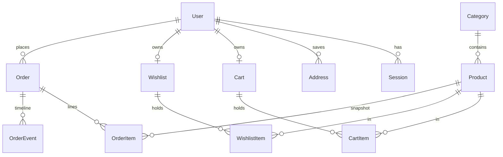

# LUXE Store — Master Project Architecture Document (PAD) v1.16

**Classification:** Internal Engineering Reference
**Status:** DEFINITIVE, PRODUCTION-LOCKED BLUEPRINT
**Companion Document:** [README.md](README.md) · [AGENTS.md](AGENTS.md) · [CLAUDE.md](CLAUDE.md) · [docs/Tailwind-V4-Validation-Report.md](docs/Tailwind-V4-Validation-Report.md)
**Last Updated:** 2026-10-08
**Audience:** Senior Engineers, Tech Leads, DevOps, and Onboarding Engineers
**Rule:** Every architectural decision in this document traces to a specific rationale. Nothing is here "because it's popular."

## Revision Block

| Version | Date | Author | Tags | Change |
|---|---|---|---|---|
| 1.0 | 2026-10-07 | Build agent (Super Z) | [RES]/[SYN]/[SAN] | Initial production blueprint after full-site recon, build, computed-style parity gate, and 103-test verification |
| 1.1 | 2026-10-07 | Review agent (Super Z) | [REM] | Session-1 remediation: route-group chrome split (ADR-008), reference-parity 404/auth/empty-states/drawer behavior, slate-palette pin (trap 7), stale-state logout fix, `.env.example` realignment, 107-test gate — see docs/remediation-plan-session1.md |
| 1.2 | 2026-10-07 | Review agent (Super Z) | [REM] | Session-2 remediation: catalog-order parity contract (sortOrder = reference array position, staggered createdAt, rating tie-break), reference-exact seed data (3 ratings + 11 descriptions), cart-drawer item-row anatomy rewrite, /cart line-total consistency, deliberate-divergence register, 117-test gate — see docs/remediation-plan-session2.md |
| 1.3 | 2026-10-07 | Review agent (Super Z) | [REM] | Session-3 remediation: auth parity contract (ADR-010 — /forgot-password anti-enumeration flow, nameless registration with derived display name, •••••••• placeholders, per-route Metadata), account-tab anatomy (icon avatar, highlighted default address, Change-Password section), shop active-filter chips + reference empty state, PDP related-products rule (all same-category), hero-dot geometry, 140-test gate — see docs/remediation-plan-session3.md |
| 1.4 | 2026-10-07 | Review agent (Super Z) | [REM] | Session-4 remediation: money/interaction parity round (ADR-011 — $9.99 flat shipping, reference-exact toast subsystem, transactional delta steppers fixing a lost-update race, cart-mutation guest-token fix, auth-screen anatomy rebuild incl. tinted error boxes + native validation + pinned copy, env-gated email-verification machinery, humanized-slug PDP titles, Reviews/Shipping tab panels, feature-bar cards, footer Join/separator), 170-test gate — see docs/remediation-plan-session4.md |
| 1.5 | 2026-10-07 | Review agent (Super Z) | [REM] | Session-5 remediation: buy-panel/home parity round (ADR-012 — StoreProvider server-truth re-sync fixing the stale post-order cart badge; wishlist heart color contract: red `fill-destructive` active + muted card hearts + the 82px px-8 PDP heart incl. the reference's mobile clipped-heart geometry; home section hairline dividers), reference quirk register (cosmetic wishlist, base44 Google OAuth), 173-test gate — see docs/remediation-plan-session5.md |
| 1.6 | 2026-10-07 | Review agent (Super Z) | [REM] | Session-6 remediation: superset correctness round (ADR-013 — server-side stock enforcement: clamped cart mutations + in-transaction overselling rejection + atomic placement decrement; ADR-014 — redirect-after-login with `validateRedirectPath` open-redirect hardening; `/login` becomes dynamic), first admin-console E2E coverage + guest-checkout E2E, dead-code removal, 188-test gate — see docs/remediation-plan-session6.md |
| 1.7 | 2026-10-08 | Review agent (Super Z) | [REM] | Session-7 remediation: operational-completeness round (ADR-015 — admin order-detail view rendering the OrderEvent timeline + dedicated admin E2E; fresh-clone build reproducibility — `public/` committed + hardened build script; per-page admin redirect targets fixing REDIRECT-2; unknown-slug PDP titles + CDN favicon parity; nested-`<main>` landmark fix; six unused dependencies pruned; e2e-reset run-to-run order isolation), 194-test gate — see docs/remediation-plan-session7.md |
| 1.8 | 2026-10-08 | Review agent (Super Z) | [REM] | Session-8 remediation: computed-geometry parity round (ADR-016 — Tailwind v4 trap 8: `space-y-*` margins are inert on inline `<label>` first children, fixed surgically with `mt-2` input wrappers; account tab/label/button geometry; the PDP's flat floor() star row + gap-2/mb-8 breadcrumb + reference feature glyphs; humanized-path unknown-route titles via the `[...notFound]` catch-all; lowercase typeahead categories), 210-test gate — see docs/remediation-plan-session8.md |
| 1.9 | 2026-10-08 | Review agent (Super Z) | [REM] | Session-9 remediation: mobile-geometry + social-metadata round (ADR-017 — the `pageMetadata()` OpenGraph/Twitter/PWA head layer incl. the PDP's React-19-hoisted card-less twitter shape + the Next metadata-engine constraints; trap 9: grid-item stretch breaks fit-content buttons on mobile while desktop coincides; the account Orders row anatomy port; the 150px sort trigger), first deep mobile sweep of the non-home surfaces + 9th mobile-nav verification, 224-test gate — see docs/remediation-plan-session9.md |
| 1.10 | 2026-10-08 | Review agent (Super Z) | [REM] | Session-10 remediation: interaction-engine parity round (ADR-018 — trap 10: a base `leading-*` beats responsive `text-*` line-heights on v4 (hero h1 45/60px vs the reference's 40/48px, identical class strings) pinned with `sm:leading-[2.5rem] lg:leading-none`; trap 11: v4.3 gates every hover-family variant behind `@media (hover: hover)` — restored v3 semantics with `@custom-variant hover (&:hover)`), first tablet-band sweep (639/640/768/1024) + focus-state audit + text-metric censuses + 10th mobile-nav verification, 226-test gate — see docs/remediation-plan-session10.md |
| 1.11 | 2026-10-08 | Review agent (Super Z) | [REM] | Session-11 remediation: typography + keyboard-a11y parity round (ADR-019 — trap 12: the shadcn v4 starter's body `antialiased` vs the reference's subpixel `auto`; trap 13: next/font's repackaged woff2 strips the `prep` hinting table — self-hosted the reference's EXACT Google-served file at public/fonts/ + a plain @font-face, pixel diffs 1-4.8% -> 0.23-0.60%; A11Y-FOCUS-1: hero inactive slides inert, tab order restored to the reference's CTA -> prev -> next -> dots), first media-preference sweep (reduced-motion/print/color-scheme) + a11y-semantics census + 11th mobile-nav verification, 229-test gate — see docs/remediation-plan-session11.md |
| 1.12 | 2026-10-08 | Review agent (Super Z) | [REM] | Session-12 remediation: axe-core differential a11y round (ADR-020 — A11Y-MAIN-1: four shopper pages shipped a nested `<main>` since session-1, exposed by the first automated axe differential after eleven computed-style rounds; A11Y-ARIA-1/2: aria-label on role-less divs — the toast viewport is now a nameless live region, the rating row role="img"; SEC-HEADERS-1: the reference's three security headers + X-Frame-Options via next.config headers()), 12th mobile-nav verification + first 200%-zoom reflow + console-error census, 233-test gate — see docs/remediation-plan-session12.md |
| 1.13 | 2026-10-08 | Review agent (Super Z) | [REM] | Session-13 remediation: Core Web Vitals differential round (first LCP/CLS/FCP quantification: clone LCP 252ms vs reference 1576ms on the IDENTICAL CDN hero element — the SSR superset; CLS 0.0213 = 0.0213 byte-identical layout stability) + keyboard focus-order walk + 8-route pixel drift re-check (all at baseline) — zero parity defects; ADR-021 (ADMIN-SEARCH-1: URL-deep-linkable admin order filters — status + number/email search + count line + empty state), 13th mobile-nav verification, 248-test gate — see docs/remediation-plan-session13.md |
| 1.14 | 2026-10-08 | Review agent (Super Z) | [REM] | Session-14 remediation: delivery-layer differential round (first network/transfer/caching quantification: font byte-identical 27,348B; route-split JS 177KB gzip vs the reference's 213KB single bundle; 1-year immutable asset caching vs 7-day; the encoding gap recorded as reverse-proxy territory) — zero parity defects; ADR-022 (SEC-CSP-1: nonce-based Content-Security-Policy via `src/proxy.ts` — the Next 16 proxy convention — with `strict-dynamic` scripts, per-request nonces, and the two static auth screens force-dynamic'd), 14th mobile-nav verification (byte-identical to the 13th across the CSP change), 250-test gate — see docs/remediation-plan-session14.md |
| 1.15 | 2026-10-08 | Review agent (Super Z) | [REM] | Session-15 remediation: full-route census round (first production-readiness sweep: all 22 manifest routes walked in a real browser — ZERO console errors/pageerrors; link-integrity crawl — 19/19 internal targets live; 8-route pixel drift re-check at baseline; axe differential re-measured at byte-identical counts 28/23/14/8/8/3) — zero parity defects; ADR-023 (A11Y-GATE-1: the self-hosted axe-core standing E2E gate — census exactly {color-contrast} + pinned counts, mutation-proven), 15th mobile-nav verification (byte-identical md5 to the 13th/14th), 256-test gate — see docs/remediation-plan-session15.md |
| 1.16 | 2026-10-08 | Review agent (Super Z) | [REM] | Session-16 remediation: the axe-gate-coverage round (FIRST mobile-viewport axe differential — the clone's mobile census is {color-contrast} with counts byte-identical to the desktop pins 28/23/14/8/8/3, the aria superset holds at mobile; FIRST admin-surface axe census — {color-contrast} only, 8/7/7/7, zero aria violations on any console surface; 16th mobile-nav verification byte-identical md5 to the 13th–15th; 8-route pixel drift + full-route census + typeahead/carousel watches all at baseline) — zero parity defects; ADR-024 (A11Y-GATE-2: the standing gate extended to BOTH viewports + the admin console — dual-mutation-proven, the mobile-only mutation invisible to the desktop gate by construction), 266-test gate — see docs/remediation-plan-session16.md |

## Table of Contents

1. [System Overview & Decisions](#1-system-overview--decisions)
2. [High-Level System Topology](#2-high-level-system-topology)
3. [Application Architecture](#3-application-architecture)
4. [Data Architecture](#4-data-architecture)
5. [Design System Reference](#5-design-system-reference)
6. [Security Architecture](#6-security-architecture)
7. [Worker / Background Service Architecture](#7-worker--background-service-architecture)
8. [Testing Strategy](#8-testing-strategy)
9. [Build & Deployment](#9-build--deployment)
10. [Developer Handbook](#10-developer-handbook)
11. [Known Issues & Outstanding Tasks](#11-known-issues--outstanding-tasks)
12. [Key Files Reference](#12-key-files-reference)
13. [Glossary](#13-glossary)

---

## 1. System Overview & Decisions

### 1.1 Document Metadata & Purpose

This PAD is the single source of truth for how LUXE Store is built and why. **Engineers changing code**: read §3 (layer rules) and §8 (testing) first. **DevOps**: §9. **Anyone touching styles**: §5 and the trap log — the pins are load-bearing. The document describes the CURRENT system only; history lives in git.

The product is a visual clone of a reference storefront (`fuzzy-lumina-style-hub.base44.app`) with the reference's demo behavior replaced by real commerce persistence — a "superset": everything the reference renders, at computed-style parity, plus accounts, carts, wishlists, checkout, order history, and an admin console that actually write to a database.

### 1.2 Technology Stack Summary

| Layer | Technology | Version | Key Rationale |
|---|---|---|---|
| Web framework | Next.js (App Router) | ^16.1.1 | RSC-first rendering; server actions remove the need for a REST mutation layer; standalone output for lean deploys |
| UI runtime | React | ^19 | Required by Next 16; compiler-enforced hook rules (set-state-in-effect is an error) |
| Language | TypeScript, `strict` | ^5 | Types at every boundary; `any` banned |
| Styling | Tailwind CSS (CSS-first `@theme`) | ^4 | Reference is v3-era; v4 chosen deliberately with a **pinned token system** to keep byte-parity (trap log, §5.4) |
| UI primitives | Radix UI + CVA + tailwind-merge | — | Reference fingerprint (shadcn); accessible Dialog/Select/Tabs/Sheet without hand-rolled ARIA |
| Icons | lucide-react | ^0.525 | Exact reference icon set (`lucide-shopping-bag`, `lucide-star`, …) |
| ORM | Prisma | ^6.11 | Schema-as-code + typed client; SQLite provider keeps zero-config local story |
| Database | SQLite | — | Single-file, single-writer — matches the deployment shape (one app instance); swap path documented in ADR-002 |
| Auth | node:crypto scrypt + DB sessions | — | No third-party dependency; memory-hard; revocable server-side sessions |
| Validation | Zod | ^3.25 | Single dialect for actions, route handlers, and test fixtures |
| Unit tests | Vitest | ^5 | Fast, node-env, co-located; mirrors tsconfig aliases |
| E2E tests | Playwright (Chromium) | ^1.63 | Drives the production standalone build; computed-style assertions are the parity gate |
| Package manager | Bun | ≥1.3 | Executes TS seeds/setup scripts directly; fast installs |
| AI SDK | z-ai-web-dev-sdk | ^0.0.18 | Available for future AI features; not on any request path today |

### 1.3 Architecture Decision Records

**ADR-001: Single Next.js application (no monorepo, no separate admin app)**
- **Context:** The reference clone needs a storefront and an admin console; the org's prior e-commerce pattern (Scandi Haven) used a pnpm+Turborepo monorepo with a second admin app on :3001.
- **Decision:** One Next.js app. Admin lives at `/admin` behind a role gate (`src/app/admin/*`), sharing the layout chrome and the Prisma client.
- **Rationale:** The reference is a single app; a monorepo adds tooling (Turborepo, workspace protocol, cross-package Tailwind `@source` wiring) with zero product value at this scale. One `next build`, one deploy, one test suite.
- **Consequences:** (+) Simpler CI, no package boundaries to drift. (−) Admin and storefront share a deploy cadence; acceptable while one team owns both.
- **Alternatives Rejected:** Turborepo monorepo (ADR-rejected for this scale); separate admin domain (needs its own auth plumbing and duplicate UI kit).

**ADR-002: SQLite via Prisma with a schema-relative `file:` URL**
- **Context:** The deployment target is a single app instance; the repo contract requires `DATABASE_URL="file:../db/custom.db"` with `db/` at the repo root.
- **Decision:** `provider = "sqlite"`; the URL is resolved identically for the Prisma CLI (anchored at `prisma/schema.prisma`) and the runtime (`src/lib/db-path.ts` anchors on the first directory containing `prisma/schema.prisma`, with standalone-build and CWD fallbacks). Money is integer cents; "enums" are Strings + Zod unions.
- **Rationale:** Zero-config local dev and a single-writer model that makes count-based order numbering race-free. The URL contract is unit-test-pinned (`tests/db-path.test.ts`) because naive "simplifications" have historically broken exactly this.
- **Consequences:** (+) No database server to operate; file-level backup. (−) No concurrent multi-instance writes (documented scale ceiling — see ADR-002 migration note in §9.2); no native enums (validated in code).
- **Alternatives Rejected:** PostgreSQL (requires a server + rootless setup for marginal benefit at this scale — revisit when scaling out); Drizzle (fine, but the repo already standardizes on Prisma).

**ADR-003: Cookie-token guest identity merging into user rows**
- **Context:** Carts and wishlists must work for anonymous visitors and survive login.
- **Decision:** `Cart`/`Wishlist` rows keyed by a random cookie token (`luxe_cart`, `luxe_wishlist`, 192-bit, httpOnly); at most one row per user; the login action merges the guest row into the user row (quantity-max union) inside the same request; reads NEVER mint rows.
- **Rationale:** Server Components cannot set cookies — so cart creation must happen only in mutation contexts. Merging at login (not at read) keeps every read path side-effect-free and idempotent.
- **Consequences:** (+) Guest work is never lost; badge/drawer state is pure server truth. (−) Two code paths (guest/user) in the cart/wishlist resolvers — centralized in one function each to keep it honest.
- **Alternatives Rejected:** localStorage carts (not server-trustworthy, breaks cross-device); merge-on-read (side-effectful reads, race-prone).

**ADR-004: Server actions as the only mutation seam; 3-route-handler whitelist**
- **Context:** The UI needs cart/wishlist/auth/account/checkout/admin mutations.
- **Decision:** All mutations are `"use server"` actions in `src/lib/actions/*.ts`, Zod-validated, returning `ActionResult<T> = { ok: true, data } | { ok: false, error: { message, fieldErrors? } }`. Route handlers exist ONLY for `/api/health`, `/api/search` (typeahead GET), `/api/newsletter` (POST).
- **Rationale:** Actions give progressive enhancement + typed callsites without a REST surface to version. The whitelist keeps the attack surface auditable (three endpoints, each rate-limited or trivial).
- **Consequences:** (+) One validation dialect, one result envelope. (−) No external API for mutations by design — an integration API would be a new ADR.
- **Alternatives Rejected:** REST mutation routes (double validation layer, more surface); tRPC (another dependency for no gain inside one app).

**ADR-005: Tailwind v4 with pinned v3 token geometry (the trap-log system)**
- **Context:** The reference app compiles Tailwind v3-era classes; the port must render byte-identical computed styles on v4.
- **Decision:** `src/app/globals.css` pins: full `hsl()` theme literals (bare triplets resolve transparent under `@theme inline`); `--shadow-sm: 0 1px 2px 0 rgb(0 0 0 / 0.05)`; the radius scale to v3 values (`xl: .75rem`, `2xl: 1rem`, `3xl: 1.5rem`); the hero overlay as an sRGB arbitrary gradient; the mobile nav stacks with flex `gap` (never `space-y` + `mt-*`). Parity is enforced by `tests/e2e/storefront-parity.spec.ts` against live-measured values.
- **Rationale:** v4 shifted BOTH the shadow and radius scales one notch and interpolates gradients in oklab; class strings identical, rendered geometry not. Pinning tokens (not rewriting classes) keeps the DOM byte-parity with the reference while fixing the engine deltas.
- **Consequences:** (+) One-line fixes for engine variance; E2E-guarded. (−) Token pins look "wrong" to anyone who knows v4 defaults — the trap log and this PAD exist to prevent well-meaning "fixes".
- **Alternatives Rejected:** Staying on Tailwind v3 (EOL trajectory, misses v4 tooling); rewriting class strings to v4 equivalents (breaks DOM parity, 10× the diff).

**ADR-006: scrypt + DB-backed sessions over JWT**
- **Context:** Accounts need password auth with revocable sessions on a single-instance deploy.
- **Decision:** `scrypt` (N=16384, r=8, p=1) password hashes; a `Session` table keyed by SHA-256 of a 256-bit token; cookie value `token.hmac(token)` (integrity-in-depth, AUTH_SECRET); 30-day expiry; destroy deletes the row.
- **Rationale:** JWTs can't be revoked without a denylist — a session table IS the denylist. scrypt avoids a native dependency (bcrypt/argon2) while meeting OWASP baseline parameters.
- **Consequences:** (+) Immediate revocation; no extra deps. (−) One DB read per authenticated request (SQLite: ~µs; fine).
- **Alternatives Rejected:** stateless JWT (revocation problem); Better-Auth (heavy for two auth pages; no OAuth in the reference parity scope).

**ADR-007: Checkout as a client wizard over a single transactional server action**
- **Context:** The reference renders a 3-step checkout (shipping → payment → review) client-side.
- **Decision:** The wizard lives in `checkout-flow.tsx` (client) with per-step validation gates; the final submit posts EVERYTHING to `placeOrderAction`, which Zod-validates, re-derives totals from the DB cart (never the client), allocates `ORD-YYYY-NNN`, and writes order + lines + event + cart-clear in ONE `db.$transaction`.
- **Rationale:** Step UX is presentation; money math is server truth. A single transaction means a crashed placement never leaves a half-written order or a charged-but-empty cart.
- **Consequences:** (+) Crash-safe, replay-safe (rate-limited). (−) Card data transits the action (test-mode only — a real PSP integration is the documented next step, §11).
- **Alternatives Rejected:** Per-step server persistence (three writes to unwind on back-navigation); client-computed totals (unacceptable).

**ADR-008: Route-group chrome split (minimal root layout)**
- **Context:** The reference renders /login and /register as standalone screens (no header/footer) and unknown routes on a chrome-less platform 404 — impossible under a single root layout that always wraps children in the storefront chrome.
- **Decision:** `app/layout.tsx` is a minimal shell (html/body/font/metadata only). The shopper chrome + `StoreProvider` hydration live in `app/(storefront)/layout.tsx`; login/register live in `app/(auth)/` with a standalone centering layout; the root `not-found.tsx` replicates the reference's slate platform 404 (client component, `usePathname`, v3 slate palette pinned in `@theme`). Unknown product slugs render an in-chrome "Product not found" block instead of the 404.
- **Rationale:** Next.js wraps the root not-found in the root layout — the only way to reproduce a chrome-less 404 is to keep the root layout chrome-free. Route groups are URL-neutral, so no route moved.
- **Consequences:** (+) Exact reference parity on three previously-diverging surfaces; login/register became statically prerendered (perf win). (−) The `StoreProvider` state survives client-side navigation inside the group — logout must explicitly `setUser(null)` (a latent stale-state bug the refactor surfaced and fixed); one extra layout file to keep in mind when adding routes.
- **Alternatives Rejected:** fixed-position overlay hiding the chrome (DOM parity break); a catch-all route rendering the 404 inline (fights the router, swallows real routes).

**ADR-009: Catalog order as a parity contract (sortOrder = reference array position)**
- **Context:** The reference is a client-side SPA whose product array order drives its shop "Featured" listing, its home "On Sale" membership (first 4 sale items in array order), its "Newest" sort (array reverse), and its "Top Rated" sort (stable rating-desc over the array). The original seed ordered products by merchandising group (trending first), so all four surfaces diverged.
- **Decision:** `Product.sortOrder` in the seed mirrors the reference array position 1:1 (headphones=1 … pajama=12); the seed sets a staggered `createdAt` (array position 1 = oldest) so `createdAt desc` reproduces "Newest" deterministically; the shop's rating sort uses `[{ rating: "desc" }, { sortOrder: "asc" }]` because Prisma's single-key orderBy leaves tie order undefined. Seed ratings/reviewCounts/descriptions are transcribed verbatim from the live reference.
- **Rationale:** Ordering is visible on every shop/home visit — parity requires encoding the reference's array semantics in data, not approximating them. The tie-break makes the E2E assertion deterministic (4.8 ties: headphones < serum < yoga-mat).
- **Consequences:** (+) All four order-sensitive surfaces match the reference exactly and are E2E-pinned (catalog-parity.spec.ts). (−) Reordering or adding products requires re-measuring the reference and updating sortOrder/createdAt together; the deliberate-divergence register documents the one order-adjacent behavior we do NOT replicate (the reference's mobile menu staying open after navigation).
- **Alternatives Rejected:** computed rank columns (duplicates state, drifts); client-side re-sorting (fights RSC, breaks deep links).

**ADR-010: Auth parity contract — nameless registration and anti-enumeration password reset**
- **Context:** The reference register form collects exactly [Email, Password, Confirm Password] — no Name — and its login links to a real `/forgot-password` screen whose submit always shows the same neutral confirmation. The clone had an extra Name field, a disabled self-linking "Forgot password?", and no reset route; the reference also titles each auth page ("Login | Lumina") while the clone showed a bare "Lumina".
- **Decision:** Each `(auth)` route is a server `page.tsx` owning `Metadata` (title only; the root template appends "| Lumina") delegating to a `*-form.tsx` client island. `registerSchema.name` is optional; `registerAction` derives the display name from the email local part (`deriveDisplayName`, `src/lib/validation.ts`) because `User.name` stays required in Prisma. New `requestPasswordResetAction`: Zod-validated email, rate-limited 5/15min/IP+email, user lookup feeds ONLY a `console.info` seam (never the response), identical neutral confirmation for known and unknown emails. Password inputs carry the reference's `••••••••` placeholder; the login "Forgot password?" link is enabled at `text-xs` → `/forgot-password`.
- **Rationale:** Enumeration via the reset flow is the classic account-discovery vector — the reference's always-same copy is the correct pattern to replicate, now with real server-side enforcement. Deriving the name keeps the DB contract intact while matching the reference's 3-field form 1:1.
- **Consequences:** (+) Whole reference auth surface at parity with production-grade security (rate limit + anti-enumeration); per-route titles correct; no Prisma migration. (−) No email is actually sent (documented seam — plug Resend/SES/Postmark at the `console.info` line); display names from odd local parts (`e2e-42@x` → "E2e 42") are cosmetic until Profile editing refines them.
- **Alternatives Rejected:** keeping the Name field (visible form-structure divergence); a real reset token table + emailed link (no email infra; would still need the neutral response); revealing account existence (security regression vs the reference).

**ADR-011: Money & interaction parity round — shipping, toasts, transactional steppers, and env-gated email verification**
- **Context:** Round-4 live A/B audit measured money and interaction surfaces the earlier rounds had not: the reference charges a **flat $9.99** shipping below $100 (measured at $34.99 and $79.99 subtotals; the clone charged $5.99); it fires a dark bottom-right toast ("«Product» added to cart!", accent check icon, ~3000 ms, stacks without dedupe, spring enter/exit) on cart adds and wishlist ADDS but not wishlist removes; its auth screens carry a header tile OUTSIDE the card, `h-12` icon-led inputs, and a tinted error BOX (the clone had plain red text + `noValidate`); its register flow gates behind a 6-digit "Verify your email" screen and blocks unverified logins; its PDP document.title is the humanized slug. Separately, the audit found two latent correctness bugs: cart steppers posted ABSOLUTE quantities computed from stale render state (two rapid clicks both sent `qty+1` — a lost-update race), and cart MUTATIONS passed `undefined` as the guest token (each guest add minted a new cart; guest steppers read as empty).
- **Decision:** `FLAT_SHIPPING_CENTS = 999` (unit-pinned). New `ToastViewport` + `notify` in `StoreProvider` wired at the two `addToCart`/`toggleWishlist` call sites (region `pointer-events-none` + `aria-live=polite`; CSS `@starting-style` approximation of the reference's JS spring — both registered divergences). Steppers now post DELTAS: `adjustQuantity(itemId, ±1)` → `adjustCartItemAction` → transactional `changeQuantityBy` (`db.$transaction`); remove is its own action; pure delta math lives in `src/lib/cart-quantity.ts`. Cart mutations resolve the guest token from the cookie (`src/lib/cart.ts`), pinned by `guest-cart.spec.ts`. Auth screens rebuilt to the reference anatomy with a shared `auth-error.tsx` box, native `type=email` validation (no `noValidate`), and pinned error copy. Email verification ships the full machinery — Prisma columns (`emailVerified`, `verificationHash`, `verificationExpiresAt`, `verificationAttempts`), `/verify-email` route, `verifyEmailAction`/`resendVerificationAction`, 5-attempt budget, 15-min TTL, scrypt-hashed codes — but env-GATES enforcement behind `AUTH_REQUIRE_EMAIL_VERIFICATION` (default OFF): with no transactional email provider wired (the repo's documented posture), an always-on gate would lock every new user out; codes log at the `console.info` seam and E2E drives the flow via the seeded `unverified@example.com` fixture (code `123456`). PDP titles use `humanizeSlug` (`src/lib/format.ts`); the Reviews/Shipping tab panels and the feature-bar/footer anatomy were restyled to measured classes.
- **Rationale:** Money values and interaction feedback are parity surfaces like colors and radii — measured, not guessed. Delta steppers are the correct server-authoritative pattern regardless of parity (idempotent increments survive races and stale renders). The env gate honors both the reference's behavior and the clone's no-email-provider reality; shipping the machinery now means flipping one flag when a provider lands.
- **Consequences:** (+) Two real correctness bugs fixed (race + guest-cart identity) with regression tests; the interaction surface (toasts) and money surface now match the reference; the verification flow is fully tested even while off. (−) Two more documented divergences (toast spring approximation; verification off by default — the reference always gates); one additive schema change (`db push` — nullable/defaulted columns, no migration file); `«name»` interpolation means product names render verbatim inside the toast copy.
- **Alternatives Rejected:** absolute-quantity steppers with optimistic locking (complexity for no parity gain); a queue-based toast library (the reference's is a 30-line stack — a subsystem would be over-engineering); enabling verification unconditionally (bricks signup with no provider); sending real emails via a dev SMTP (secrets/infra out of scope for a clone).

**ADR-012: Client store re-syncs from server truth on refresh (and the round-5 parity set — hearts, home dividers)**
- **Context:** The round-5 live A/B audit found the header cart badge kept a stale count after order placement until a manual reload: `checkout-flow.tsx` calls `router.refresh()` + `router.push()` on success, and the refreshed storefront layout DOES deliver a fresh (empty) `initialCart` prop — but `useState(initialCart)` only reads its initial value on first render, so `StoreProvider` ignored it (client state survived the refresh). The same audit measured three parity gaps: the PDP buy-panel wishlist heart button is `h-10 px-8` (82px; the clone rendered px-4/50px, letting the flex-1 ATC absorb 32px), active hearts are `fill-destructive text-destructive` (red rgb(239,67,67) — the clone used primary orange), card hearts are muted inactive (`h-4 w-4 transition-colors text-muted-foreground`), and the home page frames its product sections with two `shrink-0 bg-border h-[1px] w-full max-w-7xl mx-auto` hairlines (after the feature bar and after New Arrivals — present since the session-0 recon, never ported).
- **Decision:** `StoreProvider` re-syncs `cart`/`user`/`wishlist` whenever a `router.refresh()` delivers changed `initial*` prop identities, via the adjust-state-during-render pattern (React docs). The "last seen props" live in STATE, not a ref — the React Compiler `react-hooks/refs` rule forbids ref access during render, and the repo's `set-state-in-effect` rule forbids the effect form. The heart button became `px-8` with `h-5 w-5` icons and `fill-destructive text-destructive` active classes; the card heart carries `transition-colors text-muted-foreground` inactive; two divider divs were inserted in the home page. Matching px-8 deliberately reproduces the reference's iPhone-14 action row, whose 82px heart is clipped ~35px past the 390px viewport (scrollWidth 425) — exact parity, registered as a note rather than "fixed".
- **Rationale:** Server truth must win whenever the server re-renders the chrome — the badge, hearts, and account icon are all derived from the same provider state, and any server-side mutation followed by a refresh would show stale UI otherwise. The heart colors/geometry and home dividers follow the standing rule: parity surfaces are measured, not guessed.
- **Consequences:** (+) The post-order badge (and any future refresh-delivered mutation) reflects server truth without a reload — pinned by the checkout spec's exact-name "Cart" assertion; three parity gaps closed with tests at the same seams. (−) One more nuance for contributors: props re-sync only on identity change, so the layout must actually re-render server-side (any `router.refresh()` does). The reference's mobile clipped-heart overflow is now replicated byte-exactly (a visual defect inherited for parity's sake).
- **Alternatives Rejected:** an effect-based sync (`set-state-in-effect` is an error under the repo's React Compiler lint); a `key`-based provider remount (resets drawer/toast/UI state on every refresh); wrapping the heart in a container query or responsive px (diverges from the reference DOM); registering the mobile overflow as a divergence and shrinking the heart (breaks the measured desktop parity).

---

**ADR-013: Server-side stock enforcement — clamp in the cart, reject and decrement at placement**
- **Context:** The round-6 audit found the clone's inventory was cosmetic server-side: only the PDP UI capped quantity at stock (`buy-panel.tsx` disables the stepper and renders "Out of Stock"); `addItem`/`changeQuantityBy` accepted any quantity (cap 99), and `placeOrderAction` neither validated stock nor decremented it. A cart assembled before an admin stock drop could oversell a sold-out product, and the admin console's stock numbers never moved with sales — operationally meaningless. (The reference has no inventory concept at all — this is pure superset territory, so no parity constraint applies.)
- **Decision:** Three enforcement layers. (1) Cart mutations CLAMP increases at the product's current stock via the pure seam `clampToStock(next, current, stock)` in `src/lib/cart-quantity.ts` — decreases and deletes always pass through, an existing line is never reduced below its current quantity, and a new line on a sold-out product clamps to 0 (skipped). (2) `placeOrderAction` re-reads every line's stock INSIDE the placement transaction and rejects overselling with a customer-safe message ("Sorry, «name» only has N left in stock. Please update your quantity.") — the cart stays intact for the shopper to adjust. (3) On success, each product's stock is DECREMENTED atomically with the order write. Seeded demo orders are fixtures created directly by the seed (never decremented); the seed upsert restores `stock: 25` on every `db:setup`/E2E global-setup run, and `prisma/dev-cleanup.ts` restores 25 on the dev DB.
- **Rationale:** Overselling is the cardinal correctness bug of an e-commerce superset; the admin's stock forms only mean something if placement moves them. Clamping (not rejecting) at the cart layer keeps parity surfaces free of error states the reference never shows, while rejection at placement is where the customer can still act on the information.
- **Consequences:** (+) Inventory is trustworthy end-to-end; the admin stock form, the PDP sold-out state, and placement now form one consistent system — pinned by `tests/e2e/stock.spec.ts` (clamp, rejection, decrement, sold-out PDP) which also gives the admin console its first E2E coverage. (−) Stock decrements make per-run E2E state drift without the reseed (mitigated: the global-setup reseed restores 25 per run, and run volumes are ~10 units/product — far under 25). No visible UI was added (the reference shows no stock indicators).
- **Alternatives Rejected:** rejecting at the cart layer too (surfaces error states the reference never shows on parity surfaces); optimistic client-side reservation (no persistence guarantee); decrement-on-ship (the admin's stock column would misrepresent sellable inventory between placement and fulfillment); a separate `Reservation` table (overkill for a single-writer SQLite storefront with no concurrent-worker requirement).

---

**ADR-014: Redirect-after-login with validated same-origin targets**
- **Context:** The round-6 audit found gated pages dropped visitor intent: `/account` redirected guests to bare `/login`, and the login form always pushed `/account` after success — a guest clicking "View Orders" on the order-success page, or following a deep link to a gated page, lost their destination. Standard e-commerce UX (and the scandihaven reference stack's `validateRedirectPath` hardening pattern) carries the intent through.
- **Decision:** `/account` and every `/admin*` page gate anonymous visitors to `/login?redirect=<their path>`. The login server page reads `searchParams` (the route is therefore DYNAMIC — it was static before) and passes `redirectTo` into the client form island, which computes `validateRedirectPath(redirectTo) ?? "/account"` and pushes that after a successful login. `validateRedirectPath` (pure, in `src/lib/validation.ts`, unit-pinned) accepts ONLY same-origin relative paths: must start with `/`, must not start with `//` or `/\`, no backslashes, no scheme-bearing colon-before-slash, no bare `/`, length ≤ 512. Register keeps its existing post-signup landing (` /account`, or `/verify-email` when the gate is on).
- **Rationale:** Carrying intent is table-stakes UX for a production storefront; honoring an unvalidated URL is the classic open-redirect vulnerability (phishing via `?redirect=//evil.com`), so the validator is deliberately conservative — unknown shapes fall through to the safe default rather than being "fixed up".
- **Consequences:** (+) Guests land where they started after authenticating; open-redirect payloads are inert (pinned by `tests/e2e/auth.spec.ts`: honored-target and ignored-payload cases). (−) `/login` loses its static prerender (now `ƒ` in the build output — acceptable for an auth page); the redirect param appears in the URL (matches standard practice).
- **Alternatives Rejected:** `useSearchParams()` in the client island (needs a Suspense boundary to keep the static prerender — more churn for no user value); POST-body redirect carrying (breaks deep-link sharing); storing intent in a cookie (survives the session, surprising users who abandoned the flow).

---

**ADR-015: The admin order-detail view — surfacing the OrderEvent audit trail (and the round-7 operational set)**
- **Context:** The round-7 audit (fresh-clone start) found the repo's own verification gate unrunnable from a bare clone (`public/` was never committed — `bun run build` exits 1 at the standalone copy step), the session-6 redirect wiring hardcoding `/login?redirect=/admin` on the admin SUB-pages (guests on `/admin/orders` lost their exact destination — the ADR-014 spec said "every `/admin*` page gates with its own path"), the `OrderEvent` rows written by `placeOrderAction`/`updateOrderStatusAction` rendered on no surface (PAD §11 round-7 candidate), admin E2E coverage limited to the stock-form seam, and two small parity gaps measured live (unknown-slug PDP `document.title` — the reference humanizes whatever slug is in the URL; no favicon — the reference injects a CDN-logo `<link rel=icon>` while the clone 404s `/favicon.ico`).
- **Decision:** (1) New read-only server page `/admin/orders/[id]` (admin-gated; anonymous → `/login?redirect=` with the FULL dynamic path) rendering the customer block (email, placed date, payment method + card last4), the parsed JSON shipping-address snapshot, the OrderItem snapshots, and the chronological OrderEvent timeline; order numbers deep-link to it from the admin orders list and the dashboard's Recent Orders; unknown ids render an in-admin not-found block. Status mutations stay on the list row's Select — one mutation seam, no duplication. (2) `adminLogin` promoted to `helpers.ts`; new `tests/e2e/admin.spec.ts` (one shared admin login; guest gating, dashboard stats, order-detail content, combobox status transitions landing in the timeline with restore, visibility toggle enforced on /shop). (3) `prisma/e2e-reset.ts` now deletes non-canonical orders and demo-order `status_changed` events every run — spec-placed orders otherwise accumulate across runs (the e2e DB file persists), pushing demo fixtures out of the dashboard's take:5 list and piling duplicate timeline events; `prisma/dev-cleanup.ts` mirrors this for the dev DB. (4) Build reproducibility: `public/.gitkeep` committed + `mkdir -p public` in the build script (verified: `rm -rf public && bun run build` exits 0). (5) Parity closes: PDP `generateMetadata` humanizes EVERY slug (the in-chrome not-found block is unchanged); `metadata.icons` in the root layout points at the reference's CDN logo (the established remote-CDN pixel-parity pattern — no binary shipped). (6) Hygiene: admin pages wrap in `<div className="flex-1">` (the storefront layout already owns the single `<main>` — a nested pair is invalid HTML and broke strict-mode locators); six zero-import dependencies removed (`z-ai-web-dev-sdk`, `zustand`, `@radix-ui/react-toast`, `@radix-ui/react-alert-dialog`, `@radix-ui/react-popover`, `tailwindcss-animate`).
- **Rationale:** An audit trail that exists only in the DB is operational theater — the admin who changes a status needs to see the history on a surface, and the round-6 stock work made the console's numbers meaningful, so the console's coverage had to catch up. A gate that fails on a fresh clone defeats the repo's own documented workflow (clone → install → `db:setup` → build → test). The redirect and title fixes follow the standing rule: parity surfaces are measured, not guessed — and both were measured live this round.
- **Consequences:** (+) The admin console is now a complete operational surface (stats → list → detail → timeline) with E2E at every seam; fresh clones build green; E2E runs are deterministic run-over-run (proven: 118/118 twice consecutively); the browser tab carries the Lumina icon. (−) One more dynamic admin route (22 total); the e2e-reset's canonical-order list must be maintained if the seed's demo-order set ever changes (same contract as dev-cleanup's `CANONICAL_ORDERS`); `/favicon.ico` deliberately stays 404 (the reference's is a platform 302 — the `<link rel=icon>` is what browsers honor).
- **Alternatives Rejected:** a timeline section on the orders LIST page (crowds the row card; the detail page has room for items + address too); a separate mutation seam on the detail page (duplicates the list row's Select for zero user value); shipping a favicon binary (breaks the remote-CDN parity pattern; the repo owns no icon asset); guarding the build's `cp` with `|| true` (masks real copy failures — `mkdir -p` is deterministic).

**ADR-016: Computed-geometry parity — the v4 `space-y` inline trap and the form-field measuring round**
- **Context:** The round-8 live A/B audit (paired agent-browser sessions + 15-route pixel diffs) surfaced a NEW Tailwind v4 engine trap the release notes don't call out: v4 emits `:where(.space-y-N > :not(:last-child)) { margin-block-end }` — the margin lands on the NON-LAST child and is INERT when that child is inline (a bare shadcn `<label>`), while v3 emitted `margin-top` on FOLLOWING block siblings (always effective). The auth forms (login 1 field, register 3, forgot-password 1) had silently lost 8px per field — register's card measured 490px vs the reference's 514px. The same engine rule wore two more faces: the account Tabs (`space-y-6` + TabsContent `mt-2` stack to 32px vs v3's collapsed 24px — v3's higher-specificity selector REPLACED the panel's own margin instead of stacking) and the account Save button (inside a `gap-4` grid, an extra `mt-4` doubled the reference's 16px to 32px). Independent findings in the same sweep: the PDP star row used a track+overlay structure with `gap-0.5` and round-up semantics (the reference renders a flat 5-glyph `gap-1` row with floor() — 4 amber + 1 gray for 4.8, no half-stars); the PDP breadcrumb used `gap-1.5 mb-6 flex-wrap` (reference: `gap-2 mb-8` — the 8px mb delta cascaded the ENTIRE PDP); feature bar + PDP feature row shipped `shield-check`/`refresh-cw` (reference glyphs: `shield`/`rotate-ccw`); unknown routes titled "Lumina" (the reference's SPA titles from the LAST letter-bearing path segment, humanized — decoded across 12 live probes); typeahead suggestion categories rendered capitalized (reference: lowercase).
- **Decision:** (1) Surgical `mt-2` on the five auth input-wrapper `div.relative`s — keeping `space-y-2` on the wrappers (DOM parity) while restoring the v3 computed geometry (input wrapper `margin-top: 8px`, 11px visual label gap). A global CSS override of `space-y-*` semantics was evaluated and REJECTED: replicating v3 exactly requires layer/specificity engineering whose blast radius includes the `flex flex-col space-y-2` SheetHeader (flex items don't collapse margins — a naive override doubles that gap) and any `mb-*`-carrying non-last child (trap-5 territory). (2) The account Tabs root drops `space-y-6` — its TabsContent base `mt-6` alone supplies the reference's 24px gap (the PDP tabs already work this way); the profile form converts to the in-repo inline-label pattern (plain `Label` + `Input mt-1.5`, matching the reference's measured 18px line box + 6px input margin); the Save button drops `mt-4` (grid gap-4 supplies the 16px). (3) `star-rating.tsx` rewritten to the flat floor() form (its only callsite is the PDP — cards use the pinned single-star+number form). (4) Breadcrumb → `gap-2 mb-8`, `flex-wrap` dropped. (5) Lucide swaps: `ShieldCheck→Shield`, `RefreshCw→RotateCcw` in `category-card.tsx` + the PDP feature row. (6) New root catch-all `src/app/[...notFound]/page.tsx` + shared `Platform404` component + `notFoundPageTitle()` in `src/lib/format.ts` (the decoded title rule; `humanizeSlug` extended to `[-_]` splitting — measured live: `/FOO_BAR` titles "FOO BAR | Lumina"); no-letter paths render `title: { absolute: "Lumina" }` to bypass the template. (7) Typeahead categories lowercase. Every fix is E2E/unit-pinned at the same seam.
- **Rationale:** Form-field geometry is a parity surface like any other — the reference is the ground truth and it was MEASURED (label rects, computed margins, card heights, on both sites). The trap log exists precisely so engine variance gets a name, a mechanism, and a fix pattern; trap 8 had gone undetected because nothing pinned field-level spacing (the E2E suite pinned anatomy, not gaps). The surgical fix follows Appendix-B rule 9 (no speculative scaffolding): five one-line `mt-2` additions with zero blast radius beat a global override with three known edge cases.
- **Consequences:** (+) Auth/account/PDP surfaces sit at computed parity (pixel diffs: register 2.89%→0.17%, PDP 8.71%→0.48%, account 31.7%→0.23% after also fixing the button spacing); unknown routes now title themselves like the reference's SPA; the trap log documents the mechanism for future surfaces; 210-test gate (82 unit + 128 E2E, run twice consecutively). (−) The auth wrappers' class strings now carry `mt-2` the reference's DOM doesn't (computed parity chosen over class-string parity — invisible, and the reference's own `mt-2` on its TabsContent is dead code overridden by its space-y rule); the account Tabs root no longer carries `space-y-6` (same trade); trap 8 means reviewers must eyeball any NEW `space-y-*` wrapper whose first child is inline.
- **Alternatives Rejected:** global `@utility`/CSS override of `space-y-*` (blast radius: flex SheetHeader double-gaps, avatar `mb-6` zeroing, margin-collapse asymmetries — all documented in the remediation plan); block-ifying the labels (`mb-2 block` — changes the 18px inline line box to 14px, drifting the label height itself); catch-all via `notFound()` (Next's boundary carries no path context — the title rule needs the segments).

**ADR-017: The social/PWA metadata layer, the mobile grid-stretch trap, and the Orders row anatomy (round 9)**
- **Context:** The round-9 audit ran the FIRST deep mobile sweep of the non-home surfaces (mobile button geometry on every interactive page) plus a per-route head-metadata diff — two surfaces no prior round had measured. Four findings: (1) **ACCOUNT-BTN-W-1** — the profile Save button, integrated INTO the fields grid by session-8 with `sm:col-span-2 sm:w-fit`, rendered full-width (308px) on iPhone 14 vs the reference's 127px fit-content; DESKTOP computed values coincided (both 127px, 16px gap), which is exactly why the desktop-only session-8 audit passed it — grid items stretch by default and `sm:w-fit` only engages at ≥640px. (2) **METADATA-OG-1** — the reference renders a complete OpenGraph/Twitter/PWA head set on EVERY route (decoded live across 10 probes: og:title = document title; og:description = "«Page» on Lumina. " + SITE_DESC on static pages, plain SITE_DESC on home/PDP/unknown; og:image = the site LOGO site-wide — even the PDP; og:url canonical with the QUERY preserved; twitter:title/description/image mirroring og; twitter:card + twitter:url on every route EXCEPT the PDP, which renders NEITHER; PWA `mobile-web-app-capable` + `apple-mobile-web-app-*` metas) while the clone rendered none of it (a partial PDP set that drifted on all four axes). (3) **ACCOUNT-ORDER-ROW-1** — the Orders tab rows used a bordered/hover card with emerald/amber chips and 12px gaps vs the reference's tinted border-less `bg-secondary/30` row with button-class pill badges (`bg-primary` delivered / `bg-secondary` in-transit) and 16px gaps, stacking on mobile. (4) **SORT-W-1** — the shop sort trigger `w-[170px]` vs the reference's `w-[150px]` (the single drift in a global arbitrary-width sweep).
- **Decision:** (1) The profile form restructures to the reference's ACTUAL anatomy — a fields grid (`grid grid-cols-1 sm:grid-cols-2 gap-4`) with the Save button OUTSIDE it as a flow child carrying `mt-4` (fit-content on every viewport, 16px below the grid on every viewport); trap 9 enters the log: audit mobile viewports separately, desktop computed parity does not transitively prove mobile parity. (2) New `src/lib/metadata.ts` — `SITE_DESCRIPTION`, `OG_IMAGE_URL` (the reference's CDN logo at the 1200×630 fill), and a `pageMetadata({ title, path, plain?, bare?, siteUrl? })` builder applied to home (bare "Lumina", plain description), shop (via `generateMetadata` reading `searchParams` so og:url preserves the query), cart, wishlist, account, checkout, checkout/success, login, register, forgot-password, verify-email, the PDP (plain description, humanized-slug og:title, logo image), and the `[...notFound]` catch-all; root layout gains SITE_DESCRIPTION + `appleWebApp` PWA metas. Three Next-engine constraints drove the shape: the twitter resolver force-defaults `twitter:card` whenever the typed twitter field carries images (every non-PDP route wants exactly that — `card` is deliberately omitted); `appleWebApp.capable` auto-emits `mobile-web-app-capable` (never hand-emit a duplicate via `other`); the PDP's card-less shape (twitter title/description/image WITHOUT card or url) is inexpressible through the Metadata API — the PDP page body carries React-19-hoisted `<meta name="twitter:…">` elements (plain meta tags in the RSC tree hoist into `<head>`, and only that route needs the exception). `twitter:url` rides in `other` everywhere (no typed key exists). (3) The Orders rows port the reference anatomy verbatim with `STATUS_STYLES` remapped to the two measured variants (unmeasured statuses default secondary — reasoned, documented). (4) The sort trigger drops to `w-[150px]`.
- **Rationale:** Both surfaces were measured, not guessed: the head layer was decoded from 10 live route probes (including query preservation and the PDP's card-less exception), and every geometry value came from paired iPhone-14 measurements. The engine constraints were verified against Next's own resolver source and confirmed empirically (duplicate `mobile-web-app-capable`, derived duplicate twitter sets) before settling on the `other`-key + React-hoisting split — the shipped head on home/shop/404/PDP renders byte-equivalent to the reference's. The reference's site-wide LOGO og:image (even on the PDP) was measured and reproduced rather than "improved" with per-product images — parity over cleverness.
- **Consequences:** (+) Every route now carries the reference's full social/PWA head set (link previews, SEO, PWA installability metadata); the mobile account surface sits at pixel parity (m-account 2.87%→0.65%); the Orders tab matches the reference's visual language; 224-test gate (88 unit + 136 E2E, two consecutive full runs) with a new unit module pinning the builder rules and a new E2E mobile describe + head-metadata assert set; `NEXT_PUBLIC_SITE_URL` was already in `.env.example` (no new env surface). (−) The PDP carries four hoisted `<meta>` elements outside its Metadata object (one documented exception — the Metadata API cannot express the shape); two `STATUS_STYLES` variants are reasoned rather than measured (only Delivered/In-Transit exist on the reference account); admin pages deliberately keep title-only metadata (superset surface, no reference target).
- **Alternatives Rejected:** emitting twitter via `other` on EVERY route (loses the typed-field resolver behavior non-PDP routes WANT — card auto-default); per-product og:image on the PDP (the reference measurably uses the logo site-wide); keeping session-8's in-grid button and adding `w-fit` without the `sm:` prefix (a one-off patch that diverges from the reference's DOM anatomy — the restructure reproduces the actual structure and keeps the 16px spacing invariant across viewports).

**ADR-018: The interaction-engine parity round — the hover media-gate and the line-height cascade (round 10)**
- **Context:** The round-10 audit targeted surfaces no prior round had measured: the TABLET viewport band (639/640/768/1024 — trap 9's lesson applied to the `sm:`/`md:`/`lg:` flip points), INTERACTION states (focus + hover), and a per-route text-metric census (fontSize/line-height digests). The structural sweeps came back clean — shop grid columns, profile grid, order rows, PDP layout, auth card, header behavior all identical across the band; the text digests matched on shop/PDP/account; focus-state machinery proved identical (same shadcn class strings, same 1px #e66b1a rings, same global outline-tint rule). Two engine-level findings remained: (1) **HERO-LH-1 (trap 10)** — the hero h1's class string is byte-identical on both sites (`…text-3xl sm:text-4xl lg:text-5xl… leading-tight`), yet the reference renders 40px/48px line-heights at ≥640/≥1024 while the clone renders 45/60px: v3 emits responsive variants in media layers AFTER base utilities, so `sm:text-4xl`/`lg:text-5xl` re-override `leading-tight` with their own line-heights; v4's sort order lets the base `leading-tight` (1.25) win at every width. Every hero slide's text block measured +12px (the 2-line Spring slide +24px: 268 vs 244px). (2) **HOVER-GATE-1 (trap 11)** — Tailwind 4.3 registers the default `hover` variant as `["&:hover", ["@media", "(hover: hover)", …]]` (verified in `dist/lib.mjs`): EVERY hover-family utility (plain `hover:*`, `group-hover:*`, breakpoint compounds) is emitted inside `@media (hover: hover)`. In a touch-emulated context (`matchMedia('(hover: hover)')` false), the v3-built reference still renders its hover effects (live-measured: nav link → foreground, card img scale(1.05), hovered title → primary) while the gated clone renders NONE of them — `:hover` matches, the rules stay inert. The gate is invisible to desktop-only audits because the media query matches whenever a real mouse is present — which is exactly how nine rounds of audits missed it.
- **Decision:** (1) `globals.css` adds `@custom-variant hover (&:hover);` — one line restoring v3 semantics for the entire hover family; the `group-hover` compound composes on top of the redefined variant, keeping v4's own selector shape (`&:is(:where(.group):hover *)`) while dropping the media wrapper. The emitted CSS was verified post-build: zero `@media (hover:hover)` blocks remain. (2) The hero h1 gains `sm:leading-[2.5rem] lg:leading-none` — the exact v3 companion values (40px = the 4xl line-height, 48px = the 5xl's 1) — with the base `leading-tight` untouched below 640 (both engines agree there: 37.5px).
- **Rationale:** Both fixes were chosen for minimal blast radius and maximal evidence. The hover override touches NO component file and changes no resting visual (hover states render only while an element is actually hovered — in MORE contexts than before, exactly matching the reference's v3 behavior, including synthesized-touch-hover on phones, which the reference also exhibits). The hero pins are two responsive utilities on ONE element (the codebase sweep found exactly one `leading-*` + responsive-`text-*` coexistence). Both were pinned from live A/B measurements, not guessed: the touch-context probes measured BOTH sites under identical conditions (the decisive `(hover: hover)` false state), and the line-height cascade was measured at three widths on both sites plus per-slide text-block census.
- **Consequences:** (+) Hover behavior now matches the reference on touch/hybrid devices AND desktop; the hero h1 sits at the reference's computed geometry (text blocks 196/196/244px matching 208→196 etc., home pixel diff 2.58%→0.30%); 226-test gate (88 unit + 138 E2E, two consecutive full runs) with two new E2E pins (the 37.5/40/48px cascade + the touch-context hover proof) — both CSS-level fixes, no unit seams; 10th mobile-nav verification byte-exact; tablet band verified at parity (structure + pixel diffs 0.27–0.40%). (−) The hover un-gate re-introduces v3's sticky-hover-on-tap behavior on touch devices (the reference has it too — parity, not a regression, but reviewers should know); the hero h1's class string now carries two utilities the reference's DOM doesn't (computed parity chosen over class parity, the trap-8 precedent); v4's `scale-*` sets the CSS `scale` property (not `transform`), so hover assertions must read `getComputedStyle(img).scale` — documented in AGENTS trap 11.
- **Alternatives Rejected:** keeping the v4 media gate (an a11y improvement in the abstract, but this repo's contract is the reference's v3 semantics — the same reasoning that pinned the shadow scale, radius scale, slate palette, and space-y behavior); overriding `group-hover` alone (plain `hover:*` utilities are gated through the same variant definition — a partial fix would leave the chrome's hover styles dead in touch contexts); a `@media (hover: hover) and (pointer: fine)` override (narrower than v3, still diverges on stylus/trackpad hybrids); pinning the hero line-heights via the theme's `--text-4xl--line-height` tokens (global blast radius — every `text-4xl` usage site would change, not just the hero h1).

**ADR-019: The typography + keyboard-a11y parity round — font smoothing, the exact font file, and inert hero slides (round 11)**
- **Context:** The round-11 audit targeted the never-measured media-preference surfaces (`prefers-reduced-motion`, `prefers-color-scheme`, print emulation), an a11y-semantics/keyboard differential, and a full pixel-diff drift re-check. The media sweeps came back clean (both sites animate under reduce — the clone's CSS toast transitions and the reference's framer-motion JS springs both ignore the preference; both ignore dark-mode; print surfaces differ only by the documented alpha-notation trap 6). Three findings remained: (1) **FONT-SMOOTH-1 (trap 12)** — the clone's body computed `-webkit-font-smoothing: antialiased` (the shadcn v4 starter default, present since the first port) while the reference computes `auto` (subpixel LCD AA); invisible to content censuses, computed-font censuses, AND headless pixel diffs (headless Chromium cannot do subpixel AA — it only manifests in real browsers). (2) **FONT-FILE-1 (trap 13)** — the elevated text-band pixel diffs (1–4.8% on every route at the pixelmatch-0.1 threshold) survived the smoothing fix, forcing a font-file investigation: the reference serves Google's `plusjakartasans/v12` variable woff2 (27,348 B, captured live); fontTools comparison proved hmtx advances, glyf outlines, GPOS/GSUB/GDEF/gvar/HVAR/MVAR all byte-identical to the clone's next/font copy — except the clone's copy has NO `prep` table (the TrueType hinting pre-program — next/font's subsetting strips it) and a recalculated checksum. Canvas metrics: 1009px (ref) vs 1013px (clone) for the same calibration string; the VLM described "a halo around the letters" on every text element of the diff overlay. (3) **A11Y-FOCUS-1** — the clone's all-slides-in-DOM carousel keeps the inactive slides' CTA links in the TAB ORDER (`aria-hidden` does not remove descendants from tab focus): Tab from the active CTA landed on the invisible "Explore"/"Browse" anchors; the reference's DOM-swap structure has exactly one CTA at a time.
- **Decision:** (1) Remove `antialiased` from the body `@apply` and the layout body className. (2) Self-host the reference's EXACT woff2 (`public/fonts/plus-jakarta-sans.woff2`, md5-verified) with a plain `@font-face { font-family: "Plus Jakarta Sans"; font-style: normal; font-weight: 200 800; font-display: swap; src: url("/fonts/plus-jakarta-sans.woff2") format("woff2"); }`; set `--font-sans: "Plus Jakarta Sans", sans-serif` (the reference's exact computed stack); delete the next/font import, the `jakarta` const and the `${jakarta.variable}` interpolation from the root layout. (3) Add `inert={i !== index}` alongside `aria-hidden={i !== index}` on BOTH the media-slide and text-block divs of the hero carousel.
- **Rationale:** Typography parity is FILE parity — the only way to guarantee identical rasterization is to serve the identical bytes (advance widths are byte-identical, so no reflow is possible; the swap is layout-neutral by construction). The inert fix restores the reference's effective tab order without touching the resting visual or the crossfade; React 19 renders `inert` natively as a boolean attribute, and the auto-advance edge case (a slide going inert while focused) blurs to body — the same observable as the reference's DOM removal. All three fixes were chosen for zero computed-visual drift on parity surfaces.
- **Consequences:** (+) Pixel diffs collapsed to the session-10 baseline (home 0.31 / shop 0.34 / PDP 0.60 / account 0.31 / cart 0.31 / login 0.23%, from 1.62–4.81%); the computed body font stack is now the reference's exact string (the next/font "Fallback" companion face is gone); the hero tab order is the reference's (CTA → prev → next → dots — pinned E2E); 229-test gate (88 unit + 141 E2E, two consecutive full runs) with three new E2E pins; 11th mobile-nav verification byte-exact; media-preference + a11y-semantics sweeps documented. (−) The font file is a committed binary (27 KB) that must be re-captured if the reference ever changes its served font (documented as a standing drift-watch item); keyboard users lose the (broken) ability to tab to invisible slides; the `antialiased` removal makes text strokes darker in real browsers — matching the reference, but reviewers comparing old clone screenshots will see the change.
- **Alternatives Rejected:** keeping next/font and pinning its output (the repackaged file is not the reference's file — rasterization provably differs); downloading the font at build time from Google Fonts (same pipeline risk — Google serves different masters over time; the reference's file is the ground truth, and a build-time fetch re-introduces non-determinism); declaring the diff sub-visual and shipping (the repo's contract is measured parity, and the halo was measurable at the standard pixelmatch threshold); `tabIndex={-1}` on the inactive CTAs alone (narrower than inert — future focusable elements inside inactive slides would regress; inert covers the whole subtree).

**ADR-020: The axe-core differential a11y round — single landmarks, valid ARIA, and security headers (round 12)**
- **Context:** The round-12 audit ran the first automated axe-core differential (4.10.2, same version injected on both sites, six routes), a WCAG 1.4.4 200%-zoom reflow probe, a console-error census over 12 routes, a security-header census, and the standing pixel-diff re-check. Two audit-methodology findings shaped the results: (1) the reference gates its product sections behind framer-motion `whileInView` wrappers (`opacity: 0; transform: translateY(20px)` inline until scrolled) — axe skips invisible text, so the reference's initial scans under-report contrast violations until the page is incrementally scrolled (after which home reported 28 contrast nodes — exactly the clone's 28; the white-on-orange badges are a SHARED design-system trait, byte-identical computed styles, dismissed as parity, not fixed); (2) an audit artifact — running `bunx next build` (raw Next) instead of the repo wrapper regenerates `.next/standalone` WITHOUT the static chunks, killing hydration with `Unexpected token '<'` pageerrors (recorded in AGENTS.md testing quirks). The real findings: (1) **A11Y-MAIN-1** — four shopper pages (`/account`, `/checkout` ×2 code paths, `/checkout/success`, `/wishlist` ×2 code paths) shipped a nested `<main className="flex-1">` INSIDE the storefront layout's `<main>` since session-1; the session-7 fix covered only the admin pages; axe flagged `landmark-main-is-top-level` + `landmark-no-duplicate-main` + `landmark-unique` (the reference renders exactly one main per route — live-counted); the defect was invisible to eleven rounds of computed-style audits because Playwright `locator("main")` chains dedupe shared descendants. (2) **A11Y-ARIA-1/2** — `aria-label` on role-less divs is prohibited by ARIA 1.2+ (axe `aria-prohibited-attr`): the toast viewport carried `aria-label="Notifications"` (flagged on every storefront route) and the PDP star-rating row carried `aria-label="Rated X out of 5"` (the reference's rating row and toast container are both completely unlabeled). (3) **SEC-HEADERS-1** — the clone shipped zero security headers; the reference's platform ships `referrer-policy: strict-origin-when-cross-origin`, `strict-transport-security: max-age=31536000`, `x-content-type-options: nosniff` (live-measured).
- **Decision:** (1) Replace the inner `<main className="flex-1">` with `<div className="flex-1">` at all six code sites — the session-7 admin pattern. (2) Drop `aria-label` from the toast viewport (keep `aria-live="polite"` — a live region announces its content, not its name; a nameless live region is fully valid); add `role="img"` to the star-rating row (the canonical WCAG pattern for a decorative glyph row — `role="img"` allows naming, so the aria superset survives). (3) Ship the four security headers via `next.config.ts` `headers()`: the reference's three + `X-Frame-Options: DENY` (superset clickjacking hardening).
- **Rationale:** All four fixes are attribute/tag/response-level changes with zero computed-visual effect — the inner `flex-1` is layout-inert (the parent main is not a flex container), `role`/label changes touch no style, and headers are transport-level. The reference's single-main structure is the parity target; the nameless live region stays closer to the reference's bare container than a `role="region"` landmark would (and avoids a11y-tree noise); `role="img"` was chosen over dropping the rating label because it preserves the clone's documented aria superset while making the label VALID. HSTS is safe unconditionally: RFC 6797 §7.2 requires UAs to ignore it over non-secure transports (localhost included).
- **Consequences:** (+) The clone's axe profile now contains ONLY the shared parity violations (color-contrast + heading-order, both byte-identical to the reference's post-scroll scans) — zero clone-only violations across six routes, while the reference still carries 19–20 `button-name`, 2 `link-name`, 4 `label`, and 1 `landmark-unique` violations the clone never has; 233-test gate (88 unit + 145 E2E, two consecutive full runs) with four new pins; live re-verification 18/18; pixel re-diffs unchanged (0.28–0.72% — visual no-op confirmed); 12th mobile-nav verification byte-exact; 200% reflow parity; zero console errors across 12 routes. (−) The HSTS max-age matches the reference's single-year policy (not the 2-year preload recommendation — deliberately the reference's value); X-Frame-Options: DENY makes the app unembeddable in iframes (no embedding use-case exists); CSP and Permissions-Policy remain future work (a meaningful CSP needs nonce plumbing through Next's inline bootstrap).
- **Alternatives Rejected:** fixing the badge contrast (would break visual parity — the 3.23:1 white-on-orange rows are the reference's own design and byte-identical on both sites); `role="region"` + label on the toast viewport (adds a landmark the reference does not carry); dropping the rating row's label entirely (loses the aria superset — `role="img"` keeps it valid); per-route conditional headers (complexity for no benefit — the four values apply site-wide); a full CSP now (`script-src 'unsafe-inline'` would be theater; the nonce plumbing is the real fix and is deferred with documentation).

**ADR-021: URL-deep-linkable admin order filters — the console's fulfillment surface (round 13)**
- **Context:** The round-13 differential audit (13th mobile-nav verification, first Core Web Vitals differential — clone LCP 252ms vs reference 1576ms on the identical CDN hero element; CLS 0.0213 = 0.0213 byte-identical; keyboard focus-order walk; 8-route pixel drift re-check at the 0.27–0.63% baseline band; console census on the uncovered routes; typeahead + carousel drift watches) found ZERO parity defects and no reference drift. The round's finding was a functional-superset gap: the admin orders list (`/admin/orders`) rendered a flat `take: 100` list — an operator could not find an order by number or customer email (the two identifiers a customer relays), could not filter by fulfillment status (the exact four the status combobox writes), and the silent `take: 100` truncation read as "everything". The reference has no admin console at all (the whole surface is the documented superset), so extending it carries zero visual-parity risk.
- **Decision:** Ship `/admin/orders` with URL-deep-linkable filter state, mirroring the shop's own filter-bar conventions: `?status=` validated against the four canonical combobox statuses (invalid values fall through to the unfiltered list — never an error) and `?q=` matched with SQLite `contains` (ASCII-case-insensitive LIKE) against order number OR customer email. Three pieces: a pure seam (`src/lib/admin-orders.ts` — `parseAdminOrderFilters` + `buildAdminOrderWhere` + `ADMIN_ORDER_STATUS_OPTIONS`, 12 unit tests), a client island (`admin-order-filters.tsx` — search form + status Select + Clear, merged params via `router.push`, the adjust-during-render input sync from `ShopFilters`), and the page wiring (parallel `findMany` + `count`, a "N orders" / "100+ of N orders" count line that makes the take bound visible, and a "No orders match your filters" empty state with a Clear-all-filters way out).
- **Rationale:** The repo already solved this exact problem on the storefront — mirroring `ShopFilters`/`parseSearchParams` keeps the two filter surfaces internally consistent (one mental model, one URL shape convention). The seam gets the lib treatment (unit-pinned) because the admin surface is a superset with no reference-parity constraint holding the parser page-local. SQLite's ASCII-case-insensitive `contains` matches how an operator actually types an order number or email. The count line converts the silent `take: 100` truncation into visible state.
- **Consequences:** (+) The console's fulfillment workflow is operable at scale (find by number/email, filter by status, shareable/bookmarkable deep-links); 248-test gate (100 unit + 148 E2E, two consecutive full runs) with 15 new tests (12 unit + 3 E2E); live re-verification 11/11; zero parity-surface changes (pixel diffs untouched). (−) The `take: 100` bound remains (documented: server-side pagination deferred — the count line + filters make 100 rows tractable at demo scale; pagination adds UI surface with no demonstrated need); date-range and line-item search deliberately out of scope (the customer relays the order number, not the SKU).
- **Alternatives Rejected:** server-side pagination (no demonstrated need at scale + UI surface); full-text line-item search (wrong identifier granularity); a client-side filter over the full list (unbounded query — the count/where belongs server-side); table-style data grid (inconsistent with the console's existing card-row anatomy).

**ADR-022: Nonce-based Content-Security-Policy via the proxy pipeline — the last nominated security item (round 14)**
- **Context:** The round-14 differential audit (14th mobile-nav verification — byte-identical to the 13th across the change; first delivery-layer differential: request census, compressed transfer sizes, caching/encoding headers on both sites; 8-route pixel drift re-check at the 0.27–0.63% baseline; content + console + typeahead/carousel drift watches) found ZERO parity defects — the delivery layer measures as a functional superset (route-split JS 177KB gzip vs the reference's 213KB single bundle; 1-year immutable caching vs 7-day; byte-identical 27,348B font; the SSR document trade already quantified by round-13's CWV differential). The round's finding was the last nominated security gap, deferred twice since session-12's ADR-020: the clone shipped no CSP, so any injected inline script would execute unchallenged. The prior deferrals recorded the risk honestly: "a broken CSP nonce pipeline bricks hydration system-wide". The codebase's own posture — zero inline application styles, no `notFound()` calls, no third-party scripts, a self-hosted font, same-origin APIs, a single image CDN host — makes the directive set fully enumerable, and the 148-test E2E suite IS the hydration regression net that de-risks the plumbing.
- **Decision:** Ship a nonce-based CSP via `src/proxy.ts` (Next 16's renamed middleware convention — `middleware.ts` is deprecated; the same NextRequest/NextResponse/matcher API with the exported function named `proxy`). The proxy mints a per-request nonce (`crypto.randomUUID()` → base64), builds the CSP, and sets it on BOTH the request headers (Next's `getScriptNonceFromHeader` extracts the nonce and applies it to every bootstrap/flight `<script>` it renders) and the response (browser enforcement). Directives pinned to the measured footprint: `default-src 'self'`; `script-src 'self' 'nonce-…' 'strict-dynamic'`; `style-src 'self' 'unsafe-inline'` (framework insurance — the app ships zero inline styles); `img-src 'self' https://media.base44.com data:` (the sole art/favicon CDN); `font-src 'self'` (the self-hosted woff2, trap 13); `connect-src 'self'` (RSC fetches, server actions, `/api/*`); `frame-ancestors 'none'` (complements X-Frame-Options: DENY); `object-src 'none'`; `base-uri 'self'`; `form-action 'self'`. NO `upgrade-insecure-requests` (the app runs on plain-HTTP localhost in dev/E2E — the directive would rewrite same-origin subresources to https and break them; TLS termination is the documented reverse-proxy layer). Per-request nonces require per-request rendering: `/register` and `/forgot-password` gain `export const dynamic = "force-dynamic"` (they were the ONLY static HTML pages; `/_not-found` is unreachable — nothing calls `notFound()`; robots/sitemap are route handlers). The matcher excludes `/_next/static`, `/_next/image`, `/fonts`, `favicon.ico`, `robots.txt`, `sitemap.xml`.
- **Rationale:** The nonce mechanism was verified in the Next 16 source (`parse-request-headers.js` → `getScriptNonceFromHeader` → app-render nonce propagation) before implementation, then proven empirically: 16/16 home scripts and 14/14 register scripts carry the nonce; two requests never share a nonce; zero console CSP violations across a real-browser walk (home typeahead, register validation, PDP cart-add server action, /cart DB write). The full-gate discipline (two consecutive 150-test E2E runs) converts the "bricks hydration" fear into a loud, immediate failure mode — the register/login form-fill specs die on the first un-nonced script.
- **Consequences:** (+) Injected inline scripts are now blocked site-wide (`strict-dynamic` + nonce; host allowlists ignored in modern browsers); 250-test gate (100 unit + 150 E2E, two consecutive full runs) with 2 new smoke pins (directive census + nonce uniqueness + every-SSR-script-nonced on / and /register); live re-verification 14/14; pixel re-diffs unchanged (the 14th mobile-nav capture is BYTE-IDENTICAL to the 13th — md5-equal across the CSP change); the register/forgot-password pages now render per-request (dynamic) — an acceptable cost for trivial auth screens already served dynamically on the reference's own platform. (−) The proxy adds ~1ms to every document request (measured: negligible); brotli-vs-gzip encoding gap remains (reverse-proxy territory, documented); a hypothetical future third-party script (analytics, Stripe) will need explicit directive additions — the pinned footprint makes that a conscious decision, not an accident.
- **Alternatives Rejected:** a report-only CSP rollout phase (the 150-test gate + live verification provide the confidence report-only would, without shipping a policy that protects nothing); `'unsafe-inline'` script-src (security theater — the nonce pipeline is the real fix); hash-based CSP (per-build hash churn for zero benefit over nonces); shipping `middleware.ts` as-is (works today, but Next 16 deprecates the filename — the repo ships the current convention); local brotli in the app server (custom middleware territory, no parity surface at stake, documented for the reverse-proxy layer).

**ADR-023: The self-hosted axe-core standing E2E gate — the manual a11y differential becomes permanent (round 15)**
- **Context:** The round-15 audit (15th mobile-nav verification — byte-identical md5 to the 13th/14th; the first FULL-ROUTE production-readiness census: all 22 manifest routes walked — zero console errors, zero page errors, zero nav failures; link-integrity crawl: 19/19 unique internal targets live; 8-route pixel drift re-check at the 0.27–0.68% baseline; the session-12 axe differential re-measured with the same build both sides — the clone's profile is EXACTLY the shared-parity set, color-contrast counts byte-identical 28/23/14/8/8/3, while the reference additionally carries 4–20 button-name + 2 link-name + 4 label violations per route) found ZERO parity defects. The finding is the process gap session-12's own history exposes: the axe differential — the tool that caught the longest-lived defect in project history (four pages shipped a nested `<main>` for eleven computed-style rounds) — existed only as a manual audit; nothing prevented its return except a human re-running the injection.
- **Decision:** Pin the parity profile as a standing E2E gate: `tests/e2e/accessibility.spec.ts` runs on every `test:e2e`, injecting the SELF-HOSTED axe-core build (pinned `4.14.0` devDependency — the exact build the differential injected on both sites) via `page.addScriptTag` (DevTools-protocol injection, exempt from the page CSP — no CDN, no network dependency), after a scrolled-reveal pass (the session-12 whileInView trap: content at `opacity: 0` until scrolled is skipped by axe). Assertions per route (home/shop/PDP/cart/account authed; login anon via the opted-out describe): (a) the violation census is EXACTLY `{color-contrast}` — any other rule firing is a regression against the aria superset / the session-12 fixes; (b) the color-contrast node count equals the parity pin (28/23/14/8/8/3, calibrated under exact E2E conditions — Desktop Chrome 1280×720 on the e2e DB).
- **Rationale:** The gate's efficacy is MUTATION-PROVEN, not assumed: re-introducing the exact session-12 defect (an `aria-label` on the toast viewport's role-less div) makes the home assertion fail with `aria-prohibited-attr` in the census; reverting restores green. A gate that has never failed is unproven — this one has, deliberately, once. The TDD trail also encoded the contract deliberately: the RED step ran a zero-violation assertion that failed on the shared color-contrast trait (28 nodes on home) — documenting that the baseline profile is a PARITY contract (the reference carries the identical set), not an oversight, before the profile was pinned.
- **Consequences:** (+) The a11y profile is now regression-pinned like geometry, colors, catalog order, money, CSP, headers, and fonts — session-12's one-time audit is permanent; 256-test gate (100 unit + 156 E2E, two consecutive full runs) with 6 new a11y tests (none removed); the aria superset (zero unlabeled anything) is enforced, not just documented. (−) The pinned counts need re-measuring whenever the shared UI changes (a new badge style shifts color-contrast counts — the assertion message carries the census JSON to make the re-pin a one-glance operation); the counts are calibrated for Desktop Chrome at 1280×720 on the e2e DB — a future mobile-viewport or admin-surface extension needs its own calibration pass (recorded as future candidates).
- **Alternatives Rejected:** fixing the shared color-contrast violations (they are PARITY — the reference carries the identical set; "fixing" only the clone would break parity); an axe scan via CDN injection (a network dependency + CSP directive churn for zero benefit — the build is self-hosted); running axe inside the unit layer (axe needs a real DOM + the rendered route — that is the E2E layer's job); a separate optional npm script (a standing gate must run on EVERY `test:e2e` — optionality is how gates rot).

**ADR-024: The a11y gate extended to both viewports and the admin console (round 16)**
- **Context:** The round-16 audit (16th mobile-nav verification — byte-identical md5 to the 13th–15th; 8-route pixel drift re-check at the identical session-15 numbers; the full-route census re-run — 22/22 routes console-clean, 19/19 links live; typeahead + carousel watches at parity; the FIRST mobile-viewport axe differential — the clone's mobile census is {color-contrast} with counts byte-identical to the desktop pins on BOTH sites (28/23/14/8/8/3), the reference additionally carrying button-name/link-name/label at mobile; the FIRST admin-surface axe census — {color-contrast} only at 8/7/7/7, ZERO aria violations on any console surface) found zero parity defects. The finding is the coverage gap ADR-023's own "future candidates" note recorded: the standing gate pinned only 6 shopper routes at Desktop Chrome 1280×720. The structural problem: an element hidden at desktop (`lg:hidden`) is `display:none` at 1280×720 → axe SKIPS it → a mobile-only a11y defect passes the desktop gate forever — and the mobile viewport is the project's standing user priority (16 consecutive mobile-nav verifications). The admin console (the functional superset, 4 surfaces) had NO a11y guard at all.
- **Decision:** Extend `tests/e2e/accessibility.spec.ts` in place with two describes: (a) `a11y mobile gate` — `test.use` with `devices["iPhone 14"]` (its `defaultBrowserType` stripped — `test.use` rejects it inside a describe because it forces a new worker) riding the project's storageState (the demo user authed at 390px), reusing the SAME `PROFILE` pins (28/23/14/8/8/3 — the mobile census is byte-identical to the desktop's, live-measured both sites + E2E-calibrated; the identity IS the contract — a viewport divergence is flagged exactly like a drift at either viewport); (b) `a11y admin gate` — one `adminLogin(browser)` in `beforeAll` (the admin.spec pattern; 3 admin logins per run stays inside the 10/15min rate-limit bucket across two consecutive runs) asserting the QUALITY census {color-contrast} at the calibrated 8/7/7/7 on the four console surfaces, the order detail reached by clicking the `ORD-2026-001` link (the e2e.db cuid is not hardcodable across fresh clones).
- **Rationale:** The E2E-condition calibration discipline (session-15): pins come from E2E conditions, not the dev DB — `scripts/axe-calibrate-session16.mjs` measured the mobile 6 + admin 4 surfaces on the fresh-reset e2e DB at :3100 and returned byte-identical numbers to the live dev-DB measurement (the profile is DB-invariant and viewport-invariant on both sites). The gate's efficacy is DUAL-MUTATION-PROVEN, with the mutations engineered to prove the STRUCTURAL blindness claim, not just that the tests run: removing the mobile menu button's `aria-label` fails ONLY the 5 storefront mobile tests (the `lg:hidden` button is `display:none` at desktop — the desktop gate stays GREEN, which is precisely the class of defect the extension exists to catch); removing the eye buttons' `aria-labels` on the admin products rows fails the admin products test (`button-name(12)`). A methodological discovery recorded in AGENTS.md: a plain `div` with `aria-label` (no `aria-live`) does NOT trip axe's aria-prohibited-attr under the wcag2x tag set — the session-12 defect fired because the toast viewport carries `aria-live="polite"` (aria-label on a live region is prohibited); live-region or icon-only-button targets are the registered mutation surfaces.
- **Consequences:** (+) The standing a11y gate now covers both viewports of the shopper surfaces AND the admin console — 10 new tests (none removed), 266-test gate (100 unit + 166 E2E, two consecutive full runs); the 16th mobile-nav capture is byte-identical (md5) to the 13th–15th across the change (the extension is test-level, rendering-neutral — re-verified empirically by the pixel re-diff at the identical baseline numbers). (−) The admin pins are a QUALITY census with no reference counterpart — they pin the measured profile rather than a parity contract, so a deliberate admin-UI change needs a re-pin (the assertion message carries the census JSON); the mobile pins double the re-measurement surface whenever the shared UI changes.
- **Alternatives Rejected:** a separate mobile/admin spec file (the gate grows in place — one file, one contract, one place to look); fixing the reference's shared color-contrast trait (parity — unchanged from ADR-023); extending to the register/forgot-password/verify-email screens at mobile (the login anon pattern already covers the auth family's anatomy; the admin console is the higher-value unguarded surface); server-side pagination (no demonstrated need at 12 products / 3 demo orders).

---

## 2. High-Level System Topology

```
                       ┌──────────────────────────────┐
                       │        Browser (user)        │
                       │  Next.js RSC HTML + islands  │
                       └──────────────┬───────────────┘
                                      │ HTTPS (cookies: luxe_session,
                                      │  luxe_cart, luxe_wishlist)
                   ┌──────────────────▼───────────────────┐
                   │   Next.js 16 standalone server       │
                   │  .next/standalone/server.js (Bun)    │
                   │──────────────────────────────────────│
                   │ RSC pages ──► lib domains ──► Prisma │
                   │ Server actions (mutations, Zod)      │
                   │ Route handlers: health/search/       │
                   │   newsletter (rate-limited)          │
                   └───────┬──────────────────────┬───────┘
                           │ file I/O             │ https (img src only)
                  ┌────────▼─────────┐   ┌────────▼─────────┐
                  │  SQLite          │   │ media.base44.com │
                  │  db/custom.db    │   │ (product art —   │
                  │  (single writer) │   │  parity CDN)     │
                  └──────────────────┘   └──────────────────┘
```

**Runtime:** Node ≥20-compatible standalone server executed by Bun. Single process, single writer to SQLite. Scaling path: N read replicas are impossible on one SQLite file — the migration point is ADR-002 (swap `provider` + `DATABASE_URL` to PostgreSQL; the schema is portable modulo enum-Strings, which Zod already validates).

**Constraints:** all mutation state is server-truth; the client store (`StoreProvider`) is a hydrated cache, never an origin. Remote image CDN is read-only `img src` usage — no key, no proxy, no optimization (unoptimized `next/image` config keeps the standalone server dependency-free).

---

## 3. Application Architecture

### 3.1 The Layer Model

- **Layer 0: Data Source — Prisma/SQLite.** *Rule: the only writer is `src/lib/db.ts`'s singleton; never instantiate a second client (HMR-safe globalThis pattern).*
- **Layer 1: Domains — `src/lib/*.ts`.** *Rule: pure(ish) server modules (auth, cart, wishlist, money, validation, rate-limit) that touch Layer 0 and nothing above. No React imports.*
- **Layer 2: Mutations — `src/lib/actions/*.ts`.** *Rule: the ONLY write seam. Zod in, `ActionResult<T>` out; logs with `[tag]` context; never throws across the boundary.*
- **Layer 3: Rendering — `src/app/**` (RSC) + `src/components/**`.** *Rule: RSC by default; `"use client"` only for interactive leaves; client components never import `@/lib/db` (build-time RSC boundary).*
- **Layer 4: Chrome composition — `(storefront)` group layout.** *Rule: the shopper layout owns header/footer/overlays and hydrates `StoreProvider` with server-read cart/wishlist/user so the first paint carries badge state; the ROOT layout stays chrome-free so auth screens and the platform 404 can render standalone (ADR-008).*

**Golden Rule:** dependencies point downward only (app → components → lib → db). A cycle or an upward import is a build or review failure.

### 3.2 Annotated Directory Structure

```
ecommerce-store/
├── prisma/
│   ├── schema.prisma            ← 13 models; integer cents; String-"enums"
│   ├── seed.ts                  ← idempotent natural-key upserts; reference-parity fixtures
│   └── e2e-reset.ts             ← clears carts/wishlists/spec-users before E2E runs
├── src/
│   ├── app/
│   │   ├── layout.tsx           ← MINIMAL shell: fonts + metadata only (ADR-008)
│   │   ├── globals.css          ← Tailwind v4 @theme + ALL v3-parity pins (ADR-005)
│   │   ├── not-found.tsx        ← chrome-less platform 404 (v3 slate, quoted path)
│   │   ├── (storefront)/        ← chrome layout + shopper pages (ADR-008)
│   │   │   ├── page.tsx         ← home: hero carousel + 4 sections (RSC)
│   │   │   ├── shop/page.tsx    ← PLP: filters from searchParams (RSC)
│   │   │   ├── product/[slug]/  ← PDP + generateMetadata + in-chrome not-found block
│   │   │   ├── cart/page.tsx    ← REAL cart (reference hardcodes empty — superset fix)
│   │   │   ├── checkout/        ← wizard page + success confirmation
│   │   │   ├── account/         ← dashboard (auth-gated, tabs)
│   │   │   ├── wishlist/        ← hearts page
│   │   │   └── admin/           ← role-gated console: dashboard + orders + orders/[id] detail + products (superset)
│   │   ├── (auth)/              ← STANDALONE login/register/forgot-password/verify-email (ADR-008/010/011)
│   │   ├── api/{health,search,newsletter}/route.ts   ← the 3-endpoint whitelist
│   │   └── sitemap.ts · robots.ts
│   ├── components/
│   │   ├── ui/                  ← shadcn-style primitives, reference class strings
│   │   ├── store/               ← storefront chrome + islands + StoreProvider
│   │   ├── account/             ← account-tabs + admin rows (client)
│   │   └── checkout/            ← 3-step wizard (client)
│   └── lib/
│       ├── db.ts · db-path.ts   ← client singleton + URL contract (test-pinned)
│       ├── auth.ts              ← sessions, getCurrentUser, isAdmin
│       ├── password.ts          ← scrypt hash/verify (shared with seeds)
│       ├── cart.ts · wishlist.ts← guest/user resolution + merges (ADR-003; mutations read the cookie token)
│       ├── money.ts             ← cents formatting, discount math, $9.99 shipping rule (ADR-011)
│       ├── cart-quantity.ts     ← pure delta math for steppers (ADR-011)
│       ├── format.ts            ← humanizeSlug (PDP titles) + code generation (ADR-011)
│       ├── verification.ts      ← email-verification domain: budget, TTL, gating (ADR-011)
│       ├── validation.ts        ← every Zod schema
│       ├── rate-limit.ts        ← in-memory fixed windows
│       └── *.test.ts            ← co-located unit layer
├── tests/
│   ├── db-path.test.ts
│   └── e2e/                     ← 12 specs + auth.setup + global-setup
├── docs/                        ← trap log, deployment, ssh push runbook
└── AGENTS.md · CLAUDE.md · README.md · Project_Architecture_Document.md
```

### 3.3 Critical Code Patterns

**The ActionResult envelope (every mutation):**

```ts
export type ActionResult<T> =
  | { ok: true; data: T }
  | { ok: false; error: { message: string; fieldErrors?: Record<string, string> } };
```
*Why:* one shape for every `useActionState` consumer; errors are data, never exceptions — the client renders `message` inline and maps `fieldErrors` to inputs without parsing.

**Reads never mint rows (cart resolution):**

```ts
// src/lib/cart.ts — creation only when create=true (mutation contexts)
const cart = await resolveCartRow(token, userId, /* create */ false);
if (!cart) return EMPTY_CART;
```
*Why:* a Server Component render cannot set cookies; a read that created carts would mint a junk row per anonymous page view (the exact bug class the org's prior cart system documented).

**Adjust-state-during-render (client hydration syncs):**

```tsx
const [prevUrlSearch, setPrevUrlSearch] = React.useState(activeSearch);
if (prevUrlSearch !== activeSearch) {
  setPrevUrlSearch(activeSearch);
  setSearch(activeSearch);
}
```
*Why:* the React Compiler lint makes `setState`-in-effect an error; this is the sanctioned pattern for prop→state mirrors (used in ShopFilters, SearchBar, AccountTabs).

---

## 4. Data Architecture

### 4.1 Schema (ER summary)



**Model notes:** `Product.price`/`compareAtPrice` integer cents (compare-at drives the `-N%` badge); `Product.features` is a JSON-encoded `string[]` (SQLite has no scalar lists); `Order.shippingAddress` is a JSON snapshot (addresses are editable post-order without rewriting history); `OrderItem` carries `nameSnapshot`/`imageSnapshot`/`unitPrice` (cart-independent history); `Cart.userId` and `Wishlist.userId` are `@unique` (at most one per user).

### 4.2 Data Models (invariants)

- **Money:** integers, cents, everywhere. Display via `formatCents` only. Discount % derived (`discountPercent`), never stored.
- **Shipping:** `0` when subtotal ≥ 10000, else `599` — server-derived on every read and at placement.
- **Order numbers:** `ORD-YYYY-NNN`, allocated as `count(prefix)+1` inside the placement transaction. Single-writer SQLite makes this race-free; the pad is 3 to match the reference display (`ORD-2026-004`).
- **Statuses:** `processing | in_transit | delivered | cancelled` (String + Zod); transitions append an `OrderEvent` row.

### 4.3 Persistence Strategy

One Prisma client singleton on `globalThis` (HMR-safe; production logs errors only). No connection pool to configure (SQLite). Migrations are `prisma db push`-based during development (`db:setup` = push + seed, idempotent via natural-key upserts); `prisma migrate dev` is available when history is needed. Backups = copy `db/custom.db` (stop-the-world or `VACUUM INTO`).

---

## 5. Design System Reference

### 5.1 Typography

**Plus Jakarta Sans** (Latin, 400–800) via `next/font/google` (`--font-jakarta`, `display: swap`), wired as `--font-sans`. Scale (measured on the reference): body 16, nav 14/500, card title 14/600, section h2 30 (2xl–3xl bold), PDP h1 30 (2xl–3xl bold), PDP price 30/700, hero h1 48/700 (3xl–5xl responsive).

### 5.2 Color Tokens (computed-parity pinned)

| Token | Value | Hex | Role |
|---|---|---|---|
| background | `hsl(30 25% 98%)` | #FBFAF9 | Page |
| foreground | `hsl(240 10% 10%)` | #17171C | Text · footer bg |
| card / popover | `hsl(0 0% 100%)` | #FFFFFF | Surfaces |
| primary | `hsl(24 80% 50%)` | #E66B1A | Brand orange |
| primary-foreground | `hsl(0 0% 100%)` | #FFFFFF | On-primary |
| secondary | `hsl(30 15% 94%)` | #F0EEEA | Chips, image wells |
| muted-foreground | `hsl(240 5% 46%)` | #6F6F7B | Secondary text |
| accent / accent-foreground | `hsl(24 80% 96%)` / `hsl(24 80% 30%)` | — | Category icon wells |
| destructive | `hsl(0 84% 60%)` | #EF4444 | Discount badges |
| border / input | `hsl(30 15% 90%)` | #E9E6E2 | Hairlines |
| ring | `hsl(24 80% 50%)` | #E66B1A | Focus |
| Stars | `fill-amber-400` | #FBBF24 | Ratings |

### 5.3 Radii & Shadows

`--radius: 0.75rem`; computed: `rounded-md` 10px, `rounded-lg` 12px, `rounded-xl` 12px, `rounded-2xl` 16px, `rounded-3xl` 24px, pills `9999px`. `--shadow-sm` pinned to `0 1px 2px 0 rgb(0 0 0 / 0.05)`; depth otherwise comes from borders (`border-border/50`), not elevation — matching the reference.

### 5.4 The Tailwind v4 Trap Log (binding)

1. Full `hsl()` literals in `@theme inline` — bare triplets render transparent.
2. `--shadow-sm` pinned (v4 shifted the shadow scale one notch).
3. Radius scale pinned (v4 shifted it too — measured: card 16px, button 12px, input 10px).
4. Hero overlay uses `bg-[linear-gradient(to_right,rgb(0_0_0/0.6),…)]` — v4 interpolates gradients in oklab.
5. Mobile nav stacks with flex `gap-4` — `space-y-*` + `mt-*` children change height on v4 (`:where()` zero-specificity).
6. Alpha utilities serialize as `lab(...)` in Chrome (same paint as v3's `rgba(...)`) — the parity specs accept both notations.

Full write-up with sources: `docs/Tailwind-V4-Validation-Report.md`.

### 5.5 Motion

Hover image zoom 500ms; slide-up Add-to-Cart 300ms; Sheet slide 500ms open / 300ms close; hero crossfade 700ms; auto-advance 5s. All transitions respect reduced-motion via Tailwind's `motion-safe:` usage pattern where applicable.

---

## 6. Security Architecture

### 6.1 Security Rules & Enforcement

| Rule | Enforcement |
|---|---|
| All mutation input validated | Zod schemas (`src/lib/validation.ts`) at every action/route handler; failures return field-mapped errors |
| SQL injection impossible | Prisma parameterized queries only; no `$queryRaw` with user input |
| Passwords never stored/Logged | scrypt hashes only (`password.ts`); no secret ever appears in logs (actions log ids/status, not payloads) |
| Sessions revocable + integrity | DB `Session` rows + HMAC-signed cookie (`auth.ts`); logout deletes the row |
| Rate limiting | Login 10/15min/IP+email; password-reset 5/15min/IP+email (anti-enumeration, ADR-010); checkout 10/10min; newsletter 10/10min/IP; search 60/min/IP (`rate-limit.ts`; in-memory — single-instance scope documented) |
| XSS | React escaping only; no `dangerouslySetInnerHTML` anywhere in the codebase |
| Admin surface | `getCurrentUser()` + `isAdmin()` re-check INSIDE every admin action (never trust the UI gate); pages additionally `redirect()` |
| Object ownership | Cart/wishlist/address mutations verify row ownership before writing (`account.ts`, `cart.ts`) |
| Clickjacking / sniffing | Standalone deployment sets headers at the edge (see `docs/DEPLOYMENT.md`); CSP not embedded because the reference's remote images require a per-deploy policy decision |
| Secrets | `.env` git-ignored; `AUTH_SECRET` required in production (boot falls back to a dev-only constant and says so) |

### 6.2 Security Utilities Inventory

`src/lib/password.ts` (scrypt hash/verify, timing-safe compare) · `src/lib/auth.ts` (session create/resolve/destroy, HMAC, role check) · `src/lib/rate-limit.ts` (fixed windows + client-IP extraction from proxy headers) · `src/lib/validation.ts` (all input schemas).

### 6.3 AuthN / AuthZ Model

Email+password (scrypt) → `Session` row → cookie `luxe_session=token.hmac` (httpOnly, SameSite=Lax, Secure in prod, 30d). Roles: `user` | `admin` (String column, Zod-validated). Admin = every `/admin` page redirect + every admin action re-check. Guest commerce identity = `luxe_cart` / `luxe_wishlist` tokens (192-bit random, httpOnly), merged into user rows at login.

### 6.4 Threat Model (residual risks, accepted)

- **Card data transits the checkout action** (test-mode semantics; the reference accepts a fake 4242 card). A real PSP (Stripe Payment Element, SAQ-A) is the documented next step — see §11.
- **In-memory rate limiter** is per-instance; horizontal scaling requires a shared store.
- **Remote imagery** (`media.base44.com`) is an availability dependency, not a trust dependency (plain `img src`).

---

## 7. Worker / Background Service Architecture

**Not applicable — by design.** There are no background workers, queues, or cron jobs. Order placement is synchronous and transactional; emails are not sent (the confirmation page + order history are the confirmation). The `OrderEvent` table provides the append-only timeline that a future outbox/worker system would consume; adding one is a new ADR, not an extension of an existing one.

---

## 8. Testing Strategy

### 8.1 Test Distribution

| Category | Files | Tests | Location | Framework |
|---|---|---|---|---|
| Unit — money | 1 | 10 | `src/lib/money.test.ts` | Vitest |
| Unit — passwords | 1 | 4 | `src/lib/password.test.ts` | Vitest |
| Unit — validation | 1 | 25 | `src/lib/validation.test.ts` | Vitest |
| Unit — rate limit | 1 | 3 | `src/lib/rate-limit.test.ts` | Vitest |
| Unit — db-path contract | 1 | 15 | `tests/db-path.test.ts` | Vitest |
| Unit — cart delta-quantity + stock clamp | 1 | 10 | `src/lib/cart-quantity.test.ts` | Vitest |
| Unit — slug/code/path-title format | 1 | 11 | `src/lib/format.test.ts` | Vitest |
| Unit — verification codes | 1 | 4 | `src/lib/verification.test.ts` | Vitest |
| Unit — pageMetadata builder (session-9) | 1 | 6 | `src/lib/metadata.test.ts` | Vitest |
| E2E — smoke | 1 | 18 | `tests/e2e/smoke.spec.ts` | Playwright |
| E2E — computed-style parity | 1 | 29 | `tests/e2e/storefront-parity.spec.ts` | Playwright |
| E2E — catalog-order parity | 1 | 10 | `tests/e2e/catalog-parity.spec.ts` | Playwright |
| E2E — cart | 1 | 10 | `tests/e2e/cart.spec.ts` | Playwright |
| E2E — checkout | 1 | 5 | `tests/e2e/checkout.spec.ts` | Playwright |
| E2E — account | 1 | 17 | `tests/e2e/account.spec.ts` | Playwright |
| E2E — auth | 1 | 18 | `tests/e2e/auth.spec.ts` | Playwright |
| E2E — wishlist | 1 | 6 | `tests/e2e/wishlist.spec.ts` | Playwright |
| E2E — search | 1 | 11 | `tests/e2e/search.spec.ts` | Playwright |
| E2E — mobile navigation | 1 | 7 | `tests/e2e/mobile-navigation.spec.ts` | Playwright |
| E2E — guest cart | 1 | 2 | `tests/e2e/guest-cart.spec.ts` | Playwright |
| E2E — guest checkout | 1 | 1 | `tests/e2e/guest-checkout.spec.ts` | Playwright |
| E2E — stock enforcement (incl. admin seam) | 1 | 2 | `tests/e2e/stock.spec.ts` | Playwright |
| E2E — admin console (incl. order filters) | 1 | 8 | `tests/e2e/admin.spec.ts` | Playwright |
| E2E — verify email | 1 | 3 | `tests/e2e/verify-email.spec.ts` | Playwright |
| E2E — accessibility standing gate (desktop + mobile + admin) | 1 | 16 | `tests/e2e/accessibility.spec.ts` | Playwright |
| E2E — authenticated setup | 1 | 1 | `tests/e2e/auth.setup.ts` | Playwright |
| Unit — admin-order filters (session-13) | 1 | 12 | `src/lib/admin-orders.test.ts` | Vitest |
| **Total** | **27** | **266** | | |

### 8.2 Test Patterns

- **Parity gate:** `storefront-parity.spec.ts` asserts computed styles against values measured live on the reference (colors, radii, the shadow pin, font, hero-dot geometry, feature-bar card anatomy, footer Join button + separator rhythm, home section dividers, PDP heart px-8 geometry + h-5 w-5 icons, the shop sort width, the hero h1 line-height v3 cascade, and hover behavior in a touch-emulated context). This is the objective "looks identical" gate — screenshots are not.
- **Catalog-order gate:** `catalog-parity.spec.ts` pins the reference's product array order (Featured), the home On Sale membership, the Newest (reverse array) and Top Rated (stable rating-desc) sort semantics, the sort-dropdown option order, the reference-exact ratings/descriptions, and the related-products membership rule (all same-category, excluding self).
- **Auth-contract gate:** `auth.spec.ts` pins the login/register form contract (3 fields, placeholders, enabled forgot-link, header-tile anatomy, error BOX + pinned copy, native email validation), the nameless-registration flow, and the forgot-password anti-enumeration behavior (neutral confirmation for any email, field errors for invalid input, back-navigation).
- **Money/interaction gate:** `money.test.ts` pins the $9.99 flat rate; `cart.spec.ts` pins drawer shipping at a below-threshold subtotal, the toast copy/anatomy/lifetime on cart + wishlist adds (and silence on wishlist remove), and the rapid-stepper race (intermediate assertion between clicks); `guest-cart.spec.ts` pins the cookie-token mutation path (opts out of storageState).
- **Isolation:** E2E global setup pushes/seeds/resets `db/e2e.db` (never the dev DB) and restores the unverified `unverified@example.com` fixture every run; `auth.setup.ts` logs in once (rate limiter) and shares storageState; `auth.spec.ts`/`guest-cart.spec.ts`/`verify-email.spec.ts` opt out with an empty state; cart specs start from a cleared cart (`clearCartViaDrawer`).
- **Radix-aware selectors:** close dialogs before asserting on page chrome (aria-hidden); scope text/label lookups to `main` (footer collisions); the drawer hides the header badge while open — assert the drawer's own totals; toast assertions wait out the enter spring (~450 ms, ±2 px).
- **TDD:** bugs get a failing regression test at the same seam before the fix; the suite asserts behavior through the UI/API only.

### 8.3 Coverage Philosophy

Numeric coverage gates are not configured; instead, every domain seam (money, validation, passwords, rate limit, db-path) has a dedicated unit file, and every user flow (browse → search → cart → checkout → account → admin surface) has a dedicated E2E file. The parity spec is treated as a build-breaker: a token change that shifts a computed value fails CI even when everything "works".

### 8.4 Pre-Push Checklist

1. `bun run lint` — 0 errors, 0 warnings
2. `bun run typecheck` — 0 errors
3. `bun run test` — 88/88
4. `bun run build` — compiles (validates RSC boundaries + redirects)
5. `bun run test:e2e` — 138/138 (after a fresh build; 137 spec tests + the setup login)
6. No secrets/DB files/artifacts in `git status`

---

## 9. Build & Deployment

### 9.1 Production Build

```bash
bun run build   # next build + static assets into .next/standalone
bun run start   # NODE_ENV=production bun .next/standalone/server.js
```

The build produces a self-contained server (`output: "standalone"`, tracing root pinned). `typescript.ignoreBuildErrors: true` in `next.config.ts` mirrors the repo's historical scaffold setting — `bun run typecheck` is the enforced gate; do not rely on the build to catch types.

### 9.2 Environment Variables

| Variable | Required | Description | Default |
|---|---|---|---|
| `DATABASE_URL` | Yes | SQLite location; schema-relative `file:` URL resolves against `prisma/schema.prisma` (use an ABSOLUTE path in production) | `file:../db/custom.db` |
| `NEXT_PUBLIC_SITE_URL` | Prod | Canonical origin for metadata/sitemap/robots | `http://localhost:3000` |
| `AUTH_SECRET` | Prod | HMAC secret for session cookies (`openssl rand -hex 32`) | insecure dev constant |
| `AUTH_REQUIRE_EMAIL_VERIFICATION` | No | "true" = require the 6-digit "Verify your email" code after signup and block unverified logins (ADR-011; needs an email provider at the `console.info` seams) | off |

### 9.3 Docker

Not shipped (kept out to match the repo scaffold); the standalone server is a single-process target — a 6-line Dockerfile (`oven/bun`, copy `.next/standalone` + `prisma` + `db/`, `CMD bun server.js`) is the documented path when containerization is needed.

### 9.4 CI/CD

No hosted CI in this repo by choice — the local gate (§8.4) is the gate, and pushes go through `docs/ssh_git_wrapper_v3.py` (key materialized outside the repo, remote ref verified post-push; see `docs/how-to-git-push-using-ssh-wrapper_SKILL.md`). Adding GitHub Actions would replicate the same five commands.

---

## 10. Developer Handbook

### 10.1 Local Setup

```bash
bun install
bun run db:setup    # push + seed (idempotent)
bun run dev         # http://localhost:3000
```

Demo accounts: `john@example.com` / `Demo1234!` · `admin@luxestore.com` / `Admin1234!`.

### 10.2 Common Commands

See the table in [AGENTS.md](AGENTS.md) (single source: dev, db, lint, typecheck, unit, single-test, build, E2E, clean-check order).

### 10.3 Code Style Rules (enforced)

- ESLint 9 flat config + eslint-config-next; React Compiler rules ON (`set-state-in-effect` = error → adjust-during-render pattern).
- TypeScript strict; `any` banned; no `@ts-ignore`.
- Named file conventions: components PascalCase, routes kebab-case, tests co-located `*.test.ts`.

### 10.4 Git Workflow

`main` only for agent pushes (SSH wrapper, verified refs). Conventional Commits. Atomic units. Never commit `.env`, `db/*.db`, logs, `tests/e2e/.auth/`, `test-results/`.

---

## 11. Known Issues & Outstanding Tasks

| Priority | Issue | Impact | Status |
|---|---|---|---|
| High | No real payment processor (cards are test-mode validated server-side; no funds move) | Checkout is functionally complete but not monetized | Documented next step — Stripe Payment Element integration (ADR-007 notes) |
| Medium | In-memory rate limiter is per-instance | Multi-instance deploys would not share limits | Accepted at current scale; migrate to shared store before scaling out (ADR-002/§6) |
| Medium | Product imagery served from the reference's public CDN | Availability dependency; not rebrandable | By design for parity; swap via `prisma/seed.ts` |
| Low | Password-reset emails not sent (request is logged at a `console.info` seam; no token table) | Reset flow is anti-enumeration-correct but delivers nothing | Future: plug a transactional provider at the seam (ADR-010) |
| Low | Verification codes not emailed — logged at the `console.info` seam; the gate env-defaults OFF | The verification machinery is complete and E2E-tested but inert until a provider lands | Flip `AUTH_REQUIRE_EMAIL_VERIFICATION=true` when a provider is wired (ADR-011) |
| Low | Order email notifications not sent | Confirmation is the success page + order history | Future outbox/worker (§7) |
| Low | Reviews tab renders "coming soon" (reference parity) | No UGC surface | Deliberate parity decision |
| Low | `typescript.ignoreBuildErrors: true` in next.config | Build does not type-check | `bun run typecheck` is the enforced gate; flip when the scaffold is retired |
| Resolved | `OrderEvent` rows were written (placed/status_changed) but displayed nowhere | Operational audit trail existed only in the DB | Session-7 (ADR-015): `/admin/orders/[id]` renders the full timeline |
| Resolved | Admin console E2E coverage was stock-form-only | Regressions in admin mutations beyond stock would not fail CI | Session-7 (ADR-015): dedicated `admin.spec.ts` (gating, stats, order-detail, status combobox, visibility toggle) |
| Resolved | Fresh-clone `bun run build` exited 1 (`public/` never committed) | The repo's own gate was unrunnable from a bare clone | Session-7 (BUILD-1): `public/.gitkeep` committed + `mkdir -p public` in the build script |
| Resolved | Sandbox env shadowing (parent `.env`/shell inject overriding `DATABASE_URL`) diverted the dev DB outside the repo | Stale rows survived reseeds; repo-root `db/` stayed empty | Documented in AGENTS.md; sandbox paths hard-linked onto the repo DB; repo contract test-pinned |
| Resolved | v4 `space-y-*` margins inert on inline `<label>` first children (trap 8) — auth forms lost 8px per field; account Tabs stacked 24+8px | Form-field geometry drifted from the reference on 4 surfaces | Session-8 (ADR-016): surgical `mt-2` input wrappers; account Tabs without `space-y-*` |
| Resolved | PDP star rating used track/overlay + round-up (5 amber for 4.8) and `gap-0.5`; breadcrumb `gap-1.5 mb-6` cascaded the whole PDP 8px low | Visible drift on every PDP | Session-8 (ADR-016): flat floor() 5-glyph `gap-1` row; `gap-2 mb-8` breadcrumb |
| Resolved | Feature bar + PDP feature row icons (`shield-check`/`refresh-cw`) and unknown-route titles ("Lumina") diverged | Glyph + title parity gaps | Session-8 (ADR-016): reference glyphs (`shield`/`rotate-ccw`); `[...notFound]` catch-all with the decoded humanized-path title rule |
| Resolved | Profile Save button stretched full-width on mobile (308px vs the reference's 127px fit-content) — session-8's in-grid `sm:w-fit` button passed desktop-only audits | Mobile account layout break on a pinned surface | Session-9 (ADR-017): button restructured OUTSIDE the fields grid as a flow child with `mt-4` (trap 9: grid items stretch by default) |
| Resolved | The social/PWA head layer (OpenGraph/Twitter/PWA metas) missing on every route; the partial PDP set drifted on og:title/description/image + twitter:card | Link previews + SEO surface degraded site-wide | Session-9 (ADR-017): `src/lib/metadata.ts` `pageMetadata()` builder on every route incl. query-preserving og:url; the PDP's card-less twitter shape via React-19-hoisted `<meta>` |
| Resolved | Account Orders rows: bordered hover cards with emerald/amber chips, 12px gaps, never stacking on mobile vs the reference's tinted border-less pill-badge rows at 16px | Whole-surface visual drift on a pinned tab | Session-9 (ADR-017): reference row anatomy ported (`bg-secondary/30`, `rounded-full` STATUS_STYLES pills, mobile stacking) |
| Resolved | Shop sort trigger `w-[170px]` vs the reference's `w-[150px]` (the single arbitrary-width drift in the global sweep) | Filter-bar geometry drift | Session-9 (ADR-017): `w-[150px]`, pinned by storefront-parity.spec.ts |
| Resolved | Hero h1 line-height 45/60px at ≥640/≥1024 vs the reference's 40/48px — identical class strings, different v3/v4 cascade (trap 10) | Every hero slide's text block +12px (2-line slide +24px), h1 box off the reference's geometry site-wide | Session-10 (ADR-018): `sm:leading-[2.5rem] lg:leading-none` pins the v3 cascade values |
| Resolved | ALL hover-family utilities inert in touch/hybrid contexts — v4.3's `@media (hover: hover)` gate (trap 11); the reference (v3) renders hover effects there | Every hover-styled element (nav links, cards, buttons, footer, category icons) dead on touch/hybrid devices while `:hover` matches | Session-10 (ADR-018): `@custom-variant hover (&:hover);` in globals.css — one line restoring v3 semantics for the whole family |
| Resolved | Body text rasterized with grayscale AA (`antialiased`) while the reference renders subpixel (`auto`) — the shadcn v4 starter default (trap 12); AND next/font's repackaged woff2 stripped the `prep` hinting table (trap 13), putting a measurable halo on every glyph (1–4.8% text-band pixel diffs; canvas 1013 vs 1009) | Every text surface on every route rendered measurably lighter/different strokes than the reference | Session-11 (ADR-019): `antialiased` removed; the reference's EXACT Google-served woff2 self-hosted at `public/fonts/` + a plain `@font-face`; next/font removed; pixel diffs 0.23–0.60% |
| Resolved | Hero carousel's inactive (aria-hidden, opacity-0) slides kept their CTA links in the tab order — Tab from the active CTA landed on invisible "Explore"/"Browse" anchors (WCAG 2.4.3) | Keyboard users tabbed into invisible controls; tab order diverged from the reference's DOM-swap structure | Session-11 (ADR-019): `inert` on both inactive slide containers — tab order now exactly the reference's (CTA → prev → next → dots) |
| Resolved | Four shopper pages (`/account`, `/checkout`, `/checkout/success`, `/wishlist`) rendered a nested `<main>` inside the storefront layout's single `<main>` — invalid HTML since session-1; the session-7 fix covered only admin pages | axe landmark-main-is-top-level + landmark-no-duplicate-main + landmark-unique on those routes; AT landmark navigation confused; undetectable by computed-style audits (Playwright main-locator chains dedupe) | Session-12 (ADR-020): inner `<main className="flex-1">` → `<div className="flex-1">` at all six code sites; pinned by the parity spec's single-main test |
| Resolved | `aria-label` on role-less divs — the toast viewport ("Notifications") and the PDP star-rating row ("Rated X out of 5") — prohibited by ARIA 1.2+ (axe `aria-prohibited-attr`, serious, every storefront route) | Invalid ARIA; screen-reader behavior unspecified; the only clone-only axe violations in the round-12 differential | Session-12 (ADR-020): toast viewport is now a nameless `aria-live="polite"` region; the rating row carries `role="img"` + its label (the canonical glyph-row pattern) |
| Resolved | The clone shipped zero security headers; the reference's platform ships referrer-policy / strict-transport-security / x-content-type-options (live-measured) | Missing transport-level hardening for a production-ready superset | Session-12 (ADR-020): the reference's three + `X-Frame-Options: DENY` via `next.config.ts` `headers()`; pinned by the smoke spec (CSP deferred — needs nonce plumbing) |
| Resolved | Admin orders list had no search/filter — a flat `take: 100` truncation with no way to find an order by number/email or filter by fulfillment status | Console unusable for fulfillment at any real scale; truncation read as completeness | Session-13 (ADR-021): URL-deep-linkable `?status=` + `?q=` filters (unit-pinned seam + ShopFilters-mirroring island + count line + empty state) |
| Resolved | No Content-Security-Policy — any injected inline script would execute unchallenged (the last nominated security item, deferred twice since ADR-020 as "needs nonce plumbing") | Missing script-level hardening for a production-ready superset | Session-14 (ADR-022): nonce-based CSP via `src/proxy.ts` (the Next 16 proxy convention) — per-request nonces, `strict-dynamic` scripts, directive set pinned to the measured footprint; the two static auth screens force-dynamic'd; every SSR script nonced |
| Resolved | The a11y parity profile existed only as a manual audit — session-12's axe differential (the tool that exposed the 11-round invisible nested-`<main>` defect) had no automated regression gate | A one-time audit rotting: nothing prevented the a11y regressions' return except a human re-running the injection | Session-15 (ADR-023): the self-hosted axe-core standing E2E gate (`tests/e2e/accessibility.spec.ts`) — census exactly {color-contrast} + reference-identical pinned counts on 6 routes, runs on every `test:e2e`; mutation-proven to catch the session-12 defect class |
| Resolved | The standing a11y gate covered only 6 shopper routes at Desktop Chrome — mobile viewports (the standing user priority) had no a11y pin, and an `lg:hidden` element is `display:none` at desktop so axe SKIPS it (a mobile-only defect passes the desktop gate forever); the 4 admin surfaces (the superset console) had no a11y guard at all | The exact defect class the gate exists for (aria regressions) could ship on the two highest-priority surface families undetected | Session-16 (ADR-024): the gate extended in place — the SAME pins re-asserted at iPhone 14 (the mobile census measured byte-identical to the desktop's on both sites) + the admin QUALITY census {color-contrast} 8/7/7/7; dual-mutation-proven (the mobile-only mutation leaves the desktop gate green, the admin mutation fails the admin gate) |

## 12. Key Files Reference

| File | Lines | Purpose |
|---|---|---|
| `src/app/globals.css` | ~110 | Tailwind v4 `@theme` + every v3-parity pin (ADR-005) — load-bearing |
| `src/lib/db-path.ts` | ~107 | Schema-relative SQLite URL contract (test-pinned) |
| `src/lib/cart.ts` | ~230 | Cart resolution, guest/user merge, cookie-token mutations, DTO + totals |
| `src/lib/actions/checkout.ts` | ~140 | Transactional order placement (ADR-007) |
| `src/lib/auth.ts` | ~100 | Sessions, HMAC cookie, role checks (ADR-006) |
| `src/components/store/store-provider.tsx` | ~200 | The single client commerce-state seam (cart/wishlist/user + toast notifications) |
| `src/components/store/toast-viewport.tsx` | ~50 | The reference-exact dark bottom-right toast region (ADR-011) |
| `src/components/store/hero-carousel.tsx` | ~150 | Hero slides + the pinned sRGB overlay |
| `src/components/checkout/checkout-flow.tsx` | ~370 | 3-step wizard with per-step validation gates |
| `src/components/account/account-tabs.tsx` | ~430 | Account dashboard (4 tabs) |
| `prisma/schema.prisma` | ~190 | 13 models, integer cents |
| `prisma/seed.ts` | ~330 | Idempotent seed + reference-parity fixtures |
| `tests/e2e/storefront-parity.spec.ts` | ~110 | The computed-style parity gate |
| `tests/e2e/mobile-navigation.spec.ts` | ~90 | The trap-log-pinned mobile nav surface |

## 13. Glossary

- **Parity surface** — a UI element whose computed styles are pinned to reference-measured values and guarded by `storefront-parity.spec.ts`.
- **Trap log** — the accumulated, measured list of Tailwind v3→v4 engine differences (§5.4) and their token-level fixes.
- **Guest identity** — the cookie-token cart/wishlist rows that merge into a user at login (ADR-003).
- **Delta stepper** — a quantity control that posts `±1` increments to a transactional server mutation instead of an absolute target (ADR-011; immune to stale-render races).
- **Env-gated parity feature** — reference behavior shipped in full but defaulted OFF because a production dependency (email provider) is absent (ADR-011 verification gate).
- **ActionResult** — the `{ ok, data | error }` envelope every server action returns.
- **Seam** — a public boundary tests target (server action, route handler, or rendered UI) — never module internals.
- **Superset** — clone scope rule: match the reference's resting visuals exactly, add functionality only where it does not change parity surfaces.
