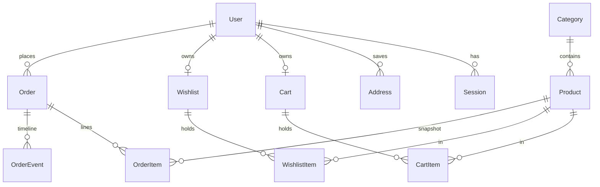

# LUXE Store — Master Project Architecture Document (PAD) v1.0

**Classification:** Internal Engineering Reference
**Status:** DEFINITIVE, PRODUCTION-LOCKED BLUEPRINT
**Companion Document:** [README.md](README.md) · [AGENTS.md](AGENTS.md) · [CLAUDE.md](CLAUDE.md) · [docs/Tailwind-V4-Validation-Report.md](docs/Tailwind-V4-Validation-Report.md)
**Last Updated:** 2026-10-07
**Audience:** Senior Engineers, Tech Leads, DevOps, and Onboarding Engineers
**Rule:** Every architectural decision in this document traces to a specific rationale. Nothing is here "because it's popular."

## Revision Block

| Version | Date | Author | Tags | Change |
|---|---|---|---|---|
| 1.0 | 2026-10-07 | Build agent (Super Z) | [RES]/[SYN]/[SAN] | Initial production blueprint after full-site recon, build, computed-style parity gate, and 103-test verification |

## Table of Contents

1. [System Overview & Decisions](#1-system-overview--decisions)
2. [High-Level System Topology](#2-high-level-system-topology)
3. [Application Architecture](#3-application-architecture)
4. [Data Architecture](#4-data-architecture)
5. [Design System Reference](#5-design-system-reference)
6. [Security Architecture](#6-security-architecture)
7. [Worker / Background Service Architecture](#7-worker--background-service-architecture)
8. [Testing Strategy](#8-testing-strategy)
9. [Build & Deployment](#9-build--deployment)
10. [Developer Handbook](#10-developer-handbook)
11. [Known Issues & Outstanding Tasks](#11-known-issues--outstanding-tasks)
12. [Key Files Reference](#12-key-files-reference)
13. [Glossary](#13-glossary)

---

## 1. System Overview & Decisions

### 1.1 Document Metadata & Purpose

This PAD is the single source of truth for how LUXE Store is built and why. **Engineers changing code**: read §3 (layer rules) and §8 (testing) first. **DevOps**: §9. **Anyone touching styles**: §5 and the trap log — the pins are load-bearing. The document describes the CURRENT system only; history lives in git.

The product is a visual clone of a reference storefront (`fuzzy-lumina-style-hub.base44.app`) with the reference's demo behavior replaced by real commerce persistence — a "superset": everything the reference renders, at computed-style parity, plus accounts, carts, wishlists, checkout, order history, and an admin console that actually write to a database.

### 1.2 Technology Stack Summary

| Layer | Technology | Version | Key Rationale |
|---|---|---|---|
| Web framework | Next.js (App Router) | ^16.1.1 | RSC-first rendering; server actions remove the need for a REST mutation layer; standalone output for lean deploys |
| UI runtime | React | ^19 | Required by Next 16; compiler-enforced hook rules (set-state-in-effect is an error) |
| Language | TypeScript, `strict` | ^5 | Types at every boundary; `any` banned |
| Styling | Tailwind CSS (CSS-first `@theme`) | ^4 | Reference is v3-era; v4 chosen deliberately with a **pinned token system** to keep byte-parity (trap log, §5.4) |
| UI primitives | Radix UI + CVA + tailwind-merge | — | Reference fingerprint (shadcn); accessible Dialog/Select/Tabs/Sheet without hand-rolled ARIA |
| Icons | lucide-react | ^0.525 | Exact reference icon set (`lucide-shopping-bag`, `lucide-star`, …) |
| ORM | Prisma | ^6.11 | Schema-as-code + typed client; SQLite provider keeps zero-config local story |
| Database | SQLite | — | Single-file, single-writer — matches the deployment shape (one app instance); swap path documented in ADR-002 |
| Auth | node:crypto scrypt + DB sessions | — | No third-party dependency; memory-hard; revocable server-side sessions |
| Validation | Zod | ^3.25 | Single dialect for actions, route handlers, and test fixtures |
| Unit tests | Vitest | ^5 | Fast, node-env, co-located; mirrors tsconfig aliases |
| E2E tests | Playwright (Chromium) | ^1.63 | Drives the production standalone build; computed-style assertions are the parity gate |
| Package manager | Bun | ≥1.3 | Executes TS seeds/setup scripts directly; fast installs |
| AI SDK | z-ai-web-dev-sdk | ^0.0.18 | Available for future AI features; not on any request path today |

### 1.3 Architecture Decision Records

**ADR-001: Single Next.js application (no monorepo, no separate admin app)**
- **Context:** The reference clone needs a storefront and an admin console; the org's prior e-commerce pattern (Scandi Haven) used a pnpm+Turborepo monorepo with a second admin app on :3001.
- **Decision:** One Next.js app. Admin lives at `/admin` behind a role gate (`src/app/admin/*`), sharing the layout chrome and the Prisma client.
- **Rationale:** The reference is a single app; a monorepo adds tooling (Turborepo, workspace protocol, cross-package Tailwind `@source` wiring) with zero product value at this scale. One `next build`, one deploy, one test suite.
- **Consequences:** (+) Simpler CI, no package boundaries to drift. (−) Admin and storefront share a deploy cadence; acceptable while one team owns both.
- **Alternatives Rejected:** Turborepo monorepo (ADR-rejected for this scale); separate admin domain (needs its own auth plumbing and duplicate UI kit).

**ADR-002: SQLite via Prisma with a schema-relative `file:` URL**
- **Context:** The deployment target is a single app instance; the repo contract requires `DATABASE_URL="file:../db/custom.db"` with `db/` at the repo root.
- **Decision:** `provider = "sqlite"`; the URL is resolved identically for the Prisma CLI (anchored at `prisma/schema.prisma`) and the runtime (`src/lib/db-path.ts` anchors on the first directory containing `prisma/schema.prisma`, with standalone-build and CWD fallbacks). Money is integer cents; "enums" are Strings + Zod unions.
- **Rationale:** Zero-config local dev and a single-writer model that makes count-based order numbering race-free. The URL contract is unit-test-pinned (`tests/db-path.test.ts`) because naive "simplifications" have historically broken exactly this.
- **Consequences:** (+) No database server to operate; file-level backup. (−) No concurrent multi-instance writes (documented scale ceiling — see ADR-002 migration note in §9.2); no native enums (validated in code).
- **Alternatives Rejected:** PostgreSQL (requires a server + rootless setup for marginal benefit at this scale — revisit when scaling out); Drizzle (fine, but the repo already standardizes on Prisma).

**ADR-003: Cookie-token guest identity merging into user rows**
- **Context:** Carts and wishlists must work for anonymous visitors and survive login.
- **Decision:** `Cart`/`Wishlist` rows keyed by a random cookie token (`luxe_cart`, `luxe_wishlist`, 192-bit, httpOnly); at most one row per user; the login action merges the guest row into the user row (quantity-max union) inside the same request; reads NEVER mint rows.
- **Rationale:** Server Components cannot set cookies — so cart creation must happen only in mutation contexts. Merging at login (not at read) keeps every read path side-effect-free and idempotent.
- **Consequences:** (+) Guest work is never lost; badge/drawer state is pure server truth. (−) Two code paths (guest/user) in the cart/wishlist resolvers — centralized in one function each to keep it honest.
- **Alternatives Rejected:** localStorage carts (not server-trustworthy, breaks cross-device); merge-on-read (side-effectful reads, race-prone).

**ADR-004: Server actions as the only mutation seam; 3-route-handler whitelist**
- **Context:** The UI needs cart/wishlist/auth/account/checkout/admin mutations.
- **Decision:** All mutations are `"use server"` actions in `src/lib/actions/*.ts`, Zod-validated, returning `ActionResult<T> = { ok: true, data } | { ok: false, error: { message, fieldErrors? } }`. Route handlers exist ONLY for `/api/health`, `/api/search` (typeahead GET), `/api/newsletter` (POST).
- **Rationale:** Actions give progressive enhancement + typed callsites without a REST surface to version. The whitelist keeps the attack surface auditable (three endpoints, each rate-limited or trivial).
- **Consequences:** (+) One validation dialect, one result envelope. (−) No external API for mutations by design — an integration API would be a new ADR.
- **Alternatives Rejected:** REST mutation routes (double validation layer, more surface); tRPC (another dependency for no gain inside one app).

**ADR-005: Tailwind v4 with pinned v3 token geometry (the trap-log system)**
- **Context:** The reference app compiles Tailwind v3-era classes; the port must render byte-identical computed styles on v4.
- **Decision:** `src/app/globals.css` pins: full `hsl()` theme literals (bare triplets resolve transparent under `@theme inline`); `--shadow-sm: 0 1px 2px 0 rgb(0 0 0 / 0.05)`; the radius scale to v3 values (`xl: .75rem`, `2xl: 1rem`, `3xl: 1.5rem`); the hero overlay as an sRGB arbitrary gradient; the mobile nav stacks with flex `gap` (never `space-y` + `mt-*`). Parity is enforced by `tests/e2e/storefront-parity.spec.ts` against live-measured values.
- **Rationale:** v4 shifted BOTH the shadow and radius scales one notch and interpolates gradients in oklab; class strings identical, rendered geometry not. Pinning tokens (not rewriting classes) keeps the DOM byte-parity with the reference while fixing the engine deltas.
- **Consequences:** (+) One-line fixes for engine variance; E2E-guarded. (−) Token pins look "wrong" to anyone who knows v4 defaults — the trap log and this PAD exist to prevent well-meaning "fixes".
- **Alternatives Rejected:** Staying on Tailwind v3 (EOL trajectory, misses v4 tooling); rewriting class strings to v4 equivalents (breaks DOM parity, 10× the diff).

**ADR-006: scrypt + DB-backed sessions over JWT**
- **Context:** Accounts need password auth with revocable sessions on a single-instance deploy.
- **Decision:** `scrypt` (N=16384, r=8, p=1) password hashes; a `Session` table keyed by SHA-256 of a 256-bit token; cookie value `token.hmac(token)` (integrity-in-depth, AUTH_SECRET); 30-day expiry; destroy deletes the row.
- **Rationale:** JWTs can't be revoked without a denylist — a session table IS the denylist. scrypt avoids a native dependency (bcrypt/argon2) while meeting OWASP baseline parameters.
- **Consequences:** (+) Immediate revocation; no extra deps. (−) One DB read per authenticated request (SQLite: ~µs; fine).
- **Alternatives Rejected:** stateless JWT (revocation problem); Better-Auth (heavy for two auth pages; no OAuth in the reference parity scope).

**ADR-007: Checkout as a client wizard over a single transactional server action**
- **Context:** The reference renders a 3-step checkout (shipping → payment → review) client-side.
- **Decision:** The wizard lives in `checkout-flow.tsx` (client) with per-step validation gates; the final submit posts EVERYTHING to `placeOrderAction`, which Zod-validates, re-derives totals from the DB cart (never the client), allocates `ORD-YYYY-NNN`, and writes order + lines + event + cart-clear in ONE `db.$transaction`.
- **Rationale:** Step UX is presentation; money math is server truth. A single transaction means a crashed placement never leaves a half-written order or a charged-but-empty cart.
- **Consequences:** (+) Crash-safe, replay-safe (rate-limited). (−) Card data transits the action (test-mode only — a real PSP integration is the documented next step, §11).
- **Alternatives Rejected:** Per-step server persistence (three writes to unwind on back-navigation); client-computed totals (unacceptable).

---

## 2. High-Level System Topology

```
                       ┌──────────────────────────────┐
                       │        Browser (user)        │
                       │  Next.js RSC HTML + islands  │
                       └──────────────┬───────────────┘
                                      │ HTTPS (cookies: luxe_session,
                                      │  luxe_cart, luxe_wishlist)
                   ┌──────────────────▼───────────────────┐
                   │   Next.js 16 standalone server       │
                   │  .next/standalone/server.js (Bun)    │
                   │──────────────────────────────────────│
                   │ RSC pages ──► lib domains ──► Prisma │
                   │ Server actions (mutations, Zod)      │
                   │ Route handlers: health/search/       │
                   │   newsletter (rate-limited)          │
                   └───────┬──────────────────────┬───────┘
                           │ file I/O             │ https (img src only)
                  ┌────────▼─────────┐   ┌────────▼─────────┐
                  │  SQLite          │   │ media.base44.com │
                  │  db/custom.db    │   │ (product art —   │
                  │  (single writer) │   │  parity CDN)     │
                  └──────────────────┘   └──────────────────┘
```

**Runtime:** Node ≥20-compatible standalone server executed by Bun. Single process, single writer to SQLite. Scaling path: N read replicas are impossible on one SQLite file — the migration point is ADR-002 (swap `provider` + `DATABASE_URL` to PostgreSQL; the schema is portable modulo enum-Strings, which Zod already validates).

**Constraints:** all mutation state is server-truth; the client store (`StoreProvider`) is a hydrated cache, never an origin. Remote image CDN is read-only `img src` usage — no key, no proxy, no optimization (unoptimized `next/image` config keeps the standalone server dependency-free).

---

## 3. Application Architecture

### 3.1 The Layer Model

- **Layer 0: Data Source — Prisma/SQLite.** *Rule: the only writer is `src/lib/db.ts`'s singleton; never instantiate a second client (HMR-safe globalThis pattern).*
- **Layer 1: Domains — `src/lib/*.ts`.** *Rule: pure(ish) server modules (auth, cart, wishlist, money, validation, rate-limit) that touch Layer 0 and nothing above. No React imports.*
- **Layer 2: Mutations — `src/lib/actions/*.ts`.** *Rule: the ONLY write seam. Zod in, `ActionResult<T>` out; logs with `[tag]` context; never throws across the boundary.*
- **Layer 3: Rendering — `src/app/**` (RSC) + `src/components/**`.** *Rule: RSC by default; `"use client"` only for interactive leaves; client components never import `@/lib/db` (build-time RSC boundary).*
- **Layer 4: Chrome composition — root layout.** *Rule: the layout owns header/footer/overlays and hydrates `StoreProvider` with server-read cart/wishlist/user so the first paint carries badge state.*

**Golden Rule:** dependencies point downward only (app → components → lib → db). A cycle or an upward import is a build or review failure.

### 3.2 Annotated Directory Structure

```
ecommerce-store/
├── prisma/
│   ├── schema.prisma            ← 13 models; integer cents; String-"enums"
│   ├── seed.ts                  ← idempotent natural-key upserts; reference-parity fixtures
│   └── e2e-reset.ts             ← clears carts/wishlists/spec-users before E2E runs
├── src/
│   ├── app/
│   │   ├── layout.tsx           ← fonts, chrome, StoreProvider server hydration
│   │   ├── globals.css          ← Tailwind v4 @theme + ALL v3-parity pins (ADR-005)
│   │   ├── page.tsx             ← home: hero carousel + 4 sections (RSC)
│   │   ├── shop/page.tsx        ← PLP: filters from searchParams (RSC)
│   │   ├── product/[slug]/      ← PDP + generateMetadata
│   │   ├── cart/page.tsx        ← REAL cart (reference hardcodes empty — superset fix)
│   │   ├── checkout/            ← wizard page + success confirmation
│   │   ├── account/page.tsx     ← dashboard (auth-gated, tabs)
│   │   ├── login/ · register/   ← auth cards (useActionState)
│   │   ├── admin/               ← role-gated console + orders/products
│   │   ├── wishlist/page.tsx    ← DB-backed
│   │   ├── not-found.tsx        ← branded 404
│   │   ├── api/{health,search,newsletter}/route.ts   ← the 3-endpoint whitelist
│   │   └── sitemap.ts · robots.ts
│   ├── components/
│   │   ├── ui/                  ← shadcn-style primitives, reference class strings
│   │   ├── store/               ← storefront chrome + islands + StoreProvider
│   │   ├── account/             ← account-tabs + admin rows (client)
│   │   └── checkout/            ← 3-step wizard (client)
│   └── lib/
│       ├── db.ts · db-path.ts   ← client singleton + URL contract (test-pinned)
│       ├── auth.ts              ← sessions, getCurrentUser, isAdmin
│       ├── password.ts          ← scrypt hash/verify (shared with seeds)
│       ├── cart.ts · wishlist.ts← guest/user resolution + merges (ADR-003)
│       ├── money.ts             ← cents formatting, discount math, shipping rules
│       ├── validation.ts        ← every Zod schema
│       ├── rate-limit.ts        ← in-memory fixed windows
│       └── *.test.ts            ← co-located unit layer
├── tests/
│   ├── db-path.test.ts
│   └── e2e/                     ← 9 specs + auth.setup + global-setup
├── docs/                        ← trap log, deployment, ssh push runbook
└── AGENTS.md · CLAUDE.md · README.md · Project_Architecture_Document.md
```

### 3.3 Critical Code Patterns

**The ActionResult envelope (every mutation):**

```ts
export type ActionResult<T> =
  | { ok: true; data: T }
  | { ok: false; error: { message: string; fieldErrors?: Record<string, string> } };
```
*Why:* one shape for every `useActionState` consumer; errors are data, never exceptions — the client renders `message` inline and maps `fieldErrors` to inputs without parsing.

**Reads never mint rows (cart resolution):**

```ts
// src/lib/cart.ts — creation only when create=true (mutation contexts)
const cart = await resolveCartRow(token, userId, /* create */ false);
if (!cart) return EMPTY_CART;
```
*Why:* a Server Component render cannot set cookies; a read that created carts would mint a junk row per anonymous page view (the exact bug class the org's prior cart system documented).

**Adjust-state-during-render (client hydration syncs):**

```tsx
const [prevUrlSearch, setPrevUrlSearch] = React.useState(activeSearch);
if (prevUrlSearch !== activeSearch) {
  setPrevUrlSearch(activeSearch);
  setSearch(activeSearch);
}
```
*Why:* the React Compiler lint makes `setState`-in-effect an error; this is the sanctioned pattern for prop→state mirrors (used in ShopFilters, SearchBar, AccountTabs).

---

## 4. Data Architecture

### 4.1 Schema (ER summary)



**Model notes:** `Product.price`/`compareAtPrice` integer cents (compare-at drives the `-N%` badge); `Product.features` is a JSON-encoded `string[]` (SQLite has no scalar lists); `Order.shippingAddress` is a JSON snapshot (addresses are editable post-order without rewriting history); `OrderItem` carries `nameSnapshot`/`imageSnapshot`/`unitPrice` (cart-independent history); `Cart.userId` and `Wishlist.userId` are `@unique` (at most one per user).

### 4.2 Data Models (invariants)

- **Money:** integers, cents, everywhere. Display via `formatCents` only. Discount % derived (`discountPercent`), never stored.
- **Shipping:** `0` when subtotal ≥ 10000, else `599` — server-derived on every read and at placement.
- **Order numbers:** `ORD-YYYY-NNN`, allocated as `count(prefix)+1` inside the placement transaction. Single-writer SQLite makes this race-free; the pad is 3 to match the reference display (`ORD-2026-004`).
- **Statuses:** `processing | in_transit | delivered | cancelled` (String + Zod); transitions append an `OrderEvent` row.

### 4.3 Persistence Strategy

One Prisma client singleton on `globalThis` (HMR-safe; production logs errors only). No connection pool to configure (SQLite). Migrations are `prisma db push`-based during development (`db:setup` = push + seed, idempotent via natural-key upserts); `prisma migrate dev` is available when history is needed. Backups = copy `db/custom.db` (stop-the-world or `VACUUM INTO`).

---

## 5. Design System Reference

### 5.1 Typography

**Plus Jakarta Sans** (Latin, 400–800) via `next/font/google` (`--font-jakarta`, `display: swap`), wired as `--font-sans`. Scale (measured on the reference): body 16, nav 14/500, card title 14/600, section h2 30 (2xl–3xl bold), PDP h1 30 (2xl–3xl bold), PDP price 30/700, hero h1 48/700 (3xl–5xl responsive).

### 5.2 Color Tokens (computed-parity pinned)

| Token | Value | Hex | Role |
|---|---|---|---|
| background | `hsl(30 25% 98%)` | #FBFAF9 | Page |
| foreground | `hsl(240 10% 10%)` | #17171C | Text · footer bg |
| card / popover | `hsl(0 0% 100%)` | #FFFFFF | Surfaces |
| primary | `hsl(24 80% 50%)` | #E66B1A | Brand orange |
| primary-foreground | `hsl(0 0% 100%)` | #FFFFFF | On-primary |
| secondary | `hsl(30 15% 94%)` | #F0EEEA | Chips, image wells |
| muted-foreground | `hsl(240 5% 46%)` | #6F6F7B | Secondary text |
| accent / accent-foreground | `hsl(24 80% 96%)` / `hsl(24 80% 30%)` | — | Category icon wells |
| destructive | `hsl(0 84% 60%)` | #EF4444 | Discount badges |
| border / input | `hsl(30 15% 90%)` | #E9E6E2 | Hairlines |
| ring | `hsl(24 80% 50%)` | #E66B1A | Focus |
| Stars | `fill-amber-400` | #FBBF24 | Ratings |

### 5.3 Radii & Shadows

`--radius: 0.75rem`; computed: `rounded-md` 10px, `rounded-lg` 12px, `rounded-xl` 12px, `rounded-2xl` 16px, `rounded-3xl` 24px, pills `9999px`. `--shadow-sm` pinned to `0 1px 2px 0 rgb(0 0 0 / 0.05)`; depth otherwise comes from borders (`border-border/50`), not elevation — matching the reference.

### 5.4 The Tailwind v4 Trap Log (binding)

1. Full `hsl()` literals in `@theme inline` — bare triplets render transparent.
2. `--shadow-sm` pinned (v4 shifted the shadow scale one notch).
3. Radius scale pinned (v4 shifted it too — measured: card 16px, button 12px, input 10px).
4. Hero overlay uses `bg-[linear-gradient(to_right,rgb(0_0_0/0.6),…)]` — v4 interpolates gradients in oklab.
5. Mobile nav stacks with flex `gap-4` — `space-y-*` + `mt-*` children change height on v4 (`:where()` zero-specificity).
6. Alpha utilities serialize as `lab(...)` in Chrome (same paint as v3's `rgba(...)`) — the parity specs accept both notations.

Full write-up with sources: `docs/Tailwind-V4-Validation-Report.md`.

### 5.5 Motion

Hover image zoom 500ms; slide-up Add-to-Cart 300ms; Sheet slide 500ms open / 300ms close; hero crossfade 700ms; auto-advance 5s. All transitions respect reduced-motion via Tailwind's `motion-safe:` usage pattern where applicable.

---

## 6. Security Architecture

### 6.1 Security Rules & Enforcement

| Rule | Enforcement |
|---|---|
| All mutation input validated | Zod schemas (`src/lib/validation.ts`) at every action/route handler; failures return field-mapped errors |
| SQL injection impossible | Prisma parameterized queries only; no `$queryRaw` with user input |
| Passwords never stored/Logged | scrypt hashes only (`password.ts`); no secret ever appears in logs (actions log ids/status, not payloads) |
| Sessions revocable + integrity | DB `Session` rows + HMAC-signed cookie (`auth.ts`); logout deletes the row |
| Rate limiting | Login 10/15min/IP+email; checkout 10/10min; newsletter 10/10min/IP; search 60/min/IP (`rate-limit.ts`; in-memory — single-instance scope documented) |
| XSS | React escaping only; no `dangerouslySetInnerHTML` anywhere in the codebase |
| Admin surface | `getCurrentUser()` + `isAdmin()` re-check INSIDE every admin action (never trust the UI gate); pages additionally `redirect()` |
| Object ownership | Cart/wishlist/address mutations verify row ownership before writing (`account.ts`, `cart.ts`) |
| Clickjacking / sniffing | Standalone deployment sets headers at the edge (see `docs/DEPLOYMENT.md`); CSP not embedded because the reference's remote images require a per-deploy policy decision |
| Secrets | `.env` git-ignored; `AUTH_SECRET` required in production (boot falls back to a dev-only constant and says so) |

### 6.2 Security Utilities Inventory

`src/lib/password.ts` (scrypt hash/verify, timing-safe compare) · `src/lib/auth.ts` (session create/resolve/destroy, HMAC, role check) · `src/lib/rate-limit.ts` (fixed windows + client-IP extraction from proxy headers) · `src/lib/validation.ts` (all input schemas).

### 6.3 AuthN / AuthZ Model

Email+password (scrypt) → `Session` row → cookie `luxe_session=token.hmac` (httpOnly, SameSite=Lax, Secure in prod, 30d). Roles: `user` | `admin` (String column, Zod-validated). Admin = every `/admin` page redirect + every admin action re-check. Guest commerce identity = `luxe_cart` / `luxe_wishlist` tokens (192-bit random, httpOnly), merged into user rows at login.

### 6.4 Threat Model (residual risks, accepted)

- **Card data transits the checkout action** (test-mode semantics; the reference accepts a fake 4242 card). A real PSP (Stripe Payment Element, SAQ-A) is the documented next step — see §11.
- **In-memory rate limiter** is per-instance; horizontal scaling requires a shared store.
- **Remote imagery** (`media.base44.com`) is an availability dependency, not a trust dependency (plain `img src`).

---

## 7. Worker / Background Service Architecture

**Not applicable — by design.** There are no background workers, queues, or cron jobs. Order placement is synchronous and transactional; emails are not sent (the confirmation page + order history are the confirmation). The `OrderEvent` table provides the append-only timeline that a future outbox/worker system would consume; adding one is a new ADR, not an extension of an existing one.

---

## 8. Testing Strategy

### 8.1 Test Distribution

| Category | Files | Tests | Location | Framework |
|---|---|---|---|---|
| Unit — money | 1 | 10 | `src/lib/money.test.ts` | Vitest |
| Unit — passwords | 1 | 4 | `src/lib/password.test.ts` | Vitest |
| Unit — validation | 1 | 13 | `src/lib/validation.test.ts` | Vitest |
| Unit — rate limit | 1 | 3 | `src/lib/rate-limit.test.ts` | Vitest |
| Unit — db-path contract | 1 | 15 | `tests/db-path.test.ts` | Vitest |
| E2E — smoke | 1 | 7 | `tests/e2e/smoke.spec.ts` | Playwright |
| E2E — computed-style parity | 1 | 10 | `tests/e2e/storefront-parity.spec.ts` | Playwright |
| E2E — cart | 1 | 5 | `tests/e2e/cart.spec.ts` | Playwright |
| E2E — checkout | 1 | 4 | `tests/e2e/checkout.spec.ts` | Playwright |
| E2E — account | 1 | 8 | `tests/e2e/account.spec.ts` | Playwright |
| E2E — auth | 1 | 7 | `tests/e2e/auth.spec.ts` | Playwright |
| E2E — wishlist | 1 | 4 | `tests/e2e/wishlist.spec.ts` | Playwright |
| E2E — search | 1 | 5 | `tests/e2e/search.spec.ts` | Playwright |
| E2E — mobile navigation | 1 | 7 | `tests/e2e/mobile-navigation.spec.ts` | Playwright |
| **Total** | **14** | **103** | | |

### 8.2 Test Patterns

- **Parity gate:** `storefront-parity.spec.ts` asserts computed styles against values measured live on the reference (colors, radii, the shadow pin, font). This is the objective "looks identical" gate — screenshots are not.
- **Isolation:** E2E global setup pushes/seeds/resets `db/e2e.db` (never the dev DB); `auth.setup.ts` logs in once (rate limiter) and shares storageState; `auth.spec.ts` opts out with an empty state; cart specs start from a cleared cart (`clearCartViaDrawer`).
- **Radix-aware selectors:** close dialogs before asserting on page chrome (aria-hidden); scope text/label lookups to `main` (footer collisions).
- **TDD:** bugs get a failing regression test at the same seam before the fix; the suite asserts behavior through the UI/API only.

### 8.3 Coverage Philosophy

Numeric coverage gates are not configured; instead, every domain seam (money, validation, passwords, rate limit, db-path) has a dedicated unit file, and every user flow (browse → search → cart → checkout → account → admin surface) has a dedicated E2E file. The parity spec is treated as a build-breaker: a token change that shifts a computed value fails CI even when everything "works".

### 8.4 Pre-Push Checklist

1. `bun run lint` — 0 errors, 0 warnings
2. `bun run typecheck` — 0 errors
3. `bun run test` — 45/45
4. `bun run build` — compiles (validates RSC boundaries + redirects)
5. `bun run test:e2e` — 58/58 (after a fresh build)
6. No secrets/DB files/artifacts in `git status`

---

## 9. Build & Deployment

### 9.1 Production Build

```bash
bun run build   # next build + static assets into .next/standalone
bun run start   # NODE_ENV=production bun .next/standalone/server.js
```

The build produces a self-contained server (`output: "standalone"`, tracing root pinned). `typescript.ignoreBuildErrors: true` in `next.config.ts` mirrors the repo's historical scaffold setting — `bun run typecheck` is the enforced gate; do not rely on the build to catch types.

### 9.2 Environment Variables

| Variable | Required | Description | Default |
|---|---|---|---|
| `DATABASE_URL` | Yes | SQLite location; schema-relative `file:` URL resolves against `prisma/schema.prisma` (use an ABSOLUTE path in production) | `file:../db/custom.db` |
| `NEXT_PUBLIC_SITE_URL` | Prod | Canonical origin for metadata/sitemap/robots | `http://localhost:3000` |
| `AUTH_SECRET` | Prod | HMAC secret for session cookies (`openssl rand -hex 32`) | insecure dev constant |

### 9.3 Docker

Not shipped (kept out to match the repo scaffold); the standalone server is a single-process target — a 6-line Dockerfile (`oven/bun`, copy `.next/standalone` + `prisma` + `db/`, `CMD bun server.js`) is the documented path when containerization is needed.

### 9.4 CI/CD

No hosted CI in this repo by choice — the local gate (§8.4) is the gate, and pushes go through `docs/ssh_git_wrapper_v3.py` (key materialized outside the repo, remote ref verified post-push; see `docs/how-to-git-push-using-ssh-wrapper_SKILL.md`). Adding GitHub Actions would replicate the same five commands.

---

## 10. Developer Handbook

### 10.1 Local Setup

```bash
bun install
bun run db:setup    # push + seed (idempotent)
bun run dev         # http://localhost:3000
```

Demo accounts: `john@example.com` / `Demo1234!` · `admin@luxestore.com` / `Admin1234!`.

### 10.2 Common Commands

See the table in [AGENTS.md](AGENTS.md) (single source: dev, db, lint, typecheck, unit, single-test, build, E2E, clean-check order).

### 10.3 Code Style Rules (enforced)

- ESLint 9 flat config + eslint-config-next; React Compiler rules ON (`set-state-in-effect` = error → adjust-during-render pattern).
- TypeScript strict; `any` banned; no `@ts-ignore`.
- Named file conventions: components PascalCase, routes kebab-case, tests co-located `*.test.ts`.

### 10.4 Git Workflow

`main` only for agent pushes (SSH wrapper, verified refs). Conventional Commits. Atomic units. Never commit `.env`, `db/*.db`, logs, `tests/e2e/.auth/`, `test-results/`.

---

## 11. Known Issues & Outstanding Tasks

| Priority | Issue | Impact | Status |
|---|---|---|---|
| High | No real payment processor (cards are test-mode validated server-side; no funds move) | Checkout is functionally complete but not monetized | Documented next step — Stripe Payment Element integration (ADR-007 notes) |
| Medium | In-memory rate limiter is per-instance | Multi-instance deploys would not share limits | Accepted at current scale; migrate to shared store before scaling out (ADR-002/§6) |
| Medium | Product imagery served from the reference's public CDN | Availability dependency; not rebrandable | By design for parity; swap via `prisma/seed.ts` |
| Low | Order email notifications not sent | Confirmation is the success page + order history | Future outbox/worker (§7) |
| Low | Reviews tab renders "coming soon" (reference parity) | No UGC surface | Deliberate parity decision |
| Low | `typescript.ignoreBuildErrors: true` in next.config | Build does not type-check | `bun run typecheck` is the enforced gate; flip when the scaffold is retired |

## 12. Key Files Reference

| File | Lines | Purpose |
|---|---|---|
| `src/app/globals.css` | ~110 | Tailwind v4 `@theme` + every v3-parity pin (ADR-005) — load-bearing |
| `src/lib/db-path.ts` | ~107 | Schema-relative SQLite URL contract (test-pinned) |
| `src/lib/cart.ts` | ~200 | Cart resolution, guest/user merge, DTO + totals |
| `src/lib/actions/checkout.ts` | ~140 | Transactional order placement (ADR-007) |
| `src/lib/auth.ts` | ~100 | Sessions, HMAC cookie, role checks (ADR-006) |
| `src/components/store/store-provider.tsx` | ~160 | The single client commerce-state seam |
| `src/components/store/hero-carousel.tsx` | ~150 | Hero slides + the pinned sRGB overlay |
| `src/components/checkout/checkout-flow.tsx` | ~370 | 3-step wizard with per-step validation gates |
| `src/components/account/account-tabs.tsx` | ~430 | Account dashboard (4 tabs) |
| `prisma/schema.prisma` | ~190 | 13 models, integer cents |
| `prisma/seed.ts` | ~330 | Idempotent seed + reference-parity fixtures |
| `tests/e2e/storefront-parity.spec.ts` | ~110 | The computed-style parity gate |
| `tests/e2e/mobile-navigation.spec.ts` | ~90 | The trap-log-pinned mobile nav surface |

## 13. Glossary

- **Parity surface** — a UI element whose computed styles are pinned to reference-measured values and guarded by `storefront-parity.spec.ts`.
- **Trap log** — the accumulated, measured list of Tailwind v3→v4 engine differences (§5.4) and their token-level fixes.
- **Guest identity** — the cookie-token cart/wishlist rows that merge into a user at login (ADR-003).
- **ActionResult** — the `{ ok, data | error }` envelope every server action returns.
- **Seam** — a public boundary tests target (server action, route handler, or rendered UI) — never module internals.
- **Superset** — clone scope rule: match the reference's resting visuals exactly, add functionality only where it does not change parity surfaces.
