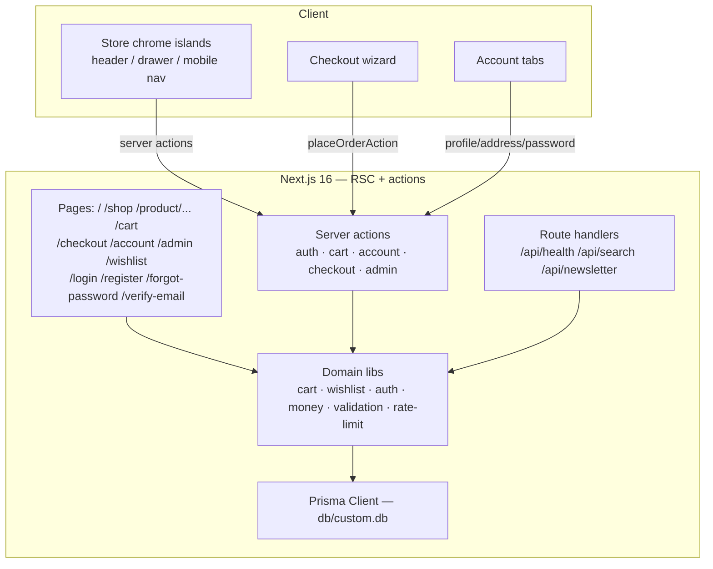

# LUXE Store


A production-grade e-commerce storefront with an admin console — a self-hosted, database-backed clone of the reference app ([fuzzy-lumina-style-hub.base44.app](https://fuzzy-lumina-style-hub.base44.app)) rebuilt as a single Next.js application. Every surface of the reference is reproduced at computed-style parity, and every mock/demo behavior is replaced by real persistence: accounts, carts, wishlists, checkout, and order history all survive a server restart.

## Overview

The reference app is a beautiful but client-side demo — its `/cart` page always renders the empty state, its account "orders" are hardcoded, and nothing persists. **LUXE Store solves that**: the same storefront, same warm-orange shadcn theme, same mobile navigation — backed by Prisma/SQLite, scrypt-hashed accounts with DB sessions, a guest-to-user cart merge, a transactional checkout that writes real orders (`ORD-YYYY-NNN`), and an admin console for products and order fulfillment. The port runs Tailwind CSS v4 against a v3-era reference via a pinned token system (shadow scale, radius scale, sRGB gradients), guarded by computed-style E2E assertions.

## Key Features

| Feature | Description |
|---|---|
| 🛍️ **Full storefront** | Hero carousel (3 slides, auto-advance — the reference's regenerated slide-3 media + plain-/shop CTAs re-pinned live session-26), feature bar, Trending / Shop by Category / New Arrivals / On Sale sections — byte-parity port of the reference |
| 🔍 **Search** | Header dropdown with live typeahead (`/api/search`, 250 ms debounce, keyboard + click navigation) and `/shop?search=` results page |
| 🧭 **Shop with filters** | Category / price-band / sort selects + search, all deep-linkable via URL params; removable active-filter chips (category + search — clicking one clears it); reference-exact empty state; sort semantics pinned to the reference (Featured = array order, Top Rated = stable rating-desc, Newest = reverse array order); typeahead suggestion categories render lowercase like the reference |
| 📦 **Product pages** | Badges, ratings (flat floor() star row — 4 amber + 1 gray for 4.8), discount math, feature chips, quantity stepper, gap-2/mb-8 breadcrumb, Description/Reviews/Shipping tabs, related products (ALL same-category items excluding self — reference rule) |
| 🛒 **Real cart** | DB-backed guest cart (cookie token) that merges into the account on login; drawer + full-page cart with transactional delta steppers (rapid clicks each land exactly once), line totals, and server-re-derived totals ($9.99 flat shipping under $100 — reference parity). Adds bump the badge only — the drawer opens via the header cart button, exactly like the reference |
| ❤️ **Persistent wishlist** | Same guest→user identity pattern; hearts everywhere (reference color contract: muted inactive, red active), dedicated page — a real superset over the reference's cosmetic wishlist |
| 💳 **3-step checkout + Stripe payments** | Shipping → Payment (card/PayPal) → Review; server-validated, transactional order placement with inventory enforcement, confirmation page with the order number; reference-parity "No items in cart" empty state; **guest checkout** works end-to-end from a cookie cart. **Stripe integration (session-22, PAY-STRIPE-1):** env-gated OFF by default — with `STRIPE_SECRET_KEY` + `NEXT_PUBLIC_STRIPE_PUBLISHABLE_KEY` set, the payment step becomes the one-page "Payment & Review" island: a site-themed Stripe Payment Element (PCI SAQ-A — card data never touches the app), a server-minted PaymentIntent whose amount is re-derived from the DB cart behind a deterministic idempotency key, verify-then-place (`Order.stripePaymentIntentId` UNIQUE anchors placement idempotency), and a signature-verified webhook (`/api/stripe/webhook`) that places orphaned payments (client died between confirm and place) — **hardened session-23 (PAY-STRIPE-2, ADR-031): the StripeEvent dedup row commits INSIDE the placement transaction (the reference skill's H4d/L9 rule), so a transient failure rolls back and answers 500 → Stripe retries → the retry re-places the order (the recovery the backstop exists for); deterministic failures (amount mismatch, stock-short) keep the 200 + refund-trail contract** — every path customer-safe and idempotent, and the whole backstop is integration-pinned (the REAL route handler + REAL HMAC-signed events against a scratch DB) |
| 👤 **Account dashboard** | Profile editing (User-icon avatar, reference anatomy), real order history with status badges, address book CRUD with highlighted default card, Change Password + Notifications sections, logout |
| 🛠️ **Admin console** | Role-gated `/admin`: revenue/orders/products/customers stats, order status transitions, stock + visibility management, an **order-detail view** (`/admin/orders/[id]`) rendering the customer, shipping snapshot, line items, the full OrderEvent timeline (placed + every status change, attributed), and **the payment-event trail** (session-29, REFUND-TRAIL-1: a Stripe-paid order's detail renders the Stripe events for its intent — the capture + any dashboard refunds — as a "Payment events" card between Items and the Timeline, composed through the `orderPaymentTrail`/`paymentEventLabel` seams; non-Stripe orders render no card), and **URL-deep-linkable order filters** — filter by fulfillment status, search by order number or customer email, with a result count and a guided empty state — and a **payment-ops view** (`/admin/payments`, session-24): the Stripe webhook event log with per-event outcome resolution (deep-linked placed orders, the refund-needed family, failed/ignored types), event-family + intent/id filters, a **date-range filter** (session-26, PAY-OPS-3: `?from=`/`?to=` strict YYYY-MM-DD bounds at UTC day boundaries — bad deep-links fall through, never error; the filter bar carries two URL-controlled date inputs), a result count, and the honest Stripe demo-mode/configured status line — and **product filters** (session-27, ADMIN-PRODUCTS-1: search by name/slug, filter by category and visibility with the same deep-linkable/count/empty-state treatment — the console trifecta complete) — and a **dashboard refund-needed alert** (session-28, DASH-ALERT-1: the entry point surfaces the payments' most actionable signal as an alert row — the count composes with the SAME seam the family filter uses, so the stat and the list can never disagree; deep-links to `?family=refund-needed`; renders nothing at count 0 — the calm state) |
| 🔐 **Auth** | Register / login / logout with scrypt hashing, DB sessions, HMAC-signed cookies, rate-limited login; nameless registration (display name derived from the email); anti-enumeration password-reset REQUEST flow + the full `/reset-password` route (the reference's 2-state screen: "Invalid reset link" without a token, "New password" with one; sha256-indexed single-use tokens with 30-min TTL, every session invalidated on reset, the reset link logged at the `console.info` email seam); standalone chrome-less auth screens with reference-exact anatomy (header tile, icon-led inputs, tinted error box, native email validation); full email-verification machinery (6-digit "Verify your email" screen + unverified-login gate) env-gated off until an email provider is wired; redirect-after-login (`/login?redirect=<path>` with open-redirect validation — gated pages return you where you started) |
| 📦 **Inventory integrity** | Server-enforced stock: cart steppers clamp at available inventory, checkout rejects overselling ("Sorry, «name» only has N left in stock.") inside the placement transaction, and successful orders decrement stock atomically — the admin console's stock numbers move with real sales |
| 🔔 **Action feedback** | Reference-exact toast subsystem — cart adds and wishlist adds fire a dark bottom-right "«Product» added to cart!" toast (accent check icon, 3 s lifetime, stacks); wishlist remove stays silent |
| 📱 **Mobile navigation** | Left-sliding Radix Sheet (w-72) pinned by a dedicated E2E spec (the Tailwind v4 trap-log surface — 29 consecutive live verifications at token-exact parity; the 29th verified across the payment-trail round — the drawer unaffected by the session-26 header-row restructure, re-verified post-change) |
| 🧭 **Reference-exact edge states** | Chrome-less platform 404 (v3 slate palette, quoted path, humanized-path document.title for unknown routes) and in-chrome "Product not found" block — both E2E-pinned |
| 🧪 **467 automated tests** | 235 Vitest (unit + the webhook integration layer + the payment-ops seams incl. the refund-needed family + the date-range bounds + the products-filter seams + the refund-needed alert contract + the payment-event trail vocabulary/calm-state contract) + 232 Playwright E2E (incl. the authenticated setup + the dashboard refund-needed alert deep-link + the order-detail payment-event trail), including computed-style + catalog-order + auth-contract + money/toast + heart-color + field-geometry + mobile-button-geometry + social-metadata + hero-cascade + **hero-content + header-geometry content pins (session-26, ADR-034: the 3 slide img srcs by hash tail + all 3 CTA hrefs at plain /shop + the gap-1 icon cluster's column-gap + the three-child mobile row — the reference's silent media/link/geometry drift is now a gate failure)** + touch-context-hover + keyboard-a11y (inert hero slides) + font-file/smoothing + landmark/ARIA (single `<main>` per page, nameless live region, labeled rating row) + security-header parity + **CSP nonce-pipeline (per-request nonce, every SSR script nonced, hydration regression-pinned)** + **standing axe-core a11y gate (self-hosted injection, census exactly {color-contrast} with reference-identical counts — asserted at BOTH desktop and iPhone 14 viewports, plus the admin console's quality census incl. the payments surface and the auth-family census on register/forgot-password/verify-email/reset-password at both viewports, plus the best-practice console-list-census pin — the session-25 sr-only-h2 heading-order fix — dual-mutation-proven)** + **standing CWV performance budget gate (LCP ≤ 2500ms + CLS ≤ 0.03 + LCP-element identity floors on home/shop/PDP at BOTH desktop and iPhone 14 viewports with mobile-scale floors — the round-17 desktop differential measured the clone 2–4.5× faster and the round-18 mobile differential 3.2–4.4× faster than the reference on the byte-identical LCP elements, dual- and triple-mutation-proven)** + **standing INP interaction budget gate (session-21, PERF-GATE-3: a scripted 5-surface protocol — PDP add-to-cart · wishlist heart · search typing · drawer stepper · carousel next — at BOTH viewports in guest contexts, trusted-click event-timing collection, INP ≤ 200ms budgets; the round-21 differential measured the clone's SERVER-ACTION mutations painting as fast as the reference's CLIENT-STATE mutations, 16–48ms on both sites at both viewports — dual-mutation-proven)** + **standing SEO gate (sitemap census — 5 curated static routes + all 12 product URLs with lastModified — + the robots rule block + the JSON-LD structured-data nodes: Organization/WebSite on home, Product/offers/aggregateRating on the PDP; quad-mutation-proven)** + **standing Stripe unconfigured-contract gate (session-22, PAY-STRIPE-1: the mock wizard's parity anchors, ZERO Stripe network traffic through the full funnel, no operator vocabulary in the customer DOM, and the 400-on-bad-signature webhook — triple-mutation-proven)** + **the NEW webhook backstop integration gate (session-23, PAY-STRIPE-2: the REAL route handler driven with REAL HMAC-signed events against a scratch SQLite DB — 11 tests incl. the H4d recovery proof: a transient placement failure rolls the dedup row back, answers 500, and the Stripe retry places the order; triple-mutation-proven)** gates measured against the live reference, plus stock-enforcement, guest-checkout, the full reset-password flow (token consumption, password rotation, session invalidation), and full admin-console flows (gating, stats, status transitions, visibility, order detail + its payment-event trail, order filtering/search, product filtering) |
| 🌐 **SEO & ops** | Full reference-parity OpenGraph/Twitter/PWA head layer on every route (`pageMetadata()` builder — per-route og:title/description, query-preserving og:url, site-logo og:image, PWA `appleWebApp` metas), **`sitemap.xml` (5 curated public routes + every active product URL with `lastModified` — the SEO superset: the reference's platform sitemap lists zero products), `robots.txt` (private families disallowed), and schema.org JSON-LD structured data (Organization + WebSite on home; Product with offers/availability/aggregateRating on the PDP)**, `/api/health` probe, **security headers matching the reference's baseline + X-Frame-Options** (Referrer-Policy, nosniff, HSTS — via `next.config.ts` `headers()`), and a **nonce-based Content-Security-Policy** (`src/proxy.ts` — per-request nonce, `strict-dynamic` scripts, `frame-ancestors 'none'`; directive set pinned to the codebase's measured footprint) |

## Architecture

| Layer | Technology | Version | Purpose |
|---|---|---|---|
| Framework | Next.js (App Router, standalone output) | ^16.1.1 | RSC pages, server actions, route handlers |
| UI runtime | React | ^19 | Server Components by default, client islands |
| Language | TypeScript (strict) | ^5 | Types at every boundary |
| Styling | Tailwind CSS (CSS-first, `@theme`) | ^4 | v3-parity token pins (see Design System) |
| UI primitives | Radix UI + CVA + tailwind-merge | — | shadcn-style Button/Badge/Select/Tabs/Sheet/… |
| Icons | lucide-react | ^0.525 | Reference-matched icon set |
| ORM | Prisma | ^6.11 | 15 models, SQLite provider |
| Database | SQLite | — | `db/custom.db` at repo root |
| Auth | node:crypto scrypt + DB sessions | — | HMAC-signed `luxe_session` cookie |
| State | React context (`StoreProvider`) | — | Server-hydrated cart/wishlist/user + UI open-states |
| Unit tests | Vitest | ^5 | Money, passwords, validation, rate limit, db-path, cart deltas, slug format, verification codes |
| E2E tests | Playwright (Chromium) | ^1.63 | Production server + isolated `db/e2e.db` |
| Runtime | Bun | ≥1.3 | Package manager, seed/test runner |



## File Hierarchy

```
📂 ecommerce-store/
├── 📂 prisma/                     ← schema + idempotent seeds
│   ├── 📄 schema.prisma           ← 15 models, integer-cents money
│   ├── 📄 seed.ts                 ← catalog + demo user/orders (reference parity)
│   └── 📄 e2e-reset.ts            ← transient-state reset for E2E runs
├── 📂 src/
│   ├── 📂 app/
│   │   ├── 📄 layout.tsx          ← minimal root shell (fonts + metadata only)
│   │   ├── 📄 globals.css         ← Tailwind v4 @theme with v3-parity pins (trap log)
│   │   ├── 📄 not-found.tsx       ← reference's chrome-less platform 404 (slate)
│   │   ├── 📂 (storefront)/       ← chrome layout + shopper pages (URL-neutral)
│   │   │   ├── 📄 page.tsx        ← home
│   │   │   ├── 📂 shop/ · product/[slug]/ · cart/ (page + client island) · checkout/ (+ success/)
│   │   │   └── 📂 wishlist/ · account/ · admin/ (dashboard, orders + orders/[id] detail, products)
│   │   ├── 📂 (auth)/             ← standalone login/register/forgot-password/verify-email (no chrome)
│   │   └── 📂 api/                ← health · search (typeahead) · newsletter
│   ├── 📂 components/
│   │   ├── 📂 ui/                 ← shadcn-style primitives (button…radio-group)
│   │   ├── 📂 store/              ← header, mobile-nav, cart-drawer, search-bar, product-card, hero-carousel, footer, store-provider
│   │   ├── 📂 account/            ← account-tabs, admin rows
│   │   └── 📂 checkout/           ← 3-step checkout-flow
│   └── 📂 lib/
│       ├── 📄 db.ts · db-path.ts  ← Prisma singleton + schema-relative SQLite URL
│       ├── 📄 auth.ts · password.ts · cart.ts · wishlist.ts · money.ts · validation.ts · rate-limit.ts · cart-quantity.ts · format.ts · verification.ts
│       └── 📂 actions/            ← the mutation seam (ActionResult<T> + Zod)
├── 📂 tests/
│   ├── 📂 e2e/                    ← 13 spec files (116 tests) + setup/global-setup
│   └── 📄 db-path.test.ts         ← URL-resolution contract
└── 📄 AGENTS.md · CLAUDE.md · Project_Architecture_Document.md · ecommerce-store_SKILL.md
```

## Quick Start

**Prerequisites:** Node.js ≥ 20, Bun ≥ 1.1 (or substitute `npx tsx` where `bun` runs TS), SQLite (bundled with Prisma).

```bash
# 1. Install dependencies
bun install

# 2. Create .env (see Environment Variables) — the repo ships a ready-to-use default
cp .env.example .env   # if .env is absent; DATABASE_URL="file:../db/custom.db"

# 3. Create + seed the database (idempotent — safe to re-run)
bun run db:setup

# 4. Start the dev server
bun run dev
```

**Verify Setup**

```bash
curl http://localhost:3000/api/health
# {"ok":true,"status":"ok","db":true}

open http://localhost:3000          # storefront with 12 seeded products
# Log in with the demo account:
#   john@example.com / Demo1234!   (account dashboard + seeded order history)
# Admin console:
#   admin@luxestore.com / Admin1234!  → http://localhost:3000/admin
```

**Full gate (what CI-if-we-had-it runs locally):**

```bash
bun run lint && bun run typecheck && bun run test && bun run build && bun run test:e2e
```

## Environment Variables

```bash
# SQLite location. RELATIVE file: URLs resolve against prisma/schema.prisma
# (exactly like the Prisma CLI), so this points at <repo>/db/custom.db.
DATABASE_URL="file:../db/custom.db"

# Canonical public origin — used for metadata, sitemap.xml, and robots.txt.
NEXT_PUBLIC_SITE_URL=http://localhost:3000

# Session-cookie HMAC secret. REQUIRED in production: openssl rand -hex 32.
# Falls back to an insecure dev-only constant when unset.
AUTH_SECRET=""

# Email-verification gate ("true" = require the 6-digit code after signup).
# OFF by default: no email provider is wired — codes log at a console seam.
AUTH_REQUIRE_EMAIL_VERIFICATION=""

# Stripe payments (session-22, PAY-STRIPE-1). Empty = the reference-parity
# demo card form (no charges). With real keys: the Payment Element flow
# (PCI SAQ-A) + the webhook backstop at /api/stripe/webhook.
STRIPE_SECRET_KEY=""
NEXT_PUBLIC_STRIPE_PUBLISHABLE_KEY=""
STRIPE_WEBHOOK_SECRET=""
```

## Testing

| Suite | Command | Count | Scope |
|---|---|---|---|
| Unit (Vitest) | `bun run test` | 235 | Money math (incl. the $9.99 flat-rate pin), scrypt hashing, Zod schemas (incl. nameless-register + display-name derivation), rate limiter, DB-path resolution, cart delta-quantity + stock clamping, slug humanization, email-verification codes, redirect-path validation, the pageMetadata builder rules (prefix vs plain description, twitter card gate, og url composition), admin-order filter parsing + where-building (session-13), **the Stripe payment seams (session-22, PAY-STRIPE-1: the config sentinel truth table + client mirror, deterministic intent idempotency keys, PaymentIntent params with server-cart amounts, the placement verification gate's failure table, event classification, last4 extraction, the webhook envelope parse)**, **the failure-policy seams (session-23, PAY-STRIPE-2: `classifyWebhookPlacementError` — duplicate/permanent/transient truth table — + `isIntentAnchorP2002`)**, **the webhook backstop integration layer (session-23: `tests/stripe-webhook.integration.test.ts` — the REAL route handler, REAL HMAC-signed events, a scratch `db/webhook-test.db`; 11 tests incl. the H4d recovery proof, duplicate delivery, client-path precedence, amount mismatch, signature 400s, stock-short, ignored types)**, **the admin-payments seams (session-24–26: the family/q parse + composable-AND where incl. the refund-needed family + the date-range bounds)**, **the admin-products seams (session-27: the q/category/visibility parse + where)**, **the refund-needed alert contract (session-28: `refundNeededAlert` — the calm state, singular/plural labels, the family deep-link href)**, **the payment-event trail contract (session-29: `paymentEventLabel` — the operator vocabulary + raw passthrough; `orderPaymentTrail` — the calm state at an empty set, the label/amount/order row mapping, the null-amount row)** |
| E2E (Playwright) | `bun run test:e2e` | 232 | Smoke (404 · humanized-path 404 titles · product-not-found · standalone auth · per-route titles · favicon link · **per-route OpenGraph/Twitter/PWA head metas incl. og:url query preservation + the PDP's card-less twitter shape** · **security headers: referrer-policy/nosniff/HSTS + X-Frame-Options DENY** · **CSP nonce pipeline: header + directive census + per-request nonce uniqueness + every SSR script nonced, session-14**) · computed-style parity (incl. hero dots · feature-bar cards + glyph names · footer Join/separator · PDP star row · breadcrumb geometry · **shop sort trigger 150px** · **hero h1 line-height v3 cascade 37.5/40/48px** · **touch-context hover un-gate: card scale 1.05 + primary title under `(hover: hover)` false** · **hero inactive slides inert — tab order CTA → prev → next → dots** · **body font = the reference's exact self-hosted woff2: single face, exact stack, canvas 1009px, 27,348-byte file; `-webkit-font-smoothing: auto`** · **exactly one `<main>` landmark per page** · **nameless toast live region** · **rating row role=img + label**) · field-geometry parity (auth label gaps · account tab/label/button spacing) · catalog parity (incl. related-products rule) · cart (incl. no-auto-open drawer pin · $9.99 shipping · toasts · rapid-stepper race) · checkout (incl. empty state · post-order badge re-sync) · account (avatar, default address, Change Password · **reference order-row anatomy incl. mobile stacking** · **mobile fit-content Save button**) · auth (form contract incl. error box + native validation, nameless registration, forgot-password anti-enumeration, redirect-after-login + open-redirect rejection) · wishlist (toast asymmetry) · search (chips · empty state) · mobile navigation · guest-cart (cookie-token path) · guest-checkout (cookie-cart → order end-to-end) · stock (admin-context control · stepper clamp · overselling rejection · placement decrement) · verify-email (fixture happy path · attempts · login gate) · admin (guest gating · dashboard stats · order-detail timeline · **the order-detail payment-event trail — the capture row on the Stripe-paid ORD-2026-003 + the calm state on a non-Stripe order, session-29** · status combobox · visibility toggle · **URL-deep-linkable order filters — status + number/email search + empty state + Clear, session-13** · **payment-ops surface — guest gating with intent, role contract, fixture outcomes, family deep-link, q search, empty state, order deep-link, session-24; the refund-needed family + amounts, session-25; the date-range bounds, session-26** · **product filters — search/category/visibility deep-links + empty state, session-27** · **the dashboard refund-needed alert + family deep-link, session-28**) · **accessibility standing gate (session-15: self-hosted axe-core injected per route after a scrolled-reveal pass — census exactly {color-contrast} with reference-identical node counts 28/23/14/8/8/3; mutation-proven to catch the session-12 defect class; session-16 A11Y-GATE-2: the SAME pins re-asserted at iPhone 14 — mobile-only defects structurally invisible to the desktop gate — plus the admin console's QUALITY census {color-contrast} 8/7/7/7 on the four surfaces; dual-mutation-proven)** · **performance standing gate (session-17 PERF-GATE-1: LCP ≤ 2500ms + CLS ≤ 0.03 + LCP-element identity floors on home/shop/PDP — pre-paint PerformanceObservers, E2E-condition-calibrated, dual-mutation-proven: a hidden hero img fails only the identity pin, a late-injected banner fails only the CLS pin; session-18 PERF-GATE-2: the mobile CWV gate at iPhone 14; session-21 PERF-GATE-3: the INP interaction gate — 10 tests = 5 surfaces × 2 viewports in guest contexts, trusted-click event-timing, INP ≤ 200ms, dual-mutation-proven)** · **SEO standing gate (session-20: the sitemap census — 5 curated static + all 12 product URLs — + the robots rule block + the JSON-LD nodes; quad-mutation-proven)** · **Stripe unconfigured-contract gate (session-22, PAY-STRIPE-1: the mock wizard's parity anchors · ZERO Stripe network traffic through the full funnel incl. a reload under the listener · no operator vocabulary in the customer DOM · the 400-on-bad-signature webhook; triple-mutation-proven)** |

E2E boots the **production standalone build** on port 3100 against an isolated `db/e2e.db` (pushed, seeded, and reset by the global setup), so the suite never touches your dev database. Run a single spec with `bunx playwright test tests/e2e/checkout.spec.ts`.

## Design System

Pinned to the reference's computed values (measured live 2026-10-07); tokens live in `src/app/globals.css`.

| Token | Value | Usage |
|---|---|---|
| `--color-background` | `hsl(30 25% 98%)` (#FBFAF9) | Page background |
| `--color-foreground` | `hsl(240 10% 10%)` (#17171C) | Text, footer background |
| `--color-primary` | `hsl(24 80% 50%)` (#E66B1A) | Brand orange — announcement bar, CTAs, badges |
| `--color-secondary` | `hsl(30 15% 94%)` | Chips, image placeholders |
| `--color-muted-foreground` | `hsl(240 5% 46%)` (#6F6F7B) | Secondary text |
| `--color-destructive` | `hsl(0 84% 60%)` | Discount badges |
| `--color-border` | `hsl(30 15% 90%)` | Hairlines |
| `--radius` | `0.75rem` | Base radius (md=10px, xl=12px, 2xl=16px, 3xl=24px) |
| `--shadow-sm` (pinned) | `0 1px 2px 0 rgb(0 0 0 / 0.05)` | v3 geometry (v4 shifted the scale) |

Typography: **Plus Jakarta Sans** (200–800 variable) — the reference's exact Google-served woff2 self-hosted at `public/fonts/` (byte-identical: same `prep` hinting table, same rasterization; subpixel smoothing, no `antialiased`). Rating stars: amber-400. Motion: hover zooms (500 ms), slide-up Add-to-Cart (300 ms), sheet slide (500 ms open / 300 ms close).

## Local Context

- Currency: **USD**, displayed as `$X.XX`; money stored as integer cents.
- Shipping: free ≥ $100 (per the announcement bar), flat `$9.99` below — both server-derived and pinned to the reference (measured live at $34.99 and $79.99 subtotals).
- Order numbers: `ORD-YYYY-NNN` (e.g. `ORD-2026-004`).
- Product imagery is served from the reference app's public media CDN (`media.base44.com`) for pixel parity; swap to owned assets in `prisma/seed.ts` before rebranding.

## Deployment

```bash
bun run build                       # .next/standalone + static assets
bun run start                       # NODE_ENV=production bun .next/standalone/server.js
```

Set `DATABASE_URL` (absolute `file:` path recommended for production), `AUTH_SECRET`, and `NEXT_PUBLIC_SITE_URL` in the process environment. Health-check `/api/health`. See `docs/DEPLOYMENT.md` for the full runbook.

## Troubleshooting

| Issue | Solution |
|---|---|
| `This page could not be found` on every route under `127.0.0.1` | Next 16 dev-origin protection — `allowedDevOrigins` in `next.config.ts` already covers it; restart `bun run dev` |
| E2E webServer times out | Run `bun run build` first — Playwright boots the standalone build |
| Cart badge sticks at an old count | The cart is DB-backed per cookie/user — clear cookies or log in; `bun run db:setup` reseeds the catalog |
| `prisma` CLI can't find the database | `DATABASE_URL` must stay schema-relative (`file:../db/custom.db`); the runtime resolver mirrors the CLI rule (`src/lib/db-path.ts`) |
| Card/button radii look "off by one notch" | Someone touched the `@theme` radius pins — restore from git; the values are measured, not aesthetic |

## Contributing

1. Branch from `main`, keep the branch short-lived.
2. TDD: write the failing test at the same seam first (unit for pure logic, E2E for flows).
3. Gate before opening a PR: `bun run lint && bun run typecheck && bun run test && bun run build && bun run test:e2e`.
4. Conventional Commits (`feat:`, `fix:`, `test:`, `docs:`).
5. Never weaken a trap-log pin or delete a test to pass — fix the cause and document it in `docs/Tailwind-V4-Validation-Report.md` if it's a new engine variance.
